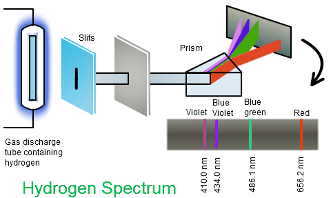
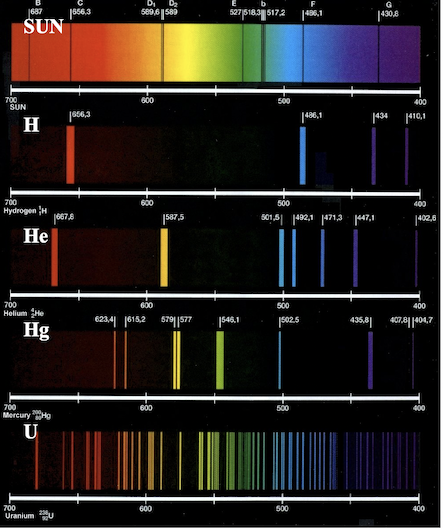
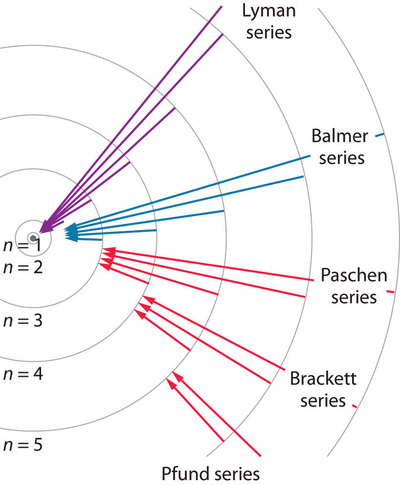
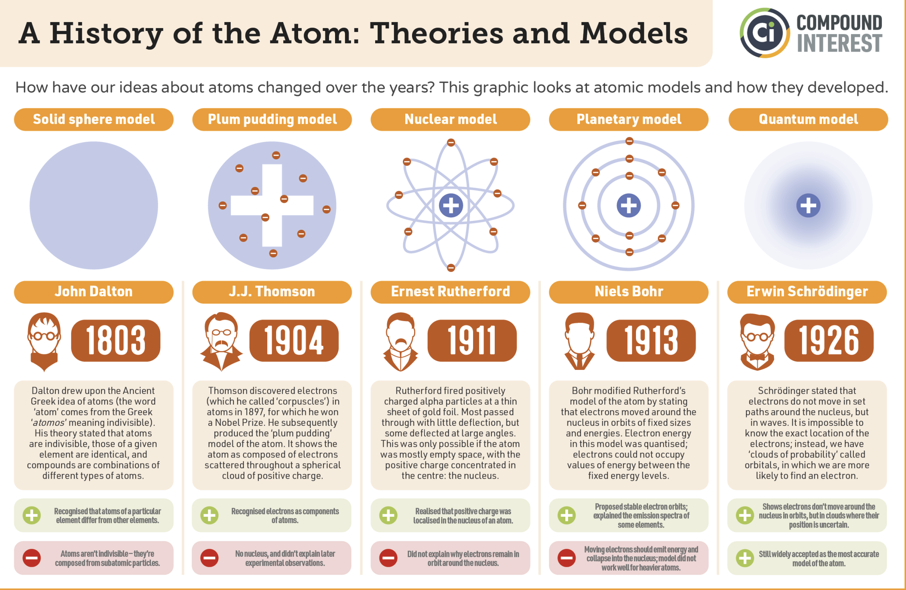

## Spectroscopy: Light as a Fingerprint

:::: {.columns}
::: {.column width="50%"}
{width="90%"}
:::
::: {.column width="50%"}
- **Spectroscopy**: interaction of matter and light
- Heated atoms emit at **characteristic frequencies**
- Spectrum is **unique per element**: an atomic fingerprint
- Reveals **structure and composition**
:::
::::

## Discrete Lines, Not a Continuum

:::: {.columns}
::: {.column width="50%"}
{width="90%"}
:::
::: {.column width="50%"}
- Solar spectrum shows **dark and bright lines**
- Lines identify **elements** in the Sun's atmosphere
- Discrete lines are **impossible** in classical mechanics
- A puzzle awaiting a new physics
:::
::::

## The Rydberg Formula

::: {.fragment}
Balmer (1885) fit part of the hydrogen spectrum. Rydberg generalized it:
:::

::: {.fragment}
$$\tilde{\nu} = R_H\left(\frac{1}{n_1^2}-\frac{1}{n_2^2}\right)$$
:::

::: {.fragment}
- $R_H = 1.097 \times 10^7 \ \text{m}^{-1}$ (Rydberg constant)
- $n_1 = 1,2,3,...$ and $n_2 = n_1+1, n_1+2,...$
:::

::: {.fragment}
- Fits the data beautifully, but offers **no physics**
- Why should **integers** govern atomic light?
:::

## Spectral Series

:::: {.columns}
::: {.column width="40%"}
{width="80%"}
:::
::: {.column width="60%"}
- Each **series** = all transitions to one lower level
- **Lyman**: $n_1=1$
- **Balmer**: $n_1=2$
- **Paschen**: $n_1=3$
- Named after their discoverers
:::
::::

## Bohr's Model (1913)

:::: {.columns}
::: {.column width="50%"}
{width="95%"}
:::
::: {.column width="50%"}
- Electron in **circular orbits** around a fixed proton
- New **quantization rule** stops the spiral into the nucleus
- Orbit must hold an **integer number of standing waves**, $n=1,2,3,...$
- Yields discrete **energy levels** labeled by $n$
:::
::::

## Quantized Angular Momentum

::: {.fragment}
Fit an integer number of de Broglie waves around the orbit:

$$2\pi r = n \lambda_e, \qquad \lambda_e = \frac{h}{m_e v}$$
:::

::: {.fragment}
Substituting gives the quantization condition:

$$m_e v r = \frac{n h}{2\pi} = n \hbar$$
:::

::: {.fragment}
- $m_e v r$ is the **angular momentum**
- Bohr: angular momentum is quantized in units of $\hbar$
:::

## Force Balance Sets the Radius

::: {.fragment}
Electrostatic pull balances the centrifugal force:

$$\frac{e^2}{4\pi\varepsilon_0 r^2} = \frac{m_e v^2}{r}$$
:::

::: {.fragment}
Combined with $m_e v r = n\hbar$, the allowed radii are:

$$r = n^2 a_0, \qquad n = 1,2,3,...$$
:::

::: {.fragment}
$$a_0 = \frac{4\pi \varepsilon_0 \hbar^2}{m_e e^2} \approx 0.529 \,\text{Å}$$
:::

::: {.fragment}
- The **Bohr radius** $a_0$ sets the length scale of atoms
:::

## The Bohr Energy Levels

::: {.fragment}
Total energy (kinetic plus Coulomb) at quantized radius:

$$E_n = -\frac{m_e e^4}{8 \varepsilon_0^2 h^2}\cdot\frac{1}{n^2}$$
:::

::: {.fragment}
The practical form for problem solving:

$$E_n = -13.6\,\frac{1}{n^2}\,\,\,[\text{eV}]$$
:::

::: {.fragment}
- **Negative**: electron is bound
- **Ionization** ($n=1 \to \infty$) costs exactly **13.6 eV**
- Photon of a jump: $\Delta E = h\nu$
:::

## Rydberg Constant from First Principles

::: {.fragment}
Photon energy of a transition, $\tilde{\nu} = \nu/c$:

$$\tilde{\nu} = R_H \left(\frac{1}{n_1^2} - \frac{1}{n_2^2}\right)$$
:::

::: {.fragment}
Now $R_H$ is **derived**, not fitted:

$$R_H = \frac{m_e e^4}{8 \varepsilon_0^2 c h^3}$$
:::

::: {.fragment}
- Bohr's model **explains** the empirical Rydberg formula
- The mysterious integers are **quantum numbers**
:::

## Hydrogen-like Atoms

::: {.fragment}
For one-electron ions ($He^+$, $Li^{2+}$), add nuclear charge $Z$:

$$E_n = -13.6\,\frac{Z^2}{n^2}\,\,\,[\text{eV}]$$
:::

::: {.fragment}
- $Z=1$ for $H$, $Z=2$ for $He^+$, $Z=3$ for $Li^{2+}$
- Energies scale as $Z^2$: $He^+$ ionization is **54.4 eV**
- Orbits shrink as $r_n = n^2 a_0 / Z$
:::

# Takeaway {.center}

> Atomic spectra are discrete because energy is quantized: Bohr's standing-wave condition fixes the orbits and yields $E_n = -13.6\,/\,n^2$ eV, deriving the empirical Rydberg formula from first principles.
