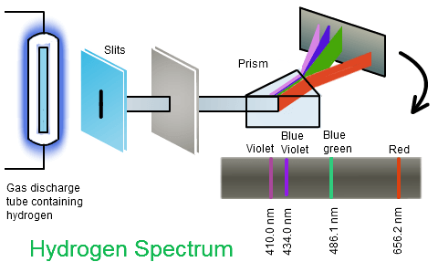
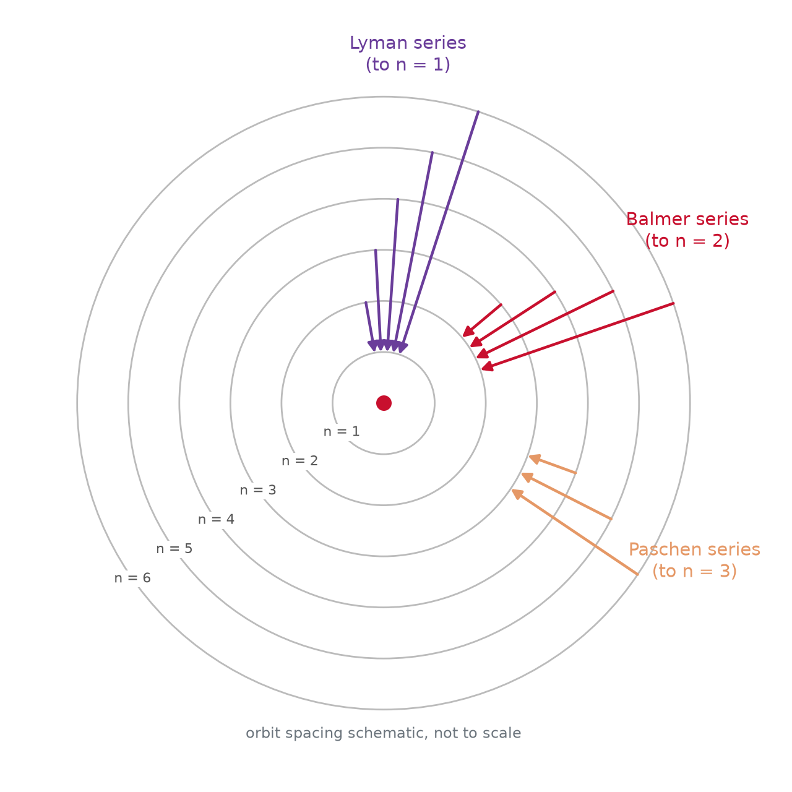
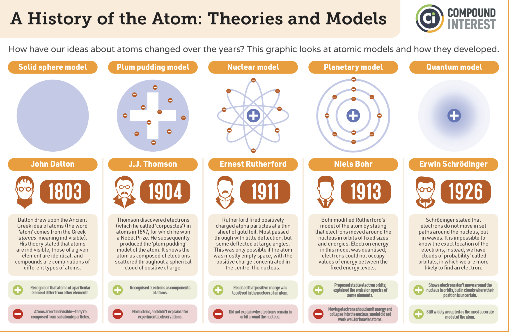
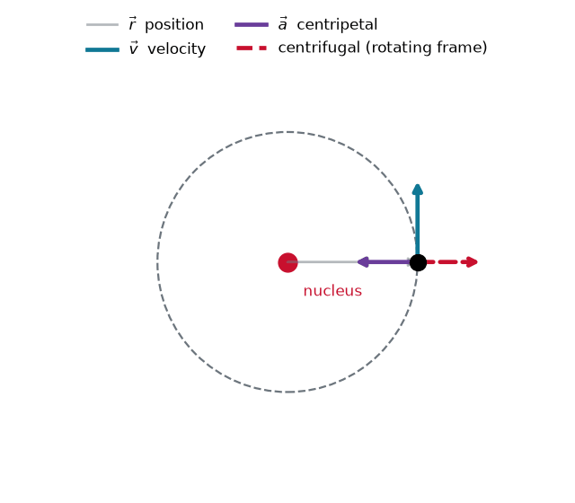
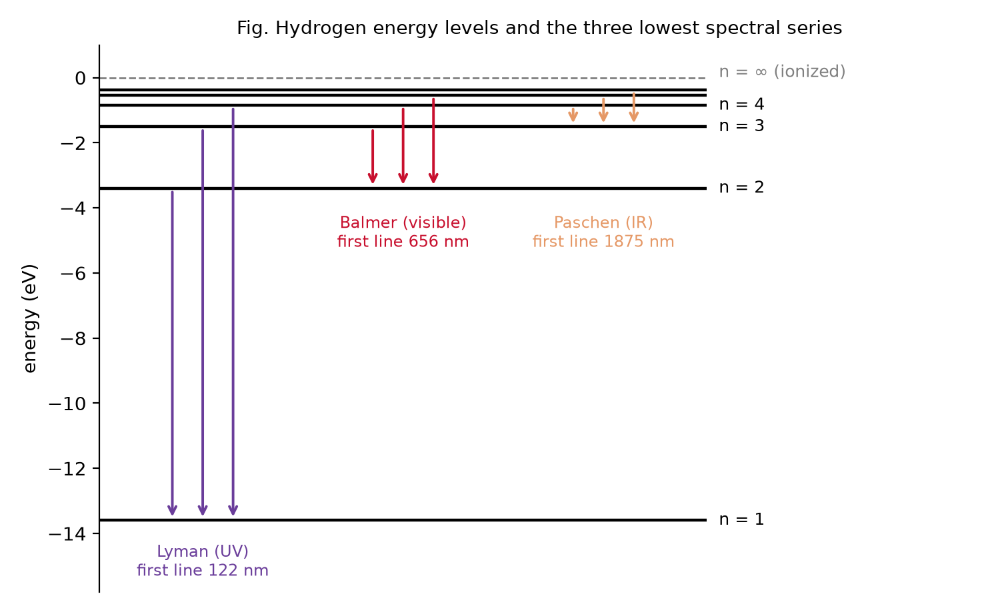

## Spectroscopy: Light as a Fingerprint

:::: {.columns}
::: {.column width="50%"}
{width="90%"}
:::
::: {.column width="50%"}
- **Spectroscopy**: interaction of matter and light
- Heated atoms emit at **characteristic frequencies**
- Spectrum is **unique per element**: an atomic fingerprint
- Reveals **structure and composition**
:::
::::

## Discrete Lines, Not a Continuum

:::: {.columns}
::: {.column width="50%"}
{height="530"}
:::
::: {.column width="50%"}
- Solar spectrum shows **dark and bright lines**
- Lines identify **elements** in the Sun's atmosphere
- Discrete lines are **impossible** in classical mechanics
- A puzzle awaiting a new physics
:::
::::

## The Rydberg Formula

Balmer (1885) fit part of the hydrogen spectrum. Rydberg generalized it:

::: {.keyeq}
$$\tilde{\nu} = R_H\left(\frac{1}{n_1^2}-\frac{1}{n_2^2}\right)$$
:::

- $R_H = 1.097 \times 10^7 \ \text{m}^{-1}$ (Rydberg constant)
- $n_1 = 1,2,3,...$ and $n_2 = n_1+1, n_1+2,...$

- Fits the data beautifully, but offers **no physics**
- Why should **integers** govern atomic light?

## Spectral Series

:::: {.columns}
::: {.column width="40%"}
{width="80%"}
:::
::: {.column width="60%"}
- Each **series** = all transitions to one lower level
- **Lyman**: $n_1=1$
- **Balmer**: $n_1=2$
- **Paschen**: $n_1=3$
- Named after their discoverers
:::
::::

## Bohr's Model (1913)

:::: {.columns}
::: {.column width="50%"}
{width="95%"}
:::
::: {.column width="50%"}
- Electron in **circular orbits** around a fixed proton
- New **quantization rule** stops the spiral into the nucleus
- Orbit must hold an **integer number of standing waves**, $n=1,2,3,...$
- Yields discrete **energy levels** labeled by $n$
:::
::::

## Quantized Angular Momentum

Fit an integer number of de Broglie waves around the orbit:

$$2\pi r = n \lambda_e, \qquad \lambda_e = \frac{h}{m_e v}$$

::: {.fragment}
Substituting gives the quantization condition:

::: {.keyeq}
$$m_e v r = \frac{n h}{2\pi} = n \hbar$$
:::

:::

- $m_e v r$ is the **angular momentum**
- Bohr: angular momentum is quantized in units of $\hbar$

## Circular Motion: What Actually Balances

:::: {.columns}
::: {.column width="52%"}
{width="100%"}
:::
::: {.column width="48%"}
- $\vec{v}$ always **tangent**, $\vec{a}$ always **inward**
- Magnitudes fixed, only **directions turn**
- Lab frame: Coulomb pull is **unbalanced**, it supplies $a = v^2/r$
- Rotating frame: **centrifugal** cancels it
- Each component is **simple harmonic motion**
:::
::::

## From Orbits to Energy Levels

Coulomb pull balances centrifugal force, $\dfrac{e^2}{4\pi\varepsilon_0 r^2} = \dfrac{m_e v^2}{r}$, combined with $m_e v r = n\hbar$:

:::: {.columns}
::: {.column width="50%"}
::: {.fragment}
$$r_n = n^2 a_0$$

$$a_0 = \frac{4\pi \varepsilon_0 \hbar^2}{m_e e^2} \approx 0.529 \,\text{Å}$$
:::
:::
::: {.column width="50%"}
::: {.fragment}

::: {.keyeq}
$$E_n = -\frac{m_e e^4}{8 \varepsilon_0^2 h^2}\cdot\frac{1}{n^2} = -\frac{13.6\ \text{eV}}{n^2}$$
:::

:::
:::
::::

- **Bohr radius** $a_0$: the length scale of atoms
- **Negative** energy: the electron is bound; ionization from $n=1$ costs **13.6 eV**
- Orbits grow as $n^2$, energies close up as $1/n^2$

## Rydberg Constant from First Principles

Photon energy of a transition, $\tilde{\nu} = \nu/c$:

$$\tilde{\nu} = R_H \left(\frac{1}{n_1^2} - \frac{1}{n_2^2}\right)$$

::: {.fragment}
Now $R_H$ is **derived**, not fitted:

$$R_H = \frac{m_e e^4}{8 \varepsilon_0^2 c h^3}$$
:::

- Bohr's model **explains** the empirical Rydberg formula
- The mysterious integers are **quantum numbers**

## Lines are Jumps Between Levels

:::: {.columns}
::: {.column width="60%"}
{width="100%"}
:::
::: {.column width="40%"}
- A photon carries away **exactly** $E_{n_2} - E_{n_1} = h\nu$
- Each **series** shares its lower level
- **Lyman** ends on $n=1$ (UV), **Balmer** on $n=2$ (visible), **Paschen** on $n=3$ (IR)
- Lines pile up at the **series limit**, the ionization edge
:::
::::

## Explore the Series

Slide the lower level: the whole series moves between UV, visible and IR.

```{ojs}
//| echo: false
viewof n1 = Inputs.range([1, 4], {step: 1, value: 2, label: "lower level n₁"})
```

```{ojs}
//| echo: false
lamColor = function (w) {
  if (w < 380 || w > 750) return "#8c8c8c";          // invisible: grey
  if (w < 440) return "#7b2fbe";
  if (w < 490) return "#2b6fd6";
  if (w < 510) return "#12b5a6";
  if (w < 580) return "#3aa93a";
  if (w < 645) return "#e0a521";
  return "#C8102E";
}
```

```{ojs}
//| echo: false
{
  const lines = d3.range(n1 + 1, n1 + 9).map(n2 => ({
    n2,
    lam: 1 / (1.097e-2 * (1 / (n1 * n1) - 1 / (n2 * n2)))   // nm
  }));
  return Plot.plot({
    width: 1120, height: 380, marginLeft: 40, marginBottom: 55,
    x: {type: "log", label: "wavelength (nm)  →", domain: [80, 5000],
        ticks: [100, 200, 500, 1000, 2000, 5000], tickFormat: d => d},
    y: {axis: null, domain: [0, 1]},
    marks: [
      Plot.rect([{}], {x1: 380, x2: 750, y1: 0, y2: 1, fill: "#ffd700", fillOpacity: 0.2}),
      Plot.text([{}], {x: 534, y: 0.04, text: ["visible"], fill: "#8a6d00", fontSize: 13}),
      Plot.ruleX(lines, {x: "lam", stroke: d => lamColor(d.lam), strokeWidth: 3}),
      Plot.text(lines.filter(d => d.n2 <= n1 + 2),
                {x: "lam", y: 0.97, text: d => `n₂=${d.n2}`, fill: "#333",
                 fontSize: 15, textAnchor: "start", dx: 6})
    ]
  });
}
```

```{ojs}
//| echo: false
md`**${["", "Lyman (UV)", "Balmer (visible)", "Paschen (IR)", "Brackett (IR)"][n1]}** &nbsp;·&nbsp;
first line **${(1/(1.097e-2*(1/(n1*n1) - 1/((n1+1)*(n1+1))))).toFixed(0)} nm** &nbsp;·&nbsp;
series limit **${(1/(1.097e-2/(n1*n1))).toFixed(0)} nm** (lines pile up here)`
```

## Hydrogen-like Atoms

For one-electron ions ($He^+$, $Li^{2+}$), add nuclear charge $Z$:

$$E_n = -13.6\,\frac{Z^2}{n^2}\,\,\,[\text{eV}]$$

- $Z=1$ for $H$, $Z=2$ for $He^+$, $Z=3$ for $Li^{2+}$
- Energies scale as $Z^2$: $He^+$ ionization is **54.4 eV**
- Orbits shrink as $r_n = n^2 a_0 / Z$

## What Bohr Gets Wrong

- **Two electrons break it**: no helium, no periodic table
- **No intensities, no selection rules**: which lines are bright?
- **No fine structure**: one quantum number $n$ is not enough
- **An orbit is not allowed**: definite $r$ and $v$ defy uncertainty

::: {.fragment}
Keep the physics, drop the picture: **quantized energies**, **integer quantum numbers**, **light from jumps between levels**
:::

# Takeaway {.center}

> Atomic spectra are discrete because energy is quantized: Bohr's standing-wave condition fixes the orbits and yields $E_n = -13.6\,/\,n^2$ eV, deriving the empirical Rydberg formula from first principles.
