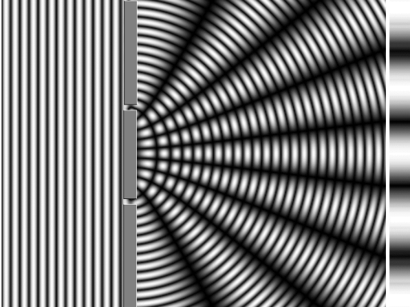
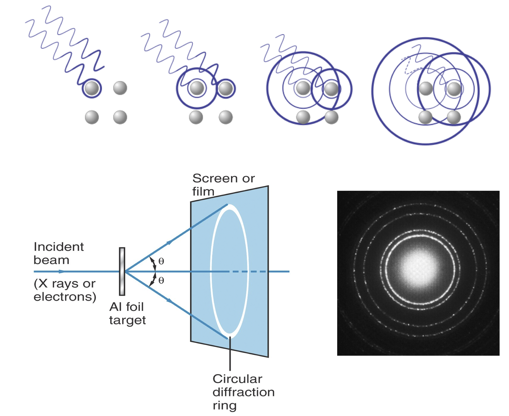
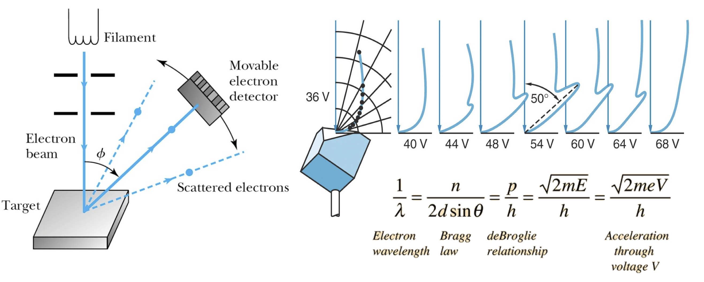
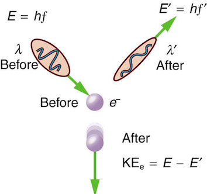
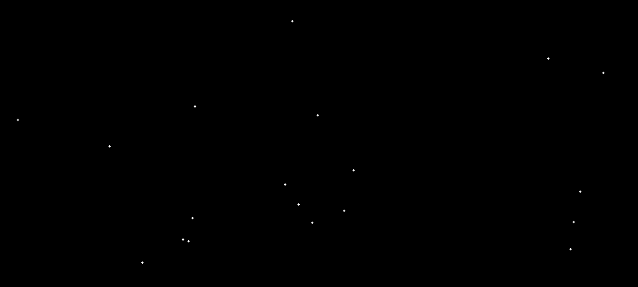
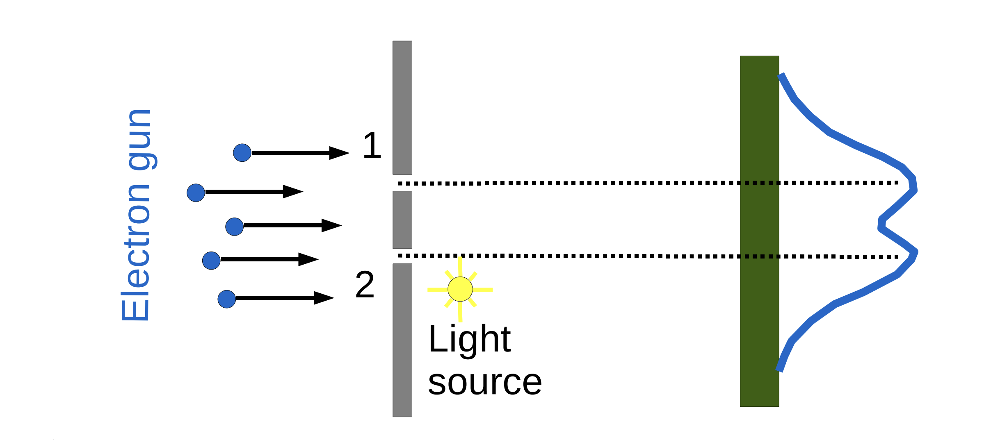
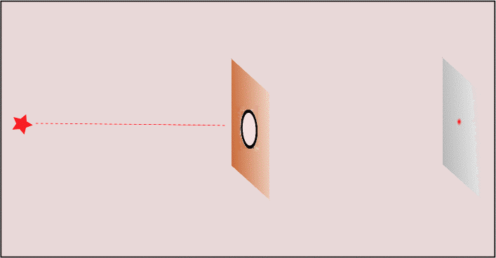

## The Big Idea

- **Particles and waves are not mutually exclusive**
- Every quantum object shows **both** behaviors

- An electron has a **wavelength**; a photon has **momentum**

- Which behavior dominates depends on the **experimental conditions**

## Diffraction and Interference

:::: {.columns}
::: {.column width="50%"}
{width="90%"}
:::
::: {.column width="50%"}
- **Diffraction:** waves spread around obstacles or through openings
- **Interference:** combined waves add (in phase) or cancel (out of phase)
- **Double slit:** two slits produce interference bands on the screen
:::
::::

## Bragg's Law: X-rays Scatter Off Crystals

:::: {.columns}
::: {.column width="50%"}
{width="90%"}
:::
::: {.column width="50%"}
- X-rays scatter off lattice atoms
- Path differences give **constructive** (left) or **destructive** (right) interference
:::
::::

::: {.fragment}
$$\boxed{2d \sin\theta = n\lambda}$$
:::

- $d$: plane spacing, $\lambda$: wavelength, $n$: diffraction order
- Interference was the **hallmark of wave behavior**

## Electrons Also Diffract

:::: {.columns}
::: {.column width="50%"}
{width="95%"}
:::
::: {.column width="50%"}
- **Davisson and Germer (1925):** intensity peaks in scattered electron beams
- Peaks fit **Bragg's law** (until then only for X-rays)
- Electrons behave as **waves**
:::
::::

## Compton Scattering: Light Has Momentum

:::: {.columns}
::: {.column width="50%"}
{width="90%"}
:::
::: {.column width="50%"}
- X-rays scatter off free electrons like **billiard balls**
- Conservation of **momentum** gives longer outgoing wavelength
- Makes sense only if the photon is a **particle** with momentum
:::
::::

## The de Broglie Relation

- Wave-like and particle-like traits are **inversely proportional**

::: {.fragment}
$$\boxed{\lambda = \frac{h}{p}}$$
:::

- $h$: Planck's constant, $p$: momentum, $\lambda$: wavelength
- **Heavy/fast** objects: tiny wavelength (particle-like)
- **Light/slow** objects: large wavelength (wave-like)

- With $E = T + V$: $\quad \lambda = \dfrac{h}{\sqrt{2m(E - V)}}$
- Wavelength **changes** as a particle moves through different potentials (key for bonding)

## The Double-Slit Puzzle

:::: {.columns}
::: {.column width="50%"}
{width="90%"}
:::
::: {.column width="50%"}
- Electrons build an **interference pattern**
- It persists even with **one electron at a time**
- Each electron interferes with **itself**
:::
::::

## Which Slit?

:::: {.columns}
::: {.column width="50%"}
{width="90%"}
:::
::: {.column width="50%"}
- Try to detect **which slit** the electron took
- The **interference pattern disappears**
- Measurement changes the outcome (resolved later via QM postulates)
:::
::::

## Heisenberg's Uncertainty Principle

:::: {.columns}
::: {.column width="50%"}
{width="90%"}
:::
::: {.column width="50%"}
- Cannot know exact **position and momentum** at once
- Narrow the slit (localize $x$): momentum spreads out
- A direct consequence of **wave-particle duality**
:::
::::

::: {.fragment}
$$\sigma_x \sigma_p \geq \hbar/2$$
:::

# Takeaway {.center}

> Every quantum object is both wave and particle, with wavelength set by $\lambda = h/p$, so position and momentum can never both be sharp: $\sigma_x \sigma_p \geq \hbar/2$.
