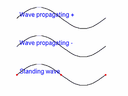
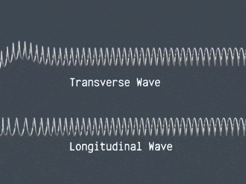
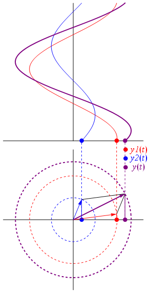
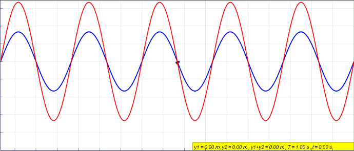
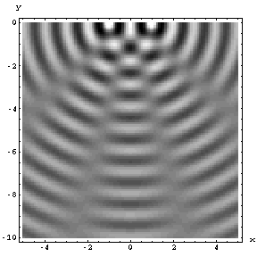

## What is a wave?

- A **wave** is a self-propagating **disturbance**
- Transfers **energy, momentum, information**
- Does **not** transport matter
- Governed by the **wave equation**, a PDE

::: {.fragment}
Two key families: **traveling waves** (propagate) and **standing waves** (oscillate in place)
:::

## Kinds of waves

:::: {.columns}
::: {.column width="50%"}
{width="90%"}
:::
::: {.column width="50%"}
- **Medium disturbance**: sound, strings, water
- **Quantum waves**: complex wavefunctions for electrons, atoms
- **Electromagnetic waves**: need **no medium**, travel in vacuum
- **Gravitational waves**: ripples in spacetime
:::
::::

## Transverse vs longitudinal

:::: {.columns}
::: {.column width="50%"}
{width="90%"}
:::
::: {.column width="50%"}
- **Transverse**: disturbance is **perpendicular** to propagation
- **Longitudinal**: disturbance is **along** propagation
:::
::::

## Defining a wave mathematically

- A disturbance $u$ depends on space and time: $u = f(x, t)$
- A surfer riding the wave sees it frozen at $x'$
- A shore observer sees the front move: $x = x' + vt$

::: {.fragment}
A right-moving wave of fixed shape:

$$u(x,t) = f(x-vt)$$
:::

::: {.fragment}
Set the front constant: $x - vt = const \Rightarrow x = vt + const$ (moves right). The form $f(x+vt)$ moves **left**.
:::

## Periodic traveling waves

:::: {.columns}
::: {.column width="50%"}
{width="90%"}
:::
::: {.column width="50%"}
A sine wave traveling along $x$:

$$y(x,t)= A \sin(kx-\omega t+\phi)$$

- **Amplitude** $A$: max disturbance
- **Wave number** $k$: periodicity in space
- **Angular frequency** $\omega = kv$: periodicity in time
- **Phase** $\phi$: starting point
:::
::::

## Complex representation

- Easier to compute with **complex exponentials**, take real or imaginary part at the end

::: {.fragment}
$$u(x,t) = Ae^{i(kx-\omega t)}$$
:::

:::: {.columns}
::: {.column width="40%"}
{width="80%"}
:::
::: {.column width="60%"}
- Real and imaginary parts are cosine and sine
- The **phasor** rotates as $t$ advances at fixed $x$
:::
::::

## Periodicity in space and time

- Repeats every **wavelength** $\lambda$ in space: $k\lambda = 2\pi$

::: {.fragment}
$$k=\frac{2\pi}{\lambda}$$
:::

- Repeats every **period** $T$ in time, frequency $\nu = 1/T$: $\omega T = 2\pi$

::: {.fragment}
$$\omega=\frac{2\pi}{T} = 2\pi\nu$$
:::

::: {.fragment}
Wavelength, frequency, and speed are linked by $\omega = kv$, i.e. $\lambda \nu = v$
:::

## The classical wave equation {auto-animate=true}

$$u(x,t) = Ae^{i(kx-\omega t)}$$

## The classical wave equation {auto-animate=true}

$$u(x,t) = Ae^{i(kx-\omega t)}$$

::: {.nonincremental}
- Two $x$-derivatives: $u_{xx} = -k^2\, u$
- Two $t$-derivatives: $u_{tt} = -\omega^2\, u$
- Their ratio eliminates $u$: $\dfrac{k^2}{\omega^2} = \dfrac{1}{v^2}$
:::

## The classical wave equation {auto-animate=true}

$$u(x,t) = Ae^{i(kx-\omega t)}$$

::: {.nonincremental}
- Two $x$-derivatives: $u_{xx} = -k^2\, u$
- Two $t$-derivatives: $u_{tt} = -\omega^2\, u$
- Their ratio eliminates $u$: $\dfrac{k^2}{\omega^2} = \dfrac{1}{v^2}$
:::

$$\frac{\partial^2 u(x,t)}{\partial x^2 } = \frac{1}{v^2}\frac{\partial^2 u(x,t)}{\partial t^2}$$

Solutions are **wave functions** of space and time

## Combining waves: interference

:::: {.columns}
::: {.column width="55%"}
{width="95%"}
:::
::: {.column width="45%"}
- **Superposition**: if $u_A$ and $u_B$ solve the wave equation, so does $u_C = u_A + u_B$
- **Interference**: combining waves yields greater, lower, or equal amplitude
:::
::::

## Interference of two phases

:::: {.columns}
::: {.column width="50%"}
{width="90%"}
:::
::: {.column width="50%"}
Summing two waves differing only in phase:

$$\Psi_{\text{total}} = 2 \cos\left( \frac{\phi_1 - \phi_2}{2} \right) e^{i \left( kx - \omega t + \frac{\phi_1 + \phi_2}{2} \right)}$$

- In phase ($\phi=0$): amplitude **doubles**
- Out of phase ($\phi=\pi$): **cancels**
:::
::::

## Live: dial the phase {.smaller}

<span style="color:#7fb3d5">**wave 1**</span> $= \sin(kx)$, <span style="color:#e59866">**wave 2**</span> $= \sin(kx+\phi)$, <span style="color:#C8102E">**sum**</span> with envelope $2\cos(\phi/2)$

```{ojs}
//| echo: false
viewof phi = Inputs.range([0, 6.283], {step: 0.01, value: 1.0, label: "phase φ (rad)"})
```

```{ojs}
//| echo: false
{
  const xs = d3.range(0, 12.57, 0.03);
  const series = (fn) => xs.map(x => ({x, y: fn(x)}));
  return Plot.plot({
    width: 1000, height: 360,
    x: {label: "kx"},
    y: {domain: [-2.2, 2.2], label: "u"},
    marks: [
      Plot.ruleY([0], {stroke: "#ccc"}),
      Plot.line(series(x => Math.sin(x)), {x: "x", y: "y", stroke: "#7fb3d5", strokeWidth: 1.5}),
      Plot.line(series(x => Math.sin(x + phi)), {x: "x", y: "y", stroke: "#e59866", strokeWidth: 1.5}),
      Plot.line(series(x => Math.sin(x) + Math.sin(x + phi)), {x: "x", y: "y", stroke: "#C8102E", strokeWidth: 2.5})
    ]
  });
}
```

```{ojs}
//| echo: false
md`Sum amplitude right now: **${(Math.abs(2*Math.cos(phi/2))).toFixed(2)}** (in phase → 2, out of phase → 0)`
```

# Takeaway {.center}

> A wave is a disturbance described by $u=f(x \pm vt)$ that obeys the classical wave equation $u_{xx} = \frac{1}{v^2}u_{tt}$, with $k=2\pi/\lambda$, $\omega=2\pi\nu$, and $\omega=kv$; superposing waves produces interference.
