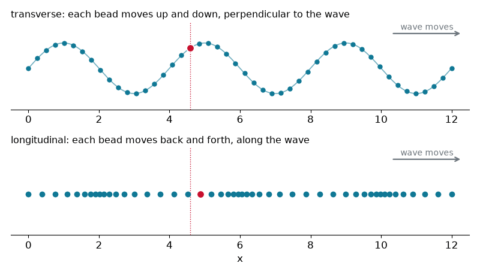
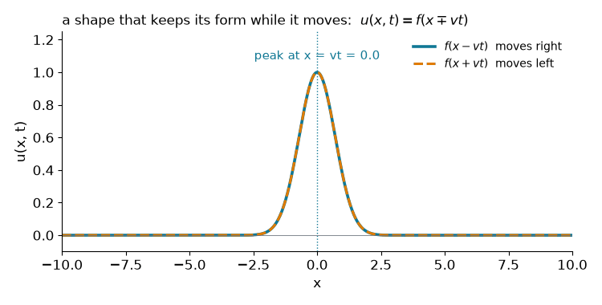
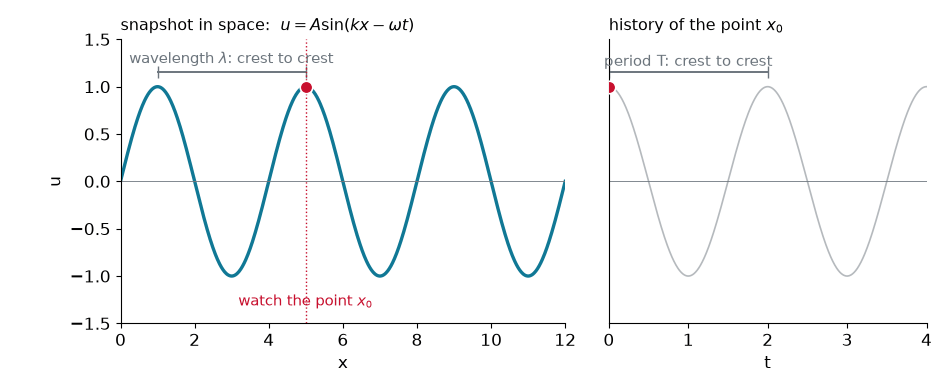
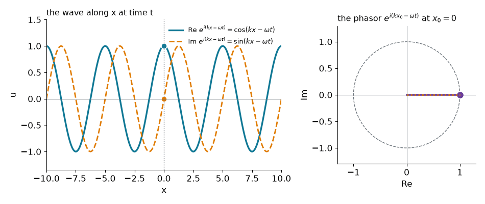
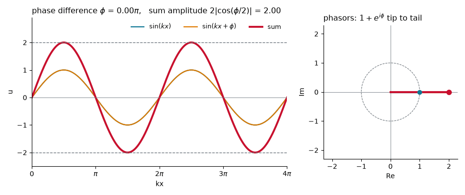
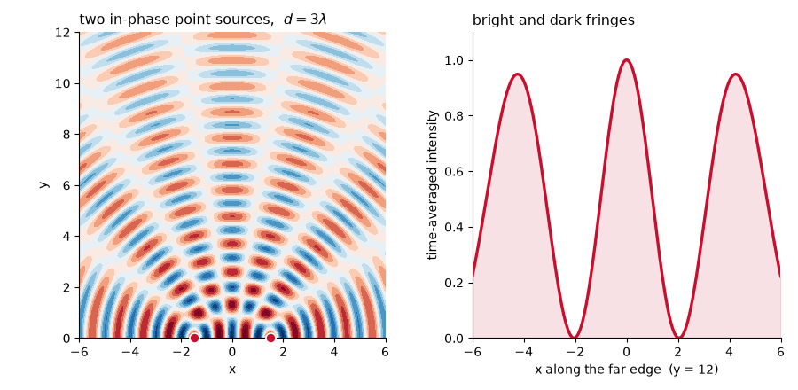
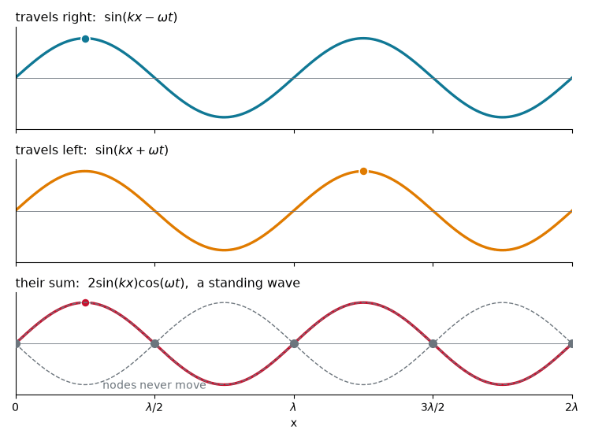
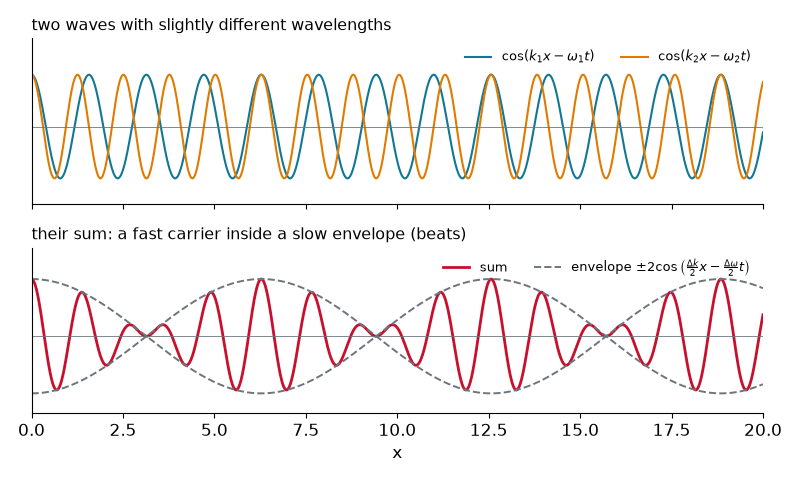

## What is a wave?

:::: {.columns}
::: {.column width="56%"}
{width="100%"}
:::
::: {.column width="44%"}
- A **self-propagating disturbance**: carries energy and information, **not matter**
- **Transverse**: medium moves perpendicular to travel (string, light)
- **Longitudinal**: medium moves along travel (sound)
- Strings, water, sound, light, and electron **wavefunctions**
:::
::::

## A shape that moves: $f(x - vt)$

:::: {.columns}
::: {.column width="56%"}
{width="100%"}
:::
::: {.column width="44%"}
- Surfer rides the wave: shape frozen at $x'$
- Shore sees it slide: $x = x' + vt$

$$u(x,t) = f(x') = f(x - vt)$$

- Hold the peak fixed: $x - vt = \text{const}$ moves **right** at speed $v$
- $f(x + vt)$ moves **left**
:::
::::

## Periodic traveling waves

{.nostretch width="76%" fig-align="center"}

$$u(x,t) = A\sin(kx - \omega t + \phi)$$

- **Amplitude** $A$, **wave number** $k$, **angular frequency** $\omega = kv$, **phase** $\phi$

## Wavelength, period, speed

Repeats every $\lambda$ in space and every $T$ in time: $k\lambda = 2\pi$ and $\omega T = 2\pi$

:::: {.columns}
::: {.column width="50%"}

::: {.keyeq}
$$k = \frac{2\pi}{\lambda}$$
:::

:::
::: {.column width="50%"}

::: {.keyeq}
$$\omega = \frac{2\pi}{T} = 2\pi\nu$$
:::

:::
::::

::: {.fragment}

::: {.keyeq}
$$v = \frac{\omega}{k} = \lambda\nu$$
:::

:::

- One wavelength per period. The **medium** sets $v$, so fixing $\lambda$ fixes $\nu$

## Complex representation

:::: {.columns}
::: {.column width="60%"}
{width="100%"}
:::
::: {.column width="40%"}
$$u(x,t) = Ae^{i(kx - \omega t)}$$

- Real part **cosine**, imaginary part **sine**
- At fixed $x$: a **phasor** turning at rate $\omega$
- Derivatives become **multiplications** by $ik$ and $-i\omega$
- Take the real part at the very end
:::
::::

## The classical wave equation {auto-animate=true}

$$u(x,t) = Ae^{i(kx-\omega t)}$$

**Two $x$-derivatives, two $t$-derivatives**

$$\frac{\partial^2 u}{\partial x^2} = (ik)^2 u = -k^2 u, \qquad \frac{\partial^2 u}{\partial t^2} = (-i\omega)^2 u = -\omega^2 u$$

## The classical wave equation {auto-animate=true}

$$u(x,t) = Ae^{i(kx-\omega t)}$$

**Two $x$-derivatives, two $t$-derivatives**

$$\frac{\partial^2 u}{\partial x^2} = (ik)^2 u = -k^2 u, \qquad \frac{\partial^2 u}{\partial t^2} = (-i\omega)^2 u = -\omega^2 u$$

Divide and use $\omega = kv$: the ratio is $k^2/\omega^2 = 1/v^2$

::: {.keyeq}
$$\frac{\partial^2 u}{\partial x^2} = \frac{1}{v^2}\frac{\partial^2 u}{\partial t^2}$$
:::

- Holds for **every** shape $f(x \mp vt)$ by the chain rule: the equation of motion of waves

## Example: read a wave off its formula

::: {.worked}
$u(x,t) = \sin(2x - 10t + \pi/2)$ in SI units. Find $A$, $\lambda$, $\nu$, $T$, and $v$.
:::

::: {.soln .fragment}
$$A = 1, \qquad k = 2\ \text{m}^{-1} \Rightarrow \lambda = \pi\ \text{m}, \qquad \omega = 10\ \text{s}^{-1} \Rightarrow \nu = \tfrac{5}{\pi}\ \text{Hz},\; T = \tfrac{\pi}{5}\ \text{s}$$

$$v = \frac{\omega}{k} = 5\ \text{m/s to the right}, \qquad \sin(\theta + \pi/2) = \cos\theta$$
:::

- Match to $A\sin(kx - \omega t + \phi)$ and read off; only $v = \omega/k$ needs a calculation

## Superposition and interference

:::: {.columns}
::: {.column width="62%"}
{width="100%"}
:::
::: {.column width="38%"}
- Linear equation: $u_A + u_B$ is again a solution
- Equal waves, phase difference $\phi$:

$$\text{sum} = 2\cos\tfrac{\phi}{2}\; e^{i(\theta + \phi/2)}$$

- $\phi = 0$: amplitude **doubles**
- $\phi = \pi$: waves **cancel**
:::
::::

## Live: dial the phase {.smaller}

<span style="color:#107895">**wave 1**</span> $= \sin(kx)$, <span style="color:#e07b00">**wave 2**</span> $= \sin(kx+\phi)$, <span style="color:#C8102E">**sum**</span> with envelope $2\cos(\phi/2)$

```{ojs}
//| echo: false
viewof phi = Inputs.range([0, 6.283], {step: 0.01, value: 1.0, label: "phase φ (rad)"})
```

```{ojs}
//| echo: false
{
  const xs = d3.range(0, 12.57, 0.03);
  const series = (fn) => xs.map(x => ({x, y: fn(x)}));
  return Plot.plot({
    width: 1000, height: 360,
    x: {label: "kx"},
    y: {domain: [-2.2, 2.2], label: "u"},
    marks: [
      Plot.ruleY([0], {stroke: "#ccc"}),
      Plot.line(series(x => Math.sin(x)), {x: "x", y: "y", stroke: "#107895", strokeWidth: 1.5}),
      Plot.line(series(x => Math.sin(x + phi)), {x: "x", y: "y", stroke: "#e07b00", strokeWidth: 1.5}),
      Plot.line(series(x => Math.sin(x) + Math.sin(x + phi)), {x: "x", y: "y", stroke: "#C8102E", strokeWidth: 2.5})
    ]
  });
}
```

```{ojs}
//| echo: false
md`Sum amplitude right now: **${(Math.abs(2*Math.cos(phi/2))).toFixed(2)}** (in phase → 2, out of phase → 0)`
```

## Two sources: fringes

:::: {.columns}
::: {.column width="62%"}
{width="100%"}
:::
::: {.column width="38%"}
- Two in-phase sources, $d = 3\lambda$
- Path difference $m\lambda$: crests meet, **bright**
- Path difference $(m + \tfrac12)\lambda$: crest meets trough, **dark**
- This is the **double slit** of Chapter 1
:::
::::

## Standing waves: two waves, opposite directions

:::: {.columns}
::: {.column width="46%"}
{height="400"}
:::
::: {.column width="54%"}
- $x$ and $t$ **separate**: the shape $\sin kx$ stays put, its height $\cos\omega t$ oscillates
- **Nodes** at $kx = n\pi$, spaced $\lambda/2$, never move
- Clamped ends must be nodes: only $L = n\lambda/2$ **fits**
:::
::::

::: {.keyeq}
$$\sin(kx-\omega t) + \sin(kx+\omega t) = 2\sin(kx)\cos(\omega t)$$
:::

## Beats

:::: {.columns}
::: {.column width="60%"}
{width="100%"}
:::
::: {.column width="40%"}
$$\cos a + \cos b = 2\cos\tfrac{a-b}{2}\cos\tfrac{a+b}{2}$$

- Slightly different $k$: a **slow envelope** times a **fast carrier**
- Beat frequency $|\nu_2 - \nu_1|$: two strings almost in tune
- Many $k$ at once: one **wave packet**, the seed of the uncertainty principle
:::
::::

# Takeaway {.center}

> A wave is any shape $f(x \mp vt)$. Sine waves carry $k = 2\pi/\lambda$ and $\omega = 2\pi\nu$ with $v = \omega/k$, every wave obeys $u_{xx} = u_{tt}/v^2$, and because that equation is linear, waves add: interference, standing waves, and beats.
