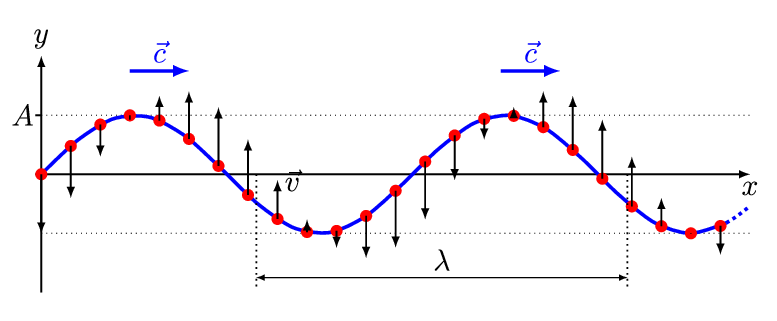
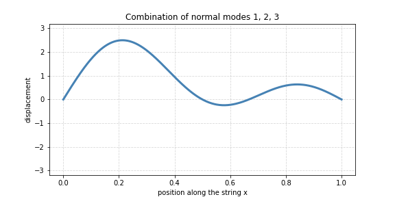
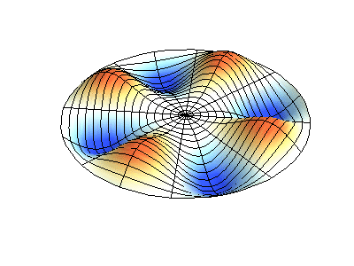

## The Classical Wave Equation

:::: {.columns}
::: {.column width="50%"}
{width="90%"}
:::
::: {.column width="50%"}
- A second-order **PDE** for the displacement $u(x,t)$

$$\frac{\partial^2 u(x,t)}{\partial x^2} = \frac{1}{v^2}\frac{\partial^2 u(x,t)}{\partial t^2}$$

- Governs evolution in **space and time**
- Given initial conditions, predicts any complicated wave
:::
::::

## Why a Guitar String?

:::: {.columns}
::: {.column width="50%"}
{width="90%"}
:::
::: {.column width="50%"}
- A plucked string is the classic **1D wave** system
- Specify initial conditions, predict evolution over space and time
- **Linear** PDE: any combination of solutions is a solution
:::
::::

## The Big Picture: Three Ingredients

- **1. Boundary conditions** (string fixed at both ends):

$$u(0, t) = 0 \quad \text{and} \quad u(L, t) = 0$$

- **2. Separation of variables** (assume $x$, $t$ vary independently):

$$u(x, t) = X(x) \cdot T(t)$$

- **3. Superposition** (linearity lets us sum solutions):

$$u = c_1 u_1+c_2u_2$$

## Step 1: Separate the Variables

- Substitute $u(x,t) = X(x)T(t)$ into the wave equation
- Divide through: each side depends on **one variable only**, so both equal a constant $K$

$$\frac{1}{T(t)v^2}\frac{\partial^2 T(t)}{\partial t^2} = \frac{1}{X(x)}\frac{\partial^2 X(x)}{\partial x^2} = K$$

- One **PDE** becomes two **ODEs**:

$$\frac{\partial^2 T(t)}{\partial t^2} - K T(t) v^2 = 0 \qquad \frac{\partial^2 X(x)}{\partial x^2} - K X(x) = 0$$

## Step 2: The Sign of K Decides

- **Recipe for linear, homogeneous ODEs:** plug in $y \to e^{kx}$, solve the algebraic equation for $k$
- **$K > 0$:** real exponentials, boundary conditions force $X(x) = 0$ (no music!)
- **$K < 0$** (set $K = -\beta^2$): oscillatory solution

$$X(x) = A \cos(\beta x) + B \sin(\beta x)$$

- Boundary conditions: $A = 0$, and $\sin(\beta L) = 0$ for a non-trivial solution

## Normal Modes Emerge

:::: {.columns}
::: {.column width="50%"}
{width="90%"}
:::
::: {.column width="50%"}
- $\sin(\beta L) = 0$ quantizes $\beta$:

$$\beta = \frac{n \pi}{L}, \quad n = 1, 2, 3, \ldots$$

- Infinite set of **normal modes**:

$$X(x) = B \sin \left(\frac{n \pi}{L} x \right)$$
:::
::::

## Modes Combine: Superposition in Motion

{width="85%" fig-align="center"}

- Any string motion = **sum of normal modes**, each oscillating at its own frequency

## The Temporal Part

- Time has **no boundary conditions**: it marches forward freely
- Solution is oscillatory with mode frequency $\omega_n = \beta v = \frac{n \pi v}{L}$

$$T(t) = D_n \cos(\omega_n t) + E_n \sin(\omega_n t) = A_n \cos (\omega_n t + \phi_n)$$

- Constants $A_n$ and $\phi_n$ are fixed by **initial conditions** (how the string is plucked)

## Step 3: The Full Solution

- Combine spatial and temporal parts, sum over all modes:

$$u(x, t) = \sum_n A_n \sin \left(\frac{n \pi}{L} x \right) \cdot \cos (\omega_n t + \phi_n)$$

- **Nodes** (points fixed at zero) grow with $n$:
  - $n=1$: **0 nodes**, fundamental (first harmonic)
  - $n=2$: 1 node, second harmonic
  - $n=3$: 2 nodes, third harmonic

## Extending to 2D Membranes

:::: {.columns}
::: {.column width="50%"}
{width="90%"}
:::
::: {.column width="50%"}
- Separate **three** functions: $u(x, y, t) = X(x) Y(y) T(t)$
- 2D mode is a product of 1D modes, indexed by $n$ and $m$

$$\omega_{nm} = v\pi \left(\frac{n^2}{a^2} + \frac{m^2}{b^2}\right)^{1/2}$$
:::
::::

## The Sound of Music

:::: {.columns}
::: {.column width="50%"}
{width="90%"}
:::
::: {.column width="50%"}
- Musical sound is a **superposition of normal modes** (harmonics, overtones)
- Instrument **size** sets the frequency range: small = high, large = low
:::
::::

# Takeaway {.center}

> Separation of variables plus boundary conditions turns the wave equation into quantized **normal modes**, and any vibration is a superposition of them.
