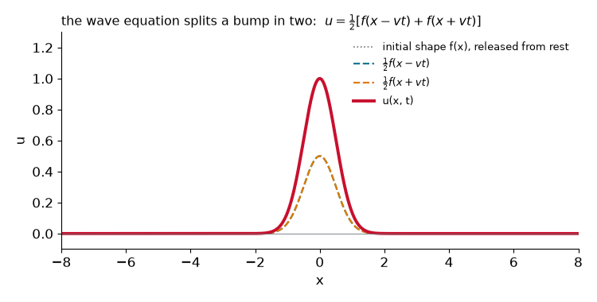
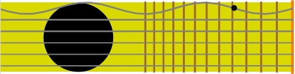
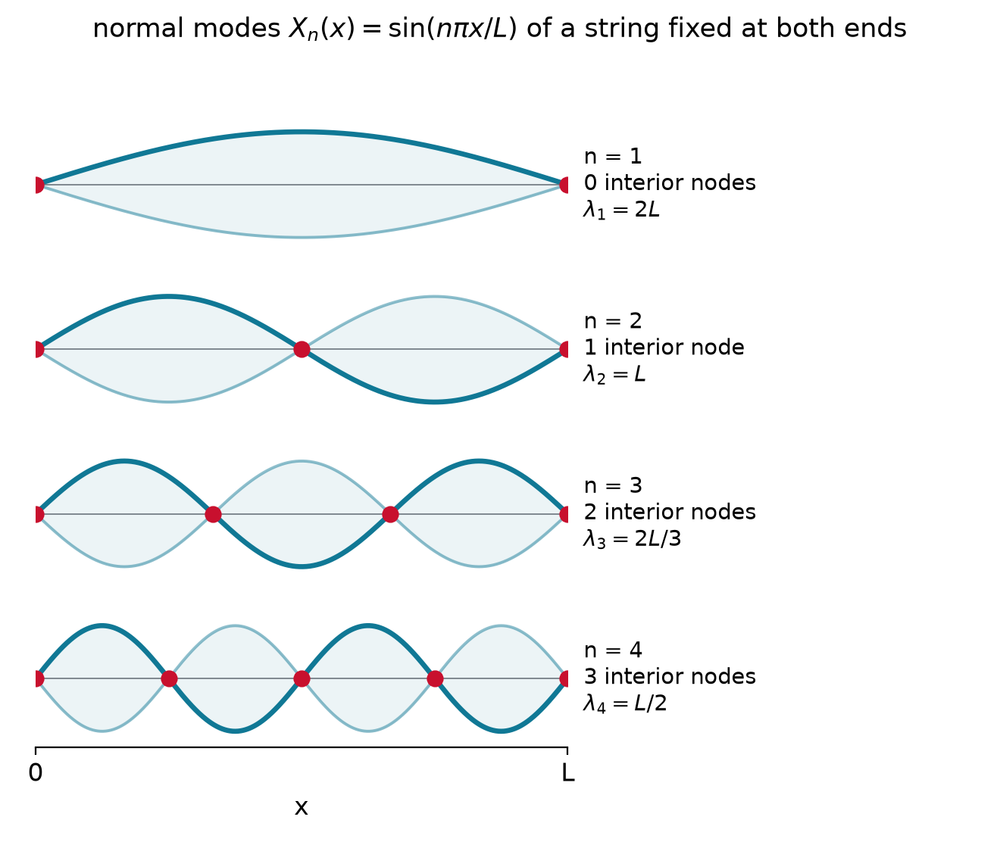
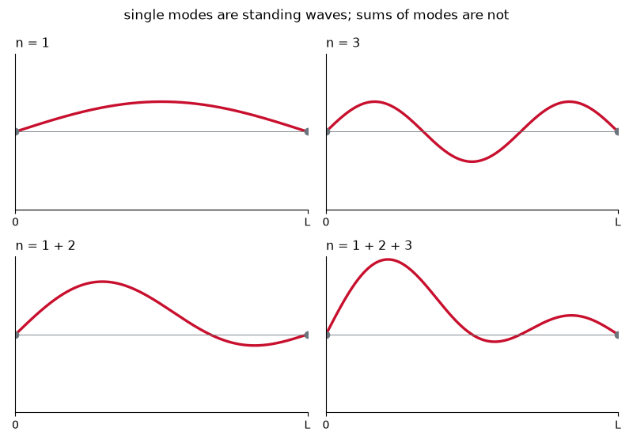
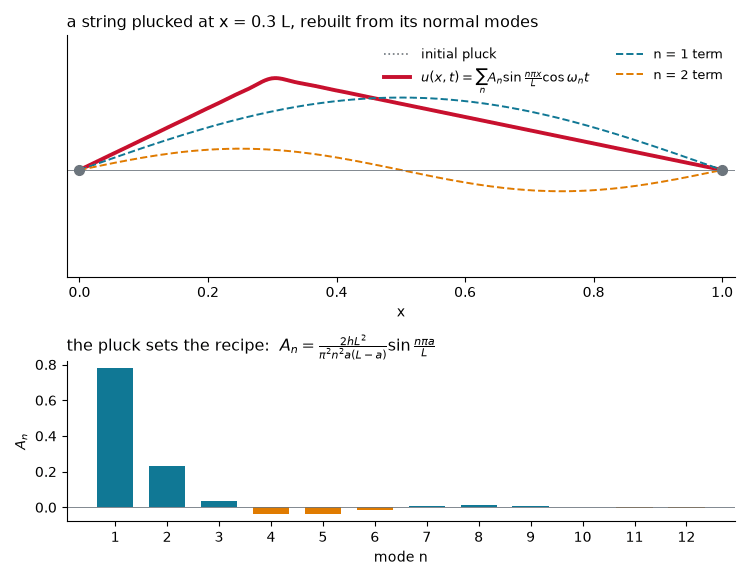
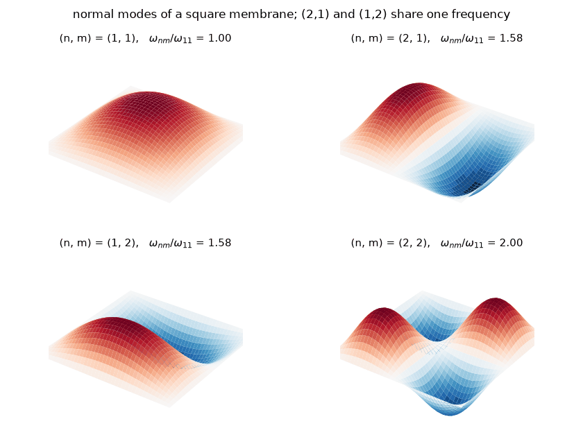

## The classical wave equation

:::: {.columns}
::: {.column width="58%"}
{width="100%"}
:::
::: {.column width="42%"}

::: {.keyeq}
$$\frac{\partial^2 u}{\partial x^2} = \frac{1}{v^2}\frac{\partial^2 u}{\partial t^2}$$
:::

- **Linear**, second order in $x$ and $t$
- General solution $f(x - vt) + g(x + vt)$
- A bump released from rest **splits in two**
:::
::::

## Clamped ends change everything

:::: {.columns}
::: {.column width="45%"}
{width="100%"}
:::
::: {.column width="55%"}
**1. Boundary conditions**

$$u(0,t) = 0, \qquad u(L,t) = 0$$

**2. Separation of variables**

$$u(x,t) = X(x)\,T(t)$$

**3. Superposition**

$$u = \sum_n c_n\, u_n$$
:::
::::

## Step 1: separate the variables

Plug $u = X(x)T(t)$ into the wave equation and divide by $XT$:

$$\frac{1}{v^2\,T}\frac{d^2T}{dt^2} = \frac{1}{X}\frac{d^2X}{dx^2} = K$$

- Left side depends only on $t$, right side only on $x$: both equal one **constant** $K$

::: {.fragment}
**One PDE becomes two ODEs**

$$\frac{d^2X}{dx^2} - KX = 0, \qquad \frac{d^2T}{dt^2} - Kv^2\,T = 0$$
:::

## Step 2: the sign of K decides

**Trial function** $e^{rx}$ turns the ODE into the algebraic equation $r^2 = K$

:::: {.columns}
::: {.column width="50%"}
**$K = \beta^2 > 0$: real roots**

$$X = c_1e^{\beta x} + c_2e^{-\beta x}$$

- $X(0) = X(L) = 0$ forces $c_1 = c_2 = 0$
- No motion, **no music**
:::
::: {.column width="50%"}
**$K = -\beta^2 < 0$: imaginary roots**

$$X = A\cos\beta x + B\sin\beta x$$

- $X(0) = 0$ gives $A = 0$
- $X(L) = 0$ needs $\sin\beta L = 0$
:::
::::

## Boundary conditions quantize

:::: {.columns}
::: {.column width="50%"}
{height="500"}
:::
::: {.column width="50%"}
$\sin\beta L = 0$ only at multiples of $\pi$: $\beta_n = n\pi/L$

::: {.keyeq}
$$X_n(x) = B_n\sin\frac{n\pi x}{L}, \quad n = 1, 2, 3, \ldots$$
:::

- An **integer** appeared from a boundary condition
- $\lambda_n = 2L/n$: half-wavelengths must **fit**
- Mode $n$ has $n - 1$ **nodes**
:::
::::

## The time part

- No boundary conditions on $t$: time marches on
- Insert $K = -\beta_n^2$: the **harmonic oscillator** equation

$$\frac{d^2T}{dt^2} + \beta_n^2 v^2\,T = 0 \quad\Longrightarrow\quad T_n(t) = A_n\cos(\omega_n t + \phi_n), \qquad \omega_n = \frac{n\pi v}{L}$$

- Each mode has its **own frequency**, an integer multiple of the fundamental
- $A_n$ and $\phi_n$ are not fixed yet: they wait for the **initial conditions**

## Step 3: the full solution

::: {.keyeq}
$$u(x,t) = \sum_{n=1}^{\infty} A_n \sin\left(\frac{n\pi x}{L}\right)\cos(\omega_n t + \phi_n), \qquad \omega_n = \frac{n\pi v}{L}$$
:::

- Modes $X_n$: a property of the **string** (length, clamps)
- Amplitudes and phases: a property of the **pluck**
- Every possible motion of the string is in this sum

## Modes combine

{.nostretch width="55%" fig-align="center"}

- A single mode is a **standing wave** with fixed nodes; a sum of modes **sloshes**, because each mode runs at its own frequency

## Example: the notes of a string

::: {.worked}
Low E string of a guitar: $L = 0.65$ m, fundamental $\nu_1 = 82.4$ Hz. Find $v$, the first overtones, and the pitch at the 12th fret (half length).
:::

::: {.soln .fragment}
$$\nu_n = n\frac{v}{2L} \;\Rightarrow\; v = 2L\nu_1 = 107\ \text{m/s}, \qquad \nu_2 = 164.8\ \text{Hz},\quad \nu_3 = 247.2\ \text{Hz}$$

$$L \to L/2 \;\Rightarrow\; \nu_1 \to 164.8\ \text{Hz}, \text{ one octave up}$$
:::

- Harmonics are integer multiples of $v/2L$: pitch from $L$ and $v$, timbre from the mix of $A_n$

## The pluck sets the amplitudes

:::: {.columns}
::: {.column width="55%"}
{width="100%"}
:::
::: {.column width="45%"}
Released from rest: $\phi_n = 0$ and $f(x) = \sum_n A_n \sin\frac{n\pi x}{L}$

::: {.keyeq}
$$A_n = \frac{2}{L}\int_0^L f(x)\sin\frac{n\pi x}{L}\,dx$$
:::

- Multiply by one mode and integrate: **orthogonality** kills every other term
- A mode with a **node at the pluck** stays silent
:::
::::

## Live: move the pluck {.smaller}

Pluck position $a$ sets the mix of harmonics: $A_n \propto \sin(n\pi a/L)\,/\,n^2$

```{ojs}
//| echo: false
viewof apos = Inputs.range([0.05, 0.95], {step: 0.01, value: 0.3, label: "pluck position a / L"})
```

```{ojs}
//| echo: false
{
  const N = 12;
  const An = d3.range(1, N + 1).map(n => ({n, A: 2 * Math.sin(n * Math.PI * apos) / (Math.PI**2 * n*n * apos * (1 - apos))}));
  const xs = d3.range(0, 1.0001, 0.005);
  const shape = xs.map(x => ({x, y: x < apos ? x / apos : (1 - x) / (1 - apos)}));
  const rebuilt = xs.map(x => ({x, y: d3.sum(An, d => d.A * Math.sin(d.n * Math.PI * x))}));
  const left = Plot.plot({width: 580, height: 320, x: {label: "x / L"}, y: {domain: [-0.2, 1.2], label: "u / h"},
    marks: [Plot.ruleY([0], {stroke: "#ccc"}),
            Plot.line(shape, {x: "x", y: "y", stroke: "#6c757d", strokeDasharray: "4,4"}),
            Plot.line(rebuilt, {x: "x", y: "y", stroke: "#C8102E", strokeWidth: 2.5})]});
  const right = Plot.plot({width: 520, height: 320, x: {label: "mode n", tickFormat: d => d}, y: {domain: [-0.35, 0.9], label: "Aₙ / h"},
    marks: [Plot.ruleY([0], {stroke: "#ccc"}),
            Plot.barY(An, {x: "n", y: "A", fill: d => d.A >= 0 ? "#107895" : "#e07b00"})]});
  return html`<div style="display:flex; gap: 24px; align-items: flex-start">${left}${right}</div>`;
}
```

```{ojs}
//| echo: false
md`Dashed: the pluck. Red: the first 12 modes added up. Silent modes at this pluck: **${d3.range(1, 13).filter(n => Math.abs(Math.sin(n * Math.PI * apos)) < 0.02).join(", ") || "none below n = 12"}**`
```

## Two dimensions: degeneracy

:::: {.columns}
::: {.column width="55%"}
{width="100%"}
:::
::: {.column width="45%"}
$u = X(x)\,Y(y)\,T(t)$: two integers $n, m$

::: {.keyeq}
$$\omega_{nm} = v\pi\sqrt{\frac{n^2}{a^2} + \frac{m^2}{b^2}}$$
:::

- Frequencies are **not** integer multiples: a drum has no pitch
- Square: $(2,1)$ and $(1,2)$ share $\omega$, they are **degenerate**
- Degeneracy comes from **symmetry**
:::
::::

## Same recipe, next chapter

| classical string | quantum particle in a box |
|---|---|
| $u_{xx} = u_{tt}/v^2$ | $-\frac{\hbar^2}{2m}\Psi_{xx} + V\Psi = i\hbar\Psi_t$ |
| $u = X(x)\,T(t)$ | $\Psi = \psi(x)\,e^{-iEt/\hbar}$ |
| $X(0) = X(L) = 0$ | $\psi(0) = \psi(L) = 0$ |
| modes $\sin(n\pi x/L)$ | states $\sin(n\pi x/L)$ |
| $\omega_n \propto n$ | $E_n \propto n^2$ |
| pluck sets $A_n$ | state sets $c_n$ |

- Boundary conditions make **integers**, orthogonality extracts **amplitudes**

# Takeaway {.center}

> Separation of variables turns the wave equation into ODEs, boundary conditions turn the ODEs into quantized normal modes, and initial conditions decide how much of each mode is present. Chapter 3 runs the same recipe on the Schrödinger equation.
