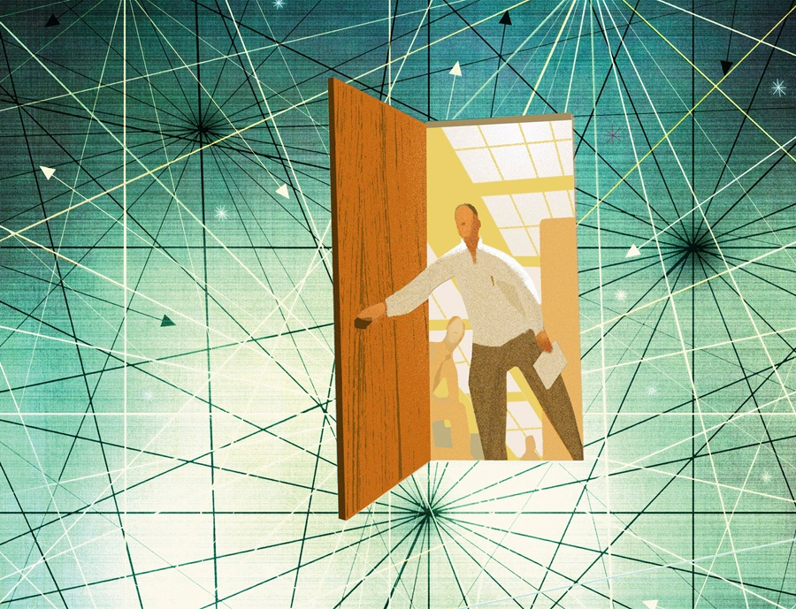
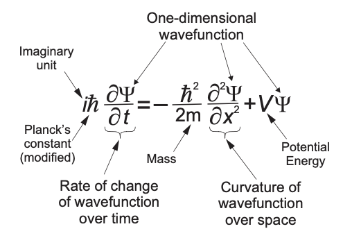
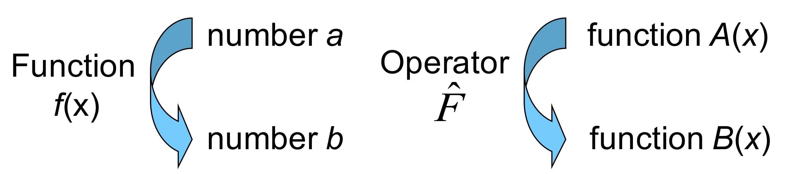
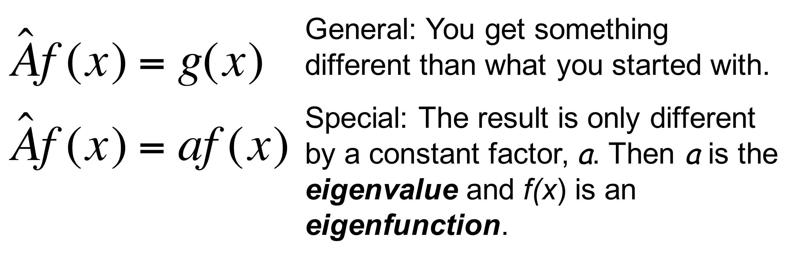

## Entering the quantum world

:::: {.columns}

::: {.column width="55%"}
::: {.fragment}
- **Classical mechanics fails** at atomic scales
:::
::: {.fragment}
- Need a new equation explaining **energy quantization** and **wave-particle duality**
:::
::: {.fragment}
- **Schrödinger's Equation** is a *fundamental law*: postulated, not derived
:::
::: {.fragment}
- Never failed when applied correctly
:::
:::

::: {.column width="45%"}

:::

::::

## From a wave to a quantum wave

::: {.fragment}
Start with a traveling wave:
$$\Psi(x,t) = Ae^{i(kx-\omega t)}$$
:::

::: {.fragment}
Insert the **de Broglie** and **Planck** relations:
$$p = \hbar k \qquad E = \hbar\omega$$
:::

::: {.fragment}
**Quantum wave function:**
$$\Psi(x,t)=Ae^{\frac{i}{\hbar}(px-E t)}$$
:::

## What equation generates it?

::: {.fragment}
**Time part** returns total energy:
$$\frac{\partial \Psi}{\partial t} = -\frac{i}{\hbar} E\, \Psi$$
:::

::: {.fragment}
**Spatial part** returns kinetic energy:
$$\frac{\partial^2 \Psi}{\partial x^2} = -\frac{2m(E - V)}{\hbar^2}\, \Psi$$
:::

::: {.fragment}
Combine via $K = E - V$ to eliminate $E$.
:::

## Time-Dependent Schrödinger Equation

::: {.fragment}
$$-\frac{\hbar^2}{2m} \frac{\partial^2 \Psi}{\partial x^2} + V(x)\,\Psi = i\hbar \frac{\partial \Psi}{\partial t}$$
:::

::: {.fragment}
- Describes evolution of $\Psi(x,t)$ in a potential $V(x)$
:::
::: {.fragment}
- Only a **single time derivative** (unlike the classical wave equation)
:::
::: {.fragment}
- The $i$ makes solutions **oscillate in the complex plane**
:::

## Anatomy of the equation

:::: {.columns}

::: {.column width="50%"}

:::

::: {.column width="50%"}
::: {.fragment}
- **Kinetic** + **potential** = total energy flow
:::
::: {.fragment}
- $\Psi$ is generally **complex**: not directly measurable
:::
::: {.fragment}
- 1D shown; 3D adds $y, z$ terms
:::
:::

::::

## Separation of variables

::: {.fragment}
Assume $\Psi(x,t) = \psi(x)\,T(t)$.
:::

::: {.fragment}
Time part is a simple oscillation:
$$\Psi(x,t) = \psi(x)\cdot e^{-iEt/\hbar}$$
:::

::: {.fragment}
- The **hard part** is finding $\psi(x)$, set by the potential $V(x)$
:::

## Time-Independent Schrödinger Equation

::: {.fragment}
$$-\frac{\hbar^2}{2m} \frac{\partial^2 \psi}{\partial x^2} + V(x)\,\psi = E\,\psi$$
:::

::: {.fragment}
- Gives the **stationary states** of the system
:::
::: {.fragment}
- Our **primary focus** for the rest of the course
:::

## Operators: the language of QM

:::: {.columns}

::: {.column width="50%"}

:::

::: {.column width="50%"}
::: {.fragment}
- An **operator** $\hat{A}$ transforms a function into another
:::
::: {.fragment}
- Differentiate, multiply, integrate, ...
:::
::: {.fragment}
- The SE is **linear**:
$$\hat{A}[c_1 f_1 + c_2 f_2] = c_1\hat{A}f_1 + c_2\hat{A}f_2$$
:::
:::

::::

## The Hamiltonian

::: {.fragment}
**Classical** total energy:
$$H(x,p) = \frac{p^2}{2m} + V(x)$$
:::

::: {.fragment}
**Quantum** Hamiltonian operator:
$$\hat{H} = \hat{K} + \hat{V} = -\frac{\hbar^2}{2m} \frac{\partial^2}{\partial x^2} + V(x)$$
:::

::: {.fragment}
The SE in operator form:
$$\hat{H}\psi = i\hbar \frac{\partial \psi}{\partial t}$$
:::

## Correspondence principle

::: {.fragment}
Every classical observable has a **quantum operator**:
:::

::: {.fragment}
| Observable | Classical | Quantum |
|:---:|:---:|:---:|
| Position | $x$ | $\hat{x}=x$ |
| Momentum | $p$ | $\hat{p}=-i\hbar \frac{\partial}{\partial x}$ |
| Kinetic energy | $\frac{p^2}{2m}$ | $\hat{K}=\frac{\hat{p}^2}{2m}$ |
| Total energy | $H$ | $\hat{H}=\hat{K}+\hat{V}$ |
:::

## Eigenvalues and eigenfunctions

:::: {.columns}

::: {.column width="48%"}

:::

::: {.column width="52%"}
::: {.fragment}
The TI-SE is an **eigenvalue problem**:
$$\boxed{\hat{H} \psi_n = E_n \psi_n}$$
:::
::: {.fragment}
- $\psi_n$: **eigenfunctions** (wave functions)
:::
::: {.fragment}
- $E_n$: **eigenvalues** (energies)
:::
::: {.fragment}
- General state: $\psi = \sum_n c_n \psi_n f_n(t)$
:::
:::

::::

# Takeaway {.center}

> Solving a quantum system means finding the eigenfunctions $\psi_n$ and eigenvalues $E_n$ of its Hamiltonian: $\hat{H}\psi_n = E_n \psi_n$.
