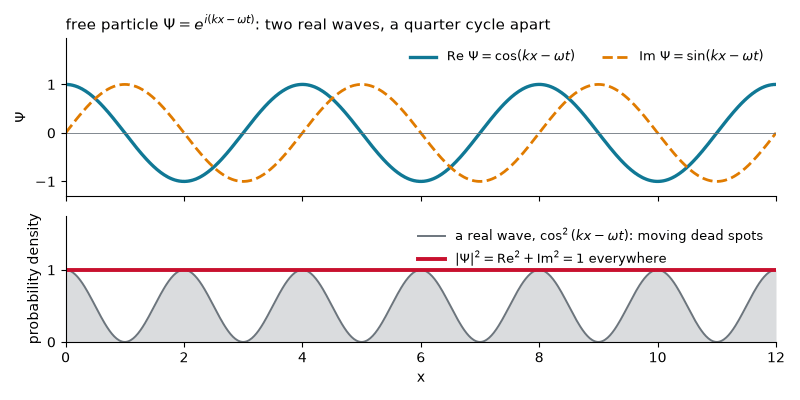
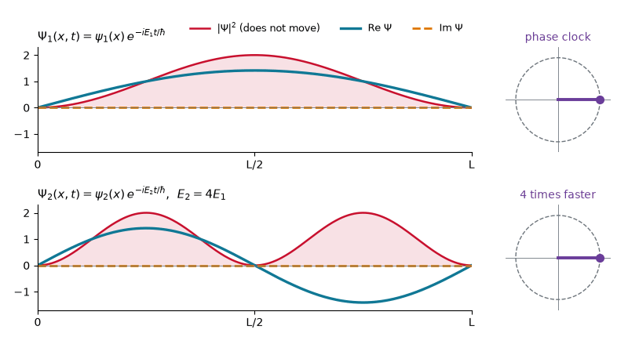
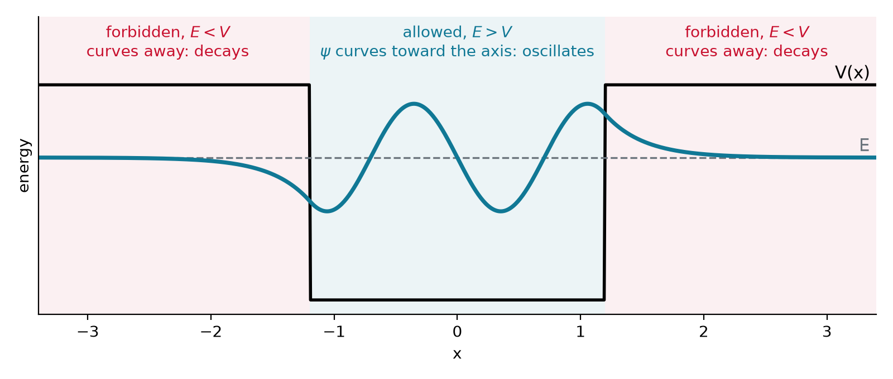
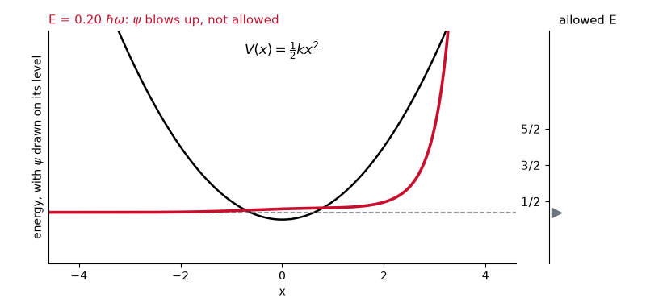
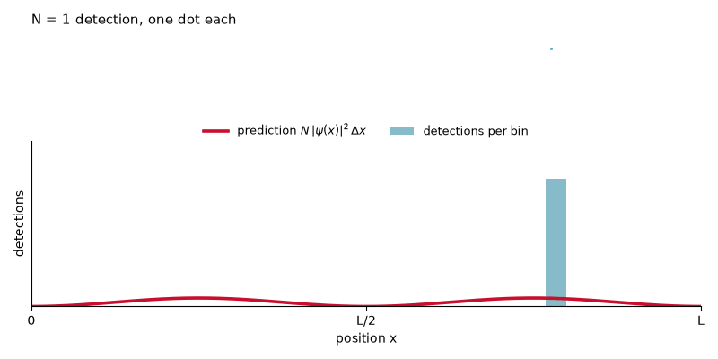
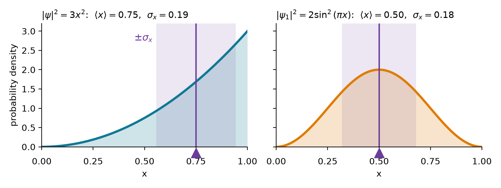
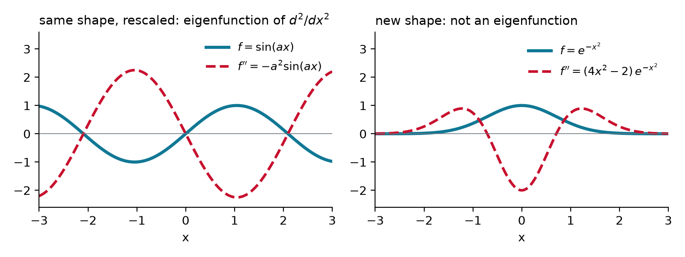
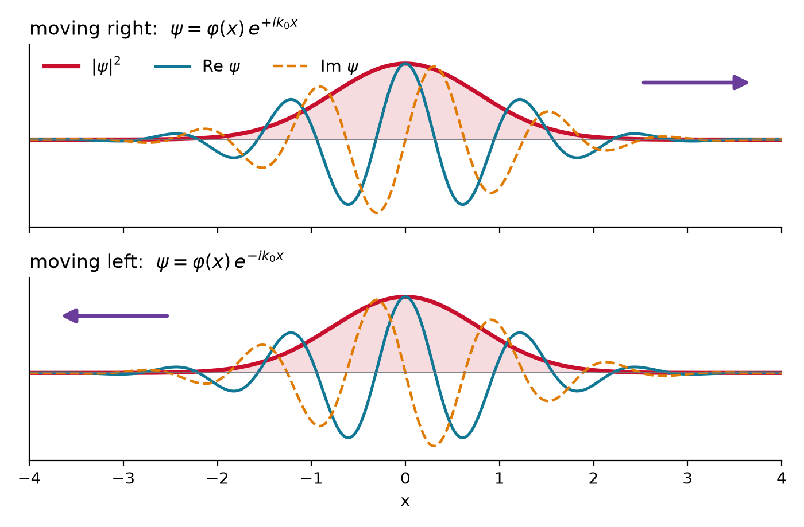

## Two facts in search of an equation

**Chapter 1: what experiments demand**

$$E = h\nu = \hbar\omega \qquad\qquad p = \frac{h}{\lambda} = \hbar k$$

**Chapter 2: the language of waves**

$$u(x,t) = A\,e^{i(kx - \omega t)}$$

- Schrödinger, 1926: **which wave equation** does the matter wave obey?
- A **fundamental law**: motivated and tested, never derived

## The wave of a free particle

:::: {.columns}
::: {.column width="58%"}
{width="100%"}
:::
::: {.column width="42%"}

::: {.keyeq}
$$\Psi(x,t) = A\,e^{\frac{i}{\hbar}(px - Et)}$$
:::

- Re and Im run a **quarter cycle apart**
- $|\Psi|^2$ is **flat**: definite momentum, no preferred position
- A real wave would have moving dead spots
:::
::::

## Example: does the string's equation work?

::: {.worked}
Put $\Psi = A\,e^{i(kx-\omega t)}$ into the string's wave equation. What must $E$ and $p$ obey?
:::

::: {.soln .fragment}
$$\frac{\partial^2 \Psi}{\partial x^2} = \frac{1}{v^2}\frac{\partial^2 \Psi}{\partial t^2} \quad\Longrightarrow\quad -k^2 = -\frac{\omega^2}{v^2} \quad\Longrightarrow\quad E = v\,p$$

Right for **light**, $E = pc$. Wrong for an **electron**, $E = p^2/2m$.

We need an equation that brings down $E$ **once** and $p$ **twice**: one time derivative, two space derivatives.
:::

## Derivatives read off $E$ and $p$

Each derivative of $\Psi = A\,e^{\frac{i}{\hbar}(px - Et)}$ brings down the factor in the exponent:

$$
\begin{aligned}
i\hbar\,\frac{\partial \Psi}{\partial t} &= i\hbar\left(-\frac{iE}{\hbar}\right)\Psi = -i^2E\,\Psi = E\,\Psi \\[6pt]
-i\hbar\,\frac{\partial \Psi}{\partial x} &= -i\hbar\left(\frac{ip}{\hbar}\right)\Psi = p\,\Psi \\[6pt]
-\frac{\hbar^2}{2m}\frac{\partial^2 \Psi}{\partial x^2} &= -\frac{\hbar^2}{2m}\left(\frac{ip}{\hbar}\right)^{2}\Psi = \frac{p^2}{2m}\,\Psi
\end{aligned}
$$

- The $i$'s cancel, since $i^2 = -1$: out come the **real** numbers $E$, $p$, $p^2/2m$
- Left sides: what to **do** to $\Psi$ to ask for its energy or momentum

## The time-dependent Schrödinger equation

Multiply $\;E = \dfrac{p^2}{2m} + V\;$ by $\Psi$ and swap each number for its derivative:

::: {.keyeq}
$$\underbrace{-\frac{\hbar^2}{2m} \frac{\partial^2 \Psi}{\partial x^2}}_{\text{kinetic}} \;+\; \underbrace{V(x)\,\Psi\vphantom{\frac{\partial^2}{\partial x^2}}}_{\text{potential}} \;=\; \underbrace{i \hbar \frac{\partial \Psi}{\partial t}\vphantom{\frac{\partial^2}{\partial x^2}}}_{\text{total energy}}$$
:::

- Kinetic energy as $p^2/2m$, not $\frac{1}{2}mv^2$: the wave knows $p$ through $\lambda = h/p$
- $V(x)$ **defines the system**; the postulate is that this holds for any $\Psi$ and any $V$

## Separation of variables

Try $\Psi(x,t) = \psi(x)\,T(t)$ and divide by $\psi T$:

$$i\hbar\,\frac{1}{T}\frac{dT}{dt} = \frac{1}{\psi}\left[-\frac{\hbar^2}{2m}\frac{d^2\psi}{dx^2} + V\psi\right] = E$$

- A function of $t$ equals a function of $x$: both are one **constant**, the energy

::: {.fragment}
**Time part**: an imaginary root, so pure rotation $T = e^{-iEt/\hbar}$. **Space part**:

::: {.keyeq}
$$-\frac{\hbar^2}{2m} \frac{d^2 \psi}{d x^2} + V(x)\, \psi = E\, \psi$$
:::
:::

## Stationary states

:::: {.columns}
::: {.column width="58%"}
{width="100%"}
:::
::: {.column width="42%"}

::: {.keyeq}
$$\Psi(x,t) = \psi(x)\,e^{-iEt/\hbar}$$
:::

- The **phase clock** turns at $E/\hbar$
- $|\Psi|^2 = |\psi|^2$: the density **does not move**
- Four times the energy, four times the clock rate
:::
::::

## A curvature equation

$$\frac{d^2\psi}{dx^2} = -\frac{2m}{\hbar^2}\,\big[E - V(x)\big]\,\psi$$

{.nostretch width="58%" fig-align="center"}

- The string's $X'' = KX$ again: the **sign of $E - V$** picks sines or exponentials

## Only some energies fit

{.nostretch width="64%" fig-align="center"}

- $\psi$ must stay **finite**: at most energies the tail blows up
- **Boundary conditions quantize**, as the clamps did for the string

## The Born rule

:::: {.columns}
::: {.column width="58%"}
{width="100%"}
:::
::: {.column width="42%"}

::: {.keyeq}
$$p(x) = \psi^{*}\psi = |\psi(x)|^2$$
:::

- $\psi$ is complex: **not measurable**
- One detection is random; **many** trace out $|\psi|^2$
- At a **node** no particle is ever found
:::
::::

## Example: normalize and locate

::: {.worked}
A particle on $[0,1]$ has $\psi = N x$. Find $N$, then the probability of finding it between $0.3$ and $0.6$.
:::

::: {.soln .fragment}
$$\int_0^1 N^2x^2\,dx = \frac{N^2}{3} = 1 \quad\Rightarrow\quad N = \sqrt{3}$$

$$P = \int_{0.3}^{0.6} 3x^2\,dx = 0.6^3 - 0.3^3 = 0.189$$
:::

- The linear equation leaves the size of $\psi$ open; **total probability one** fixes it

## Averages of many measurements

Average $N$ detections. As $N$ grows, the fraction landing near $x$ becomes $|\psi(x)|^2\,dx$:

::: {.keyeq}
$$\textstyle\frac{1}{N}\sum_{i} x_i \;\xrightarrow{\;N\to\infty\;}\; \langle x \rangle = \displaystyle\int x\,|\psi(x)|^2\,dx$$
:::

:::: {.columns}
::: {.column width="55%"}
{width="100%"}
:::
::: {.column width="45%"}

- The **balance point** of $|\psi|^2$; the band shows the **spread** $\sigma_x$
- Any function of $x$ averages the same way: $\langle x^2 \rangle$, $\langle V \rangle$
:::
::::

## What is an operator?

An **operator** turns one function into another. It wears a **hat**:

$$\hat{x}\;e^{-x^2} = x\,e^{-x^2} \qquad\qquad \frac{d}{dx}\,\sin(ax) = a\cos(ax)$$

- Two kinds: **multiply** by a function ($\hat{x}$, $\hat{V}$) or **differentiate** ($\hat{p}$, $\hat{K}$)
- We have met them already: the derivatives that **read off** $E$ and $p$
- Usually the function **changes shape**; the rare ones that do not come next

## Observables become operators

**Recipe**: write the classical quantity with $x$ and $p$, then replace $p$ by $-i\hbar\,\dfrac{d}{dx}$

:::: {.columns}
::: {.column width="52%"}

| observable | classical | operator |
|---|---|---|
| position | $x$ | $\hat{x} = x$ |
| momentum | $p$ | $\hat{p} = -i\hbar\,\dfrac{d}{dx}$ |
| kinetic energy | $\dfrac{p^2}{2m}$ | $\hat{K} = -\dfrac{\hbar^2}{2m}\dfrac{d^2}{dx^2}$ |
| potential energy | $V(x)$ | $\hat{V} = V(x)$ |

:::
::: {.column width="48%"}

::: {.keyeq}
$$\hat{H} = -\frac{\hbar^2}{2m}\frac{d^2}{dx^2} + V(x)$$
:::

- Total energy: the **Hamiltonian**
- Systems differ **only in $V$**: free particle, bond $\frac{1}{2}kx^2$, H atom $-\frac{e^2}{4\pi\epsilon_0 r}$
:::
::::

## Eigenfunctions and eigenvalues

:::: {.columns}
::: {.column width="50%"}
{width="100%"}

$$\hat{A}\,f = a\,f$$
:::
::: {.column width="50%"}

- Same function back, times a number: **eigenfunction** $f$, **eigenvalue** $a$
- In such a state **every** measurement of $A$ gives $a$: a **definite value**

::: {.keyeq}
$$\hat{H}\,\psi_n = E_n\,\psi_n$$
:::

- $\psi_n$: the **stationary states**; $E_n$: the **allowed energies**
:::
::::

## Example: is it an eigenfunction?

::: {.worked}
Test $\psi = A\sin(ax)$ against the momentum and the kinetic energy operators.
:::

::: {.soln .fragment}
$$\hat{p}\,\psi = -i\hbar\,a\,A\cos(ax) \qquad \text{a new function: no}$$

$$\hat{K}\,\psi = \frac{\hbar^2a^2}{2m}\,A\sin(ax) \qquad \text{the same function: yes}$$
:::

- Definite kinetic energy, no definite momentum: an equal mix of **left and right** movers

## What about momentum?

:::: {.columns}
::: {.column width="56%"}
{width="100%"}
:::
::: {.column width="44%"}

- Recall the free particle: $|\Psi|^2$ was **flat** whatever $p$ was
- Moving right or left: the **same** $|\psi|^2$
- The direction lives in the **phase** of $\psi$, and squaring erases it
- So $\hat{p}$ must act on $\psi$ **before** we multiply by $\psi^*$
:::
::::

## Expectation values

**Position**: $x$ is just a number, so it can sit in the middle:

$$\langle x \rangle = \int x\,|\psi|^2\,dx = \int \psi^{*}\,x\,\psi\,dx$$

**Any observable**: put its operator where $x$ was, acting on $\psi$:

::: {.keyeq}
$$\langle A \rangle = \int \psi^{*}(x)\,\hat{A}\,\psi(x)\,dx$$
:::

::: {.fragment}
**Check**: a state with a definite value, $\hat{A}\psi = a\psi$, returns it: $\;\langle A \rangle = a\displaystyle\int \psi^{*}\psi\,dx = a$
:::

## Example: which way is it moving?

::: {.worked}
$\psi = \varphi(x)\,e^{ik_0x}$, with $\varphi$ real and normalized. Find $\langle p \rangle$.
:::

::: {.soln .fragment}
$$\hat{p}\,\psi = -i\hbar\,\big(\varphi' + ik_0\,\varphi\big)\,e^{ik_0x}$$

$$\langle p \rangle = \underbrace{-i\hbar\int \varphi\,\varphi'\,dx}_{[\varphi^2/2]\;=\;0} \;+\; \hbar k_0\underbrace{\int \varphi^2\,dx}_{1} \;=\; \hbar k_0$$
:::

- Flip $k_0$ and $\langle p \rangle$ flips, while $|\psi|^2$ stays the same: the operator **reads the phase**

# Takeaway {.center}

> Energy conservation written for matter waves gives the Schrödinger equation. It separates into a turning phase and $\hat{H}\psi = E\psi$, whose finite solutions exist only at quantized energies. $|\psi|^2$ gives probabilities; because momentum lives in the phase, averages need the operator acting on $\psi$ itself: $\langle A \rangle = \int\psi^{*}\hat{A}\psi\,dx$.
