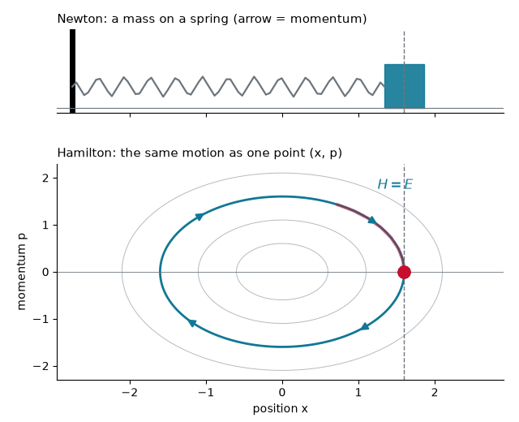
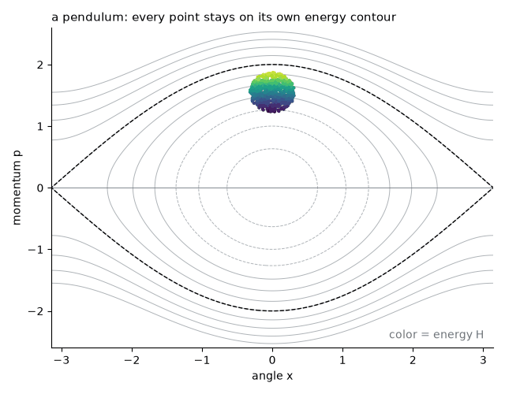
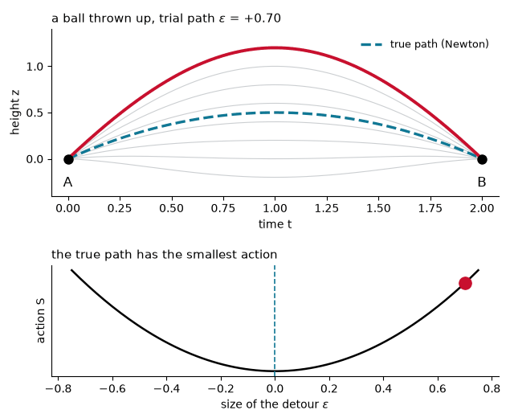
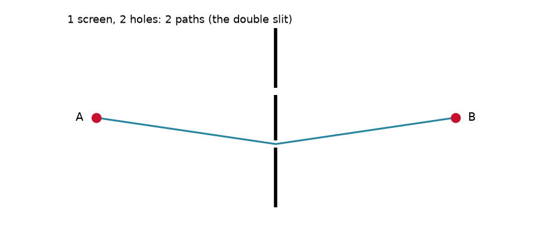
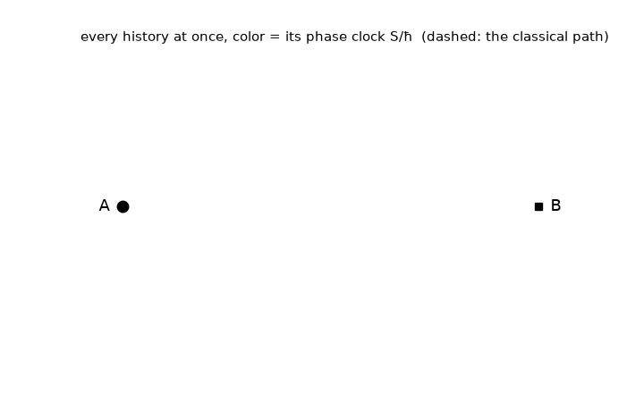
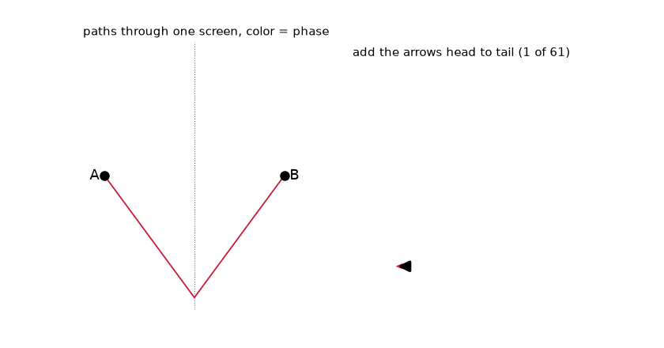
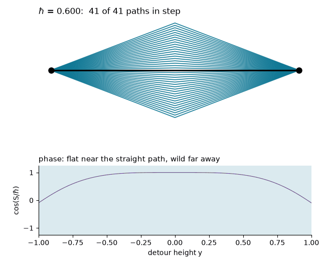
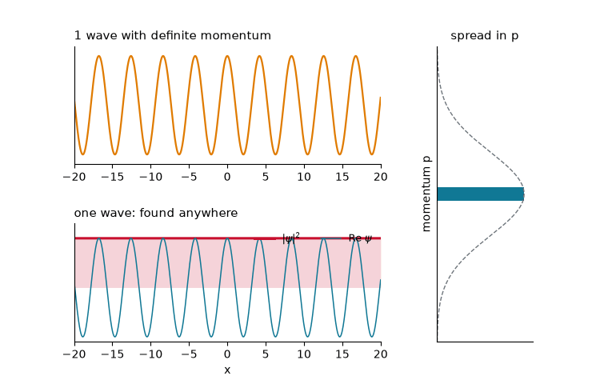
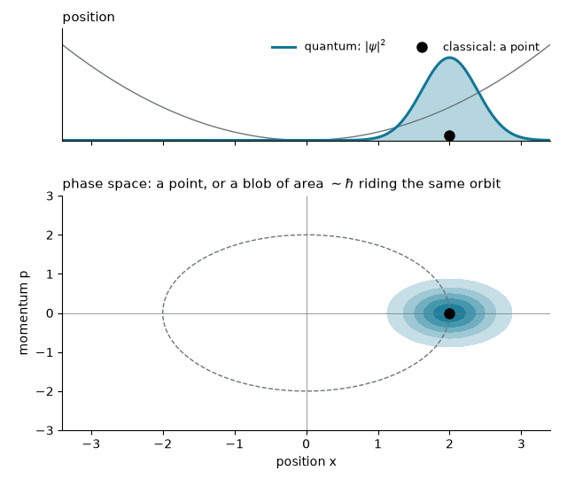

## Newton and Hamilton: one physics, two languages

:::: {.columns}
::: {.column width="50%"}
**Newton**: forces change the motion

$$m\,\frac{d^2x}{dt^2} = -\frac{dV}{dx}$$
:::
::: {.column width="50%"}
**Hamilton**: the energy drives it

$$H(x,p) = \frac{p^2}{2m} + V(x)$$
:::
::::

::: {.keyeq}
$$\frac{dx}{dt} = \frac{\partial H}{\partial p} \qquad\qquad \frac{dp}{dt} = -\frac{\partial H}{\partial x}$$
:::

::: {.fragment}
The first says $p = m\,dx/dt$, the second says $dp/dt = -dV/dx$. Together: **Newton's law**, the same physics.
:::

## Phase space: a state is a point

:::: {.columns}
::: {.column width="55%"}
{width="100%"}
:::
::: {.column width="45%"}

- A classical state is **position and momentum** together: one point $(x, p)$
- Newton follows the mass; Hamilton follows the **point**
- The point never leaves its curve $H = E$
:::
::::

## Energy conservation, pictured

:::: {.columns}
::: {.column width="55%"}
{width="100%"}
:::
::: {.column width="45%"}

Any quantity $A(x, p)$ changes as

::: {.keyeq}
$$\frac{dA}{dt} = \{A, H\}$$
:::

$$\{A,B\} = \frac{\partial A}{\partial x}\frac{\partial B}{\partial p} - \frac{\partial A}{\partial p}\frac{\partial B}{\partial x}$$

- $\{H, H\} = 0$: the energy **never changes**
- $\{x, p\} = 1$ becomes $[\hat{x}, \hat{p}] = i\hbar$
:::
::::

## Least action: nature picks one path

:::: {.columns}
::: {.column width="55%"}
{width="100%"}
:::
::: {.column width="45%"}

- Try **every** path from A to B ($K$: kinetic energy)

::: {.keyeq}
$$S = \int_{t_A}^{t_B} (K - V)\,dt$$

$$\delta S = 0$$
:::

- Only **one path** makes $S$ stationary, and it obeys **Newton's law**
:::
::::

## One path or many? Feynman drills holes

{.nostretch width="74%" fig-align="center"}

- Two holes: the electron takes **both** paths, the double slit
- More holes, more screens, then no screens at all: **every path** from A to B

## Every history at once

:::: {.columns}
::: {.column width="58%"}
{width="100%"}
:::
::: {.column width="42%"}

- The particle does not choose: **every** history contributes
- Each carries a **phase clock**, turned by its action $S/\hbar$
- Real histories or bookkeeping? The equations do not say; **interpretations** disagree (Everett: **many worlds**)
:::
::::

## Example: what does a detour cost?

::: {.worked}
Going from A to B in time $T$ through a hole at height $y$ halfway: how much extra action does the detour cost?
:::

::: {.soln .fragment}
Sideways speed $2y/T$ on both legs, for a total time $T$:

$$\Delta S = \frac{1}{2}m\left(\frac{2y}{T}\right)^{2} T = \frac{2m\,y^2}{T}$$

Smallest at $y = 0$: the straight line wins, as Newton says.
:::

- Near $y = 0$ the cost grows only as $y^2$: small detours are **almost free**

## Every path adds an arrow

:::: {.columns}
::: {.column width="60%"}
{width="100%"}
:::
::: {.column width="40%"}

::: {.keyeq}
$$\psi(B) \;\propto \sum_{\text{paths}} e^{\,iS/\hbar}$$
:::

- Each path: an arrow turned by $S/\hbar$
- Near the straight path the arrows **line up**; far ones **curl up and cancel**
- Free particle: $S/\hbar$ is the phase $(px - Et)/\hbar$ of the wave in Lecture 3.1
:::
::::

## Turn down $\hbar$: one path returns

:::: {.columns}
::: {.column width="55%"}
{width="100%"}
:::
::: {.column width="45%"}

- Paths stay in step while $\Delta S \lesssim \pi\hbar$: a band of width $\sim\sqrt{\hbar T/m}$
- Small $\hbar$ or large $m$: the band shrinks onto the **classical path**
- Classical mechanics is the $\hbar \to 0$ limit
:::
::::

## Example: how wide is the band?

::: {.worked}
Estimate $\sqrt{\hbar T/m}$ for a 0.1 kg ball in flight for 1 s, and for an electron crossing a molecule in $10^{-15}$ s.
:::

::: {.soln .fragment}
$$\text{ball:}\quad \sqrt{\frac{(1.05\times10^{-34})(1)}{0.1}} \approx 3\times10^{-17}\ \text{m}$$

$$\text{electron:}\quad \sqrt{\frac{(1.05\times10^{-34})(10^{-15})}{9.1\times10^{-31}}} \approx 3\times10^{-10}\ \text{m}$$

The ball's band is far smaller than a proton; the electron's is the size of an atom.
:::

- This is why electrons need quantum mechanics and baseballs do not

## Superposition makes the blur

:::: {.columns}
::: {.column width="60%"}
{width="100%"}
:::
::: {.column width="40%"}

::: {.keyeq}
$$\psi(x) = \sum_k c_k\,e^{ikx}$$
:::

- One wave: a **definite** $p$, found **anywhere**
- Many waves: **localized**, but $p$ is **spread**
- Quantum states are superpositions, so they are **blurry**
:::
::::

## A point becomes a blur

:::: {.columns}
::: {.column width="55%"}
{width="100%"}
:::
::: {.column width="45%"}

- Classical: a **point** $(x, p)$ riding its energy curve
- Quantum: a **blob** of area $\sim\hbar$ riding the **same** curve
- Its center follows Newton; its **width** is quantum
:::
::::

# Takeaway {.center}

> Newton, Hamilton and least action all describe one classical path: a point in phase space sliding along its energy contour. Quantum mechanics keeps every path, each with a phase $e^{iS/\hbar}$. Where $S \gg \hbar$ only the paths near the classical one survive; where $S \sim \hbar$ many do, and the state is a blurry superposition.
