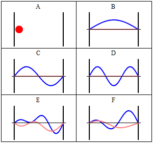
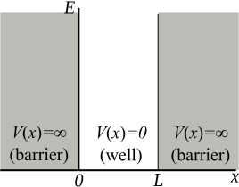
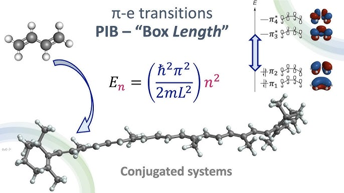
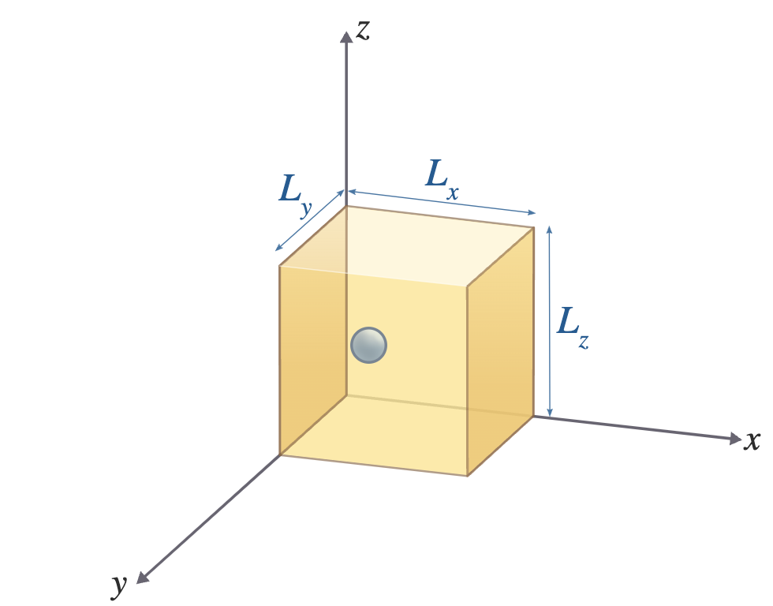

## Classical vs Quantum

:::: {.columns}
::: {.column width="50%"}
{width="100%"}
:::
::: {.column width="50%"}
- A particle trapped in a region $[0, L]$
- **Classical**: bounces freely, found **everywhere** with equal probability

- **Quantum**: described by a wavefunction $\psi(x)$, found in some regions with **high** probability, others with **zero**

- Wavefunctions are **standing waves**, but with a **probabilistic** meaning
:::
::::

## The Model

:::: {.columns}
::: {.column width="45%"}
{width="100%"}
:::
::: {.column width="55%"}
**Infinite walls** confine the particle:

$$V(x) = \begin{cases} \infty & x = 0 \text{ or } x = L \\ 0 & 0 < x < L \end{cases}$$

::: {.fragment}
**Boundary conditions:**
$$\psi(0) = \psi(L) = 0$$
:::

::: {.fragment}
Inside, only **kinetic energy**:
$$\hat{H} = -\frac{\hbar^2}{2m}\frac{d^2}{dx^2}$$
:::
:::
::::

## Solving the Schrödinger Equation

The eigenvalue problem $\hat{H}\psi = E\psi$ becomes

$$\psi''(x) = -k^2\psi(x), \qquad k^2 = \frac{2mE}{\hbar^2}$$

::: {.fragment}
General solution:
$$\psi(x) = A\cos(kx) + B\sin(kx)$$
:::

- $\psi(0)=0 \Rightarrow A = 0$
- $\psi(L)=0 \Rightarrow \sin(kL) = 0$

## Quantization Emerges

The wall condition forces

$$kL = n\pi \quad\Rightarrow\quad k = \frac{n\pi}{L}, \quad n = 1, 2, 3, \dots$$

::: {.fragment}
Energy is **quantized**:
$$E_n = \frac{n^2 h^2}{8mL^2}$$
:::

::: {.fragment}
> Confining a wave to a finite space forces **discrete** energy levels. Atoms, molecules, and solids inherit their quantized levels this way.
:::

## Normalization Fixes the Amplitude

Require total probability of $1$:

$$\int_0^L \psi_n(x)^2\, dx = 1$$

::: {.fragment}
Using $\sin^2\theta = \tfrac{1}{2}(1-\cos 2\theta)$ gives $\tfrac{B_n^2}{2}L = 1$, so

$$B_n = \sqrt{\frac{2}{L}}$$
:::

## The 1D Eigenstates

:::: {.columns}
::: {.column width="48%"}
{width="100%"}
:::
::: {.column width="52%"}
$$\psi_n(x) = \left(\frac{2}{L}\right)^{1/2}\sin\frac{n\pi x}{L}$$

$$E_n = \frac{n^2 h^2}{8mL^2}$$

- **Higher $n$**: more curvature, more energy
- State $n$ has $n-1$ **nodes** where $|\psi_n|^2 = 0$
:::
::::

## Zero-Point Energy

The lowest state $n=1$ has **nonzero** energy:

$$E_1 = \frac{h^2}{8mL^2} \neq 0$$

- Energy is purely kinetic, so a quantum particle is **never at rest**

::: {.fragment}
- Level spacing grows with $n$:
$$E_{n+1} - E_n = (2n+1)\frac{h^2}{8mL^2}$$
:::

::: {.fragment}
> Smaller box means larger spacing. Quantum effects dominate when a particle is tightly confined.
:::

## Nodes and Non-Uniform Probability

- $|\psi_n|^2$ is **not** uniform, unlike the classical prediction
- **Nodes**: points where probability is exactly **zero**

- State $n$ has $n-1$ nodes at $x = \frac{L}{n}, \frac{2L}{n}, \dots, \frac{(n-1)L}{n}$

- The existence of nodes is the signature of **wave-like** behavior

- Yet for any $n$: $\langle x \rangle = \frac{L}{2}$ and $\langle p \rangle = 0$ by symmetry

## Pure vs Mixed States

**Pure state** (single eigenstate): probability is **time-independent**

$$|\psi_n(x,t)|^2 = |\psi_n(x)|^2$$

::: {.fragment}
**Mixed state** (superposition): probability **oscillates** in time

$$\psi(x,t) = c_1\psi_1 e^{-iE_1 t/\hbar} + c_2\psi_2 e^{-iE_2 t/\hbar}$$
:::

- Interference term beats at frequency $(E_1 - E_2)/\hbar$

## The 3D Box

:::: {.columns}
::: {.column width="42%"}
{width="100%"}
:::
::: {.column width="58%"}
Separable solution $\psi = X(x)Y(y)Z(z)$:

$$\psi = \sqrt{\frac{8}{abc}}\sin\frac{n_x\pi x}{a}\sin\frac{n_y\pi y}{b}\sin\frac{n_z\pi z}{c}$$

$$E_{n_x,n_y,n_z} = \frac{h^2}{8m}\left(\frac{n_x^2}{a^2} + \frac{n_y^2}{b^2} + \frac{n_z^2}{c^2}\right)$$
:::
::::

- When $a = b = c$, different $(n_x, n_y, n_z)$ can share one energy: **degeneracy**
- **Degeneracy arises from symmetry**

# Takeaway {.center}

> Confining a quantum wave to a box quantizes its energy as $E_n = \frac{n^2 h^2}{8mL^2}$, forbids rest through zero-point energy, and carves the probability into nodes, with symmetry producing degeneracy in higher dimensions.
