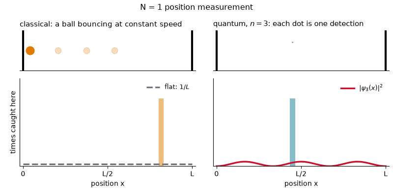
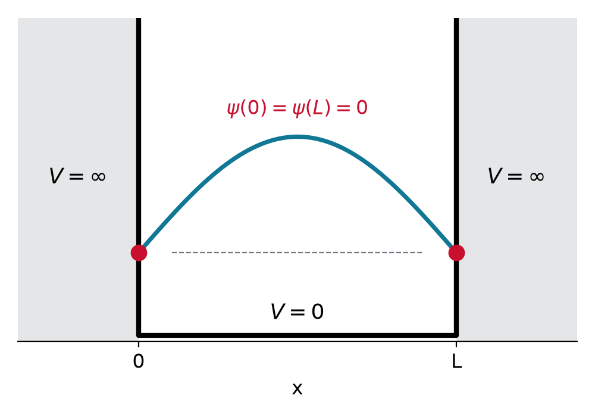
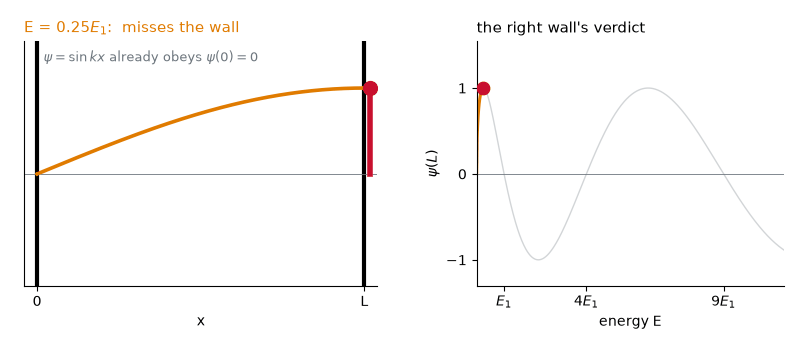
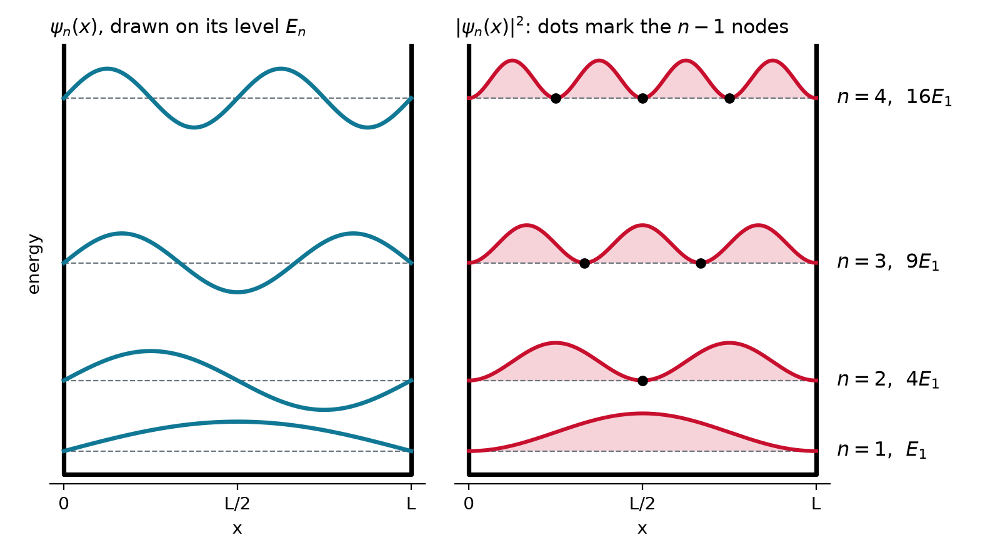
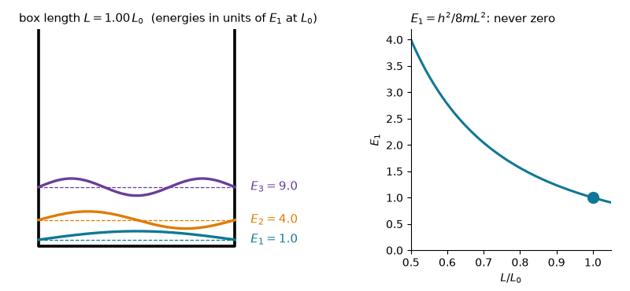
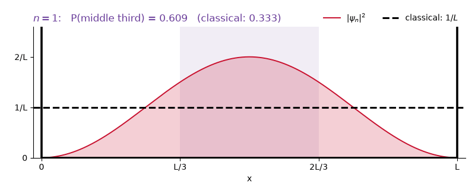
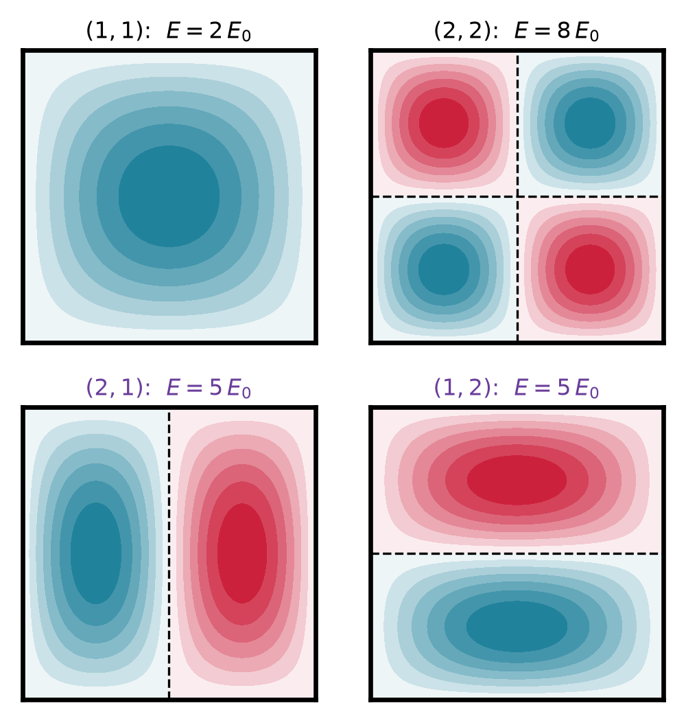
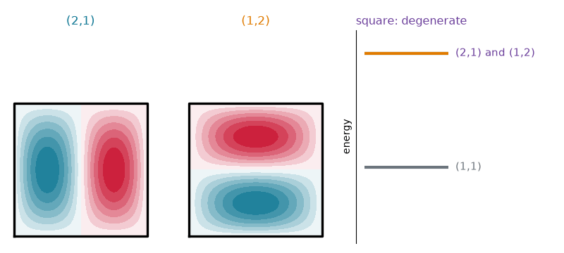

## Trap the particle

:::: {.columns}
::: {.column width="60%"}
{width="100%"}
:::
::: {.column width="40%"}

- Walls at $x = 0$ and $x = L$, nothing in between
- **Classical**: constant speed, so **equally likely** anywhere
- **Quantum** ($n = 3$): lobes, and two points where it is **never** found
- Same walls; only the rule changed: **$|\psi|^2$** decides where we catch it
:::
::::

## The model: perfect walls

:::: {.columns}
::: {.column width="45%"}
{width="100%"}
:::
::: {.column width="55%"}

**Inside**, $V = 0$: only kinetic energy

$$-\frac{\hbar^2}{2m}\frac{d^2\psi}{dx^2} = E\,\psi, \qquad 0 < x < L$$

**Walls**, $V = \infty$: the particle is never there, so

$$\psi(0) = \psi(L) = 0$$

- The walls enter only as **boundary conditions**
:::
::::

## Solve it: the string again

$$-\frac{\hbar^2}{2m}\,\psi'' = E\,\psi \quad\Longrightarrow\quad \psi'' = -k^2\,\psi, \qquad k = \frac{\sqrt{2mE}}{\hbar}$$

The clamped string's equation from Chapter 2, so the same solutions:

$$\psi(x) = A\cos kx + B\sin kx$$

::: {.fragment}
$$
\begin{aligned}
\psi(0) = 0 &\quad\Rightarrow\quad A = 0 \\
\psi(L) = 0 &\quad\Rightarrow\quad B\sin kL = 0 \quad\Rightarrow\quad kL = n\pi, \quad n = 1, 2, 3, \dots
\end{aligned}
$$
:::

- $B = 0$ would erase the particle, so the **sine** must vanish at the wall

## Only whole half-waves fit

{.nostretch width="72%" fig-align="center"}

- Raise $E$: the sine bends faster, but meets the right wall at zero only at **special energies**
- The fit condition $L = n\,\lambda/2$ is the **clamped string** again: boundary conditions quantize

## Energy in one line

The fit sets the wavelength; de Broglie turns it into momentum:

$$\lambda_n = \frac{2L}{n} \quad\Longrightarrow\quad p_n = \frac{h}{\lambda_n} = \frac{nh}{2L} \quad\Longrightarrow\quad E_n = \frac{p_n^2}{2m}$$

::: {.keyeq}
$$E_n = \frac{n^2h^2}{8mL^2}, \qquad n = 1, 2, 3, \dots$$
:::

- Same answer from $k = n\pi/L$ in $E = \hbar^2k^2/2m$
- $E \propto n^2$: gaps **widen** going up. $E \propto 1/mL^2$: **light** particles in **small** boxes

## Example: normalize

::: {.worked}
Choose $B$ so that $\psi_n = B\sin(n\pi x/L)$ is normalized.
:::

::: {.soln .fragment}
$$\int_0^L B^2\sin^2\frac{n\pi x}{L}\,dx = B^2\,\frac{L}{2} = 1 \quad\Longrightarrow\quad B = \sqrt{\frac{2}{L}}$$

Over whole half-waves $\sin^2$ averages to $\tfrac{1}{2}$: its hills fill its valleys, so the integral is half the box length.
:::

- The same $B$ for **every** $n$: more lobes, each one thinner

## The states of the box

:::: {.columns}
::: {.column width="60%"}
{width="100%"}
:::
::: {.column width="40%"}

::: {.keyeq}
$$\psi_n(x) = \sqrt{\frac{2}{L}}\,\sin\frac{n\pi x}{L}$$
:::

- $n - 1$ **nodes** inside the box
- More nodes, more **curvature**, more kinetic energy
- $|\psi_n|^2$ is **not** flat, and it is zero at every node
:::
::::

## Squeeze the box

:::: {.columns}
::: {.column width="60%"}
{width="100%"}
:::
::: {.column width="40%"}

- Halve $L$: every level rises **4 times**
- The ladder starts at $n = 1$: a **zero-point energy** $E_1 > 0$
- $n = 0$ would be $\psi = 0$, no particle: a confined particle is **never at rest**
- Uncertainty in words: pin $x$ to within $L$ and $p$ must spread by about $h/L$
:::
::::

## Example: electron or marble?

::: {.worked}
Find the gap $E_2 - E_1$ for an electron in a 1 nm box and for a 1 g marble in a 1 cm box. Compare each with $k_BT \approx 4\times10^{-21}$ J at room temperature.
:::

::: {.soln .fragment}
$$
E_2 - E_1 = \frac{3h^2}{8mL^2} =
\begin{cases}
1.8\times10^{-19}\ \text{J} \approx 1.1\ \text{eV} & \text{electron, 1 nm} \\[4pt]
1.6\times10^{-60}\ \text{J} & \text{marble, 1 cm}
\end{cases}
$$

Electron: **40 times** $k_BT$, the levels stand apart. Marble: $10^{-40}\,k_BT$, a continuum.
:::

- Chemistry lives where the electron does: **nanometer boxes, electron-volt gaps**

## Example: which third of the box?

::: {.worked}
In $\psi_1$ and in $\psi_2$, what is the probability of finding the particle in the middle third, $L/3 < x < 2L/3$? Classically it is $1/3$.
:::

::: {.soln .fragment}
$$P_n = \frac{2}{L}\int_{L/3}^{2L/3}\sin^2\frac{n\pi x}{L}\,dx = \frac{1}{3} + \frac{\sin(2n\pi/3) - \sin(4n\pi/3)}{2n\pi}$$

$$P_1 = \frac{1}{3} + \frac{\sqrt{3}}{2\pi} = 0.61 \qquad\qquad P_2 = \frac{1}{3} - \frac{\sqrt{3}}{4\pi} = 0.20$$
:::

- $n = 1$ crowds the **center**; $n = 2$ has a **node** there

## Large $n$: the classical box returns

{.nostretch width="80%" fig-align="center"}

- The lobes get finer than any detector can resolve; on average $|\psi_n|^2 \to 1/L$
- **Correspondence principle**: quantum results turn classical at large quantum numbers

## Example: moving, but going nowhere

::: {.worked}
Find $\langle p\rangle$ and $\langle p^2\rangle$ in the state $\psi_n$, with $k_n = n\pi/L$.
:::

::: {.soln .fragment}
$$\langle p\rangle = -i\hbar\int_0^L \psi_n\,\psi_n'\,dx = -i\hbar\left[\tfrac{1}{2}\psi_n^2\right]_0^L = 0$$

$$\hat{p}^2\psi_n = -\hbar^2\psi_n'' = \hbar^2k_n^2\,\psi_n \quad\Longrightarrow\quad \langle p^2\rangle = \hbar^2k_n^2 = 2mE_n$$
:::

- Equal parts $e^{+ik_nx}$ and $e^{-ik_nx}$: **left and right movers**, $|p| = \hbar k_n$
- For $n = 1$, $\sigma_x\sigma_p = 0.57\,\hbar$: just above Heisenberg's $\hbar/2$

## Superposition: the particle sloshes

::: {.keyeq}
$$\Psi(x,t) = \sum\nolimits_n c_n\,\psi_n(x)\,e^{-iE_nt/\hbar}$$
:::

:::: {.columns}
::: {.column width="60%"}
{width="100%"}
:::
::: {.column width="40%"}

$$|\Psi|^2 = \tfrac{1}{2}(\psi_1^2 + \psi_2^2) + \textcolor{#6a3d9a}{\psi_1\psi_2\cos\omega t}$$

**Mean**: only the [cross term]{.fg style="--col: #6a3d9a"} moves it

$$\langle x\rangle = \frac{L}{2} - \textcolor{#6a3d9a}{\frac{16L}{9\pi^2}\cos\omega t}$$

- $\hbar\omega = E_2 - E_1$: a tiny **antenna** for photons of that energy
:::
::::

## 2D and 3D: products of 1D boxes

:::: {.columns}
::: {.column width="58%"}

Separate variables, $\psi = X(x)\,Y(y)\,Z(z)$: each factor is a 1D box, and the energies **add**

::: {.keyeq}
$$E_{n_xn_yn_z} = \frac{h^2}{8m}\left(\frac{n_x^2}{a^2} + \frac{n_y^2}{b^2} + \frac{n_z^2}{c^2}\right)$$
:::

- Square of side $a$, $E_0 = h^2/8ma^2$
- $(2,1)$ and $(1,2)$: one pattern **turned 90°**, the same $5E_0$
:::
::: {.column width="42%"}
{width="92%"}
:::
::::

## Symmetry makes degeneracy

:::: {.columns}
::: {.column width="60%"}
{width="100%"}
:::
::: {.column width="40%"}

- **Degenerate**: different states, same energy
- In a square, a 90° turn maps $(2,1)$ onto $(1,2)$, so they **must** share an energy
- Stretch one side: the symmetry is gone and the level **splits**
- Cube: $(2,1,1)$, $(1,2,1)$, $(1,1,2)$ all have $6E_0$, **3-fold**
:::
::::

## Example: counting states in a cube

::: {.worked}
In a cube, $E = (n_x^2 + n_y^2 + n_z^2)\,E_0$. How many states have $E = 9E_0$? And $E = 14E_0$?
:::

::: {.soln .fragment}
$$9 = 2^2 + 2^2 + 1^2: \quad (2,2,1),\ (2,1,2),\ (1,2,2) \quad\Longrightarrow\quad \text{3 states}$$

$$14 = 3^2 + 2^2 + 1^2: \quad \text{every ordering of } (3,2,1) \quad\Longrightarrow\quad \text{6 states}$$

Not $(3,0,0)$: $n = 0$ means $\psi = 0$, no particle.
:::

- Three different numbers give 6 states, a repeated pair gives 3, all equal gives 1

# Takeaway {.center}

> Walls turn a free particle into a standing wave: only whole half-waves fit, so $E_n = n^2h^2/8mL^2$. The lowest level sits above zero, the levels climb as the box shrinks, and $|\psi_n|^2$ has $n-1$ nodes that blur into the classical flat distribution at large $n$. A superposition sloshes at $(E_2 - E_1)/\hbar$, and in 2D and 3D, symmetry makes levels degenerate.
