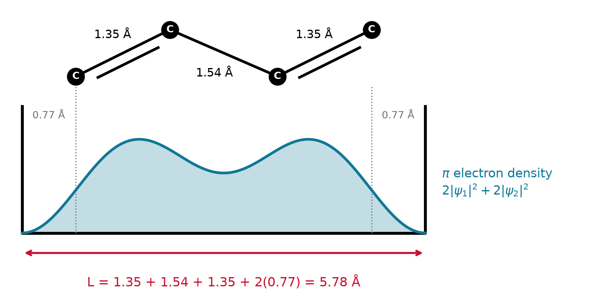
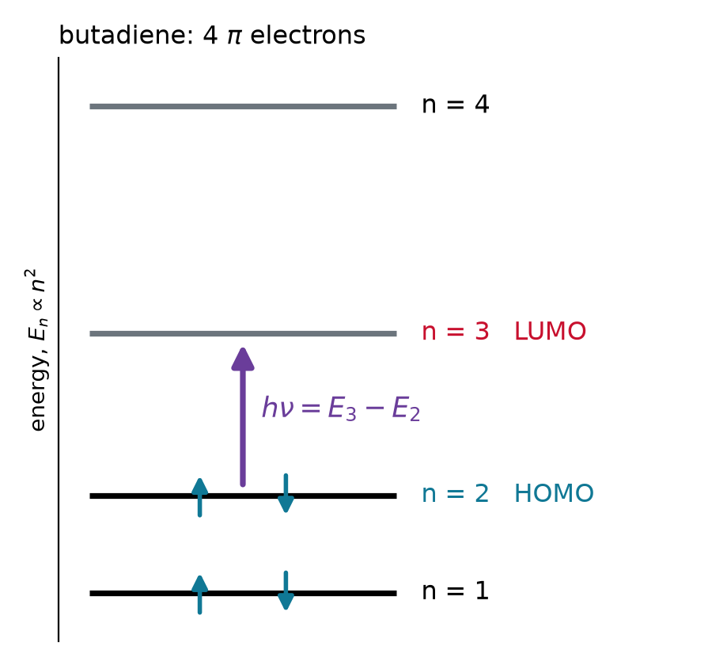
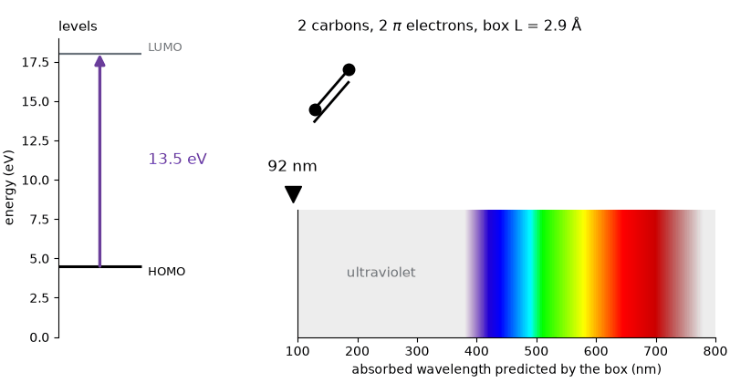
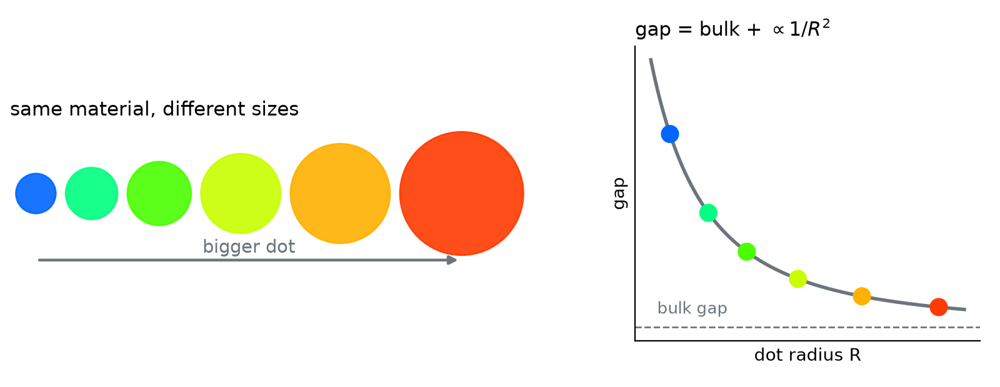

## $\pi$ electrons live in a box

:::: {.columns}
::: {.column width="62%"}
{width="100%"}
:::
::: {.column width="38%"}

- Light is absorbed when $h\nu$ matches a **gap**; visible light needs about 2 to 3 eV
- In a conjugated chain the $\pi$ electrons **spread over the whole chain**: a 1D box
- The box runs one carbon radius **past** each end carbon
:::
::::

## Fill the levels, then jump

:::: {.columns}
::: {.column width="42%"}
{width="100%"}
:::
::: {.column width="58%"}

- Each level holds **two** electrons, spin up and spin down
- $N$ $\pi$ electrons fill $n = 1$ to $N/2$
- **HOMO**: $n = N/2$, the highest filled level
- **LUMO**: $n = N/2 + 1$, the lowest empty one
- The lowest-energy absorption lifts one electron from HOMO to LUMO
:::
::::

## From gap to wavelength

The HOMO to LUMO gap:

$$\Delta E = \left[\left(\tfrac{N}{2}+1\right)^2 - \left(\tfrac{N}{2}\right)^2\right]\frac{h^2}{8mL^2} = (N+1)\,\frac{h^2}{8mL^2}$$

::: {.fragment}
Set $\Delta E = hc/\lambda$:

$$\lambda = \frac{8mc}{h}\,\frac{L^2}{N+1} \qquad\Longrightarrow\qquad \lambda\ (\text{nm}) \approx 33\,\frac{\big[L\ (\text{Å})\big]^2}{N+1}$$
:::

- Longer chain: $L^2$ grows faster than $N + 1$, so $\lambda$ **grows**

## Example: butadiene

::: {.worked}
Butadiene, CH$_2$=CH–CH=CH$_2$, has 4 $\pi$ electrons (C=C 1.35 Å, C–C 1.54 Å). Estimate $\lambda$ with the box ending (a) at the end carbons, (b) one carbon radius, 0.77 Å, beyond them.
:::

::: {.soln .fragment}
$$\text{(a)}\quad L = 1.35 + 1.54 + 1.35 = 4.24\ \text{Å}: \qquad \lambda = 33\,\frac{(4.24)^2}{5} \approx 119\ \text{nm}$$

$$\text{(b)}\quad L = 4.24 + 2(0.77) = 5.78\ \text{Å}: \qquad \lambda = 33\,\frac{(5.78)^2}{5} \approx 220\ \text{nm}$$

Measured: **217 nm**. The $\pi$ cloud does not stop at the end carbons.
:::

- No fitting: $L$ comes from bond lengths alone

## Longer chain, redder light

{.nostretch width="62%" fig-align="center"}

- Each C=C adds 2 electrons and 2.9 Å of box: the gap closes roughly as $1/N$
- The **trend** is right. Are the numbers, for a long chain?

## Example: β-carotene

::: {.worked}
β-carotene, the orange of carrots, has 22 conjugated carbons and 22 $\pi$ electrons. With the butadiene rule, $L = 1.445\,N$ Å, predict $\lambda$.
:::

::: {.soln .fragment}
$$L = 1.445 \times 22 = 31.8\ \text{Å}: \qquad \lambda = 33\,\frac{(31.8)^2}{23} \approx 1450\ \text{nm, infrared}$$

Measured: about **450 nm**. It absorbs blue, so it looks orange. The box overshoots threefold.
:::

- Real polyenes **alternate** short and long bonds: the floor of the box is bumpy, and that keeps a gap open
- Dyes with **equal** bond lengths (cyanines) follow the box far better

## Quantum dots: a box in 3D

{.nostretch width="74%" fig-align="center"}

- Semiconductor crystals a few nm across: the electron is confined in **three** dimensions
- Gap = bulk gap + confinement $\propto 1/R^2$: shrink the dot, **bluer** light
- 2023 Nobel Prize in Chemistry: Bawendi, Brus, and Ekimov

## Example: an electron in a helium bubble

::: {.worked}
An electron in liquid helium pushes the atoms away and sits in a cavity about 36 Å across. Treat it as a cube of side 36 Å: find the zero-point energy and the gap to the first excited level.
:::

::: {.soln .fragment}
$$E_{111} = \frac{3h^2}{8mL^2} = 3\,(4.65\times10^{-21}\ \text{J}) = 1.39\times10^{-20}\ \text{J} = 87\ \text{meV}$$

$$E_{211} - E_{111} = \frac{(6 - 3)\,h^2}{8mL^2} = 87\ \text{meV}, \quad \text{to a 3-fold degenerate level}$$

Measured gap: about 105 meV.
:::

- A crude cube, yet within 20% of experiment

# Takeaway {.center}

> A length and an electron count predict a color: $N$ $\pi$ electrons in a box of length $L$ absorb at $\lambda = 8mcL^2/h(N+1)$. The model gets butadiene within a few percent and the trend right for longer chains, overshoots when bond alternation roughens the box, and carries over to 3D, where the size of a quantum dot sets its color.
