## A ball bounces back, a wave gets through

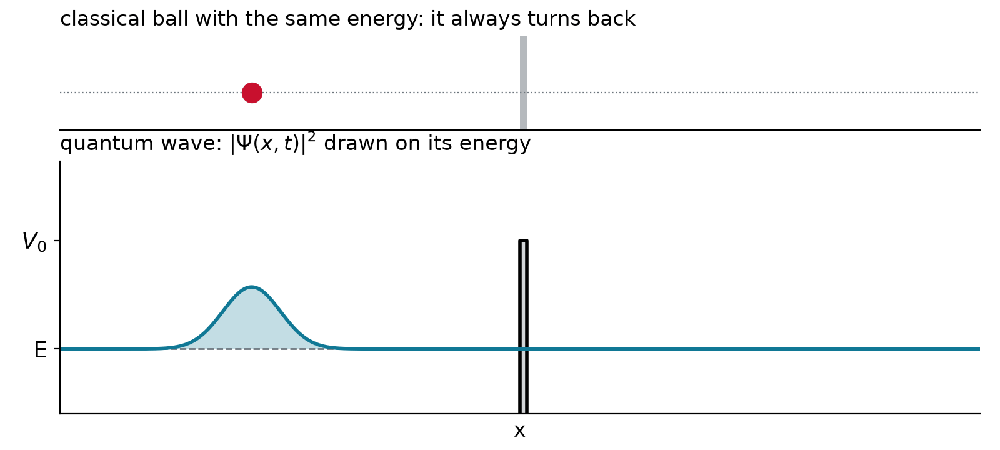{.nostretch width="70%" fig-align="center"}

- The energy is **below** the barrier top: a classical ball always turns around
- Inside the barrier the wave **decays**, but a thin barrier leaves some on the far side: **tunneling**

## The sign of $V - E$ sets the shape

$$\frac{d^2\psi}{dx^2} = \frac{2m}{\hbar^2}\,\big(V - E\big)\,\psi$$

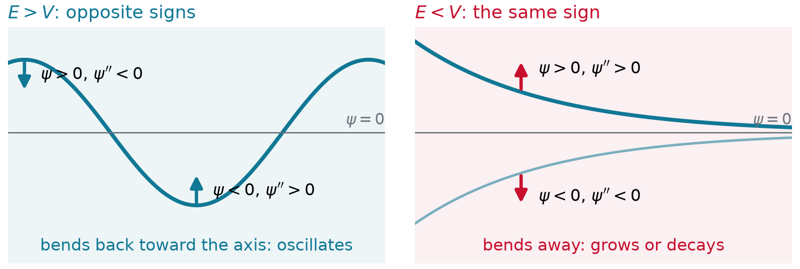{.nostretch width="66%" fig-align="center"}

- $E > V$: $\psi''$ **opposite** to $\psi$, so it bends back **toward** the axis: **oscillates**
- $E < V$: $\psi''$ the **same** sign as $\psi$, so it bends **away**: **grows or decays**

## Reading $\psi$ from $V(x)$

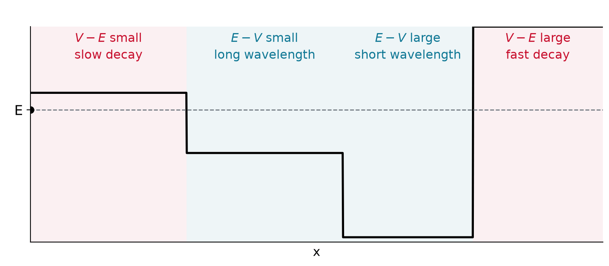{.nostretch width="72%" fig-align="center"}

- The arrow is $\psi''$: [teal]{.fg style="--col: #107895"} bends toward the axis (the dashed line), [red]{.fg style="--col: #C8102E"} bends away
- Bigger $|E - V|$, harder bending: **shorter wavelength**, **faster decay**

## Real walls are finite

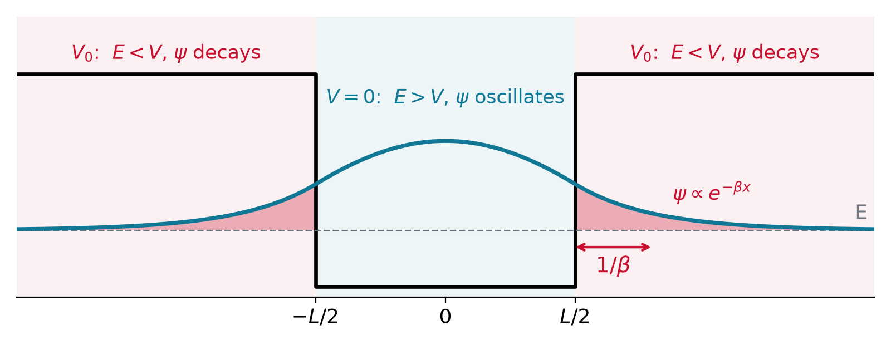{.nostretch width="60%" fig-align="center"}

$$
\begin{aligned}
\text{well:}\quad \psi'' &= -k^2\psi, & k &= \sqrt{2mE}\,/\,\hbar \\
\text{walls:}\quad \psi'' &= +\beta^2\psi, & \beta &= \sqrt{2m(V_0-E)}\,/\,\hbar
\end{aligned}
$$

- The wave leaks a distance of about $1/\beta$ into the wall: the **penetration depth**

## Three regions

$$
\begin{array}{lll}
\text{I:} & x < -\tfrac{L}{2} & \psi_{I} = A\,e^{\beta x} \\[6pt]
\text{II:} & |x| < \tfrac{L}{2} & \psi_{II} = B\cos kx + C\sin kx \\[6pt]
\text{III:} & x > \tfrac{L}{2} & \psi_{III} = D\,e^{-\beta x}
\end{array}
$$

- In each wall keep only the exponential that **decays** away from the well
- At each wall join **both** $\psi$ and $\psi'$: a kink would make $\psi''$, the kinetic energy, infinite
- Two conditions per wall can be met only at **special energies**

## Matching at the wall

:::: {.columns}

::: {.column width="56%"}

Even state: differentiate each piece

$$
\begin{aligned}
\text{inside:}\quad \psi &= B\cos kx, & \psi' &= -kB\sin kx \\
\text{wall:}\quad \psi &= D\,e^{-\beta x}, & \psi' &= -\beta D\,e^{-\beta x}
\end{aligned}
$$

Set them equal at $x = L/2$:

$$
\begin{aligned}
\text{value:}\quad B\cos\tfrac{kL}{2} &= D\,e^{-\beta L/2} \\
\text{slope:}\quad kB\sin\tfrac{kL}{2} &= \beta D\,e^{-\beta L/2}
\end{aligned}
$$

::: {.fragment}
$$\frac{\text{slope}}{\text{value}}: \quad \beta = k\tan\frac{kL}{2} \qquad (B,\ D \text{ cancel})$$
:::

:::

::: {.column width="44%"}
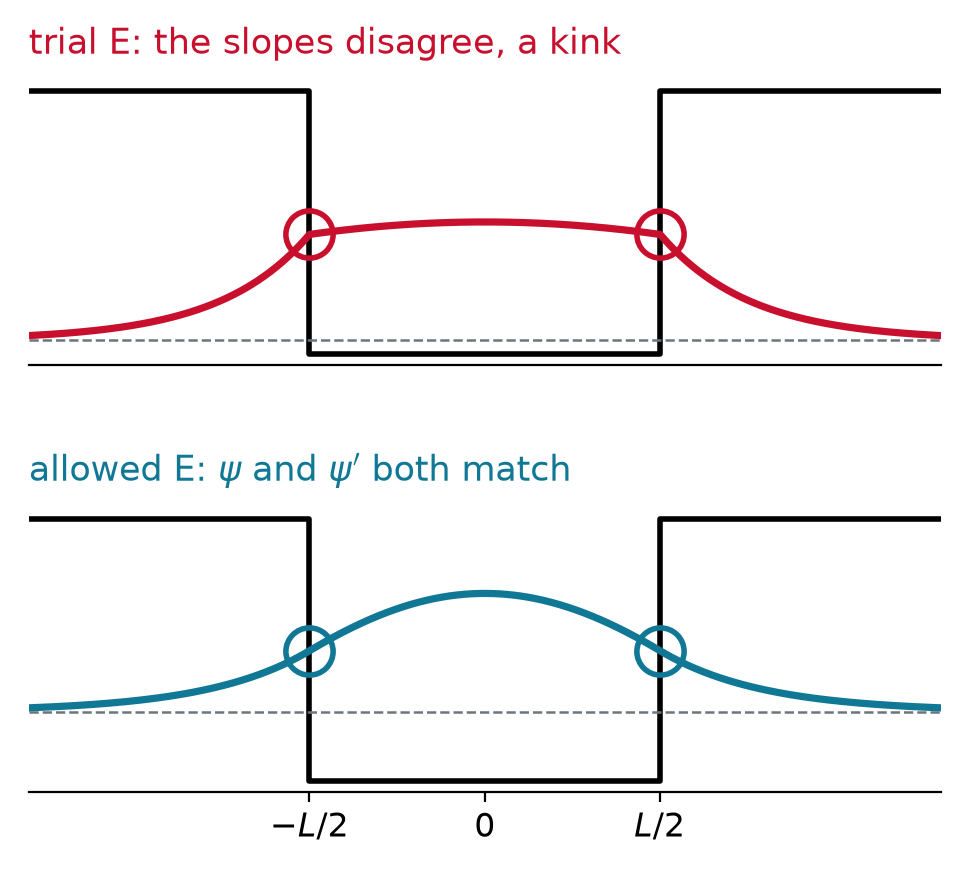{width="100%"}
:::

::::

## Even and odd: one circle

The same steps with $C\sin kx$ give the odd states:

$$\text{even: } \beta = k\tan\frac{kL}{2} \qquad\qquad \text{odd: } \beta = -k\cot\frac{kL}{2}$$

::: {.keyeq}
$$\text{even: } \eta = z\tan z, \qquad \text{odd: } \eta = -z\cot z, \qquad z^2 + \eta^2 = z_0^2$$
:::

$$z = \frac{kL}{2}, \qquad \eta = \frac{\beta L}{2}, \qquad z_0 = \frac{L}{2}\,\frac{\sqrt{2mV_0}}{\hbar}$$

- $k^2 + \beta^2 = 2mV_0/\hbar^2$ for every $E$, so $(z, \eta)$ lies on a **circle** of radius $z_0$, the **well strength**

## Solve graphically

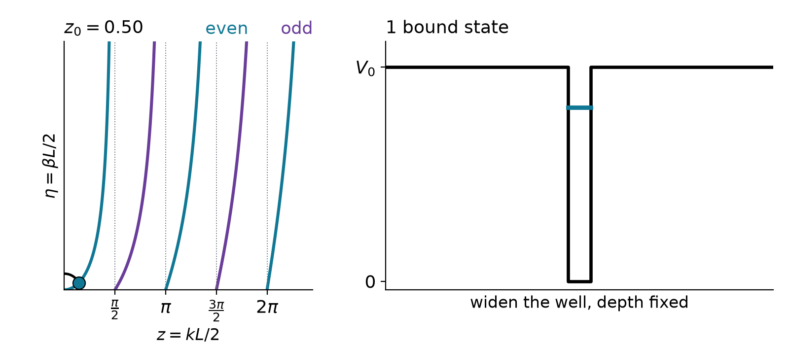{.nostretch width="72%" fig-align="center"}

- Each crossing is a bound state, with $E = V_0\,(z/z_0)^2$. A **new state** appears each time $z_0$ passes a multiple of $\pi/2$
- Even a weak well holds **one** state, and no finite well holds infinitely many

## The states leak

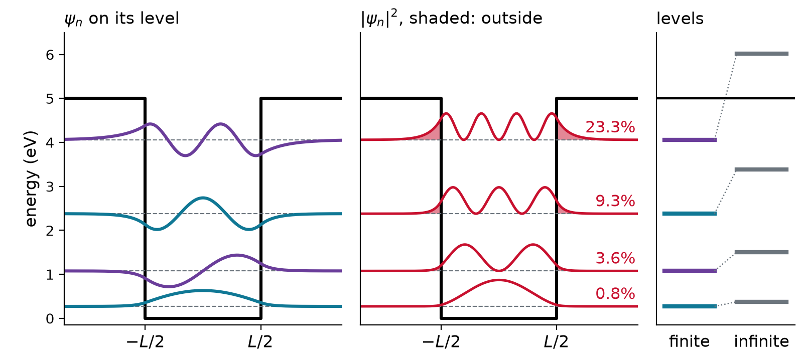{.nostretch width="72%" fig-align="center"}

- Electron, 10 Å wide, 5 eV deep: **4** states; the top one is **23%** outside
- Each level sits **below** its infinite-box partner: more room, longer wavelength

## Example: how far does it leak?

::: {.worked}
An electron sits 1 eV below the top of a wall. How far into the wall does $\psi$ reach? And a proton?
:::

::: {.soln .fragment}
$$
\frac{1}{\beta} = \frac{\hbar}{\sqrt{2m(V_0 - E)}} =
\begin{cases}
1.95\ \text{Å} & \text{electron} \\[4pt]
0.046\ \text{Å} & \text{proton: } \sqrt{1836} = 43 \text{ times shorter}
\end{cases}
$$

An electron leaks about the radius of an atom. A proton barely leaks at all.
:::

- $1/\beta$ is largest for **light** particles near the **top** of the wall

## What the transmission coefficient means

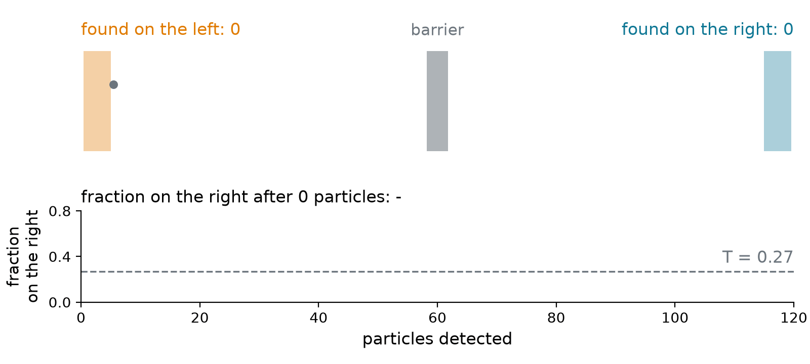{.nostretch width="66%" fig-align="center"}

- Particles arrive one at a time; each is found **either** on the left **or** on the right
- $T$ = the fraction found on the right = the **probability** that one particle gets through

## $T$ from the wave

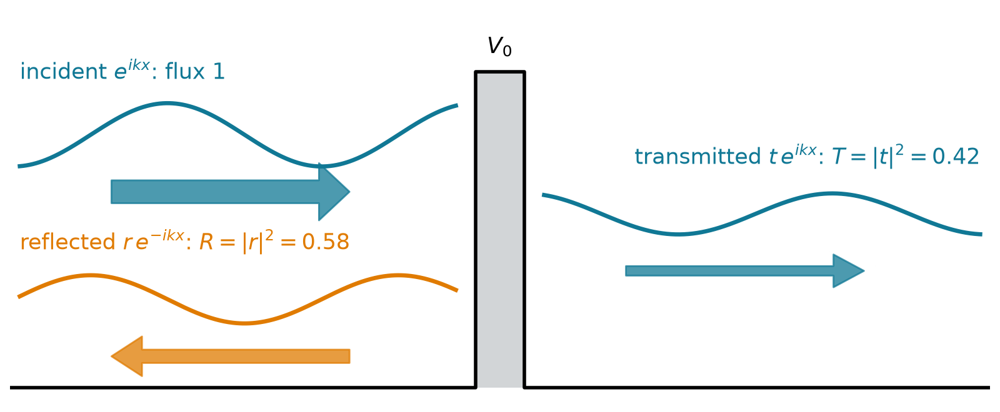{.nostretch width="56%" fig-align="center"}

::: {.keyeq}
$$T = \frac{\text{transmitted flux}}{\text{incident flux}} = |t|^2, \qquad R = |r|^2, \qquad R + T = 1$$
:::

- **Flux** = density $|A|^2$ times speed, and the speed is equal on both sides

## Computing $T$ for a barrier

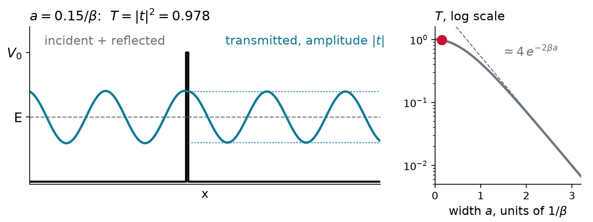{.nostretch width="60%" fig-align="center"}

Matching $\psi$ and $\psi'$ at $x = 0$ and $x = a$ gives $t$. For a thick barrier:

::: {.keyeq}
$$T = |t|^2 \approx 16\,\frac{E}{V_0}\left(1 - \frac{E}{V_0}\right)e^{-2\beta a} \qquad (\beta a \gg 1)$$
:::

## Width and mass sit in the exponent

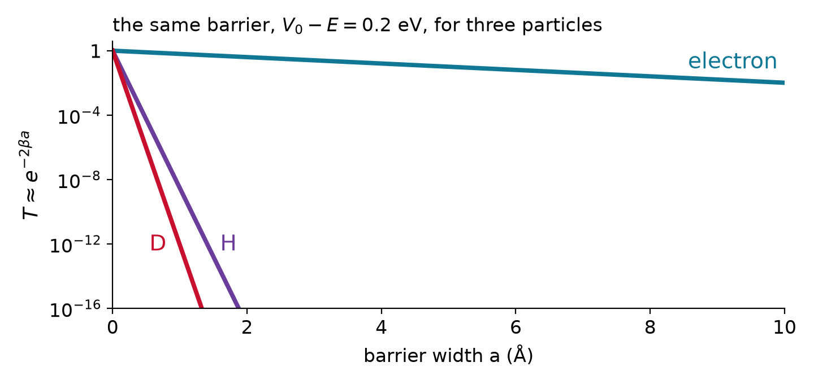{.nostretch width="66%" fig-align="center"}

- $\beta \propto \sqrt{m}$: a proton's $\beta$ is **43 times** an electron's
- Electrons tunnel through **nanometers**, protons through **fractions of an ångström**

## Example: hydrogen or deuterium?

::: {.worked}
An H atom transfers through a barrier 0.2 eV above its energy and 0.5 Å wide. Compare $T$ for H and D.
:::

::: {.soln .fragment}
$$
\begin{aligned}
\text{H:}\quad 2\beta_H a &= 9.82 & T_H &\approx e^{-9.82} = 5.4\times10^{-5} \\
\text{D:}\quad 2\beta_D a &= \sqrt{2}\,(9.82) = 13.9 & T_D &\approx e^{-13.9} = 9.4\times10^{-7}
\end{aligned}
$$

$$\frac{T_H}{T_D} = e^{(\sqrt{2}-1)(9.82)} = 58 \approx 60$$

Doubling the mass multiplies $\beta$ by $\sqrt{2}$, and the exponent does the rest.
:::

- Without tunneling $k_H/k_D$ stays below about **7**; lipoxygenase shows about **80**

## Live: tune the barrier {.smaller}

$T \approx e^{-2\beta a}$ for an [electron]{.fg style="--col: #107895"}, a [proton]{.fg style="--col: #6a3d9a"} and a [deuteron]{.fg style="--col: #C8102E"} facing the same barrier

```{ojs}
//| echo: false
viewof dE = Inputs.range([0.05, 2], {step: 0.05, value: 0.2, label: "V₀ − E (eV)"})
```

```{ojs}
//| echo: false
viewof aw = Inputs.range([0.1, 10], {step: 0.05, value: 0.5, label: "width a (Å)"})
```

```{ojs}
//| echo: false
{
  const parts = [
    {name: "electron", m: 1, c: "#107895"},
    {name: "proton (H)", m: 1836.15, c: "#6a3d9a"},
    {name: "deuteron (D)", m: 3670.48, c: "#C8102E"}
  ];
  const lg = (m, a) => -2 * 0.5123 * Math.sqrt(m * dE) * a / Math.LN10;   // log10 of e^(-2 beta a), beta in 1/Angstrom
  const as = d3.range(0, 10.001, 0.01);
  const rows = parts.flatMap(p => as.map(a => ({a, y: lg(p.m, a), name: p.name})).filter(r => r.y >= -16));
  const pts = parts.map(p => ({a: aw, y: Math.max(-16, lg(p.m, aw)), name: p.name}));
  return Plot.plot({
    width: 1000, height: 330, marginLeft: 60,
    x: {domain: [0, 10], label: "barrier width a (Å)"},
    y: {domain: [-16, 0], label: "log₁₀ T", ticks: [0, -4, -8, -12, -16]},
    color: {domain: parts.map(p => p.name), range: parts.map(p => p.c), legend: true},
    marks: [
      Plot.ruleX([aw], {stroke: "#6c757d", strokeDasharray: "4,3"}),
      Plot.line(rows, {x: "a", y: "y", stroke: "name", strokeWidth: 2.5}),
      Plot.dot(pts, {x: "a", y: "y", fill: "name", r: 7})
    ]
  });
}
```

```{ojs}
//| echo: false
{
  const lg = m => -2 * 0.5123 * Math.sqrt(m * dE) * aw / Math.LN10;
  const sci = y => {
    const e = Math.floor(y);
    return (e >= -2 && e <= 3) ? (10 ** y).toPrecision(2) : `${(10 ** (y - e)).toFixed(1)}×10<sup>${e}</sup>`;
  };
  return md`electron **${sci(lg(1))}** · proton **${sci(lg(1836.15))}** · deuteron **${sci(lg(3670.48))}** · H gets through **${sci(lg(1836.15) - lg(3670.48))}** times as often as D`;
}
```

## The scanning tunneling microscope

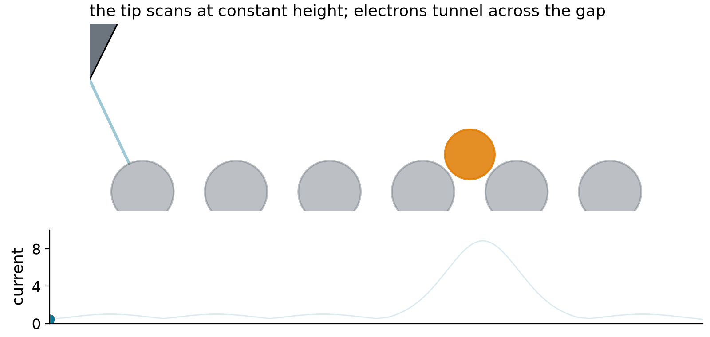{.nostretch width="74%" fig-align="center"}

- Electrons **tunnel** across the gap $d$: the current falls as $e^{-2\beta d}$ and maps the atoms
- The orange adatom is only **1 Å** taller. Binnig and Rohrer, 1981; Nobel Prize 1986

## Example: why the STM sees atoms

::: {.worked}
For a metal with work function $\phi = 4.5$ eV, by what factor does the current grow when the tip moves 1 Å closer?
:::

::: {.soln .fragment}
$$\beta = \frac{\sqrt{2m_e\phi}}{\hbar} = 1.09\ \text{Å}^{-1} \quad\Longrightarrow\quad \frac{I(d - 1\,\text{Å})}{I(d)} = e^{2\beta\,(1\,\text{Å})} = e^{2.17} \approx 9$$

A height change of 0.01 Å moves the current by 2%, which the electronics read easily.
:::

- About a factor of ten per ångström: the exponential turns height into a **huge signal**

## Ammonia turns inside out

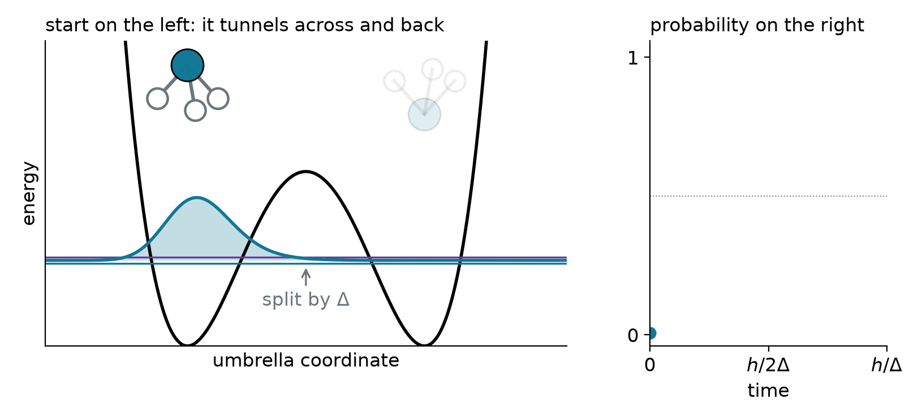{.nostretch width="72%" fig-align="center"}

- The lowest level splits by **Δ = 0.79 cm⁻¹**: a flip and back every $h/\Delta = 42$ ps
- **ND₃** is 15 times slower. The 24 GHz line ran the first **maser** (1954)

# Takeaway {.center}

> Where $E > V$ the wavefunction bends toward the axis and oscillates; where $E < V$ it bends away and decays over about $1/\beta$. Joining $\psi$ and $\psi'$ at the walls allows a finite well only a limited set of levels, each a little lower than in the infinite box. A barrier passes the fraction $T = |t|^2$ of the incident flux, $T \approx e^{-2\beta a}$, exponential in the width and in $\sqrt{m}$: electrons tunnel nanometers, protons fractions of an ångström, the STM sees atoms, and ammonia turns inside out.
