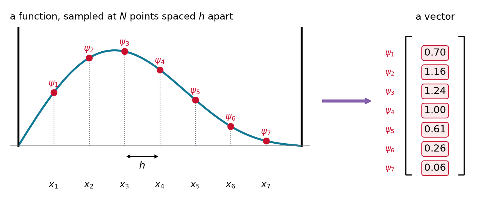
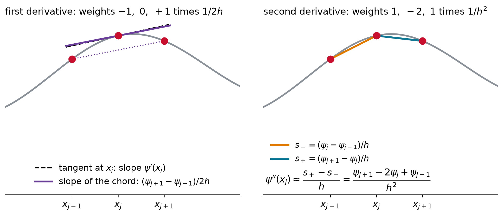
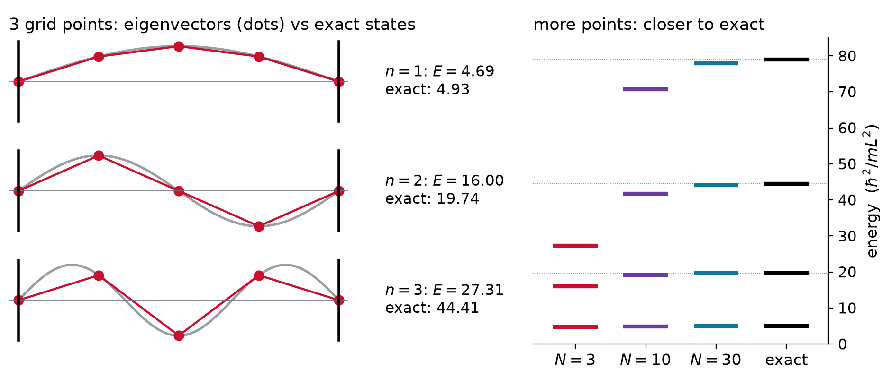
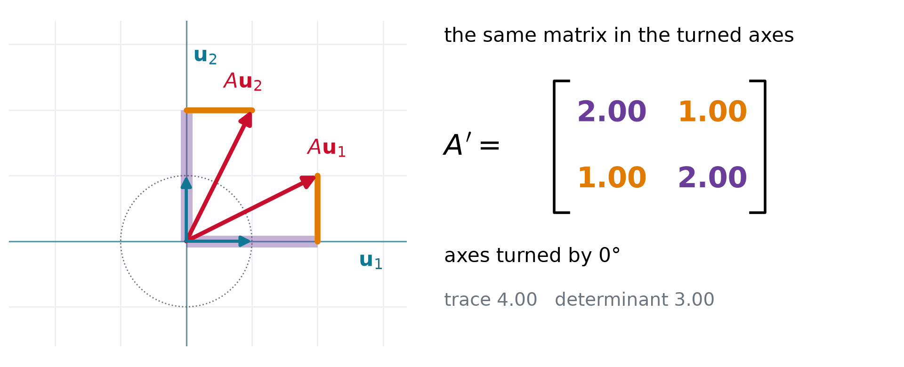

## The rules of the game

| | postulate | lecture |
|:-:|:-------------------------------------|:-----:|
| 1 | the state is a wavefunction $\psi$; $\lvert\psi\rvert^2$ is the probability density | 3.1 |
| 2 | **every observable is a linear Hermitian operator** | **3.5, 3.5b** |
| 3 | a measurement returns an eigenvalue $a_n$ and leaves the state $\phi_n$ | 3.6 |
| 4 | outcome $a_n$ has probability $\lvert\langle\phi_n\vert\psi\rangle\rvert^2$ | 3.6 |
| 5 | the state evolves by $i\hbar\,\partial\Psi/\partial t = \hat{H}\Psi$ | 3.7 |

- **Today:** a change of viewpoint. Functions become **vectors**, operators become **matrices**
- **Next lecture:** which matrices may stand for an observable (Hermitian), and what if two **do not commute**

## Operators must be linear

::: {.keyeq}
$$\hat{A}\,(c_1\psi_1 + c_2\psi_2) = c_1\,\hat{A}\psi_1 + c_2\,\hat{A}\psi_2$$
:::

- **Superposition** demands it: if $\Psi_1$ and $\Psi_2$ are states, so is their sum
- **Linear:** $x$, $d/dx$, $\hat{H}$. **Not linear:** $f^2$, $\sqrt{f}$, $\ln f$
- Quick test: a linear operator turns $2f$ into $2\hat{A}f$; squaring gives $4f^2$

## A matrix turns and stretches arrows

{.nostretch width="62%" fig-align="center"}

$$
\begin{pmatrix} 2 & 1 \\ 1 & 2 \end{pmatrix}\begin{pmatrix} 1 \\ 0 \end{pmatrix} = \begin{pmatrix} 2 \\ 1 \end{pmatrix}\ \text{turned},
\qquad\qquad
\begin{pmatrix} 2 & 1 \\ 1 & 2 \end{pmatrix}\begin{pmatrix} 1 \\ 1 \end{pmatrix} = 3\begin{pmatrix} 1 \\ 1 \end{pmatrix}\ \text{only stretched}
$$

- An **eigenvector** keeps its direction, $A\mathbf{v} = \lambda\mathbf{v}$: the same shape as $\hat{A}\phi = a\phi$

## Live: hunt for the eigenvectors

```{=html}
<div id="mx-live" style="width: 1100px; margin: 0 auto;"></div>
<script type="module">
  import widget from "../../widgets/matrix_arrows.mjs";
  const opts = { mode: "hunt", fontSize: "22px" };
  widget.render({ model: { get: (k) => opts[k] }, el: document.getElementById("mx-live") });
</script>
```

## Example: eigenvalues of a 2×2 by hand

::: {.keyeq}
$$A\mathbf{v} = \lambda\mathbf{v}\ \text{ with }\ \mathbf{v} \neq 0 \qquad\Longleftrightarrow\qquad \det(A - \lambda I) = 0$$
:::

::: {.worked}
Find the eigenvalues and eigenvectors of $A = \begin{pmatrix} 2 & 1 \\ 1 & 2 \end{pmatrix}$.
:::

::: {.soln .fragment}
$$\det\begin{pmatrix} 2-\lambda & 1 \\ 1 & 2-\lambda \end{pmatrix} = (2-\lambda)^2 - 1 = 0 \quad\Longrightarrow\quad \lambda = 3,\ 1$$

$\lambda = 3$: $\mathbf{v} \propto (1, 1)$. $\ \lambda = 1$: $\mathbf{v} \propto (1, -1)$. Check: $3 + 1 = 4$ is the trace, $3 \times 1 = 3$ the determinant.
:::

## A function becomes a vector

{.nostretch width="80%" fig-align="center"}

- Sample at $N$ points spaced $h$ apart: $\psi(x) \to (\psi_1, \psi_2, \dots, \psi_N)$, with $\psi_j = \psi(x_j)$
- Integrals become sums: $\int \phi^*\psi\,dx \;\to\; \sum_j \phi_j^*\,\psi_j\,h$

## Multiplying by $x$: a diagonal matrix

$$
\hat{x}\,\psi \;\longrightarrow\;
\begin{pmatrix} x_1 & 0 & 0 & 0 \\ 0 & x_2 & 0 & 0 \\ 0 & 0 & x_3 & 0 \\ 0 & 0 & 0 & x_4 \end{pmatrix}
\begin{pmatrix} \psi_1 \\ \psi_2 \\ \psi_3 \\ \psi_4 \end{pmatrix}
=
\begin{pmatrix} x_1\psi_1 \\ x_2\psi_2 \\ x_3\psi_3 \\ x_4\psi_4 \end{pmatrix}
$$

- Each sample is multiplied by **its own** $x_j$: nothing off the diagonal
- Any potential $V(x)$ is diagonal the same way, with $V(x_1), V(x_2), \dots$ on the diagonal

## A derivative compares neighbors

{.nostretch width="78%" fig-align="center"}

$$
\psi'(x_j) \approx \frac{\psi_{j+1} - \psi_{j-1}}{2h} \qquad\qquad
\psi''(x_j) \approx \frac{s_+ - s_-}{h} = \frac{\psi_{j+1} - 2\psi_j + \psi_{j-1}}{h^2}
$$

## One formula, one matrix row

- The curvature formula at point 2 uses three samples, with the numbers $1,\ -2,\ 1$ in front of them:

$$
\psi''(x_2) \approx \frac{1\cdot\psi_1 - 2\,\psi_2 + 1\cdot\psi_3}{h^2}
= \frac{1}{h^2}\begin{pmatrix} 1 & -2 & 1 & 0 \end{pmatrix}\begin{pmatrix} \psi_1 \\ \psi_2 \\ \psi_3 \\ \psi_4 \end{pmatrix}
$$

- **Row times column:** multiply matching entries, then add them up
- So the formula's numbers **are a row** of a matrix. At point 3 the same numbers move one place right: $(0,\ 1,\ -2,\ 1)$

## Derivatives as matrices

$$
\begin{aligned}
\frac{d}{dx} \;\to\; D_1 &= \frac{1}{2h}\begin{pmatrix} 0 & 1 & 0 & 0 \\ -1 & 0 & 1 & 0 \\ 0 & -1 & 0 & 1 \\ 0 & 0 & -1 & 0 \end{pmatrix} \\[6pt]
\frac{d^2}{dx^2} \;\to\; D_2 &= \frac{1}{h^2}\begin{pmatrix} -2 & 1 & 0 & 0 \\ 1 & -2 & 1 & 0 \\ 0 & 1 & -2 & 1 \\ 0 & 0 & 1 & -2 \end{pmatrix}
\end{aligned}
$$

- **One row per grid point:** the same formula each time, shifted one place to the right
- Row 1 of $D_2$ gives $(-2\psi_1 + \psi_2)/h^2$: the formula with $\psi_0 = 0$, so the **wall** is built in
- Momentum $\hat{p} = -i\hbar\,D_1$: $-i\hbar/2h$ above the diagonal, $+i\hbar/2h$ below

## Example: the grid derivative of a plane wave

::: {.worked}
Apply the centered difference to the samples of a plane wave, $\psi_j = e^{ikx_j}$.
:::

::: {.soln .fragment}
$$
\frac{\psi_{j+1} - \psi_{j-1}}{2h} = \frac{e^{ikh} - e^{-ikh}}{2h}\,e^{ikx_j} = \frac{i\sin kh}{h}\,\psi_j \;\;\xrightarrow{\;kh\,\ll\,1\;}\;\; ik\,\psi_j
$$

An **eigenvector** of the matrix, as $e^{ikx}$ is an eigenfunction of $d/dx$. Momentum: $\hbar\sin(kh)/h \approx \hbar k$.
:::

- The grid works when there are **many points per wavelength**

## The Hamiltonian is a matrix

$$
H = -\frac{\hbar^2}{2m}D_2 + V = \begin{pmatrix} 2\varepsilon + V_1 & -\varepsilon & 0 & 0 \\ -\varepsilon & 2\varepsilon + V_2 & -\varepsilon & 0 \\ 0 & -\varepsilon & 2\varepsilon + V_3 & -\varepsilon \\ 0 & 0 & -\varepsilon & 2\varepsilon + V_4 \end{pmatrix}, \qquad \varepsilon = \frac{\hbar^2}{2mh^2}
$$

::: {.keyeq}
$$\hat{H}\psi = E\,\psi \quad\longrightarrow\quad H\mathbf{v} = E\mathbf{v}$$
:::

- $\varepsilon$ is only a **unit of energy**: the constants in front of $D_2$, collected in one symbol
- **Potential** on the diagonal; **kinetic** energy links neighbors through $-\varepsilon$ (the Hückel picture, too)

## Example: a box with three grid points

::: {.worked}
Three interior points, $\psi = 0$ at the walls. Find the energies $E = \lambda\,\varepsilon$ of $\;H = \varepsilon\begin{pmatrix} 2 & -1 & 0 \\ -1 & 2 & -1 \\ 0 & -1 & 2 \end{pmatrix}$.
:::

::: {.soln .fragment}
Solve $\det(H/\varepsilon - \lambda I) = 0$ along the first row: each entry times the $2\times2$ determinant left after crossing out its row and column, signs $+\,-\,+$:

$$
\begin{aligned}
&(2-\lambda)\underbrace{\big[(2-\lambda)^2 - 1\big]}_{\text{cross out row 1, column 1}} \;-\; (-1)\underbrace{\big[-(2-\lambda)\big]}_{\text{cross out row 1, column 2}} \;+\; 0 \\
&= (2-\lambda)\big[(2-\lambda)^2 - 2\big] = 0 \quad\Longrightarrow\quad \lambda = 2 - \sqrt{2},\ \ 2,\ \ 2 + \sqrt{2}
\end{aligned}
$$
:::

## Check the ground state by row times column

::: {.worked}
Sample the exact ground state $\sin(\pi x/L)$ at the three points: $\mathbf{v} = \big(\sin\tfrac{\pi}{4},\ \sin\tfrac{\pi}{2},\ \sin\tfrac{3\pi}{4}\big) \propto (1,\ \sqrt{2},\ 1)$. Is it an eigenvector of $H$?
:::

::: {.soln .fragment}
$$
\begin{pmatrix} 2 & -1 & 0 \\ -1 & 2 & -1 \\ 0 & -1 & 2 \end{pmatrix}\begin{pmatrix} 1 \\ \sqrt{2} \\ 1 \end{pmatrix}
= \begin{pmatrix} 2 - \sqrt{2} \\ -1 + 2\sqrt{2} - 1 \\ -\sqrt{2} + 2 \end{pmatrix}
= (2-\sqrt{2})\begin{pmatrix} 1 \\ \sqrt{2} \\ 1 \end{pmatrix}
$$

Yes, with $\lambda = 2 - \sqrt{2}$ (the middle entry $2\sqrt{2} - 2$ is $(2-\sqrt{2})\sqrt{2}$). With $h = L/4$, $\varepsilon = 8\hbar^2/mL^2$ and $E_1 = 4.69\,\hbar^2/mL^2$, close to the exact $4.93$.
:::

## More points, better answers

{.nostretch width="80%" fig-align="center"}

- Eigenvectors are the exact states **sampled** on the grid; the levels converge **from below**

## Five lines solve the Schrödinger equation

::: {style="font-size: 1.3em"}
```python
x = np.linspace(-8, 8, 400); h = x[1] - x[0]
D2 = (np.eye(400, k=1) - 2*np.eye(400) + np.eye(400, k=-1)) / h**2
H = -0.5 * D2 + np.diag(0.5 * x**2)      # spring: hbar = m = omega = 1
E, psi = np.linalg.eigh(H)
E[:4]                                    # 0.4999  1.4997  2.4993  3.4987
```
:::

- The same recipe with **400 points**: the levels of a vibrating bond, $\left(n + \tfrac{1}{2}\right)\hbar\omega$
- `eigh` is the eigensolver for **Hermitian** matrices. Why Hermitian? Coming up

## Dirac notation: kets and bras

- **Ket** $\lvert\psi\rangle$: the column of samples. **Bra** $\langle\psi\rvert$: the same numbers as a row, **conjugated**
- A bra meeting a ket is an **inner product**, a single number:

$$\langle \phi \vert \psi \rangle = \sum_j \phi_j^*\,\psi_j\,h \;\;\longrightarrow\;\; \int \phi^*\,\psi\,dx$$

::: {.worked}
Why conjugate? Take $\lvert\psi\rangle = \begin{pmatrix} 1 \\ i \end{pmatrix}$ and find $\langle\psi\vert\psi\rangle$.
:::

::: {.soln .fragment}
$\langle\psi\rvert = (1,\ -i)$, so $\langle\psi\vert\psi\rangle = 1\cdot 1 + (-i)(i) = 2$: a real, positive **length squared**. Without the conjugate, $1 + i^2 = 0$: a nonzero vector of length zero.
:::

## Sandwiches: matrix elements

- An operator acts on a ket: $\hat{A}\lvert\psi\rangle$ is the matrix times the column
- A bra in front turns it into a number, the **matrix element**:

$$\langle \phi \vert \hat{A} \vert \psi \rangle \;=\; \text{row} \times \text{matrix} \times \text{column} \;\;\longrightarrow\;\; \int \phi^*\,\hat{A}\psi\,dx$$

::: {.worked}
For $A = \begin{pmatrix} 2 & 1 \\ 1 & 2 \end{pmatrix}$, $\mathbf{e}_1 = (1, 0)$ and $\mathbf{e}_2 = (0, 1)$, compute $\langle \mathbf{e}_1 \vert A \vert \mathbf{e}_2 \rangle$.
:::

::: {.soln .fragment}
$A\,\mathbf{e}_2 = (1,\ 2)$, then $\mathbf{e}_1 \cdot (1,\ 2) = 1 = A_{12}$: sandwiching unit vectors picks out **one entry** of the matrix.
:::

## Same matrix, new axes

{.nostretch width="78%" fig-align="center"}

- Each entry is a sandwich, $A'_{mn} = \langle \mathbf{u}_m \vert A \vert \mathbf{u}_n \rangle$: **purple** along its own axis, **orange** off it
- The entries change; **trace** 4 and **determinant** 3 never do, so neither do the **eigenvalues**

## Example: diagonal in its own eigenbasis

::: {.worked}
Write $A = \begin{pmatrix} 2 & 1 \\ 1 & 2 \end{pmatrix}$ in its eigenvector axes, $\mathbf{u}_{1,2} = \tfrac{1}{\sqrt{2}}(1,\ \pm 1)$.
:::

::: {.soln .fragment}
Each $\mathbf{u}_n$ only stretches, $A\mathbf{u}_n = \lambda_n\mathbf{u}_n$, so a sandwich is an eigenvalue times an overlap:

$$
\langle \mathbf{u}_m \vert A \vert \mathbf{u}_n \rangle = \lambda_n\,\langle \mathbf{u}_m \vert \mathbf{u}_n \rangle
\quad\Longrightarrow\quad
A' = \begin{pmatrix} 3\cdot 1 & 1\cdot 0 \\ 3\cdot 0 & 1\cdot 1 \end{pmatrix} = \begin{pmatrix} 3 & 0 \\ 0 & 1 \end{pmatrix}
$$

Check one by row times column: $\langle \mathbf{u}_2 \vert A \vert \mathbf{u}_1 \rangle = \tfrac{1}{2}(1,\ -1)\cdot(3,\ 3) = 0$
:::

- **Diagonalizing** $H$ means finding these axes: `eigh` returns them as the **columns** of `psi`

## Dirac notation: one language, three dialects

| | integral | Dirac | matrices (numpy) |
|:-----|:-----|:-----|:-----------|
| inner product | $\int\phi^*\psi\,dx$ | $\langle\phi\vert\psi\rangle$ | `np.vdot(phi, psi) * h` |
| operator acts | $\hat{A}\psi(x)$ | $\hat{A}\lvert\psi\rangle$ | `A @ psi` |
| matrix element | $\int\phi^*\hat{A}\psi\,dx$ | $\langle\phi\vert\hat{A}\vert\psi\rangle$ | `np.vdot(phi, A @ psi) * h` |
| eigenproblem | $\hat{A}\phi_n = a_n\phi_n$ | $\hat{A}\lvert n\rangle = a_n\lvert n\rangle$ | `a, phi = np.linalg.eigh(A)` |
| new axes | $\int\phi_m^*\hat{A}\phi_n\,dx$ | $\langle \phi_m \vert \hat{A} \vert \phi_n \rangle$ | `U.conj().T @ A @ U * h` |

- The same objects in three dialects: integrals for functions, brackets on paper, matrices on a computer

## Two matrix properties to watch

{.nostretch width="66%" fig-align="center"}

- **Mirror:** each matrix equals its own conjugate transpose. Next lecture: **Hermitian**, which makes eigenvalues real
- **Order:** for matrices $AB \neq BA$ in general. Next lecture: **commutators**, and why $x$ and $p$ are never sharp together

# Takeaway {.center}

> Sample a function and it becomes a vector; every operator becomes a matrix. Position is diagonal, derivatives link neighbors, and the Hamiltonian is a matrix whose eigenvalues are the allowed energies. Dirac notation writes integrals and matrices in one language, and in the axes of its own eigenvectors a matrix is diagonal. Next: which matrices can be observables, and what happens when two of them do not commute.

