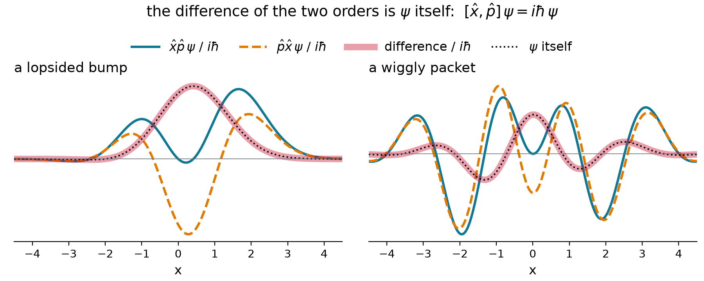

## The rules of the game

| | postulate | lecture |
|:-:|:-------------------------------------|:-----:|
| 1 | the state is a wavefunction $\psi$; $\lvert\psi\rvert^2$ is the probability density | 3.1 |
| 2 | **every observable is a linear Hermitian operator** | **today** |
| 3 | a measurement returns an eigenvalue $a_n$ and leaves the state $\phi_n$ | 3.6 |
| 4 | outcome $a_n$ has probability $\lvert\langle\phi_n\vert\psi\rangle\rvert^2$ | 3.6 |
| 5 | the state evolves by $i\hbar\,\partial\Psi/\partial t = \hat{H}\Psi$ | 3.7 |

- Today: which operators may stand for **observables**, and what if two **do not commute**?

## Operators must be linear

::: {.keyeq}
$$\hat{A}\,(c_1\psi_1 + c_2\psi_2) = c_1\,\hat{A}\psi_1 + c_2\,\hat{A}\psi_2$$
:::

- **Superposition** demands it: if $\Psi_1$ and $\Psi_2$ are states, so is their sum
- **Linear:** $x$, $d/dx$, $\hat{H}$. **Not linear:** $f^2$, $\sqrt{f}$, $\ln f$
- Quick test: a linear operator turns $2f$ into $2\hat{A}f$; squaring gives $4f^2$

## A function becomes a vector

{.nostretch width="80%" fig-align="center"}

- Sample at $N$ points spaced $h$ apart: $\psi(x) \to (\psi_1, \psi_2, \dots, \psi_N)$, with $\psi_j = \psi(x_j)$
- Integrals become sums: $\int \phi^*\psi\,dx \;\to\; \sum_j \phi_j^*\,\psi_j\,h$

## Multiplying by $x$: a diagonal matrix

$$
\hat{x}\,\psi \;\longrightarrow\;
\begin{pmatrix} x_1 & 0 & 0 & 0 \\ 0 & x_2 & 0 & 0 \\ 0 & 0 & x_3 & 0 \\ 0 & 0 & 0 & x_4 \end{pmatrix}
\begin{pmatrix} \psi_1 \\ \psi_2 \\ \psi_3 \\ \psi_4 \end{pmatrix}
=
\begin{pmatrix} x_1\psi_1 \\ x_2\psi_2 \\ x_3\psi_3 \\ x_4\psi_4 \end{pmatrix}
$$

- Each sample is multiplied by **its own** $x_j$: nothing off the diagonal
- Any potential $V(x)$ is diagonal the same way, with $V(x_1), V(x_2), \dots$ on the diagonal

## A derivative compares neighbors

{.nostretch width="78%" fig-align="center"}

$$
\psi'(x_j) \approx \frac{\psi_{j+1} - \psi_{j-1}}{2h} \qquad\qquad
\psi''(x_j) \approx \frac{s_+ - s_-}{h} = \frac{\psi_{j+1} - 2\psi_j + \psi_{j-1}}{h^2}
$$

## Derivatives as matrices

$$
\frac{d}{dx} \to \frac{1}{2h}\begin{pmatrix} 0 & 1 & 0 & 0 \\ -1 & 0 & 1 & 0 \\ 0 & -1 & 0 & 1 \\ 0 & 0 & -1 & 0 \end{pmatrix}
\qquad\qquad
\frac{d^2}{dx^2} \to \frac{1}{h^2}\begin{pmatrix} -2 & 1 & 0 & 0 \\ 1 & -2 & 1 & 0 \\ 0 & 1 & -2 & 1 \\ 0 & 0 & 1 & -2 \end{pmatrix}
$$

- Row $j$ holds the **stencil weights**, centered on the diagonal
- First row of $D_2$ gives $(-2\psi_1 + \psi_2)/h^2$: the stencil with $\psi_0 = 0$, so the **wall** is built in
- Momentum $\hat{p} = -i\hbar\,D_1$: imaginary entries, $-i\hbar/2h$ above the diagonal, $+i\hbar/2h$ below

## Example: the grid derivative of a plane wave

::: {.worked}
Apply the centered difference to the samples of a plane wave, $\psi_j = e^{ikx_j}$.
:::

::: {.soln .fragment}
$$
\frac{\psi_{j+1} - \psi_{j-1}}{2h} = \frac{e^{ikh} - e^{-ikh}}{2h}\,e^{ikx_j} = \frac{i\sin kh}{h}\,\psi_j \;\;\xrightarrow{\;kh\,\ll\,1\;}\;\; ik\,\psi_j
$$

An **eigenvector** of the matrix, as $e^{ikx}$ is an eigenfunction of $d/dx$. Momentum: $\hbar\sin(kh)/h \approx \hbar k$.
:::

- The grid works when there are **many points per wavelength**

## The Hamiltonian is a matrix

$$
H = -\frac{\hbar^2}{2m}D_2 + V = \begin{pmatrix} 2t + V_1 & -t & 0 & 0 \\ -t & 2t + V_2 & -t & 0 \\ 0 & -t & 2t + V_3 & -t \\ 0 & 0 & -t & 2t + V_4 \end{pmatrix}, \qquad t = \frac{\hbar^2}{2mh^2}
$$

::: {.keyeq}
$$\hat{H}\psi = E\,\psi \quad\longrightarrow\quad H\mathbf{v} = E\,\mathbf{v}$$
:::

- **Potential** on the diagonal; **kinetic** energy links neighbors through $-t$ (the Hückel picture, too)

## Example: a box with three grid points

::: {.worked}
Three interior points ($h = L/4$, $\psi = 0$ at the walls). Find the energies and the ground state of $\;H = t\begin{pmatrix} 2 & -1 & 0 \\ -1 & 2 & -1 \\ 0 & -1 & 2 \end{pmatrix}$, $\;t = \dfrac{8\hbar^2}{mL^2}$.
:::

::: {.soln .fragment}
$$
\begin{aligned}
&\det(H - \lambda t\,I) = t^3\,(2-\lambda)\big[(2-\lambda)^2 - 2\big] = 0 \\
&\lambda = 2-\sqrt{2},\ \ 2,\ \ 2+\sqrt{2} \\
&E_1 = (2-\sqrt{2})\,t = 4.69\ \hbar^2/mL^2 \qquad (\text{exact: } 4.93) \\
&\mathbf{v}_1 \propto \big(1,\ \sqrt{2},\ 1\big) \propto \big(\sin\tfrac{\pi}{4},\ \sin\tfrac{\pi}{2},\ \sin\tfrac{3\pi}{4}\big)
\end{aligned}
$$
:::

## More points, better answers

{.nostretch width="80%" fig-align="center"}

- Eigenvectors are the exact states **sampled** on the grid; the levels converge **from below**

## Five lines solve the Schrödinger equation

::: {style="font-size: 1.3em"}
```python
x = np.linspace(-8, 8, 400); h = x[1] - x[0]
D2 = (np.eye(400, k=1) - 2*np.eye(400) + np.eye(400, k=-1)) / h**2
H = -0.5 * D2 + np.diag(0.5 * x**2)      # spring: hbar = m = omega = 1
E, psi = np.linalg.eigh(H)
E[:4]                                    # 0.4999  1.4997  2.4993  3.4987
```
:::

- The same recipe with **400 points**: the levels of a vibrating bond, $\left(n + \tfrac{1}{2}\right)\hbar\omega$
- `eigh` is the eigensolver for **Hermitian** matrices. Why Hermitian? Coming up

## Dirac notation: one language, three dialects

| | integral | Dirac | numpy |
|:-----|:-----|:-----|:-----------|
| inner product | $\int\phi^*\psi\,dx$ | $\langle\phi\vert\psi\rangle$ | `np.vdot(phi, psi) * h` |
| operator acts | $\hat{A}\psi(x)$ | $\hat{A}\lvert\psi\rangle$ | `A @ psi` |
| matrix element | $\int\phi^*\hat{A}\psi\,dx$ | $\langle\phi\vert\hat{A}\vert\psi\rangle$ | `np.vdot(phi, A @ psi) * h` |
| eigenproblem | $\hat{A}\phi_n = a_n\phi_n$ | $\hat{A}\lvert n\rangle = a_n\lvert n\rangle$ | `a, phi = np.linalg.eigh(A)` |

- **Ket** $\lvert\psi\rangle$: the state. **Bra** $\langle\psi\rvert$: its conjugate. A bra meets a ket: a **number**

## Hermitian: its own mirror image

::: {.keyeq}
$$\langle \phi \vert \hat{A}\psi \rangle = \langle \hat{A}\phi \vert \psi \rangle \qquad\Longleftrightarrow\qquad A_{jk} = A_{kj}^*$$
:::

{.nostretch width="64%" fig-align="center"}

- Acts on **either side** of the inner product: transpose and conjugate give it back

## Example: which matrices are Hermitian?

::: {.worked}
$$
A = \begin{pmatrix} 2 & 1-i \\ 1+i & 3 \end{pmatrix} \quad
B = \begin{pmatrix} 1 & 2 \\ 3 & 4 \end{pmatrix} \quad
C = \begin{pmatrix} i & 0 \\ 0 & 1 \end{pmatrix} \quad
D = \begin{pmatrix} 0 & -i \\ i & 0 \end{pmatrix}
$$
:::

::: {.soln .fragment}
- $A$: $A_{12} = 1-i = A_{21}^*$, real diagonal: **Hermitian**
- $B$: $B_{12} = 2 \neq B_{21}^* = 3$: not Hermitian
- $C$: the diagonal must be **real**, and $i \neq i^* = -i$: not Hermitian
- $D$: $D_{12} = -i = D_{21}^*$: **Hermitian**, the pattern of $\hat{p}$ on the grid
:::

## Why observables are Hermitian

{.nostretch width="72%" fig-align="center"}

- **Real eigenvalues**: measured values are real numbers
- **Orthogonal eigenvectors**: different outcomes exclude each other. Add a non-Hermitian part and both fail

## Example: is momentum Hermitian?

::: {.worked}
Show that $\hat{p} = -i\hbar\,d/dx$ satisfies $\langle \phi \vert \hat{p}\psi \rangle = \langle \hat{p}\phi \vert \psi \rangle$.
:::

::: {.soln .fragment}
Integrate by parts; the boundary term vanishes because $\phi, \psi \to 0$:

$$\int\phi^*\big(-i\hbar\,\psi'\big)\,dx = i\hbar\int\phi'^*\,\psi\,dx = \int\big(-i\hbar\,\phi'\big)^*\,\psi\,dx \quad\checkmark$$

Without the $i$: $(d/dx)^\dagger = -d/dx$, **anti**-Hermitian. The $-i$ turns the sign around.
:::

- On the grid: $d/dx$ is real and **antisymmetric**, $\hat{p} = -i\,d/dx$ is **Hermitian**

## Order matters

::: {.keyeq}
$$[\hat{A},\hat{B}] = \hat{A}\hat{B} - \hat{B}\hat{A} \qquad\qquad [\hat{x},\hat{p}] = i\hbar$$
:::

{.nostretch width="80%" fig-align="center"}

## Example: $x$ and $d/dx$

::: {.worked}
Find $[x, d/dx]$ by acting on an arbitrary function $f$.
:::

::: {.soln .fragment}
$$x\,\frac{df}{dx} - \frac{d}{dx}\big(xf\big) = xf' - f - xf' = -f \qquad\Longrightarrow\qquad \left[x,\frac{d}{dx}\right] = -1$$

Multiply by $-i\hbar$: $[\hat{x},\hat{p}] = i\hbar$. The product rule leaves one term, for **every** $f$.
:::

- On a grid it holds only for smooth $f$: finite matrices have $\operatorname{tr}[X,P] = 0$

## Commuting operators share eigenfunctions

::: {.keyeq}
$$[\hat{A},\hat{B}] = 0 \quad\Longrightarrow\quad \hat{A}\phi_n = a_n\phi_n, \quad \hat{B}\phi_n = b_n\phi_n$$
:::

::: {.fragment}
Why: if $\hat{A}\phi = a\phi$, then $\hat{A}(\hat{B}\phi) = \hat{B}(\hat{A}\phi) = a\,(\hat{B}\phi)$, so $\hat{B}\phi = b\,\phi$
:::

- Free particle: $[\hat{H},\hat{p}] = 0$, and $e^{ikx}$ has sharp $p = \hbar k$ **and** sharp $E = \hbar^2k^2/2m$
- $[\hat{x},\hat{p}] \neq 0$: no state has sharp $x$ **and** sharp $p$ (next lecture)

# Takeaway {.center}

> Observables are linear Hermitian operators. On a grid they are matrices equal to their own conjugate transpose, with real eigenvalues and orthogonal eigenvectors, ready to be measured. Operators need not commute: $[\hat{x},\hat{p}] = i\hbar$ is why position and momentum are never sharp together, while commuting operators share eigenfunctions and can be.
