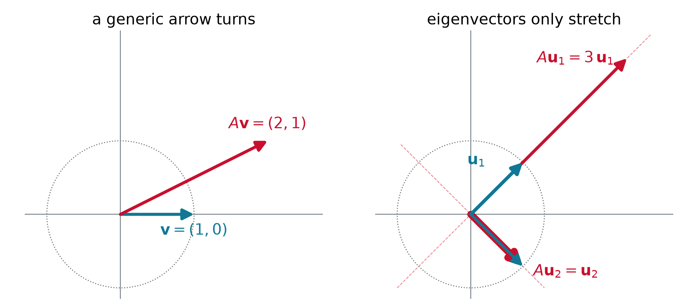
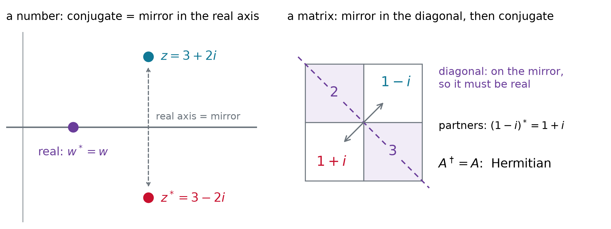
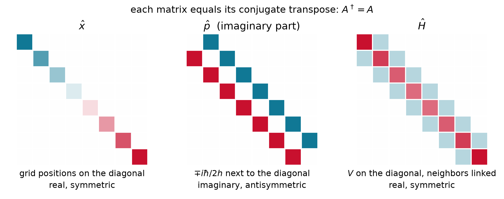
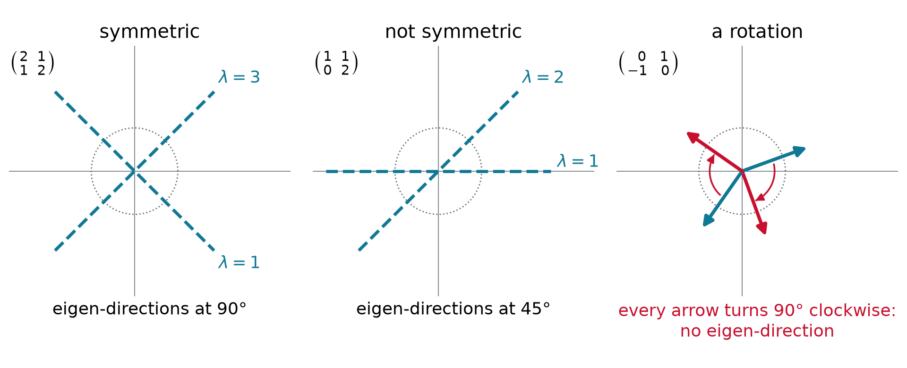
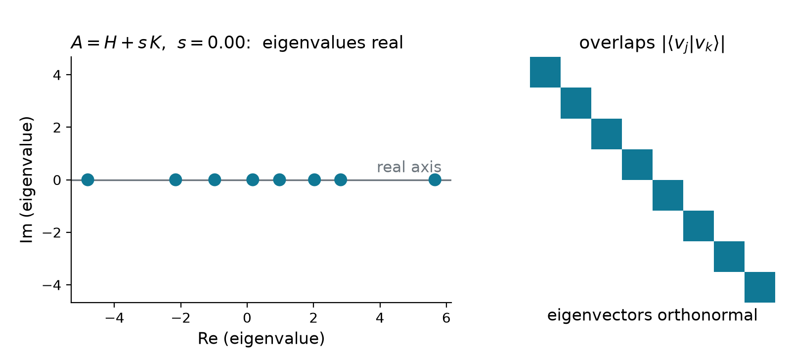
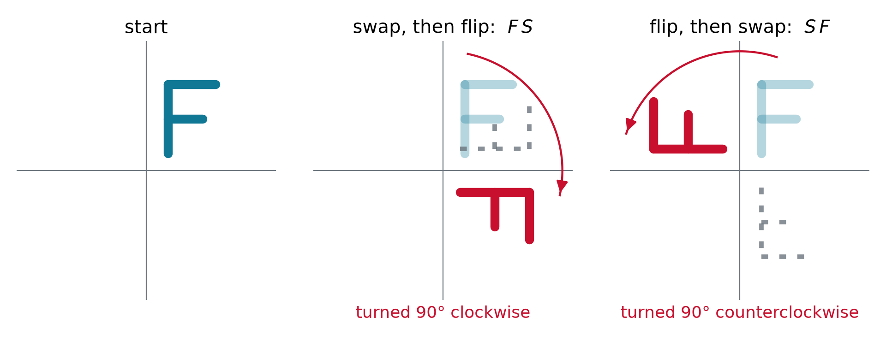
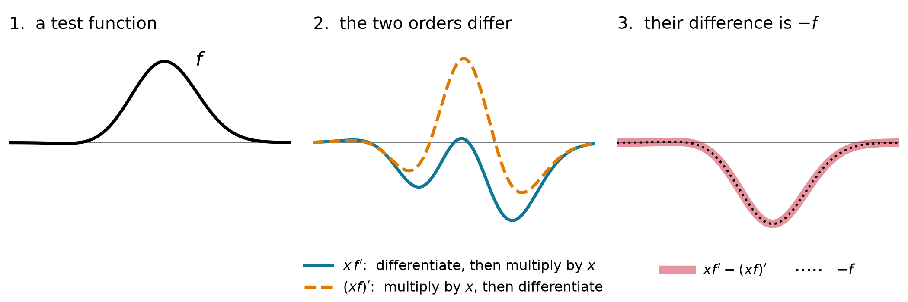

## Where we are

- **Last time:** on a grid every operator is a **matrix**, and $\hat{H}\psi = E\psi$ becomes $H\mathbf{v} = E\mathbf{v}$
- The **eigenvalues** are the values a measurement can return
- **Postulate 2:** every observable is a linear **Hermitian** operator
- **Today:** which matrices may stand for an observable? And what if two of them **do not commute**?

## A matrix turns and stretches arrows

{.nostretch width="62%" fig-align="center"}

$$
\begin{pmatrix} 2 & 1 \\ 1 & 2 \end{pmatrix}\begin{pmatrix} 1 \\ 0 \end{pmatrix} = \begin{pmatrix} 2 \\ 1 \end{pmatrix}\ \text{turned},
\qquad\qquad
\begin{pmatrix} 2 & 1 \\ 1 & 2 \end{pmatrix}\begin{pmatrix} 1 \\ 1 \end{pmatrix} = 3\begin{pmatrix} 1 \\ 1 \end{pmatrix}\ \text{only stretched}
$$

- An **eigenvector** keeps its direction, $A\mathbf{v} = \lambda\mathbf{v}$: the same shape as $\hat{A}\phi = a\phi$

## Example: eigenvalues of a 2×2 by hand

::: {.keyeq}
$$A\mathbf{v} = \lambda\mathbf{v}\ \text{ with }\ \mathbf{v} \neq 0 \qquad\Longleftrightarrow\qquad \det(A - \lambda I) = 0$$
:::

::: {.worked}
Find the eigenvalues and eigenvectors of $A = \begin{pmatrix} 2 & 1 \\ 1 & 2 \end{pmatrix}$.
:::

::: {.soln .fragment}
$$\det\begin{pmatrix} 2-\lambda & 1 \\ 1 & 2-\lambda \end{pmatrix} = (2-\lambda)^2 - 1 = 0 \quad\Longrightarrow\quad \lambda = 3,\ 1$$

$\lambda = 3$: $\mathbf{v} \propto (1, 1)$. $\ \lambda = 1$: $\mathbf{v} \propto (1, -1)$. Check: $3 + 1 = 4$ is the trace, $3 \times 1 = 3$ the determinant.
:::

## Hermitian: the matrix version of a real number

| numbers | matrices |
|:--------------------------|:--------------------------------------------|
| **conjugate** $z^*$: flip the sign of $i$ | **adjoint** $A^\dagger$: swap rows and columns, then conjugate |
| **real**: $z^* = z$ | **Hermitian**: $A^\dagger = A$ |

{.nostretch width="66%" fig-align="center"}

- Hermitian operators are the "real numbers" of quantum mechanics: their **eigenvalues are real**

## Hermitian: its own mirror image

::: {.keyeq}
$$\int \phi^*\,\big(\hat{A}\psi\big)\,dx = \int \big(\hat{A}\phi\big)^*\,\psi\,dx \qquad\Longleftrightarrow\qquad A_{jk} = A_{kj}^*$$
:::

{.nostretch width="52%" fig-align="center"}

- In Dirac notation $\langle \phi \vert \hat{A}\psi \rangle = \langle \hat{A}\phi \vert \psi \rangle$: the operator may act on **either side**

## Example: which matrices are Hermitian?

::: {.worked}
$$
A = \begin{pmatrix} 2 & 1-i \\ 1+i & 3 \end{pmatrix} \quad
B = \begin{pmatrix} 1 & 2 \\ 3 & 4 \end{pmatrix} \quad
C = \begin{pmatrix} i & 0 \\ 0 & 1 \end{pmatrix} \quad
D = \begin{pmatrix} 0 & -i \\ i & 0 \end{pmatrix}
$$
:::

::: {.soln .fragment}
- $A$: $A_{12} = 1-i = A_{21}^*$, real diagonal: **Hermitian**
- $B$: $B_{12} = 2 \neq B_{21}^* = 3$: not Hermitian
- $C$: the diagonal must be **real**, and $i \neq i^* = -i$: not Hermitian
- $D$: $D_{12} = -i = D_{21}^*$: **Hermitian**, the pattern of $\hat{p}$ on the grid
:::

## Example: real eigenvalues from the quadratic formula

::: {.worked}
Show that every Hermitian $2\times 2$ matrix $\begin{pmatrix} a & b \\ b^* & d \end{pmatrix}$, with $a$ and $d$ real, has real eigenvalues.
:::

::: {.soln .fragment}
$$(a - \lambda)(d - \lambda) - b\,b^* = 0 \qquad\Longrightarrow\qquad \lambda = \frac{a + d}{2} \pm \sqrt{\Big(\frac{a - d}{2}\Big)^2 + \lvert b\rvert^2}$$

Under the root sits a **sum of squares**, never negative, so $\lambda$ is real. Matrix $A$ above: $\lambda = \tfrac{5}{2} \pm \tfrac{3}{2} = 4$ and $1$.
:::

- The coupling $\lvert b\rvert$ pushes the two levels **apart**: bonding and antibonding orbitals

## Hermitian eigenvectors are perpendicular

{.nostretch width="80%" fig-align="center"}

- Symmetric: $(1, 1)\cdot(1, -1) = 0$, **orthogonal** eigenvectors
- Not symmetric: real eigenvalues, but the eigenvectors **overlap**. A rotation has none at all

## Live: perpendicular or not?

```{=html}
<div id="mx-live" style="width: 1100px; margin: 0 auto;"></div>
<script type="module">
  import widget from "../../widgets/matrix_arrows.mjs";
  const opts = { mode: "hunt", presets: true, fontSize: "22px" };
  widget.render({ model: { get: (k) => opts[k] }, el: document.getElementById("mx-live") });
</script>
```

## Why observables are Hermitian

{.nostretch width="64%" fig-align="center"}

- **Real eigenvalues**: measured values are real numbers
- **Orthogonal eigenvectors**: different outcomes exclude each other. Add a non-Hermitian part and both fail

## Why the eigenvalues are real, in two lines

::: {.worked}
Let $\hat{A}\phi = a\phi$ with $\langle \phi \vert \phi \rangle = 1$ and $\hat{A}$ Hermitian. Show that $a$ is real.
:::

::: {.soln}
$$\langle \phi \vert \hat{A}\phi \rangle = \langle \phi \vert a\phi \rangle = a, \qquad\qquad \langle \hat{A}\phi \vert \phi \rangle = \langle a\phi \vert \phi \rangle = a^*$$

Hermitian says the two are equal, so $a = a^*$.
:::

- The step that matters: a constant leaves a ket as it is, but leaves a bra **conjugated**

$$\langle a\phi \vert \psi \rangle = \int (a\phi)^*\,\psi\,dx = a^*\!\int \phi^*\,\psi\,dx = a^*\,\langle \phi \vert \psi \rangle$$

## Example: the derivative on two points

::: {.worked}
On two grid points $\dfrac{d}{dx} \to D_1 = \dfrac{1}{2h}\begin{pmatrix} 0 & 1 \\ -1 & 0 \end{pmatrix}$. Find the eigenvalues of $D_1$ and of $P = -i\hbar D_1$.
:::

::: {.soln .fragment}
$$
\begin{aligned}
\det(D_1 - \lambda I) &= \lambda^2 + \frac{1}{4h^2} = 0 &&\Rightarrow\quad \lambda = \pm\frac{i}{2h} \\
P = -i\hbar D_1 &= \frac{\hbar}{2h}\begin{pmatrix} 0 & -i \\ i & 0 \end{pmatrix} &&\Rightarrow\quad p = \pm\frac{\hbar}{2h}
\end{aligned}
$$

$D_1$ is the rotation of the last figure: **imaginary** eigenvalues. Times $-i\hbar$ they turn **real**; $P$ is $\tfrac{\hbar}{2h}$ times matrix $D$ above.
:::


## Example: is momentum Hermitian?

::: {.worked}
Show that $\hat{p} = -i\hbar\,d/dx$ satisfies $\int \phi^*\,(\hat{p}\psi)\,dx = \int (\hat{p}\phi)^*\,\psi\,dx$.
:::

::: {.soln .fragment}
Integrate by parts. The boundary term vanishes because physical $\phi$, $\psi$ go to zero:

$$
\begin{aligned}
\int\phi^*\big(-i\hbar\,\psi'\big)\,dx &= \Big[-i\hbar\,\phi^*\psi\Big]_{-\infty}^{\infty} + i\hbar\int\phi'^*\,\psi\,dx \\
&= 0 + \int\big(-i\hbar\,\phi'\big)^*\,\psi\,dx \quad\checkmark
\end{aligned}
$$

Without the $i$ the sign comes out wrong, $(d/dx)^\dagger = -d/dx$; the $-i$ turns it around.
:::

- **Recipe:** move the derivative to the other function by parts, then check the signs and the conjugates

## Order matters

- $\hat{A}\hat{B}\,f$ means: apply $\hat{B}$ **first**, then $\hat{A}$
- For numbers the order never matters, $3 \times 5 = 5 \times 3$. For operators it often does

::: {.keyeq}
$$[\hat{A},\hat{B}] = \hat{A}\hat{B} - \hat{B}\hat{A}$$
:::

- The **commutator** is zero exactly when the order does not matter

## Can two observables be sharp at once?

- A **sharp** value $a$ means an eigenfunction, $\hat{A}\psi = a\psi$. Sharp $a$ **and** sharp $b$ needs $\hat{B}\psi = b\psi$ too. Then

$$\hat{A}\hat{B}\,\psi = \hat{A}\,(b\psi) = ab\,\psi \qquad\qquad \hat{B}\hat{A}\,\psi = \hat{B}\,(a\psi) = ba\,\psi$$

:::: {.fragment}
::: {.keyeq}
$$\big[\hat{A},\hat{B}\big]\,\psi = \big(\hat{A}\hat{B} - \hat{B}\hat{A}\big)\,\psi = 0 \quad \text{on the shared } \psi$$
:::

- So two observables can be sharp together only if their commutator gives zero on that state
::::

## Order matters: flip and swap

{.nostretch width="58%" fig-align="center"}

$$F = \begin{pmatrix} 1 & 0 \\ 0 & -1 \end{pmatrix}, \quad S = \begin{pmatrix} 0 & 1 \\ 1 & 0 \end{pmatrix}: \qquad [F, S] = FS - SF = \begin{pmatrix} 0 & 2 \\ -2 & 0 \end{pmatrix} \neq 0$$

- Both Hermitian, **no shared eigenvector**: $F$ keeps $(1,0)$, $(0,1)$; $S$ keeps $(1,\pm 1)$. Spin along $z$, $x$ (Ch. 5)

## Example: $x$ and $d/dx$

::: {.worked}
Find $[x, d/dx]$ by acting on an arbitrary test function $f$.
:::

::: {.soln}
$$x\,\frac{df}{dx} - \frac{d}{dx}\big(xf\big) = xf' - f - xf' = -f \qquad\Longrightarrow\qquad \left[x,\frac{d}{dx}\right] = -1$$

Multiply by $-i\hbar$: $[\hat{x},\hat{p}] = i\hbar$. The product rule leaves one term, for **every** $f$.
:::

- **Recipe:** act on a test function $f$, use the product rule, then drop $f$

## Picture it: the two orders differ by $f$

{.nostretch width="76%" fig-align="center"}

::: {.keyeq}
$$\left[x,\frac{d}{dx}\right] = -1 \qquad\xrightarrow{\ \times\,(-i\hbar)\ }\qquad [\hat{x},\hat{p}] = i\hbar$$
:::

## Example: $XP - PX$ on three points

::: {.worked}
Three grid points spaced $h$ apart: $X = \operatorname{diag}(x_1, x_2, x_3)$, and $P = -i\hbar D_1$ has $P_{j,j\pm 1} = \mp\dfrac{i\hbar}{2h}$. Find $XP - PX$.
:::

::: {.soln .fragment}
Entry by entry, $(XP - PX)_{jk} = (x_j - x_k)\,P_{jk}$ with $x_j - x_{j\pm 1} = \mp h$:

$$XP - PX = \frac{i\hbar}{2}\begin{pmatrix} 0 & 1 & 0 \\ 1 & 0 & 1 \\ 0 & 1 & 0 \end{pmatrix} \qquad \text{averages the neighbors: } \approx i\hbar\,\psi$$

Its trace is $0$, not $3i\hbar$: no finite grid gives exactly $i\hbar I$.
:::

## Example: momentum and energy of a free particle

::: {.worked}
For a free particle $\hat{H} = \hat{p}^2/2m$. Is $e^{ikx}$ an eigenfunction of $\hat{p}$? Of $\hat{H}$?
:::

::: {.soln .fragment}
$$
\begin{aligned}
\hat{p}\,e^{ikx} &= -i\hbar\,(ik)\,e^{ikx} = \hbar k\,e^{ikx} \\
\hat{H}\,e^{ikx} &= \frac{1}{2m}\,\hat{p}\,\big(\hbar k\,e^{ikx}\big) = \frac{\hbar^2k^2}{2m}\,e^{ikx}
\end{aligned}
$$

Yes, both: this state has a sharp momentum **and** a sharp energy.
:::

- The two operators commute: $\hat{H}\hat{p} = \hat{p}^3/2m = \hat{p}\hat{H}$

## Commuting operators share eigenfunctions

::: {.keyeq}
$$[\hat{A},\hat{B}] = 0 \quad\Longrightarrow\quad \hat{A}\phi_n = a_n\phi_n, \quad \hat{B}\phi_n = b_n\phi_n$$
:::

**Why**, in three steps (if no other function has the same $a$):

1. Start from $\hat{A}\phi = a\phi$
2. Swap the order, allowed because they commute: $\hat{A}\big(\hat{B}\phi\big) = \hat{B}\big(\hat{A}\phi\big) = a\,\big(\hat{B}\phi\big)$
3. So $\hat{B}\phi$ also has the value $a$: it can only be $\phi$ times a number, $\hat{B}\phi = b\,\phi$

- $[\hat{x},\hat{p}]\,\psi = i\hbar\,\psi \neq 0$ for **every** $\psi$: no shared eigenfunctions, so no state has a sharp $x$ **and** a sharp $p$ (uncertainty, next lecture)

# Takeaway {.center}

> Observables are Hermitian operators, the matrix version of real numbers: equal to their own conjugate transpose, with real eigenvalues and orthogonal eigenvectors. Two observables can be sharp together only when their operators commute, and $[\hat{x},\hat{p}] = i\hbar$ says position and momentum never are.
