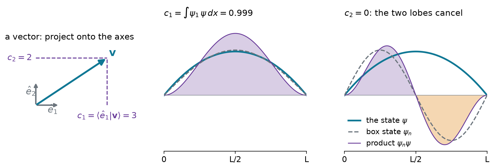
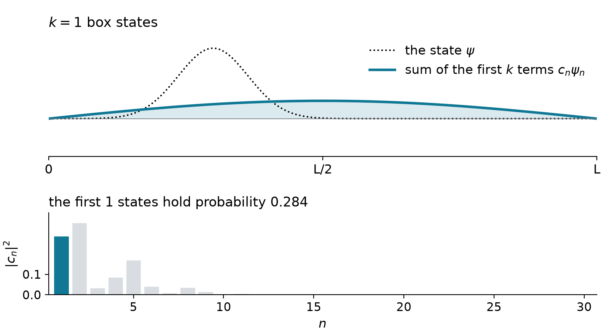
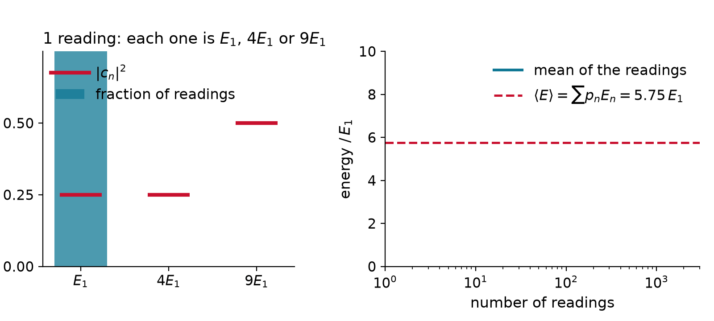
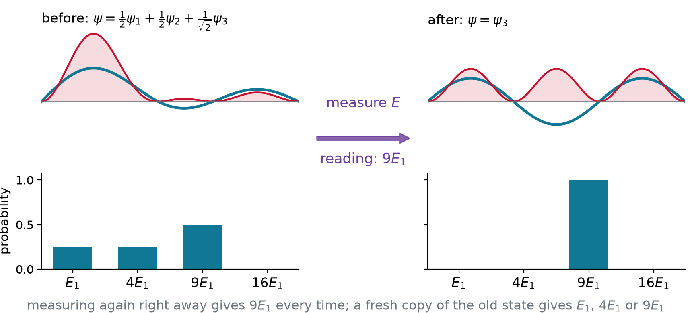
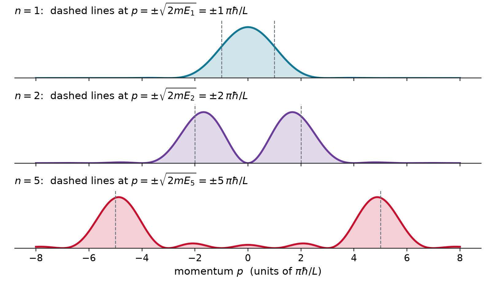
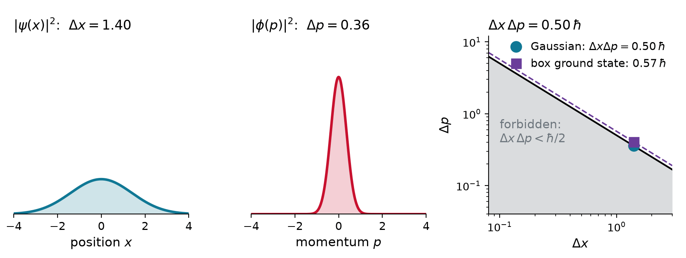

## Warm-up: components of a vector

::: {.worked}
Write $\mathbf{v} = (3, 4)$ in the tilted axes $\hat{u}_1 = \tfrac{1}{\sqrt{2}}(1, 1)$ and $\hat{u}_2 = \tfrac{1}{\sqrt{2}}(1, -1)$.
:::

::: {.soln .fragment}
Each component is a **projection** (a dot product):

$$c_1 = \hat{u}_1\cdot\mathbf{v} = \tfrac{3 + 4}{\sqrt{2}} = \tfrac{7}{\sqrt{2}}, \qquad c_2 = \hat{u}_2\cdot\mathbf{v} = \tfrac{3 - 4}{\sqrt{2}} = -\tfrac{1}{\sqrt{2}}$$

$$\mathbf{v} = c_1\hat{u}_1 + c_2\hat{u}_2, \qquad c_1^2 + c_2^2 = \tfrac{49 + 1}{2} = 25 = \lvert\mathbf{v}\rvert^2$$
:::

- Perpendicular unit axes: components are **projections**, and their squares add up to the **length** squared

## Eigenfunctions are coordinates

{.nostretch width="80%" fig-align="center"}

::: {.keyeq}
$$\psi = \sum_n c_n\,\phi_n, \qquad c_n = \langle \phi_n \vert \psi \rangle = \int \phi_n^*\,\psi\,dx$$
:::

## Three one-line derivations

All three use only **orthonormality**, $\langle \phi_m \vert \phi_n \rangle = \delta_{mn}$:

$$
\begin{aligned}
\text{coefficient:}\quad & \langle \phi_m \vert \psi \rangle = \sum_n c_n\,\langle \phi_m \vert \phi_n \rangle = c_m \\[6pt]
\text{normalization:}\quad & \langle \psi \vert \psi \rangle = \sum_m\sum_n c_m^*\,c_n\,\delta_{mn} = \sum_n \lvert c_n\rvert^2 = 1 \\[6pt]
\text{average:}\quad & \langle \psi \vert \hat{A} \vert \psi \rangle = \sum_m\sum_n c_m^*\,c_n\,a_n\,\delta_{mn} = \sum_n \lvert c_n\rvert^2\,a_n
\end{aligned}
$$

- Same as the vector: squared components add up to one, the **length** of a normalized state

## Example: how much ground state is in a parabola?

::: {.worked}
Expand $\psi = \sqrt{30/L^5}\;x(L-x)$ in box states $\psi_n = \sqrt{2/L}\,\sin(n\pi x/L)$.
:::

::: {.soln .fragment}
Two integrations by parts:

$$c_n = \int_0^L \psi_n\,\psi\,dx = \frac{8\sqrt{15}}{(n\pi)^3}\ \ (n \text{ odd}), \qquad c_n = 0\ \ (n \text{ even: odd about } L/2)$$

$$\lvert c_1\rvert^2 = \frac{960}{\pi^6} = 0.9986, \qquad \lvert c_3\rvert^2 = 0.0014, \qquad \lvert c_5\rvert^2 = 0.0001$$
:::

- A smooth, spread-out state is **almost all ground state**

## A narrow state needs many eigenstates

{.nostretch width="66%" fig-align="center"}

- Sharp features need **short wavelengths**, high $n$: about ten states for a packet $0.045\,L$ wide

## A measurement returns an eigenvalue

{.nostretch width="58%" fig-align="center"}

::: {.keyeq}
$$\text{reading } a_n \text{ with probability}\quad p_n = \lvert c_n\rvert^2 = \lvert\langle \phi_n \vert \psi \rangle\rvert^2$$
:::

## Live: measure it yourself

```{=html}
<div id="mw-live" style="width: 1080px; margin: 0 auto;"></div>
<script type="module">
  import widget from "../../widgets/measure_energy.mjs";
  const opts = { state: "example", fontSize: "22px", showMean: false };
  widget.render({ model: { get: (k) => opts[k] }, el: document.getElementById("mw-live") });
</script>
```

## Averages and spreads

::: {.keyeq}
$$\langle A \rangle = \sum_n p_n\,a_n = \langle \psi \vert \hat{A} \vert \psi \rangle$$

$$\sigma_A^2 = \sum_n p_n\,\big(a_n - \langle A \rangle\big)^2 = \langle A^2 \rangle - \langle A \rangle^2$$
:::

- $\langle A\rangle$: the **average** of many readings, usually **not** a possible reading itself
- $\sigma_A = 0$ only if all the probability sits on **one** eigenvalue: only eigenstates are **sharp**

## Example: readings, average, spread

::: {.worked}
$\psi = \tfrac{1}{2}\psi_1 + \tfrac{1}{2}\psi_2 + \tfrac{1}{\sqrt{2}}\psi_3$ in a box. What can an energy measurement give, how often, and what are $\langle E\rangle$ and $\sigma_E$?
:::

::: {.soln .fragment}
$$E_1,\ 4E_1,\ 9E_1 \quad\text{with}\quad p = \tfrac{1}{4},\ \tfrac{1}{4},\ \tfrac{1}{2}$$

$$\langle E \rangle = \tfrac{1}{4}(1) + \tfrac{1}{4}(4) + \tfrac{1}{2}(9) = 5.75\,E_1$$

$$\langle E^2 \rangle = \tfrac{1}{4}(1) + \tfrac{1}{4}(16) + \tfrac{1}{2}(81) = 44.75\,E_1^2$$

$$\sigma_E = \sqrt{44.75 - 5.75^2}\;E_1 = 3.42\,E_1$$
:::

## After the measurement

{.nostretch width="70%" fig-align="center"}

- A reading of $a_n$ leaves the state $\phi_n$ (**collapse**): measure again, get $a_n$ every time
- The probabilities live in **many identical copies**, not in one particle

## A box state has no sharp momentum

{.nostretch width="52%" fig-align="center"}

- $\sin kx$ is half $e^{ikx}$ (moving right), half $e^{-ikx}$ (moving left); the walls broaden each hump
- **Sharp** $E$, **spread** $p$: in the box $\hat{H}$ and $\hat{p}$ do not share eigenfunctions

## The uncertainty principle

{.nostretch width="76%" fig-align="center"}

::: {.keyeq}
$$\sigma_A\,\sigma_B \geq \tfrac{1}{2}\big\lvert\langle[\hat{A},\hat{B}]\rangle\big\rvert \qquad\Longrightarrow\qquad \sigma_x\,\sigma_p \geq \hbar/2$$
:::

## Example: $\sigma_x\sigma_p$ for the box ground state

::: {.worked}
For $\psi_1 = \sqrt{2/L}\,\sin(\pi x/L)$, find $\sigma_x$, $\sigma_p$ and their product.
:::

::: {.soln .fragment}
$$\langle x\rangle = \tfrac{L}{2}, \quad \langle x^2\rangle = L^2\left(\tfrac{1}{3} - \tfrac{1}{2\pi^2}\right) \;\Rightarrow\; \sigma_x = 0.181\,L$$

$$\langle p\rangle = 0, \quad \langle p^2\rangle = 2mE_1 = \left(\tfrac{\pi\hbar}{L}\right)^2 \;\Rightarrow\; \sigma_p = \tfrac{\pi\hbar}{L}$$

$$\sigma_x\,\sigma_p = 0.181\,\pi\,\hbar = 0.568\,\hbar \;\geq\; 0.5\,\hbar$$
:::

- Independent of $L$: squeeze the box and $\sigma_p$ grows, so **confinement costs energy** ($\propto 1/L^2$)

# Takeaway {.center}

> Expand the state in the eigenfunctions of the observable: the coefficients are projections, $c_n = \langle \phi_n \vert \psi \rangle$. A measurement returns one eigenvalue $a_n$, with probability $\lvert c_n\rvert^2$, and leaves the system in $\phi_n$. Averages are weighted sums, $\langle A\rangle = \sum_n \lvert c_n\rvert^2 a_n$, sharp only in eigenstates; and observables that do not commute cannot be sharp together, $\sigma_x\sigma_p \geq \hbar/2$.
