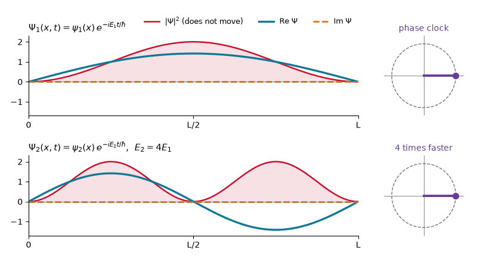
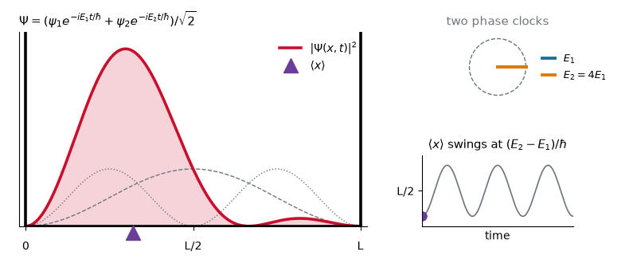
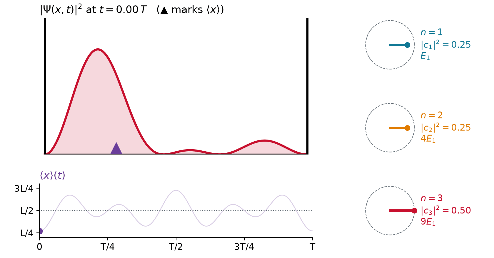
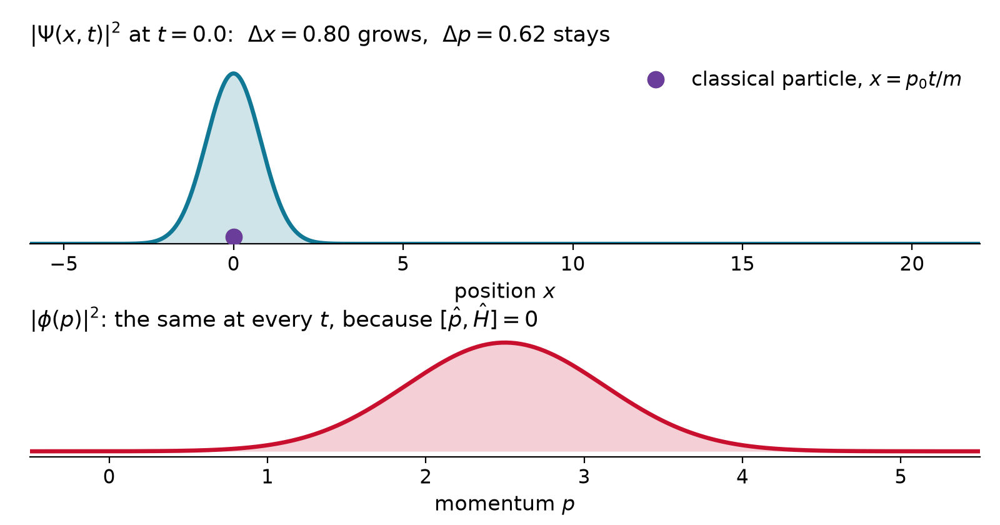
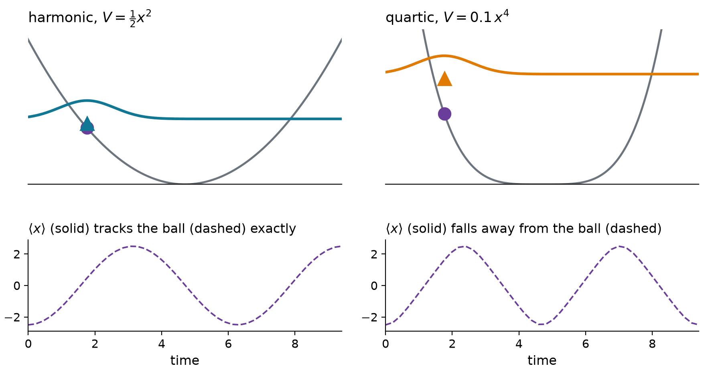
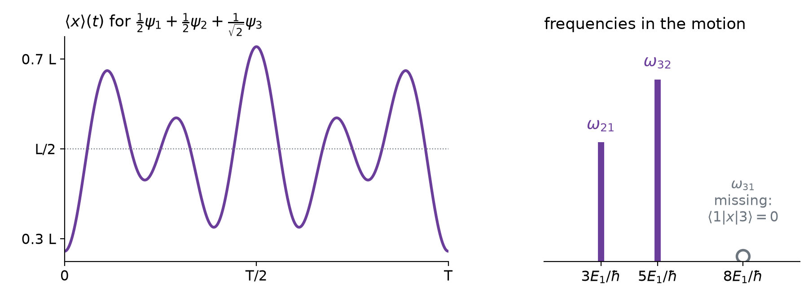
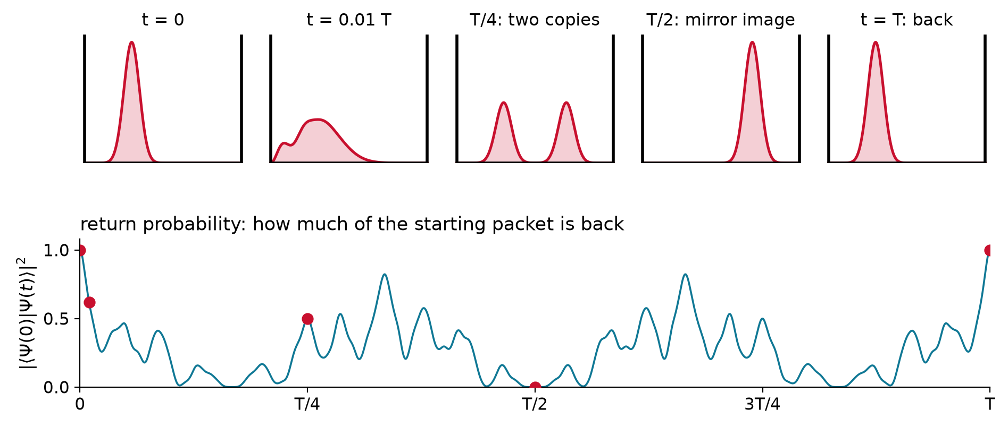
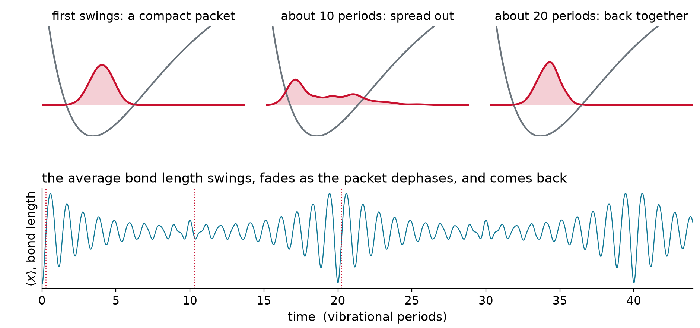

## One stationary state: only the phase turns

{.nostretch width="62%" fig-align="center"}

$$\Psi_n(x,t) = \psi_n(x)\,e^{-iE_nt/\hbar} \qquad\Longrightarrow\qquad \lvert\Psi_n\rvert^2 = \lvert\psi_n\rvert^2 \ \text{ never moves}$$

## Two states: the density sloshes

{.nostretch width="58%" fig-align="center"}

$$\lvert\Psi\rvert^2 = \tfrac{1}{2}\big(\psi_1^2 + \psi_2^2\big) + \psi_1\psi_2\cos\omega t, \qquad \omega = \frac{E_2 - E_1}{\hbar}$$

- Each term keeps **its own clock**; the **cross term** carries the difference of the two phases

## One recipe for all motion

::: {.keyeq}
$$\Psi(x,0) = \sum_n c_n\,\psi_n(x) \quad\Longrightarrow\quad \Psi(x,t) = \sum_n c_n\,e^{-iE_nt/\hbar}\,\psi_n(x)$$
:::

1. **Expand** the starting state in energy eigenstates: $c_n = \langle \psi_n \vert \Psi(0) \rangle$
2. **Attach** to each the phase of its own clock, $e^{-iE_nt/\hbar}$
3. **Add up**

- Works because the equation is **linear** and the eigenstates are a **complete** basis

## Example: does the recipe solve the equation?

::: {.worked}
Show that $\Psi(x,t) = \sum_n c_n\,e^{-iE_nt/\hbar}\,\psi_n(x)$ satisfies $i\hbar\,\partial\Psi/\partial t = \hat{H}\Psi$.
:::

::: {.soln .fragment}
$$i\hbar\,\frac{\partial\Psi}{\partial t} = \sum_n c_n\,i\hbar\left(-\frac{iE_n}{\hbar}\right)e^{-iE_nt/\hbar}\,\psi_n = \sum_n c_n\,E_n\,e^{-iE_nt/\hbar}\,\psi_n$$

$$\hat{H}\Psi = \sum_n c_n\,e^{-iE_nt/\hbar}\,\hat{H}\psi_n = \sum_n c_n\,E_n\,e^{-iE_nt/\hbar}\,\psi_n \quad\checkmark$$

Term by term, using $\hat{H}\psi_n = E_n\psi_n$. At $t = 0$ every phase is 1.
:::

## Three clocks

{.nostretch width="66%" fig-align="center"}

- Hand **lengths** $\lvert c_n\rvert$ fixed; the **angles** between hands make the motion

## Three lines of numpy

::: {style="font-size: 1.25em"}
```python
x = np.linspace(-10, 10, 600); h = x[1] - x[0]
H = -0.5 * D2 + np.diag(0.5 * x**2)            # spring: hbar = m = omega = 1
E, phi = np.linalg.eigh(H); phi /= np.sqrt(h)  # 1. diagonalize once
c = phi.T @ psi0 * h                           # 2. expand a packet released at x = 3
psi_t = phi @ (c * np.exp(-1j * E * t))        # 3. attach the phases, add up
```
:::

- $\langle x\rangle = +3.000,\ +0.004,\ -3.000$ at $t = 0,\ \pi/2,\ \pi$: exactly $3\cos t$, a classical spring
- The **norm** stays $1.000000$ at every $t$

## What never changes

$$\lvert c_n\,e^{-iE_nt/\hbar}\rvert^2 = \lvert c_n\rvert^2 \qquad\Longrightarrow\qquad \text{energy probabilities, } \langle E\rangle,\ \sigma_E \text{ frozen}$$

$$\langle \Psi(t) \vert \Psi(t) \rangle = \sum_m\sum_n c_m^*\,c_n\,e^{i(E_m - E_n)t/\hbar}\,\delta_{mn} = \sum_n \lvert c_n\rvert^2 = 1$$

- $e^{-i\hat{H}t/\hbar}$ is **unitary**: it rotates the state vector, never stretches it
- Only the **relative phases** change, and all motion comes from them

## How an average changes

Product rule, then $\partial_t\lvert\Psi\rangle = \hat{H}\lvert\Psi\rangle/i\hbar$ and $\partial_t\langle\Psi\rvert = -\langle\Psi\rvert\hat{H}/i\hbar$:

$$\frac{d}{dt}\langle\Psi\vert\hat{A}\vert\Psi\rangle = -\frac{1}{i\hbar}\langle\Psi\vert\hat{H}\hat{A}\vert\Psi\rangle + \frac{1}{i\hbar}\langle\Psi\vert\hat{A}\hat{H}\vert\Psi\rangle$$

::: {.keyeq}
$$\frac{d}{dt}\langle A\rangle = \frac{i}{\hbar}\,\big\langle[\hat{H},\hat{A}]\big\rangle \qquad (\hat{A} \text{ not explicitly time dependent})$$
:::

- Commutes with $\hat{H}$: a **constant of motion**

## Constants of motion

| observable | $[\hat{H}, \cdot\,]$ with $\hat{H} = \hat{p}^2/2m + V$ | conserved when |
|:--|:--|:--|
| energy $\hat{H}$ | $0$ | always |
| momentum $\hat{p}$ | $i\hbar\,dV/dx$ | no force |
| parity $\hat{\Pi}$ | $0$ if $V(-x) = V(x)$ | symmetric potential |
| position $\hat{x}$ | $-i\hbar\,\hat{p}/m$ | only while $\langle p\rangle = 0$ |

- The commutators of Lecture 3.5b now say **what moves** and **what stays**

## Free particle: $x$ spreads, $p$ stays

{.nostretch width="66%" fig-align="center"}

- $[\hat{p},\hat{H}] = 0$: every momentum probability is frozen, while the position spreads

## Ehrenfest: averages obey Newton

::: {.keyeq}
$$\frac{d\langle x\rangle}{dt} = \frac{\langle p\rangle}{m} \qquad\qquad \frac{d\langle p\rangle}{dt} = -\Big\langle\frac{dV}{dx}\Big\rangle$$
:::

- The force is **averaged over the packet**: the same as at its center only if it is **linear** in $x$

{.nostretch width="46%" fig-align="center"}

## Example: a packet in a uniform field

::: {.worked}
For $V = mgx$, find $\langle x\rangle(t)$ for a packet released at rest from $x_0$.
:::

::: {.soln .fragment}
$$-\frac{dV}{dx} = -mg \ \text{everywhere} \quad\Longrightarrow\quad \frac{d\langle p\rangle}{dt} = -mg, \qquad \frac{d\langle x\rangle}{dt} = \frac{\langle p\rangle}{m}$$

$$\langle x\rangle(t) = x_0 - \tfrac{1}{2}\,g\,t^2$$

The center falls like a stone, whatever the shape. The width still spreads, as for a free packet.
:::

## Motion holds only energy differences

$$\langle x\rangle(t) = \sum_n \lvert c_n\rvert^2 x_{nn} + \sum_{n\neq m} c_m^*\,c_n\,x_{mn}\,e^{-i(E_n - E_m)t/\hbar}, \qquad x_{mn} = \langle\psi_m\vert\hat{x}\vert\psi_n\rangle$$

{.nostretch width="58%" fig-align="center"}

- **Bohr frequencies** $(E_n - E_m)/\hbar$: the light a sloshing charge absorbs and emits

## Example: which frequencies are in the motion?

::: {.worked}
$\frac{1}{2}\psi_1 + \frac{1}{2}\psi_2 + \frac{1}{\sqrt{2}}\psi_3$ in a box: which of $\omega_{21}$, $\omega_{32}$, $\omega_{31}$ appear in $\langle x\rangle(t)$?
:::

::: {.soln .fragment}
About the center, $\psi_1$ and $\psi_3$ are **even**, $x - L/2$ is **odd**:

$$x_{13} = \tfrac{L}{2}\int\psi_1\psi_3\,dx + \int\psi_1\big(x - \tfrac{L}{2}\big)\psi_3\,dx = 0 + 0$$

$\omega_{21} = 3E_1/\hbar$ and $\omega_{32} = 5E_1/\hbar$ appear; $\omega_{31} = 8E_1/\hbar$ does not. A **selection rule**.
:::

## Revivals

{.nostretch width="48%" fig-align="center"}

::: {.keyeq}
$$T_{\text{rev}} = \frac{2\pi\hbar}{E_1} = \frac{4mL^2}{\pi\hbar}$$
:::

- $E_n = n^2E_1$: every phase $e^{-in^2E_1t/\hbar}$ returns to 1 at the **same** moment

## Example: revival in a 1 nm box

::: {.worked}
How long does an electron in a box 1 nm long take to rebuild any starting state?
:::

::: {.soln .fragment}
$$T_{\text{rev}} = \frac{4\,(9.109\times10^{-31}\ \text{kg})\,(10^{-9}\ \text{m})^2}{\pi\,(1.055\times10^{-34}\ \text{J s})} = 1.1\times10^{-14}\ \text{s} = 11\ \text{fs}$$

Twice the box, four times slower: $T_{\text{rev}} \propto L^2$.
:::

## Watching a bond vibrate

{.nostretch width="66%" fig-align="center"}

- A laser pulse makes a **packet** of vibrational states: the bond swings. **Femtochemistry**, Zewail, Nobel 1999. I₂: about 300 fs
- **Anharmonic** levels: the clocks drift apart (**dephasing**), then realign (**revival**)

## The postulates, all together

| | postulate | in equations |
|:-:|:------------------------------|:----------------------|
| 1 | the state is a normalized wavefunction | $\langle \psi \vert \psi \rangle = 1$ |
| 2 | observables are linear Hermitian operators | $\hat{A} = \hat{A}^\dagger$, $\hat{A}\phi_n = a_n\phi_n$ |
| 3 | a reading is an eigenvalue; the state becomes its eigenfunction | $a_n$, then $\psi \to \phi_n$ |
| 4 | probabilities and averages | $p_n = \lvert\langle \phi_n \vert \psi \rangle\rvert^2$, $\langle A\rangle = \langle \psi \vert \hat{A} \vert \psi \rangle$ |
| 5 | evolution by the Schrödinger equation | $\Psi(t) = \sum_n c_n e^{-iE_nt/\hbar}\psi_n$ |

- The rest of the course applies these five rules to new potentials $V(x)$

# Takeaway {.center}

> Diagonalize $\hat{H}$ once, and any state's future follows: expand, attach to each eigenstate its phase $e^{-iE_nt/\hbar}$, add up. The energy probabilities and the norm never change; the relative phases make all the motion, at the Bohr frequencies $(E_n - E_m)/\hbar$ that spectroscopy measures. Averages obey Newton's laws, exactly so in a harmonic well, and observables that commute with $\hat{H}$ are conserved.
