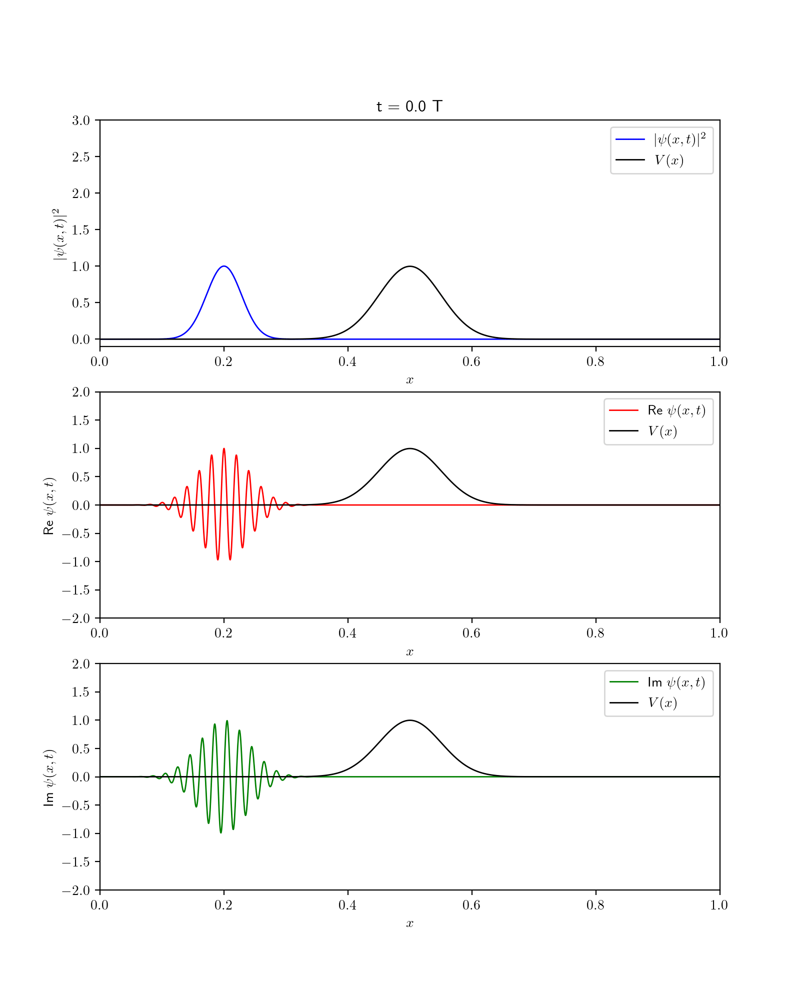
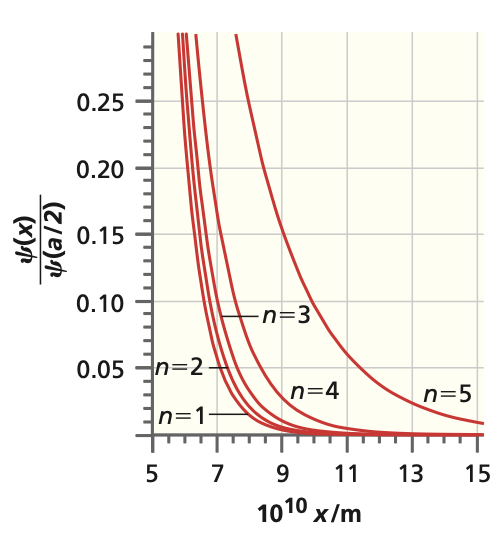

## How states evolve in time

The **time-dependent Schrödinger equation** governs all quantum dynamics:

$$ i\hbar\frac{\partial}{\partial t}\mid \psi \rangle =\hat{H}\mid\psi(t)\rangle $$

::: {.fragment}
So far we have studied states that **do not appear to move**. Why?
:::

## Stationary states carry a phase

A pure eigenstate of $\hat{H}$ evolves only by a complex **phase factor**:

$$\psi_n(x,t) = \psi_n(x)\, e^{-\frac{i}{\hbar}E_n t}$$

::: {.fragment}
- Spatial shape $\psi_n(x)$ is **fixed**
- Only the phase $e^{-iE_n t/\hbar}$ turns
:::

## Why the probability is stationary

The phase has **unit magnitude**, so it cancels in $|\psi|^2$:

$$\mid \psi_n(x,t) \mid^2 = \psi_n^*(x)\psi_n(x)\, e^{-\frac{i}{\hbar}E_n t} e^{+\frac{i}{\hbar}E_n t} = \mid \psi_n(x) \mid^2$$

::: {.fragment}
**Definite energy** $\Rightarrow$ **time-independent** probability distribution.
:::

## Expectation values freeze too

For any operator $\hat{A}$ the phases also cancel:

$$\langle A \rangle = \int \psi_n^*(x) e^{+\frac{i}{\hbar}E_n t} \hat{A}\, \psi_n(x) e^{-\frac{i}{\hbar}E_n t}\, dx = \int \psi_n^*(x) \hat{A}\, \psi_n(x)\, dx$$

::: {.fragment}
Nothing observable changes in a **single eigenstate**.
:::

## Superpositions bring time back

Start with a superposition at $t=0$:

$$\mid \psi(0) \rangle = c_1\mid 1 \rangle + c_2 \mid 2 \rangle$$

::: {.fragment}
Each piece picks up **its own** phase:

$$\mid \psi(t) \rangle = c_1 e^{-\frac{i}{\hbar}E_1 t}\mid 1 \rangle + c_2 e^{-\frac{i}{\hbar}E_2 t}\mid 2 \rangle$$
:::

## Coefficients move, basis stays fixed

$$\mid \psi(t) \rangle = c_1(t)\mid 1\rangle+c_2(t) \mid 2 \rangle$$

::: {.fragment}
- The eigenstates are **fixed, orthogonal** directions
- The **coefficients** $c_n(t)$ rotate the state vector through them
:::

::: {.fragment}
General case:

$$\mid \psi(t)\rangle = \sum_n c_n e^{-\frac{i}{\hbar}E_n t} \mid n\rangle$$
:::

## Interference makes probabilities oscillate

Different energies $\Rightarrow$ phases turn at **different rates**.

::: {.fragment}
- Relative phase $e^{-\frac{i}{\hbar}(E_k - E_n)t}$ drives **interference**
- Drives **oscillations** between states in two-level systems
- The engine of all **quantum dynamics**
:::

## What stays constant: normalization

Orthogonality kills the cross terms, so the norm is **conserved**:

$$\langle \psi(t) \mid \psi(t)\rangle = \sum_n \sum_k c^*_n c_k\, e^{-\frac{i}{\hbar}(E_k - E_n)t} \delta_{kn} = \sum_n \mid c_n \mid^2 = 1$$

::: {.fragment}
The particle is always **somewhere**.
:::

## Constants of motion

Time derivative of any expectation value:

$$\frac{\partial}{\partial t}\langle A \rangle = \frac{1}{i\hbar} \langle \psi \mid [\hat{A}, \hat{H}] \mid \psi \rangle + \langle \psi \mid \frac{\partial \hat{A}}{\partial t} \mid \psi \rangle$$

::: {.fragment}
- **Commutes** with $\hat{H}$ and no explicit $t$ $\Rightarrow$ **conserved**
- Energy commutes with itself $\Rightarrow$ $\dfrac{\partial}{\partial t}\langle E \rangle = 0$
:::

## Quantum dynamics, visualized

:::: {.columns}

::: {.column width="50%"}
{width="90%"}
:::

::: {.column width="50%"}
{width="90%"}
:::

::::

::: {.fragment}
Superposition of energies $\Rightarrow$ **motion** you can watch.
:::

# Takeaway {.center}

> A single eigenstate only spins its phase, so nothing observable moves; superpose different energies and their phases beat against each other, and quantum dynamics comes alive.
