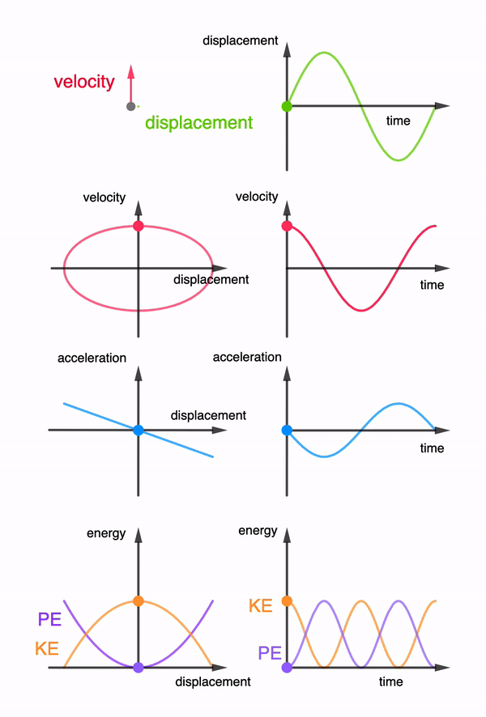
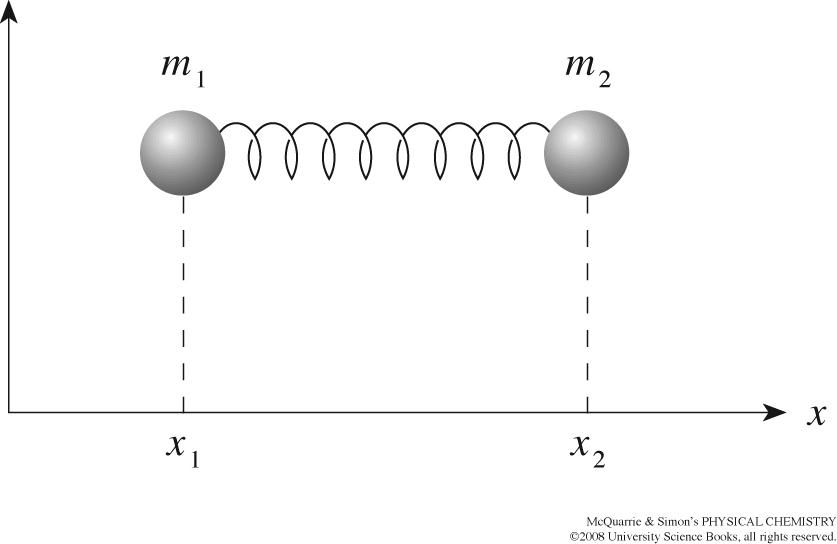

## A molecule is four motions at once

:::: {.columns}
::: {.column width="50%"}
{width="95%"}
:::
::: {.column width="50%"}
- **Translation**: the molecule flies
- **Rotation**: it tumbles
- **Vibration**: bonds stretch and bend
- **Electronic**: electrons rearrange
:::
::::

## Each motion has its own energy ladder

:::: {.columns}
::: {.column width="45%"}
{width="95%"}
:::
::: {.column width="55%"}
$$E= \epsilon_{trans}+ \epsilon_{rot}+ \epsilon_{vib}+\epsilon_{elec}$$

- Level spacings differ by **orders of magnitude**
- That is why **different spectroscopies** exist: microwave for rotation, infrared for vibration, UV-Vis for electrons
:::
::::

## Separating the Hamiltonian

- Born-Oppenheimer separates nuclei from electrons, leaving

$$\hat{H} = \hat{H}_{tr} + \hat{H}_{rot} + \hat{H}_{vib}$$

- Separation means the wavefunction **factorizes**:

::: {.fragment}
$$\psi = \psi_{tr}\,\psi_{rot}\,\psi_{vib}$$
:::

- One hard problem becomes **three toy models**: particle in a box, rigid rotor, harmonic oscillator

## Counting the coordinates

- $N$ nuclei carry $3N$ coordinates
- **Translation** always takes 3
- **Rotation** takes 3, or only 2 for a **linear** molecule
- **Vibrations** get the rest: $3N-6$ (nonlinear) or $3N-5$ (linear)

::: {.fragment}
| molecule | $3N$ | trans | rot | vib |
|---|---|---|---|---|
| H$_2$O | 9 | 3 | 3 | **3** |
| CO$_2$ | 9 | 3 | 2 | **4** |
| benzene | 36 | 3 | 3 | **30** |
:::

## The classical harmonic oscillator

:::: {.columns}
::: {.column width="50%"}
{width="95%"}
:::
::: {.column width="50%"}
- Bead on a spring: displacement $x$ meets a **restoring force**

$$F=-kx$$

- **Hooke's law**; $k$ is the spring stiffness
:::
::::

## Solving the motion {auto-animate=true}

$$m \ddot x+kx = 0$$

## Solving the motion {auto-animate=true}

$$m \ddot x+kx = 0 \quad\Longrightarrow\quad \ddot{x}+\omega^2 x =0, \qquad \omega=\sqrt{\frac{k}{m}}$$

::: {.nonincremental}
- Stiffer spring: **faster** oscillation; heavier mass: **slower**
:::

::: {.fragment}
$$x(t)= A \sin(\omega t+\phi)$$
:::

::: {.fragment}
Amplitude $A$ and phase $\phi$ come from **initial conditions**
:::

## Energy sloshes but is conserved

:::: {.columns}
::: {.column width="40%"}
{width="90%"}
:::
::: {.column width="60%"}
$$V(x) = \frac{kx^2}{2}, \qquad E=\frac{p^2}{2m} + \frac{kx^2}{2}$$

- Kinetic and potential energy **interconvert** at frequency $\omega$
- This total energy becomes the quantum **Hamiltonian** next lecture
:::
::::

## A diatomic is one bead in disguise

:::: {.columns}
::: {.column width="40%"}
{width="90%"}
:::
::: {.column width="60%"}
- Two masses, one spring: the center of mass **moves freely**
- Relative coordinate obeys the one-bead equation with the **reduced mass**

$$\mu=\frac{m_1 m_2}{m_1+m_2}, \qquad \omega = \sqrt{\frac{k}{\mu}}$$
:::
::::

## Why harmonic? Taylor says so

:::: {.columns}
::: {.column width="45%"}
{width="95%"}
:::
::: {.column width="55%"}
$$U(x) = \frac{1}{2}k(x-x_0)^2+\frac{\gamma}{3!}(x-x_0)^3+...$$

- Near any minimum the **quadratic term dominates**
- $k = U''(x_0)$: curvature of the true potential
- Higher terms are the **anharmonicity**
:::
::::

# Takeaway {.center}

> Molecular motion separates into translation, rotation, vibration, and electronic parts, with $3N-6$ (or $3N-5$) vibrations. Each vibration is classically a harmonic oscillator: $\ddot{x} = -\omega^2 x$, $\omega = \sqrt{k/\mu}$, $E = \frac{p^2}{2\mu} + \frac{kx^2}{2}$, valid because every smooth potential is a parabola near its minimum.
