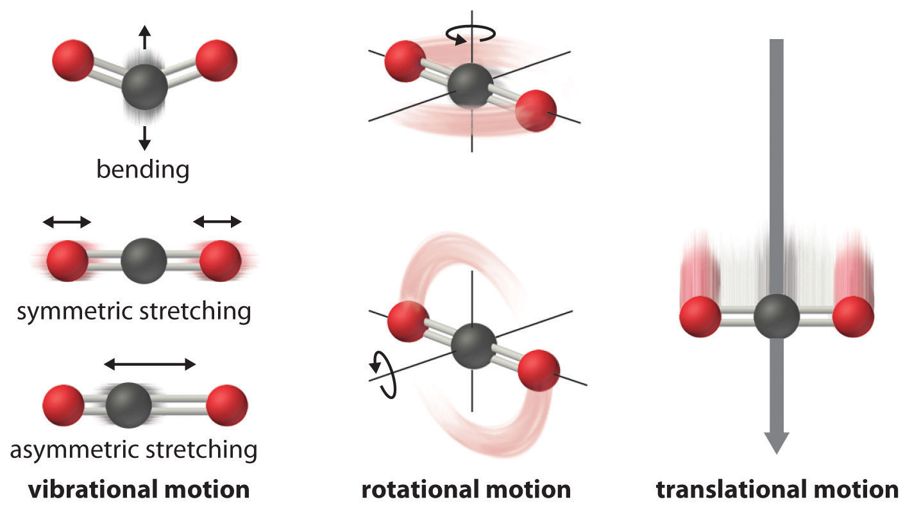
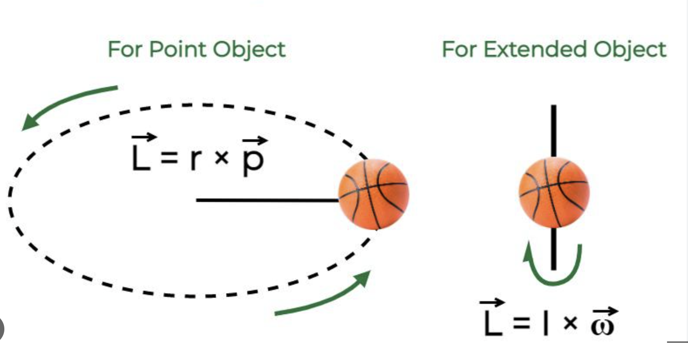

## Where we are headed

Bound systems have **quantized** energy.

::: {.fragment}
Next: how each kind of motion is quantized, and how **spectroscopy** probes it.
:::

::: {.fragment}
Toy models map onto real motions:

- **Particle in a box** → translation
- **Harmonic oscillator** → vibration
- **Rigid rotor** → rotation
:::

## Four kinds of molecular motion

:::: {.columns}

::: {.column width="50%"}

:::

::: {.column width="50%"}
A molecule's energy splits into independent pieces:

$$E = \epsilon_{trans} + \epsilon_{rot} + \epsilon_{vib} + \epsilon_{elec}$$

::: {.fragment}
Each kind of motion is **quantized differently**.
:::
:::

::::

## Different spacings, different spectroscopy

:::: {.columns}

::: {.column width="45%"}

:::

::: {.column width="55%"}
::: {.fragment}
Boundary conditions set the **level spacing**.
:::

::: {.fragment}
Electronic ≫ vibrational ≫ rotational ≫ translational.
:::

::: {.fragment}
Each scale → its **own spectroscopy**.
:::
:::

::::

## Counting: 3N nuclear coordinates

:::: {.columns}

::: {.column width="50%"}

:::

::: {.column width="50%"}
$N$ nuclei, each with $x, y, z$:

$$3N \text{ total degrees of freedom}$$

::: {.fragment}
**Born–Oppenheimer**: separate nuclei from electrons.
:::

::: {.fragment}
$$\hat{H} = \sum_{i=1}^{N} -\frac{\hbar^2}{2m_i}\nabla_{R_i}^2 + E(R_1,\dots,R_N)$$
:::
:::

::::

## Splitting the Hamiltonian

The nuclear motion separates into three parts:

$$\hat{H} = \hat{H}_{tr} + \hat{H}_{rot} + \hat{H}_{vib}$$

::: {.fragment}
- $\hat{H}_{tr}$, $\hat{H}_{rot}$: **no potential**
- $\hat{H}_{vib}$: carries the potential $E$ between nuclei
:::

::: {.fragment}
Separation lets the wavefunction **factorize**:

$$\psi = \psi_{tr}\,\psi_{rot}\,\psi_{vib}$$
:::

## Three Schrödinger equations

$$\hat{H}_{tr}\psi_{tr} = E_{tr}\psi_{tr}$$

$$\hat{H}_{rot}\psi_{rot} = E_{rot}\psi_{rot}$$

$$\hat{H}_{vib}\psi_{vib} = E_{vib}\psi_{vib}$$

::: {.fragment}
**Translation**: no boundary condition → continuous spectrum.
:::

::: {.fragment}
**Rotation** (cyclic boundary) and **vibration** (potential $E$) → **quantized**.
:::

## Bookkeeping the degrees of freedom

Start with $3N$, then subtract:

::: {.fragment}
- **Translation**: always $3$ → leaves $3N - 3$
:::

::: {.fragment}
- **Rotation**: $3$ nonlinear, $2$ linear
:::

::: {.fragment}
- **Vibration**: whatever remains
  - Nonlinear: $3N - 6$
  - Linear: $3N - 5$
:::

## At a glance

|              | Translation | Rotation | Vibration |
|--------------|:-----------:|:--------:|:---------:|
| **Linear**   | 3           | 2        | $3N-5$    |
| **Nonlinear**| 3           | 3        | $3N-6$    |

::: {.fragment}
Linear molecules have **one fewer** rotation, so **one more** vibration.
:::

# Takeaway {.center}

> A molecule has $3N$ degrees of freedom: $3$ translation, $2$ or $3$ rotation, the rest ($3N-5$ or $3N-6$) vibration. Born–Oppenheimer separation factorizes the motion, and boundary conditions decide which parts are quantized and how spectroscopy probes them.
