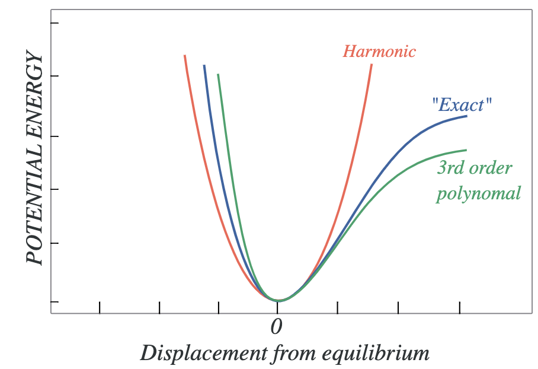
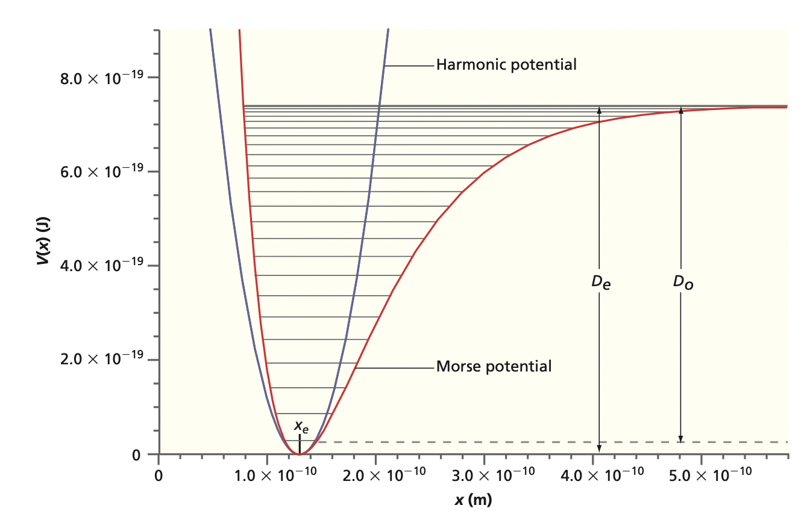

## Why the Harmonic Oscillator?

- Near equilibrium, **any** bond is a spring.

::: {.fragment}
:::: {.columns}
::: {.column width="55%"}
- Molecular **vibrations** are quantized.
- Foundation for **IR and Raman** spectroscopy.
- First place we meet **zero-point energy** and **tunneling**.
:::
::: {.column width="45%"}

:::
::::
:::

## The Schrodinger Equation

- Classical Hamiltonian: kinetic plus a quadratic well.

::: {.fragment}
$$\hat{H} = -\frac{\hbar^2}{2\mu}\frac{d^2}{dx^2} + \frac{1}{2}kx^2$$
:::

::: {.fragment}
$$\hat{H}\psi_v(x) = E_v\,\psi_v(x)$$
:::

- **Spring constant** $k$, **angular frequency** $\omega = \sqrt{k/\mu}$.

## Quantized Energies

::: {.fragment}
$$E_v = \left(v + \tfrac{1}{2}\right)\hbar\omega, \qquad v = 0,1,2,\dots$$
:::

- Levels are **evenly spaced** by $\hbar\omega$.
- The integer $v$ is the **vibrational quantum number**.
- Energy never goes to zero, even in the lowest state.

## Zero-Point Energy

::: {.fragment}
$$E_0 = \tfrac{1}{2}\hbar\omega \neq 0$$
:::

- The oscillator **cannot sit still** at the bottom of the well.
- A consequence of the **uncertainty principle**: pinning $x$ would blow up $p$.
- Atoms keep moving even at **absolute zero**.

## The Wavefunctions

::: {.fragment}
$$\psi_v(x) = N_v\,H_v\!\left(\sqrt{\alpha}\,x\right)e^{-\alpha x^2/2}$$
:::

- **Hermite polynomial** $H_v$ times a **Gaussian** envelope.
- Scaling $\alpha = \sqrt{k\mu/\hbar^2}$, normalization $N_v = \dfrac{1}{\sqrt{2^v v!}}\left(\dfrac{\alpha}{\pi}\right)^{1/4}$.

## The Gaussian Ground State

::: {.fragment}
$$\psi_0(x) = \left(\frac{\alpha}{\pi}\right)^{1/4} e^{-\alpha x^2/2}$$
:::

- **No nodes**, a single peak at the bottom of the well.
- A pure **Gaussian**: the minimum-uncertainty state.
- First excited state gains one node: $\psi_1(x) \propto x\,e^{-\alpha x^2/2}$.

## Hermite Polynomials

| $v$ | $H_v(y)$ |
|---|---|
| 0 | $1$ |
| 1 | $2y$ |
| 2 | $4y^2 - 2$ |
| 3 | $8y^3 - 12y$ |

- Each added quantum number adds **one node**.
- They are **orthogonal** with weight $e^{-y^2}$.

## Even / Odd Parity

- Even $v = 0,2,4,\dots$: $\psi_v(-x) = \psi_v(x)$.
- Odd $v = 1,3,5,\dots$: $\psi_v(-x) = -\psi_v(x)$.

::: {.fragment}
$$\langle x \rangle = 0, \qquad \langle p \rangle = 0$$
:::

- Symmetry **kills** odd integrals, so spreads survive: $\langle x^2\rangle, \langle p^2\rangle \neq 0$.

## Tunneling

- Wavefunction tails **leak past** the classical turning points.

- Finite probability in the **classically forbidden region** where $E < V$.
- Strictly impossible in classical mechanics.

- At **high** $v$, probability piles up near the edges, approaching the classical result.

## Beyond Harmonic: Anharmonicity

:::: {.columns}
::: {.column width="50%"}

:::
::: {.column width="50%"}
- Real bonds **dissociate**, the well is not a perfect parabola.
- Levels **bunch up** toward $D_e$.
- Harmonic model is only the **near-equilibrium** limit.
:::
::::

# Takeaway {.center}

> The quantum oscillator has **evenly spaced** levels $E_v = \hbar\omega(v+\tfrac{1}{2})$ with an irreducible **zero-point energy** $\tfrac{1}{2}\hbar\omega$. Its states are **Hermite polynomials times a Gaussian**, with definite **parity** and tails that **tunnel** into the forbidden region.
