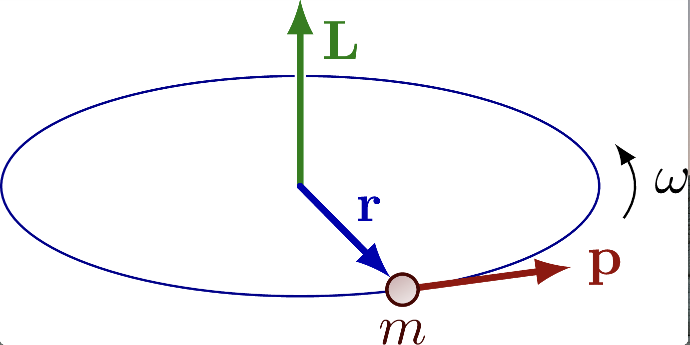
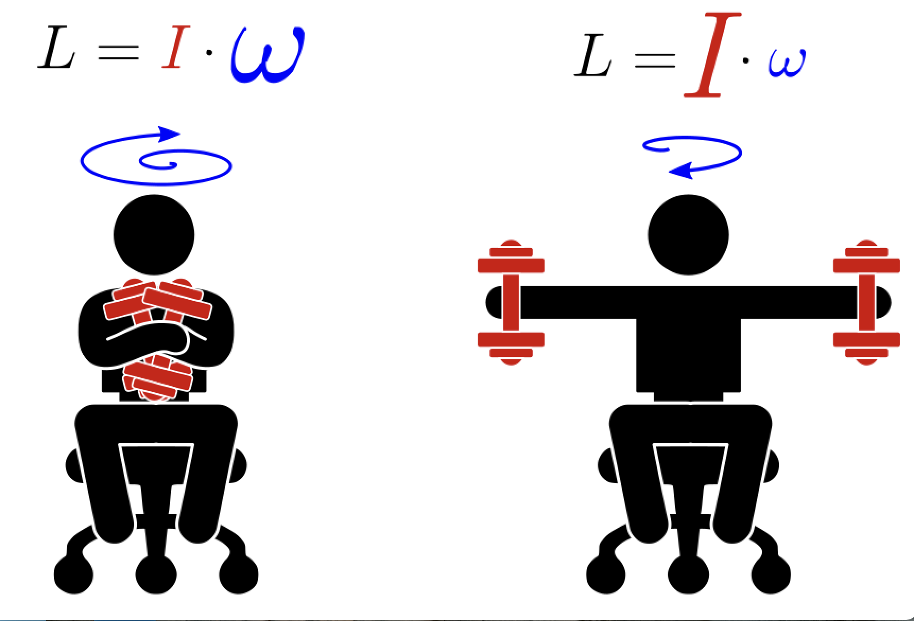
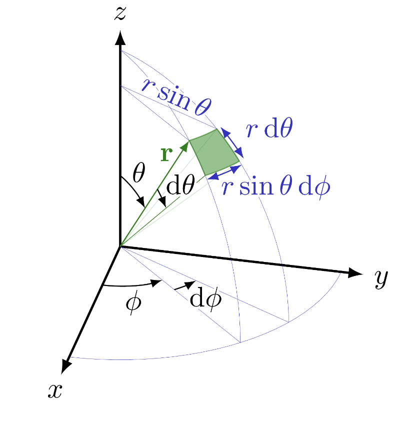
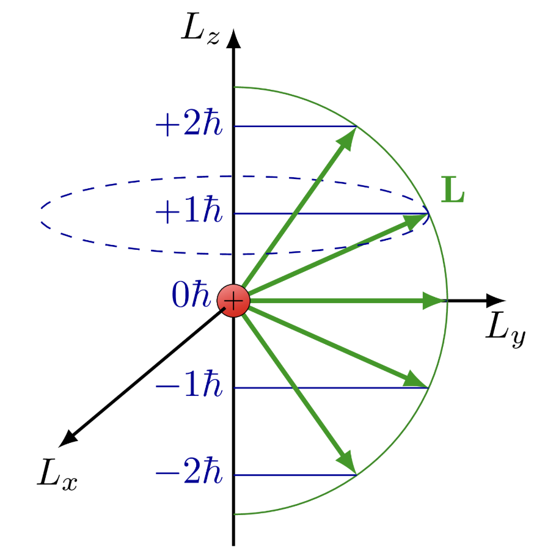
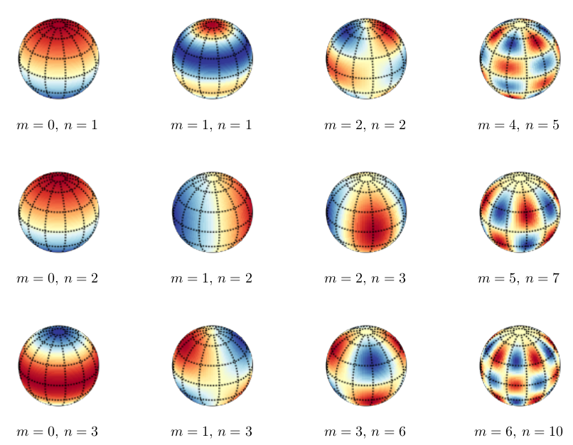

## Why angular momentum?

- **Rotation** is to angular momentum what **straight-line motion** is to linear momentum.

::: {.fragment}
- Central to **atomic structure** and any system with **rotational symmetry**.
:::

::: {.fragment}
- In QM it is a **vector operator**, like $\vec{p}$.
:::

::: {.fragment}
- Key twist: its three components **do not commute**.
:::

## Conservation from symmetry

:::: {.columns}

::: {.column width="55%"}
**Noether's theorem**

> Every continuous symmetry of the laws of physics corresponds to a conserved quantity.

::: {.fragment}
- Translation $\to$ **momentum**
- Rotation $\to$ **angular momentum**
- Time shift $\to$ **energy**
:::
:::

::: {.column width="45%"}
{width="60%"}
:::

::::

## Classical definition

:::: {.columns}

::: {.column width="55%"}
$$\vec{L}=\vec{r}\times\vec{p}$$

::: {.fragment}
- A **vector**: direction by the **right-hand rule**.
:::

::: {.fragment}
- Components:
$$L_x = yp_z - zp_y$$
$$L_y = zp_x - xp_z$$
$$L_z = xp_y - yp_x$$
:::
:::

::: {.column width="45%"}
{width="85%"}
:::

::::

## Conservation in action

:::: {.columns}

::: {.column width="50%"}
- **No external torque** $\Rightarrow$ $\vec{L}$ **conserved**.

::: {.fragment}
- Rotational energy:
$$E_\text{rot}=\frac{L^2}{2I}$$
:::

::: {.fragment}
- Pull mass inward $\to$ smaller $I$ $\to$ **faster spin**.
:::
:::

::: {.column width="50%"}
{width="80%"}
:::

::::

## Spherical coordinates

:::: {.columns}

::: {.column width="50%"}
- Natural choice for rotation: $(r,\theta,\phi)$.

::: {.fragment}
- Fixed orbit $r=\text{const}$ removes the **radial** degree of freedom.
:::

::: {.fragment}
$$x=r\sin\theta\cos\phi$$
$$y=r\sin\theta\sin\phi$$
$$z=r\cos\theta$$
:::
:::

::: {.column width="50%"}
{width="85%"}
:::

::::

## Quantum operators

- Promote classical $\vec{L}$ to operators, e.g.

$$\hat{L}_z = -i\hbar\frac{\partial}{\partial\phi}$$

::: {.fragment}
- Eigenvalue problem $\hat{L}_z f = a f$ gives
$$f(\phi)=e^{im\phi},\qquad a=\hbar m$$
:::

::: {.fragment}
- The **$z$-axis is a choice** (often set by an external field).
:::

## Components do not commute

$$\left[\hat{L}_x,\hat{L}_y\right]=i\hbar\hat{L}_z,\;\left[\hat{L}_y,\hat{L}_z\right]=i\hbar\hat{L}_x,\;\left[\hat{L}_z,\hat{L}_x\right]=i\hbar\hat{L}_y$$

::: {.fragment}
$$\left[\hat{L}_x,\vec{\hat{L}}^2\right]=\left[\hat{L}_y,\vec{\hat{L}}^2\right]=\left[\hat{L}_z,\vec{\hat{L}}^2\right]=0$$
:::

::: {.fragment}
- Only $\vec{\hat{L}}^2$ **and one component** are knowable **simultaneously**.
:::

::: {.fragment}
- Note the **cyclic** pattern $x\to y\to z\to x$.
:::

## Quantized eigenvalues

- Shared eigenfunctions $Y_l^m(\theta,\phi)$:

$$\hat{L}^2 Y_l^m = \hbar^2 l(l+1)\, Y_l^m$$
$$\hat{L}_z Y_l^m = \hbar m\, Y_l^m$$

::: {.fragment}
- **Magnitude** quantized: $L^2 \to \hbar^2 l(l+1)$.
- **Projection** quantized: $L_z \to m\hbar$.
:::

::: {.fragment}
- $l=0,1,2,\dots$ and $|m|\le l$, giving $2l+1$ values of $m$.
:::

## A vector on a cone

:::: {.columns}

::: {.column width="50%"}
- Fixed length $\sqrt{l(l+1)}\,\hbar$.

::: {.fragment}
- Only **$2l+1$ projections** onto $z$.
:::

::: {.fragment}
- $\vec{L}$ never points exactly along $z$: $L_x, L_y$ stay **uncertain**.
:::
:::

::: {.column width="50%"}
{width="90%"}
:::

::::

## Spherical harmonics

:::: {.columns}

::: {.column width="50%"}
- $Y_l^m(\theta,\phi)$ or $|l,m\rangle$: the **angular wavefunctions**.

::: {.fragment}
- **Orthonormal**: $\langle l',m'|l,m\rangle=\delta_{ll'}\delta_{mm'}$.
:::

::: {.fragment}
- **Total nodes** $= l$ (polar bands from $l$, longitude lines from $|m|$).
:::
:::

::: {.column width="50%"}
{width="95%"}
:::

::::

# Takeaway {.center}

> Angular momentum is a **vector operator** with **quantized** magnitude $L^2\to\hbar^2 l(l+1)$ and projection $L_z\to m\hbar$. Its components **do not commute**, so only $\vec{L}^2$ and one component are simultaneously sharp, and the **spherical harmonics** $Y_l^m$ are their shared eigenfunctions.
