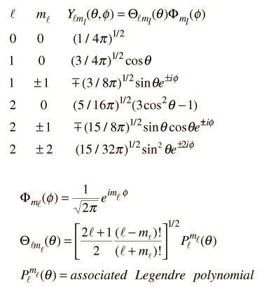
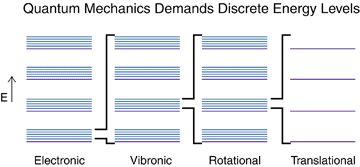
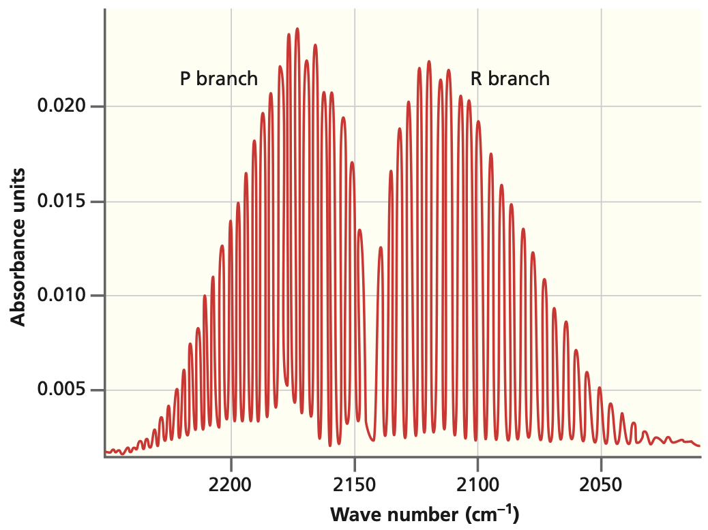
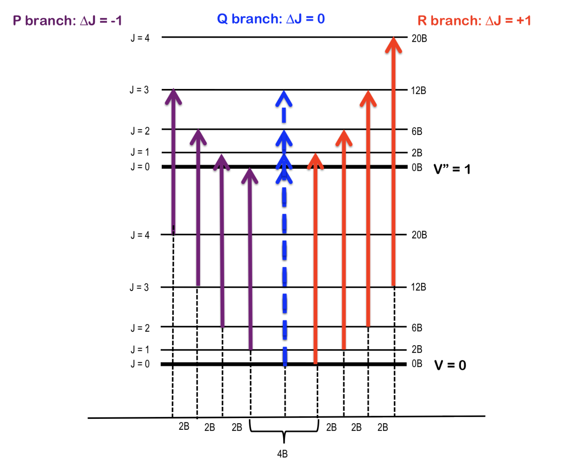

## The model

:::: {.columns}

::: {.column width="55%"}
- A mass $\mu$ rotating at **fixed radius** $r$
- No potential: pure rotational **kinetic energy**
- Use **spherical coordinates** to exploit the symmetry
::: {.fragment}
- Hamiltonian becomes angular momentum:
$$\hat{H}=\frac{\hat{L}^2}{2I}$$
:::
:::

::: {.column width="45%"}

:::

::::

## Two angles, two quantum numbers

::: {.fragment}
Eigenfunctions are the **spherical harmonics** $Y(\theta,\phi)$:
$$\hat{H}\,Y(\theta,\phi)=E_{J,m}\,Y(\theta,\phi)$$
:::

- $J$ quantizes total angular momentum
- $M_J$ quantizes its projection
- Quantization comes from the **cyclic boundary condition** $\Phi(0)=\Phi(2\pi)$

## Rotational energy levels

::: {.fragment}
$$E_J = \frac{\hbar^2}{2I}J(J+1) = B\,J(J+1)$$
:::

::: {.fragment}
**Rotational constant** (units of energy):
$$B = \frac{h^2}{8\pi^2 I}$$
:::

- Energy depends **only on $J$**
- **No zero-point energy**: $J=0$ is allowed

## Degeneracy and the moment of inertia

:::: {.columns}

::: {.column width="50%"}
::: {.fragment}
Each level is **$(2J+1)$-fold degenerate** (the allowed $M_J$)
:::
::: {.fragment}
For a diatomic:
$$I = \mu r^2$$
:::
- Bigger $I$ $\Rightarrow$ smaller $B$ $\Rightarrow$ closer levels
:::

::: {.column width="50%"}

:::

::::

## Selection rules

::: {.fragment}
The molecule must have a **permanent dipole moment**:
$$\langle J' | \mu | J'' \rangle \neq 0$$
:::

::: {.fragment}
Only adjacent levels connect:
$$\boxed{\Delta J = \pm 1}$$
:::

- Derived from the **recursion relations** of spherical harmonics

## Evenly spaced lines

::: {.fragment}
Line positions ($\Delta J = +1$):
$$\tilde{\nu}_J = 2\tilde{B}(J+1)$$
:::

::: {.fragment}
Take one more difference:
$$\tilde{\nu}_{J+1} - \tilde{\nu}_J = 2\tilde{B}$$
:::

- Successive lines at $2\tilde{B},\,4\tilde{B},\,6\tilde{B},\dots$
- **Equal spacing** is the fingerprint of the rigid rotor

## Reading the spacing

:::: {.columns}

::: {.column width="55%"}
- Measure line spacing $\Rightarrow$ get $\tilde{B}$
- $\tilde{B}\Rightarrow I\Rightarrow$ **bond length** $r$
- Different **isotopes** shift the lines
- Intensities follow the **Boltzmann** populations $g_J\,e^{-E_J/k_BT}$
:::

::: {.column width="45%"}

:::

::::

## Rotation rides on vibration

:::: {.columns}

::: {.column width="50%"}
::: {.fragment}
Combine rotor and oscillator:
$$\tilde{E}_{v,J} = \tilde{\omega}(v+\tfrac12) + \tilde{B}J(J+1)$$
:::
- **R branch** ($\Delta J=+1$): high side of $\tilde{\omega}$
- **P branch** ($\Delta J=-1$): low side
- **Q branch** ($\Delta J=0$) is **forbidden**
:::

::: {.column width="50%"}

:::

::::

## Where the model breaks

::: {.fragment}
- **Rovibrational coupling**: $B$ shrinks with $v$
$$B_v = B_e - \alpha_e(v+\tfrac12)$$
:::

::: {.fragment}
- **Centrifugal distortion**: fast rotation stretches the bond
$$\tilde{E}_r(J) = \tilde{B}J(J+1) - \tilde{D}J^2(J+1)^2$$
:::

- Both crowd the levels at large $J$

# Takeaway {.center}

> Rotational energies $E_J = B\,J(J+1)$ are $(2J+1)$-fold degenerate. With $\Delta J=\pm 1$ this gives **evenly spaced microwave lines** separated by $2\tilde{B}$, and the spacing reveals the bond length through $I=\mu r^2$.
