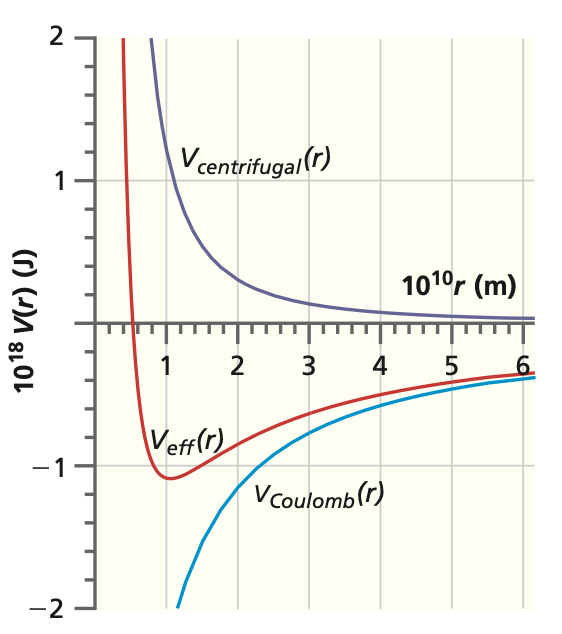
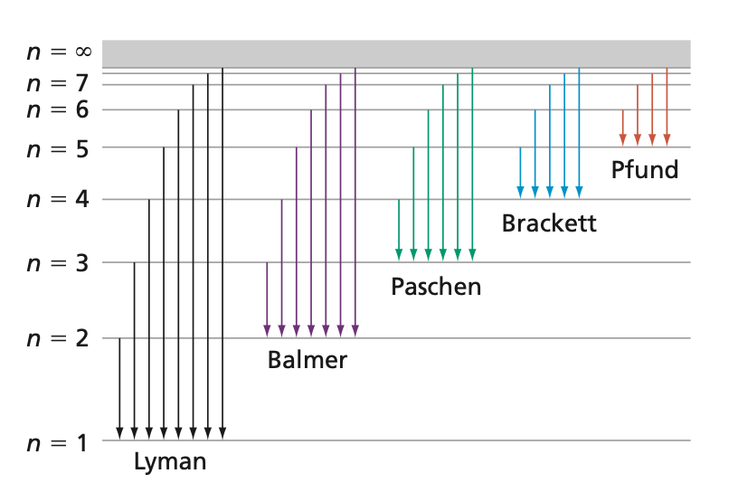

## The Simplest Atom We Can Solve

- One electron, one nucleus of charge $Ze$: **H**, $\text{He}^+$, $\text{Li}^{2+}$.

- The **only** atom solved **exactly**: add even one electron and electron-electron repulsion breaks it.

- The Coulomb pull is **isotropic**: it depends only on distance $r$.

- That **symmetry** is the source of the **degeneracies** we will find.

## The Schrodinger Equation

- Kinetic energy plus one **Coulomb** attraction term.

::: {.fragment}
$$\left[ -\frac{\hbar^2}{2m_e}\nabla^2 - \frac{Ze^2}{4\pi\epsilon_0 r}\right]\psi(r,\theta,\phi) = E\psi(r,\theta,\phi)$$
:::

- Since the potential depends **only on $r$**, work in **spherical coordinates**.
- Electron mass $m_e$ replaces the reduced mass (the nucleus is far heavier).

## Separation of Variables

- The Laplacian splits into a **radial** and an **angular** piece via $\hat{L}^2$.

::: {.fragment}
$$\psi_{n,l,m}(r,\theta,\phi) = R_{nl}(r)\,Y_l^m(\theta,\phi)$$
:::

- **Angular part** is already solved: spherical harmonics $Y_l^m$.
- **Radial part** $R_{nl}(r)$ is the new piece to find.

::: {.fragment}
$$\hat{L}^2 Y_l^m = \hbar^2 l(l+1)\, Y_l^m$$
:::

## The Effective Radial Potential

:::: {.columns}
::: {.column width="50%"}

:::
::: {.column width="50%"}
$$V_{eff} = -\frac{Ze^2}{4\pi\epsilon_0 r} + \frac{l(l+1)\hbar^2}{2m_e r^2}$$

- Coulomb **attraction** plus a **centrifugal** barrier.

- For $l > 0$ the barrier pushes the electron **farther** from the nucleus.
:::
::::

## Radial Wavefunctions

::: {.fragment}
$$R_{nl}(r) = \rho^l\, e^{-\rho/2}\, L_{n-l-1}^{2l+1}(\rho)$$
:::

- **Laguerre polynomial** times a decaying exponential.
- Bohr radius sets the length scale: $a_0 = \dfrac{4\pi\epsilon_0\hbar^2}{m_e e^2}$.
- Scaled distance: $\rho = \dfrac{2Zr}{n a_0}$.

- Example, the **1s** orbital: $R_{10}(r) = 2\left(\dfrac{Z}{a_0}\right)^{3/2} e^{-\rho/2}$.

## The Full Solution

:::: {.columns}
::: {.column width="50%"}

:::
::: {.column width="50%"}
$$\psi_{n,l,m_l} = N_{nl}\,R_{nl}(r)\,Y_{l,m_l}(\theta,\phi)$$

::: {.fragment}
$$E_n = -\frac{m_e e^4}{8\varepsilon_0^2 h^2}\cdot\frac{1}{n^2}$$
:::

- Three quantum numbers in $\psi$, but **energy depends only on $n$**.
:::
::::

## Degeneracy from Symmetry

- All states of a given $n$ share the **same energy**.

- For $n = 2$: the $2s$ and the three $2p$ states are **degenerate**.

- Counting spin, the total degeneracy of level $n$ is $2n^2$.

- This **accidental degeneracy** is special to the $1/r$ Coulomb potential.

## Quantum Numbers

::: {.fragment}
$$n = 1, 2, 3, \dots$$
$$l = 0, 1, 2, \dots, n-1$$
$$m = 0, \pm 1, \pm 2, \dots, \pm l$$
$$m_s = \pm 1/2$$
:::

- $n$ sets the **energy**, $l$ the **shape**, $m$ the **orientation**.
- Letters for $l$: $s, p, d, f, \dots$ for $l = 0, 1, 2, 3, \dots$

## The Hydrogen Spectrum

:::: {.columns}
::: {.column width="50%"}

:::
::: {.column width="50%"}
$$\Delta\tilde{v} = R_H Z^2\left(\frac{1}{n_1^2} - \frac{1}{n_2^2}\right)$$

- **Lyman** ($n_1 = 1$), **Balmer** ($n_1 = 2$), **Paschen** ($n_1 = 3$).

- Balmer lines are the **visible** emission of hydrogen.
:::
::::

## Ionization Energy

- Removing the ground-state electron means $n_1 = 1$, $n_2 \to \infty$.

::: {.fragment}
$$E_i = R_H Z^2\left(\frac{1}{1^2} - \frac{1}{\infty}\right)$$
:::

- For hydrogen: $109678~\text{cm}^{-1} = 13.6057~\text{eV}$.

- Larger nuclear charge $Z$ means **tighter binding**.

# Takeaway {.center}

> The hydrogenlike atom separates into a **radial** function $R_{nl}$ and a **spherical harmonic** $Y_l^m$. Its energy $E_n \propto -Z^2/n^2$ depends **only on $n$**, so each level carries a $2n^2$-fold **degeneracy** that traces directly to the **spherical symmetry** of the Coulomb potential.
