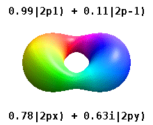

## What Is an Orbital?

- A **one-electron wavefunction** is called an **orbital**.
- For the hydrogen atom it is an **atomic orbital (AO)**, exact for H-like atoms.

::: {.fragment}
$$\psi_{n\ell m_\ell}(r,\theta,\phi) = R_{n\ell}(r)\,Y_{\ell m_\ell}(\theta,\phi)$$
:::

::: {.fragment}
- Splits cleanly into a **radial** part and an **angular** part.
:::

## Three Quantum Numbers

::: {.fragment}
- **Principal:** $n = 1, 2, 3, \ldots$
:::

::: {.fragment}
- **Orbital angular momentum:** $\ell = 0, 1, 2, \ldots, n-1$
:::

::: {.fragment}
- **Magnetic:** $m_\ell = -\ell, -\ell+1, \ldots, \ell$
:::

::: {.fragment}
- Each valid triple labels **one** orbital.
:::

## Where Is the Electron?

- Probability over the full 3D volume:

::: {.fragment}
$$|\psi|^2 dV = \big|R_{n\ell}(r)\big|^2 \cdot \big|Y_{\ell m_\ell}(\theta,\phi)\big|^2 \cdot r^2\sin\theta \, dr \, d\theta \, d\phi$$
:::

::: {.fragment}
- The $r^2$ factor reshapes the radial picture.
:::

## Radial Probability

:::: {.columns}
::: {.column width="50%"}
{width="100%"}
:::
::: {.column width="50%"}
$$P_r(r) = r^2\big|R_{n\ell}(r)\big|^2$$

::: {.fragment}
- Peaks mark the **most probable distance** from the nucleus.
:::

::: {.fragment}
- For the $1s$ orbital the peak sits at the **Bohr radius** $a_0$.
:::
:::
::::

## How Far Out?

- Average distance grows with $n$:

::: {.fragment}
$$\langle r\rangle_{nl} = \frac{n^2 a_0}{Z}\left\{ 1 + \frac{1}{2}\left[ 1 - \frac{l(l+1)}{n^2}\right]\right\}$$
:::

::: {.fragment}
- Larger $n$: electron **moves outward**.
- Larger $Z$: electron **pulled inward**.
:::

::: {.fragment}
- Expectation value $\langle r\rangle$ is **not** the most probable $r$.
:::

## Counting Nodes

::: {.fragment}
- **Radial** nodes: $n - \ell - 1$
:::

::: {.fragment}
- **Angular** nodes: $\ell$
:::

::: {.fragment}
- **Total** nodes: $n - 1$
:::

::: {.fragment}
- More nodes mean more **curvature** and higher energy.
:::

## Angular Shapes

:::: {.columns}
::: {.column width="50%"}
{width="100%"}
:::
::: {.column width="50%"}
$$P_\Omega(\theta,\phi) = \big|Y_{\ell m_\ell}(\theta,\phi)\big|^2$$

::: {.fragment}
- $s$ orbitals ($\ell = 0$) are **isotropic**: $P_\Omega = \tfrac{1}{4\pi}$.
:::

::: {.fragment}
- $p, d, \ldots$ have **angular nodes** that carve the lobes.
:::
:::
::::

## Real vs Complex Orbitals

:::: {.columns}
::: {.column width="50%"}
{width="100%"}
:::
::: {.column width="50%"}
- Degenerate $\ell > 0$ states allow **free recombination**.

::: {.fragment}
$$p_x \propto \sin\theta\cos\phi \propto x$$
$$p_y \propto \sin\theta\sin\phi \propto y$$
$$p_z = p_0$$
:::

::: {.fragment}
- Same density, **different frame**.
:::
:::
::::

## Pointing the Lobes

- Combining $p_x, p_y, p_z$ aims a lobe in **any direction**.
- Five degenerate $d$ orbitals follow the same recipe:

::: {.fragment}
$$d_{x^2 - y^2} = \tfrac{1}{\sqrt{2}}\left(d_{+2} + d_{-2}\right), \quad d_{xy} = -\tfrac{i}{\sqrt{2}}\left( d_{+2} - d_{-2}\right)$$
$$d_{xz} = -\tfrac{1}{\sqrt{2}}\left( d_{+1} - d_{-1}\right), \quad d_{yz} = \tfrac{i}{\sqrt{2}}\left( d_{+1} + d_{-1}\right)$$
$$d_{z^2} = d_0$$
:::

## Putting It Together

{width="78%"}

::: {.fragment}
- Cross sections of $|\psi_{n\ell m}|^2$: **radial reach** times **angular shape**.
:::

# Takeaway {.center}

> An atomic orbital factors as $\psi = R_{n\ell}(r)\,Y_{\ell m_\ell}(\theta,\phi)$, labeled by $n$, $\ell$, $m_\ell$. The radial part sets **how far** ($n - \ell - 1$ nodes) and the angular part sets the **shape** ($\ell$ nodes), for $n - 1$ nodes in all.
