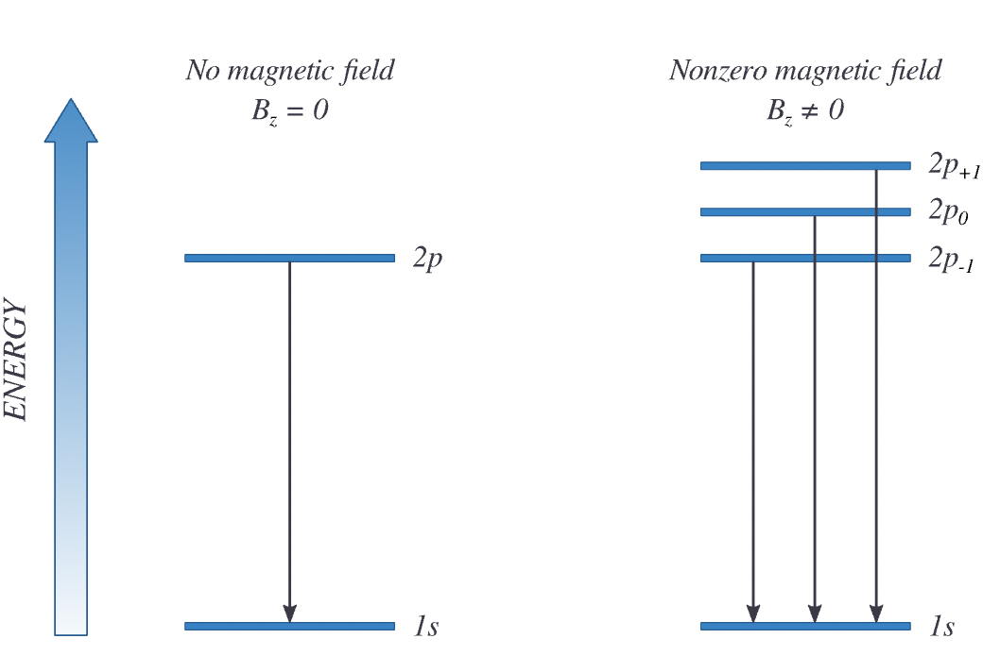
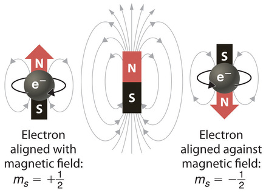

## Moving Charge Makes a Magnet

- A charge circulating around the nucleus generates a **magnetic moment**.

::: {.fragment}
$$\vec{\mu} = \gamma_e \vec{L}, \qquad \mu_z = -\mu_B m_l$$
:::

::: {.fragment}
- **Bohr magneton** $\mu_B = \dfrac{e\hbar}{2m_e}$ sets the scale.
- Only electrons with $l > 0$ carry an orbital magnetic moment.
:::

## Atoms in a Magnetic Field

- Add the field-interaction term to the Hamiltonian:

::: {.fragment}
$$\hat{H} = \hat{H}_0 + \frac{eB}{2m_e}\hat{L}_z$$
:::

::: {.fragment}
- $\hat{L}_z$ **commutes** with $\hat{H}_0$, so they share eigenstates.
- The field only **shifts** each level by its $m_l$.
:::

## The Orbital Zeeman Effect

:::: {.columns}
::: {.column width="50%"}
{width="100%"}
:::
::: {.column width="50%"}
$$E_{nlm} = E_n + \mu_B m_l B$$

::: {.fragment}
- Field **splits** the $(2l+1)$ degenerate levels.
- The $2p$ level fans into **three** lines: $-\mu_B B,\ 0,\ +\mu_B B$.
:::
:::
::::

## A Surprise: Spin

- Stern-Gerlach split a beam into **two** spots, not an odd number.

::: {.fragment}
- Electrons carry an **intrinsic** angular momentum: **spin**.
- Not literal spinning, an intrinsic property like **mass** and **charge**.
:::

::: {.fragment}
- The Schrodinger equation misses it; spin comes from the **Dirac equation**.
:::

## Spin as a Tiny Magnet

:::: {.columns}
::: {.column width="50%"}
{width="100%"}
:::
::: {.column width="50%"}
- Every particle carries a **permanent magnetic moment**.
- Add spin as a new quantum number $s$, like $l$.

::: {.fragment}
- Allowed projections: $2s + 1$.
- Experiment shows only **two**, so $s = \tfrac{1}{2}$.
:::
:::
::::

## The Two Spin States

::: {.fragment}
$$S = \frac{\sqrt{3}}{2}\hbar, \qquad S_z = \pm\frac{1}{2}\hbar$$
:::

::: {.fragment}
- $m_s = +\tfrac{1}{2}$ is $\alpha$ (**spin-up**), $m_s = -\tfrac{1}{2}$ is $\beta$ (**spin-down**).
:::

::: {.fragment}
$$\hat{S}^2|\alpha\rangle = \tfrac{3}{4}\hbar^2|\alpha\rangle, \qquad \hat{S}_z|\alpha\rangle = +\tfrac{1}{2}\hbar|\alpha\rangle$$
:::

## Spin Joins the Wavefunction

- States $\alpha$ and $\beta$ are **orthonormal**:

::: {.fragment}
$$\langle\alpha|\alpha\rangle = \langle\beta|\beta\rangle = 1, \qquad \langle\alpha|\beta\rangle = 0$$
:::

::: {.fragment}
- The full state is **spatial** times **spin**:
$$|n,l,m_l,m_s\rangle = \psi_{n,l,m_l}\,\sigma, \quad \sigma = \alpha \text{ or } \beta$$
:::

## Magnetic Moment of Spin

::: {.fragment}
$$\hat{\mu}_z = -\frac{g_e e}{2m_e}\hat{S}_z, \qquad g_e \approx 2$$
:::

::: {.fragment}
- The **$g$-factor** $g_e = 2.0023$ comes from relativistic theory.
- Energy in a field: $E = g_e \mu_B m_s B$.
:::

::: {.fragment}
$$\hat{H} = \hat{H}_0 + \frac{eB}{2m_e}\left(\hat{L}_z + g_e\hat{S}_z\right)$$
:::

## Spin-Orbit Coupling

:::: {.columns}
::: {.column width="50%"}
{width="100%"}
:::
::: {.column width="50%"}
- Two internal magnets, orbital and spin, **interact**.

::: {.fragment}
$$\hat{H} = \hat{H}_0 + \frac{A}{r^3}\,\hat{L}\cdot\hat{S}$$
:::

::: {.fragment}
- $\hat{L}$ and $\hat{S}$ no longer commute with $\hat{H}$.
- Need the **total** $\vec{J} = \vec{L} + \vec{S}$.
:::
:::
::::

## Total Angular Momentum and Terms

::: {.fragment}
$$j = |l - s|, \dots, l + s = l \pm \tfrac{1}{2}$$
:::

::: {.fragment}
- Label each level by a **term symbol**:
$$^{2S+1}L_J$$
:::

::: {.fragment}
- A $2p$ electron splits into $^2P_{3/2}$ and $^2P_{1/2}$ (**fine structure**).
:::

## Selection Rules

- Transitions are allowed only when:

::: {.fragment}
$$\Delta L = \pm 1$$
$$\Delta S = 0$$
$$\Delta J = 0, \pm 1 \quad (0 \rightarrow 0 \text{ forbidden})$$
:::

::: {.fragment}
- These rules govern which spectral lines actually appear.
:::

# Takeaway {.center}

> Electrons carry an **intrinsic spin** with $s = \tfrac{1}{2}$ and two states $\alpha, \beta$ at $S_z = \pm\tfrac{1}{2}\hbar$. Its magnetic moment ($g_e \approx 2$) drives the **anomalous Zeeman effect**, while **spin-orbit coupling** binds $\vec{L}$ and $\vec{S}$ into the total $\vec{J}$ that labels states as $^{2S+1}L_J$.
