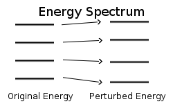

## Why Time-Dependent Perturbations?

:::: {.columns}
::: {.column width="50%"}
{width="100%"}
:::
::: {.column width="50%"}
- A **time-dependent** field can drive **transitions** between stationary states.

- Light is an **oscillating** electromagnetic field.

- This is the origin of **spectroscopy** and **selection rules**.
:::
::::

## The Setup

- Split the Hamiltonian into a solvable part plus a weak, time-dependent kick.

::: {.fragment}
$$\hat{H}(t) = \hat{H}_0 + \hat{V}(t), \qquad \hat{H}_0|n\rangle = E_n|n\rangle$$
:::

::: {.fragment}
- Expand the state in the **stationary basis**:
$$|\Psi(t)\rangle = \sum_n c_n(t)\, e^{-iE_n t/\hbar}|n\rangle$$
:::

- The coefficients $c_n(t)$ carry **all the dynamics**.

## Equation of Motion for the Coefficients

- Insert the expansion into the time-dependent Schrodinger equation.

::: {.fragment}
$$i\hbar\,\dot{c}_m(t) = \sum_n c_n(t)\, V_{mn}(t)\, e^{i\omega_{mn}t}$$
:::

::: {.fragment}
$$V_{mn}(t) = \langle m|\hat{V}(t)|n\rangle, \qquad \omega_{mn} = \frac{E_m - E_n}{\hbar}$$
:::

## First-Order Transition Amplitude

- Start in state $|i\rangle$. The perturbation is **weak**, so keep $c_n \approx \delta_{ni}$.

::: {.fragment}
$$\dot{c}_f^{(1)}(t) = -\frac{i}{\hbar}\, V_{fi}(t)\, e^{i\omega_{fi}t}$$
:::

::: {.fragment}
Integrate from $0$ to $t$:
$$c_f^{(1)}(t) = -\frac{i}{\hbar}\int_0^t V_{fi}(t')\, e^{i\omega_{fi}t'}\, dt'$$
:::

## Coupling to Light: Dipole Approximation

- An oscillating field couples through the **electric dipole**.

::: {.fragment}
$$\hat{V}(t) = -\hat{\boldsymbol{\mu}}\cdot\mathbf{E}(t), \qquad \mathbf{E}(t) = \mathbf{E}_0\cos(\omega t)$$
:::

::: {.fragment}
- Define the **dipole matrix element** $\mu_{fi} = \langle f|\hat{\boldsymbol{\mu}}\cdot\hat{\mathbf{e}}|i\rangle$:
$$V_{fi}(t) = -\mu_{fi}\, E_0\cos(\omega t)$$
:::

## Resonance and Energy Conservation

- Write $\cos(\omega t') = \tfrac{1}{2}(e^{i\omega t'} + e^{-i\omega t'})$.

- The integral holds terms $\displaystyle\int_0^t e^{i(\omega_{fi}\pm\omega)t'}\,dt'$.

- Off-resonance these **oscillate away**. The amplitude is large only when $\omega_{fi}\approx\omega$.

::: {.fragment}
$$E_f - E_i = \pm\hbar\omega$$
:::

## Transition Probability

::: {.fragment}
$$P_{i\to f}(t) \approx |c_f^{(1)}(t)|^2 \propto |\mu_{fi}|^2$$
:::

- The transition rate is set by the **square** of the dipole matrix element.

- **Allowed** when $\mu_{fi} = \langle f|\hat{\boldsymbol{\mu}}\cdot\hat{\mathbf{e}}|i\rangle \neq 0$.

- **Forbidden** (first order) when symmetry makes it **exactly zero**.

## Where Selection Rules Come From

- A vanishing integral is dictated by **symmetry**, not by accident.

- **Wavefunctions**: angular and parity symmetry of $|i\rangle$ and $|f\rangle$.

- **Operator**: $\hat{\boldsymbol{\mu}}\sim\mathbf{r}$ is a **vector** (angular-momentum-1) object.

- The parity of the state must **change** for a dipole transition.

## Selection Rules for Hydrogen-Like Atoms

- States are labeled $|n, l, m_l\rangle$; $\mathbf{r}$ transforms like $Y_{1m}$.

::: {.fragment}
**Orbital angular momentum:**
$$\Delta l = l_f - l_i = \pm 1$$
:::

::: {.fragment}
**Magnetic quantum number:**
$$\Delta m_l = m_{l,f} - m_{l,i} = 0, \pm 1$$
:::

# Takeaway {.center}

> A weak oscillating field drives transitions with amplitude $c_f^{(1)} = -\frac{i}{\hbar}\int_0^t V_{fi}\, e^{i\omega_{fi}t'}\,dt'$, large only at **resonance** $E_f - E_i = \pm\hbar\omega$. The rate scales as $|\mu_{fi}|^2$, and where symmetry makes this **vanish** the transition is forbidden: for hydrogen-like atoms $\Delta l = \pm 1$, $\Delta m_l = 0,\pm 1$.
