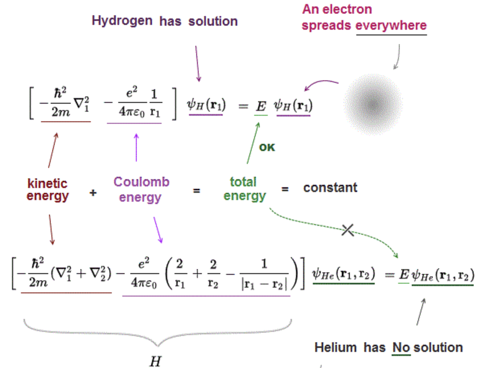
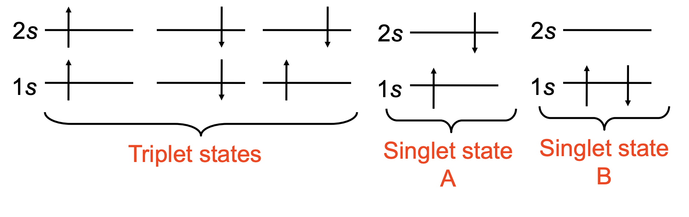
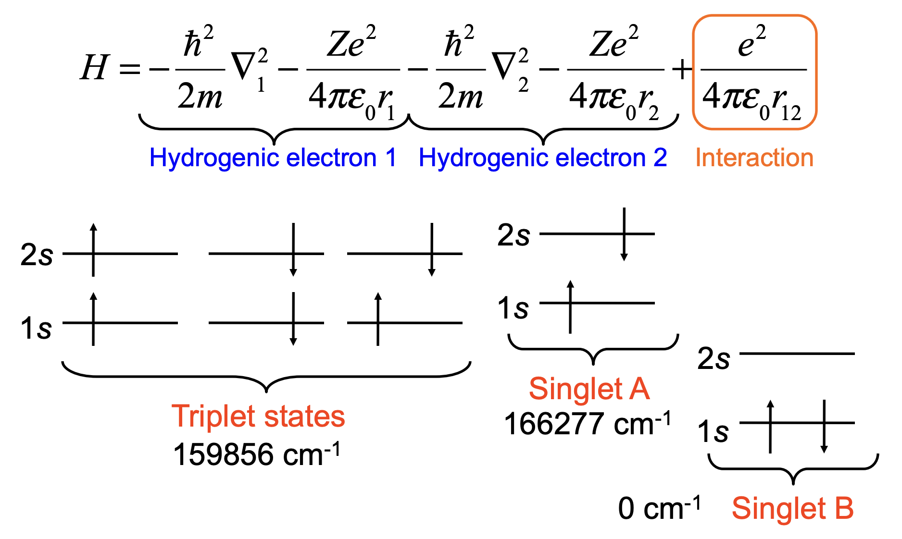
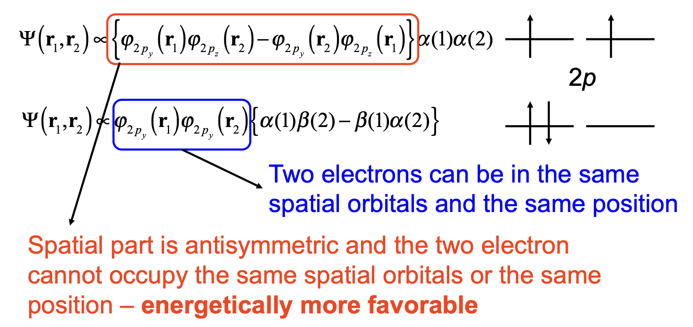

## Why Helium Is Hard

:::: {.columns}
::: {.column width="50%"}
{width="100%"}
:::
::: {.column width="50%"}
- One extra **electron-electron repulsion** term couples the coordinates.

::: {.fragment}
- The coordinates **do not separate**, so there is **no exact analytical solution**.
:::

::: {.fragment}
- We must **approximate** the many-electron wavefunction.
:::
:::
::::

## The Orbital Approximation

- Build the wavefunction from **single-electron orbitals**.

::: {.fragment}
$$\Psi(r_1, r_2, \ldots, r_n) \approx \phi_1(r_1)\phi_2(r_2)\cdots\phi_n(r_n)$$
:::

::: {.fragment}
- Each $\phi_i(r)$ is an **atomic orbital** holding one electron.
- Orbitals come from **computation** (for example, variationally).
:::

## Three Problems With a Plain Product

For helium, $\Psi(r_1,r_2) \approx \phi_1(r_1)\phi_2(r_2)$ fails because of:

::: {.fragment}
- **Indistinguishability**: cannot label "electron 1" with "orbital 1".
:::

::: {.fragment}
- **Spin**: a spin function is needed so the total state is antisymmetric.
:::

::: {.fragment}
- **Correlation**: a product assumes electrons move independently.
:::

## Antisymmetry Requirement

- Electrons are **fermions**: swapping two must flip the sign.

::: {.fragment}
$$\Psi(\ldots, r_m, \ldots, r_n, \ldots) = -\Psi(\ldots, r_n, \ldots, r_m, \ldots)$$
:::

::: {.fragment}
- Antisymmetrized helium spatial part:
$$\Psi(r_1,r_2) \propto \phi_1(r_1)\phi_2(r_2) - \phi_1(r_2)\phi_2(r_1)$$
:::

## Spin Pairs With Space

- Total wavefunction = **spatial** times **spin**, and must be **antisymmetric**.

::: {.fragment}
- **Symmetric** space pairs with **antisymmetric** spin.
- **Antisymmetric** space pairs with **symmetric** spin.
:::

::: {.fragment}
- This is the **Pauli exclusion principle**:
> No two electrons can possess identical sets of quantum numbers.
:::

## Slater Determinant

- A compact, universal way to enforce antisymmetry.

::: {.fragment}
$$\Psi(r_1,\ldots, r_n) = \frac{1}{\sqrt{n!}}
\begin{vmatrix}
\chi_1(1) & \chi_2(1) & \cdots & \chi_n(1) \\
\chi_1(2) & \chi_2(2) & \cdots & \chi_n(2) \\
\vdots    & \vdots    & \ddots & \vdots    \\
\chi_1(n) & \chi_2(n) & \cdots & \chi_n(n)
\end{vmatrix}$$
:::

::: {.fragment}
- $\chi_j(i)$ is a **spin-orbital**; swapping two rows flips the sign.
:::

## Singlets and Triplets

:::: {.columns}
::: {.column width="50%"}
{width="100%"}
:::
::: {.column width="50%"}
For $1s2s$ helium, the spatial part is symmetric **or** antisymmetric:

::: {.fragment}
- **Triplet** ($S=1$): symmetric spin, **antisymmetric** space.
:::

::: {.fragment}
- **Singlet** ($S=0$): antisymmetric spin, **symmetric** space.
:::
:::
::::

## Exchange Stabilization

:::: {.columns}
::: {.column width="50%"}
{width="100%"}
:::
::: {.column width="50%"}
- **Triplet** electrons are spatially **antisymmetric**: they avoid each other, feel **less repulsion**, lie **lower**.

::: {.fragment}
- **Singlet** electrons overlap more and lie **higher**.
:::

::: {.fragment}
- The split is the origin of **exchange stabilization**.
:::
:::
::::

## Coulomb and Exchange Integrals

- The repulsion energy splits into two kinds of integral.

::: {.fragment}
$$J_{ij} = \int |\phi_i(r_1)|^2 \frac{e^2}{4\pi\epsilon_0 r_{12}} |\phi_j(r_2)|^2 \, d^3r_1 \, d^3r_2$$
always **positive**.
:::

::: {.fragment}
$$K_{ij} = \int \phi_i^*(r_1)\phi_j^*(r_2) \frac{e^2}{4\pi\epsilon_0 r_{12}} \phi_j(r_1)\phi_i(r_2) \, d^3r_1 \, d^3r_2$$
purely quantum; lowers the **triplet**.
:::

## The Splitting Made Explicit

::: {.fragment}
$$E_{\text{triplet}} = I(1s) + I(2s) + J(1s,2s) - K(1s,2s)$$
:::

::: {.fragment}
$$E_{\text{singlet}} = I(1s) + I(2s) + J(1s,2s) + K(1s,2s)$$
:::

::: {.fragment}
- $J$ shifts **both** up; $K$ **splits** them.
- Triplet sits **lower by** $2K(1s,2s)$.
:::

## Filling the Orbitals

:::: {.columns}
::: {.column width="45%"}
{width="100%"}
:::
::: {.column width="55%"}
- **Aufbau**: fill orbitals in order of increasing energy.

::: {.fragment}
- **Pauli**: two electrons per orbital, opposite spins.
:::

::: {.fragment}
- **Hund**: fill degenerate orbitals **singly with parallel spins** first.
- Same **exchange stabilization** that split helium's triplet below its singlet.
:::
:::
::::

# Takeaway {.center}

> Multi-electron atoms do not separate, so we build wavefunctions from **orbitals** made **antisymmetric** by a **Slater determinant**. Antisymmetry forces **Pauli exclusion**, and the **exchange integral** $K$ lowers parallel-spin (triplet) states, the origin of **exchange stabilization** and **Hund's rule**.
