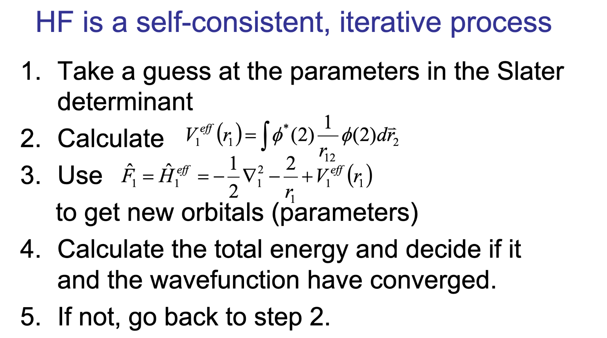
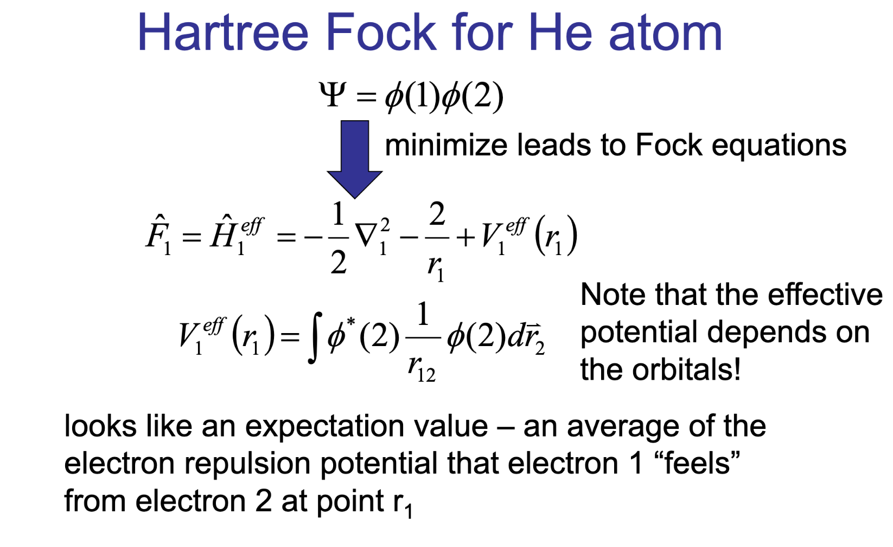
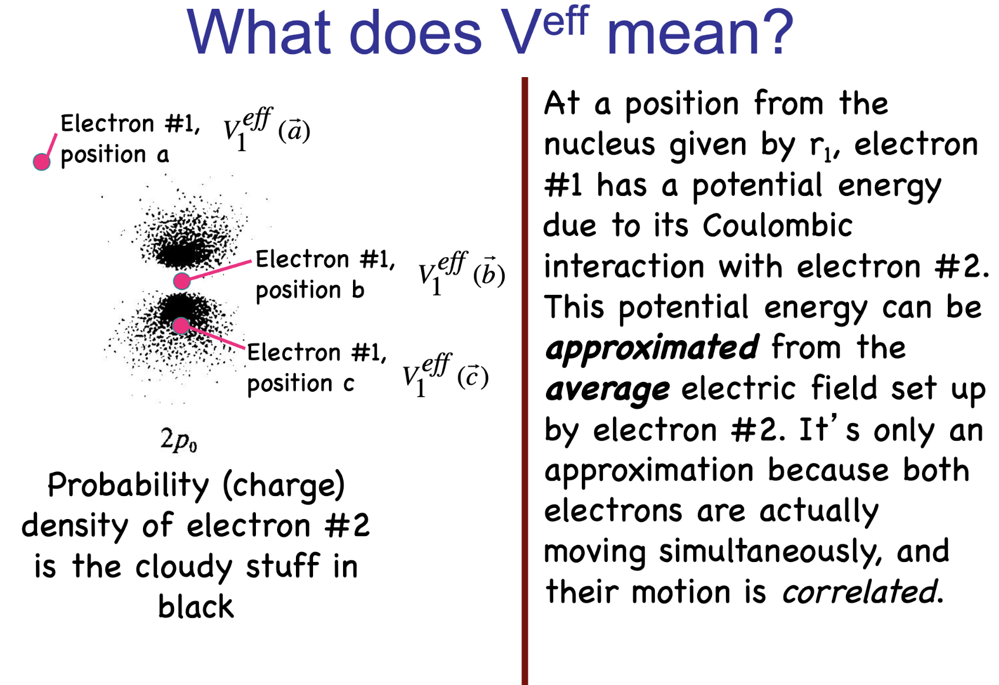

## The Many-Electron Problem

- The Schrodinger equation is **unsolvable** for $N > 1$ electrons.

::: {.fragment}
- The culprit: **electron, electron repulsion** couples every coordinate.
:::

::: {.fragment}
- **Idea:** let each electron feel only the **average field** of all the others.
- A many-body problem becomes many **one-electron** problems.
:::

## The Slater Determinant

- The total wavefunction must be **antisymmetric** (Pauli).

::: {.fragment}
$$\Psi(1, 2, \ldots, N) = \frac{1}{\sqrt{N!}}
\begin{vmatrix}
\psi_1(1) & \psi_2(1) & \cdots & \psi_N(1) \\
\psi_1(2) & \psi_2(2) & \cdots & \psi_N(2) \\
\vdots & \vdots & \ddots & \vdots \\
\psi_1(N) & \psi_2(N) & \cdots & \psi_N(N)
\end{vmatrix}$$
:::

::: {.fragment}
- Swapping two electrons **swaps rows**, flipping the sign automatically.
:::

## The Hartree-Fock Equation

- Each orbital is an **eigenfunction** of one effective operator.

::: {.fragment}
$$\hat{F}\,\psi_i = \varepsilon_i\,\psi_i$$
:::

::: {.fragment}
- $\hat{F}$ is the **Fock operator**.
- $\varepsilon_i$ are the **orbital energies**.
:::

## Inside the Fock Operator

$$\hat{F} = \hat{h} + \sum_{j}\left(\hat{J}_j - \hat{K}_j\right)$$

::: {.fragment}
- $\hat{h}$: **kinetic energy** plus **nuclear attraction**.
:::

::: {.fragment}
- $\hat{J}_j$: **Coulomb** operator, classical electron, electron repulsion.
:::

::: {.fragment}
- $\hat{K}_j$: **exchange** operator, a purely **quantum** effect with no classical analogue.
:::

## The Self-Consistent Field

:::: {.columns}
::: {.column width="48%"}

:::
::: {.column width="52%"}
$\hat{F}$ depends on the very orbitals it determines, so we **iterate**:

::: {.fragment}
1. **Guess** the orbitals $\psi_i$.
2. **Build** the Fock operator $\hat{F}$.
3. **Solve** $\hat{F}\psi_i = \varepsilon_i\psi_i$.
4. **Repeat** until the orbitals stop changing.
:::
:::
::::

## The Mean Field in Action

:::: {.columns}
::: {.column width="50%"}

:::
::: {.column width="50%"}
- **Helium:** the simplest closed-shell test.

::: {.fragment}
- Each $1s$ electron moves in the **average field** of the other.
:::

::: {.fragment}
- The two-electron problem splits into **two one-electron** problems.
:::
:::
::::

## The Effective Potential

:::: {.columns}
::: {.column width="50%"}

:::
::: {.column width="50%"}
- One electron feels the bare **nuclear attraction**...

::: {.fragment}
- ...**screened** by the averaged charge cloud of the other.
:::

::: {.fragment}
- The net pull is **weaker** than the bare nucleus: **shielding**.
:::
:::
::::

## The Total Energy

$$E_{HF} = \sum_{i}\langle \psi_i | \hat{h} | \psi_i \rangle + \frac{1}{2}\sum_{i,j}\left(J_{ij} - K_{ij}\right)$$

::: {.fragment}
- $J_{ij}$: **Coulomb** integral, classical repulsion.
- $K_{ij}$: **exchange** integral, lowers the energy.
:::

::: {.fragment}
- The factor $\tfrac{1}{2}$ removes **double counting** of each pair.
:::

## Strengths and Limits

**Strengths**

- **Efficient:** intractable many-body problem becomes coupled one-electron equations.
- **Exchange** is captured **exactly** through the determinant.

::: {.fragment}
**Limits**

- **No dynamic correlation:** each electron sees only the *average*, not instantaneous, positions.
- **Post-HF** methods (MP2, CCSD) add correlation on top.
:::

# Takeaway {.center}

> Hartree-Fock replaces the impossible many-body problem with a **self-consistent** set of one-electron equations, where each electron moves in the **averaged field** of all the others. The **Slater determinant** enforces antisymmetry and captures **exchange exactly**, but **correlation** only on average.
