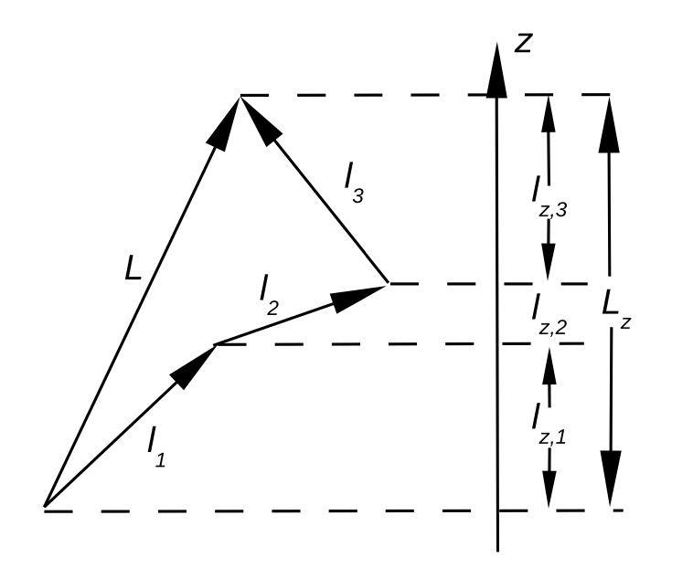
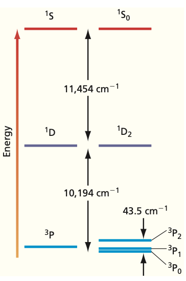
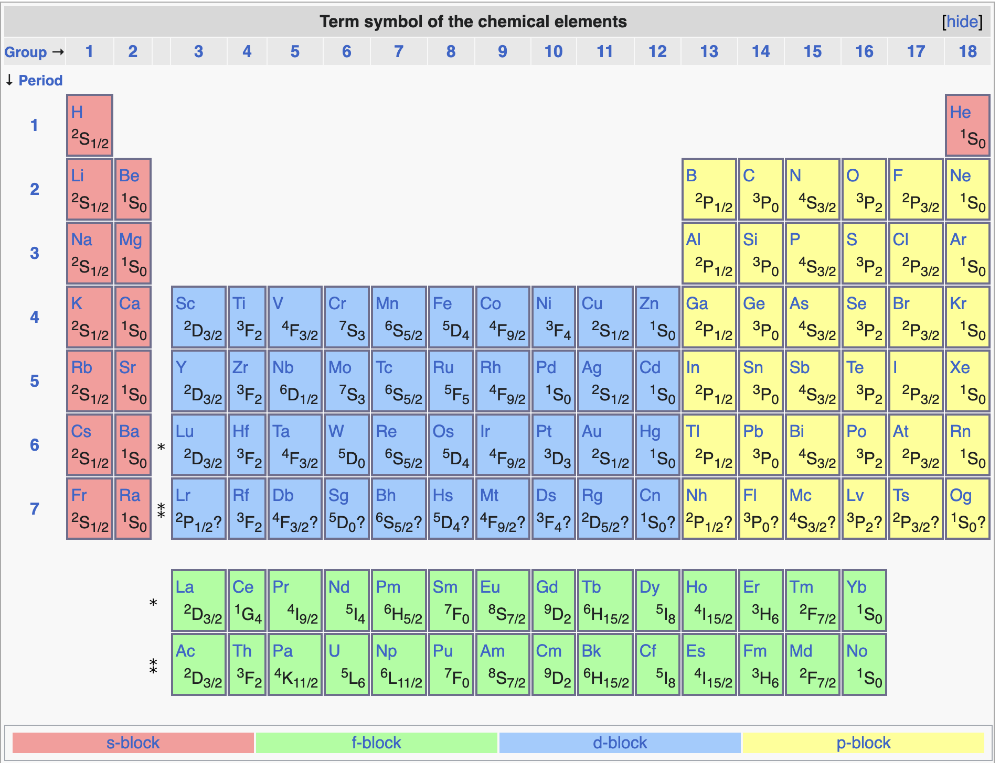
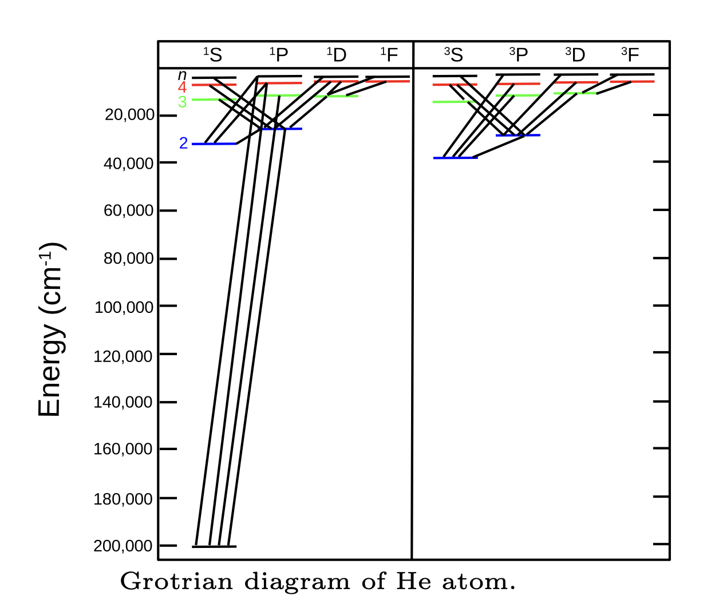

## Adding Angular Momenta

:::: {.columns}
::: {.column width="45%"}
{width="100%"}
:::
::: {.column width="55%"}
- Each electron carries **orbital** and **spin** angular momentum.
- They add as **vectors**, not numbers.

::: {.fragment}
$$\hat{L} = \sum_{i=1}^{N} \hat{l}_i, \qquad M_L = \sum_{i=1}^{N} m_i$$
:::

::: {.fragment}
- Light atom: neglect **spin-orbit** for now.
:::
:::
::::

## Total Orbital Momentum L

- Two electrons couple between **parallel** and **antiparallel**.

::: {.fragment}
$$L = l_1 + l_2,\; l_1 + l_2 - 1,\; \ldots,\; |l_1 - l_2|$$
:::

::: {.fragment}
- Two $p$ electrons: $L = 2, 1, 0$.
- State count matches: $5 + 3 + 1 = 9 = 3^2$.
:::

## Total Spin S

- Same coupling rule for the **spins**.

::: {.fragment}
$$S = s_1 + s_2,\; s_1 + s_2 - 1,\; \ldots,\; |s_1 - s_2|$$
:::

::: {.fragment}
- Two electrons: $S = 1$ (**triplet**) or $S = 0$ (**singlet**).
:::

## Total Angular Momentum J

- Combine **orbital** and **spin**: $\vec{\hat{J}} = \vec{\hat{L}} + \vec{\hat{S}}$.

::: {.fragment}
$$J = L + S,\; L + S - 1,\; \ldots,\; |L - S|$$
$$M_J = M_L + M_S$$
:::

::: {.fragment}
- This is **Russell-Saunders** ($LS$) coupling.
- Good for the first two rows of the table.
:::

## Term Symbols

- One compact label for a whole group of states.

::: {.fragment}
$$^{2S+1}L_J$$
:::

::: {.fragment}
- $2S+1$ is the **spin multiplicity** (1 singlet, 2 doublet, 3 triplet).
- $L$ as a **letter**: S, P, D, F for $L = 0, 1, 2, 3$.
- Only **valence** electrons matter.
:::

## Configurations, Terms, Levels

:::: {.columns}
::: {.column width="55%"}
{width="100%"}
:::
::: {.column width="45%"}
- One **configuration** splits into **terms** (electron repulsion).

::: {.fragment}
- Each term splits into **levels** by $J$ (spin-orbit).
:::

::: {.fragment}
- Carbon $2p^2$: $^3$P, $^1$D, $^1$S.
:::
:::
::::

## Hund's Rules

- **Maximum multiplicity** $2S+1$ lies lowest.

::: {.fragment}
- For equal $S$, **maximum $L$** lies lowest.
:::

::: {.fragment}
- For equal $S$ and $L$, $J$ depends on filling:
  - Less than half-filled: **smallest $J$** lowest.
  - More than half-filled: **largest $J$** lowest.
:::

::: {.fragment}
- Carbon ground state: $^3$P$_0$.
:::

## Ground Terms Across the Table

{width="62%"}

::: {.fragment}
- Every element's ground state is a **single term symbol**.
- Read straight off Hund's rules.
:::

## Spin-Orbit Interaction

- A relativistic term couples $\vec{L}$ and $\vec{S}$:

::: {.fragment}
$$\hat{H}_{SO} = A\,\vec{\hat{L}}\cdot\vec{\hat{S}}$$
:::

::: {.fragment}
$$\vec{\hat{L}}\cdot\vec{\hat{S}} = \tfrac{1}{2}\left[J(J+1)-L(L+1)-S(S+1)\right]$$
:::

::: {.fragment}
- Larger for **heavy** atoms; only $J$ stays a **good** quantum number.
:::

## Selection Rules

:::: {.columns}
::: {.column width="48%"}
{width="100%"}
:::
::: {.column width="52%"}
- $\Delta L = 0, \pm 1$ (not $0 \to 0$).
- $\Delta l = \pm 1$ for the active electron.
- $\Delta J = 0, \pm 1$ (not $0 \to 0$).
- $\Delta S = 0$ (spin does not flip).

::: {.fragment}
- Violations are **forbidden**: weak, long-lived **metastable** states.
:::
:::
::::

# Takeaway {.center}

> Couple the electron momenta as vectors to get $L$, $S$, and $J$, pack them into a term symbol $^{2S+1}L_J$, and let **Hund's rules** pick the ground state. Spin-orbit coupling splits terms into levels, and **selection rules** decide which transitions you actually see.
