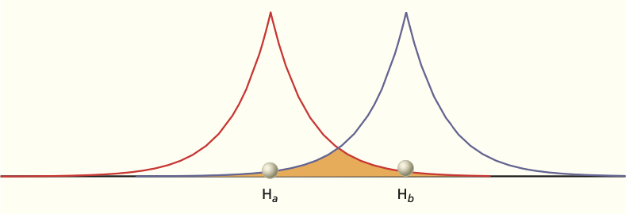
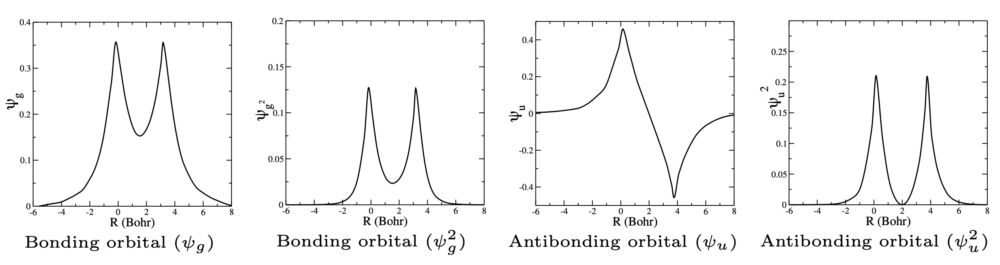
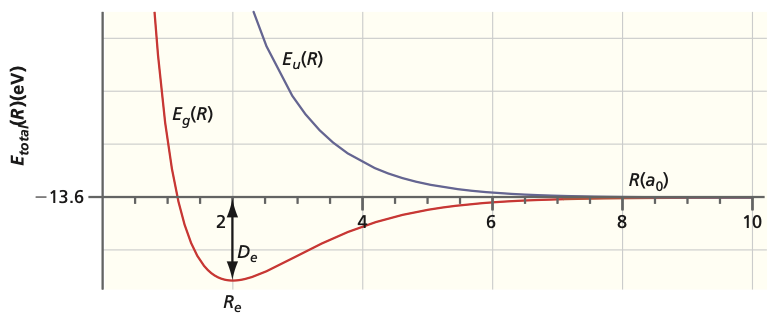
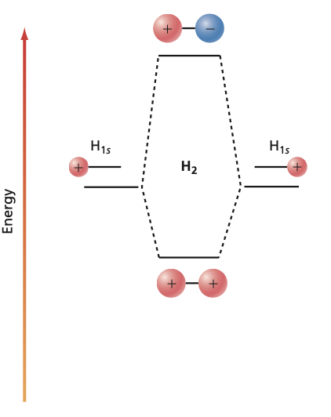

## Why $H_2^+$?

- The **simplest molecule**: two nuclei, one electron.

- Solvable **exactly**, but the math is ugly.

- Instead we build an **approximate** wavefunction from atomic orbitals.
- Goal: intuition for **chemical bonding** from a model we can do by hand.

## Building MOs from AOs

:::: {.columns}
::: {.column width="45%"}

:::
::: {.column width="55%"}
- Combine two hydrogen **1s** orbitals.

::: {.fragment}
$$\psi_{\pm} = c\,\big(1s_A \pm 1s_B\big)$$
:::

- This is the **LCAO** approximation.
- Identical nuclei force $c_1 = c_2 \equiv c$ by **symmetry**.
:::
::::

## The Overlap Integral

- Normalizing the **bonding** combination:

::: {.fragment}
$$1 = c^2 \int (1s_A + 1s_B)^2\, d\tau = c^2(2 + 2S)$$
:::

::: {.fragment}
$$S = \int 1s_A(\vec{r})\,1s_B(\vec{r})\, d\tau$$
:::

- The **overlap** $S$ measures how much the AOs share space.
- Fixes the normalization constant $c = 1/\sqrt{2(1+S)}$.

## Bonding and Antibonding MOs

::: {.fragment}
$$\psi_{+} \equiv \psi_g = \frac{1}{\sqrt{2(1+S)}}\left( 1s_A + 1s_B \right)$$
:::

::: {.fragment}
$$\psi_{-} \equiv \psi_u = \frac{1}{\sqrt{2(1-S)}}\left( 1s_A - 1s_B \right)$$
:::

- The antibonding orbital has a **node between the nuclei**: zero density there.

## Where the Electron Goes

:::: {.columns}
::: {.column width="50%"}

:::
::: {.column width="50%"}
- **Bonding** $(+)$: density **piled up** between the nuclei.

- **Antibonding** $(-)$: density **scooped out**, a node at the midpoint.

- This buildup of charge **glues** the nuclei together.
:::
::::

## Symmetry Labels: $g$ and $u$

- Invert through the **center of symmetry** at the midpoint.

- $\psi(-\vec{r}) = +\psi(\vec{r})$: even parity, label $g$.
- $\psi(-\vec{r}) = -\psi(\vec{r})$: odd parity, label $u$.

- For $\sigma$ orbitals: **bonding is $g$**, **antibonding is $u$**.
- The analytic overlap: $S(R) = e^{-R}\left( 1 + R + \tfrac{R^3}{3}\right)$, with $S(0)=1$.

## Variational Energy

- Plug the LCAO trial function into the **variational** energy:

::: {.fragment}
$$E = \frac{c_1^2 H_{AA} + 2c_1 c_2 H_{AB} + c_2^2 H_{BB}}{c_1^2 + 2c_1 c_2 S + c_2^2}$$
:::

- $H_{AA} = H_{BB}$: the **Coulomb** integral (attractive).
- $H_{AB} = H_{BA}$: the **resonance** integral.

## The Secular Determinant

- Minimizing over $c_1, c_2$ gives a **generalized eigenvalue** problem:

::: {.fragment}
$$\begin{pmatrix}H_{AA} - E & H_{AB} - SE\\ H_{AB} - SE & H_{BB} - E\end{pmatrix}\begin{pmatrix} c_1\\ c_2\end{pmatrix} = 0$$
:::

::: {.fragment}
- Non-trivial $c$'s exist only if the **determinant vanishes**:
$$\begin{vmatrix}H_{AA} - E & H_{AB} - SE\\ H_{AB} - SE & H_{BB} - E\end{vmatrix} = 0$$
:::

## Two Energy Roots

::: {.fragment}
$$E_g(R) = E_{1s} + \frac{J(R) + K(R)}{1 + S(R)}$$
:::

::: {.fragment}
$$E_u(R) = E_{1s} + \frac{J(R) - K(R)}{1 - S(R)}$$
:::

- $J(R)$: Coulomb term. $K(R)$: **resonance** term, the source of bonding.
- $E_g$ **lowers** the energy, $E_u$ **raises** it relative to separated atoms.

## Energy vs Internuclear Distance

:::: {.columns}
::: {.column width="55%"}

:::
::: {.column width="45%"}
- $E_g$ has a **minimum**: a stable bond.

- $E_u$ is **repulsive** at all $R$: a purely excited state.

- Crude model: bond length **132 pm** vs **106 pm** experiment.
- Improved by adding more terms to the LCAO.
:::
::::

## The MO Diagram

:::: {.columns}
::: {.column width="40%"}

:::
::: {.column width="60%"}
- Two AOs **split** into a lower $\sigma_g$ and a higher $\sigma_u^{*}$.

- $\sigma$: zero angular momentum about the axis, $\lambda = 0$.
- $\pi$ orbitals from $p_{x,y}$ are **doubly degenerate**.

- Same recipe scales to all **homonuclear** diatomics.
:::
::::

# Takeaway {.center}

> Mixing two **1s** orbitals gives a **bonding** $\sigma_g$ that piles electron density between the nuclei and **lowers** the energy, plus an **antibonding** $\sigma_u^{*}$ with a node that **raises** it. The variational secular determinant turns this LCAO picture into the two energy curves $E_g$ and $E_u$.
