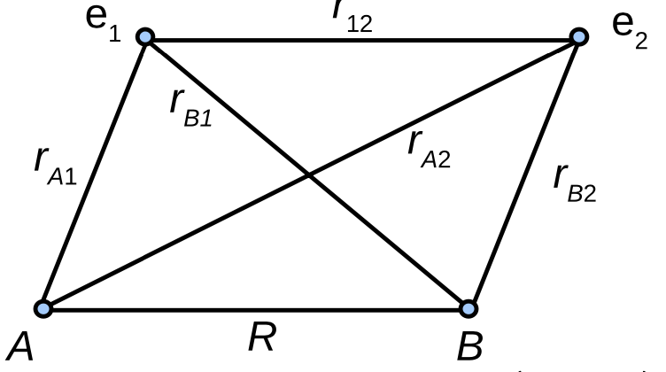
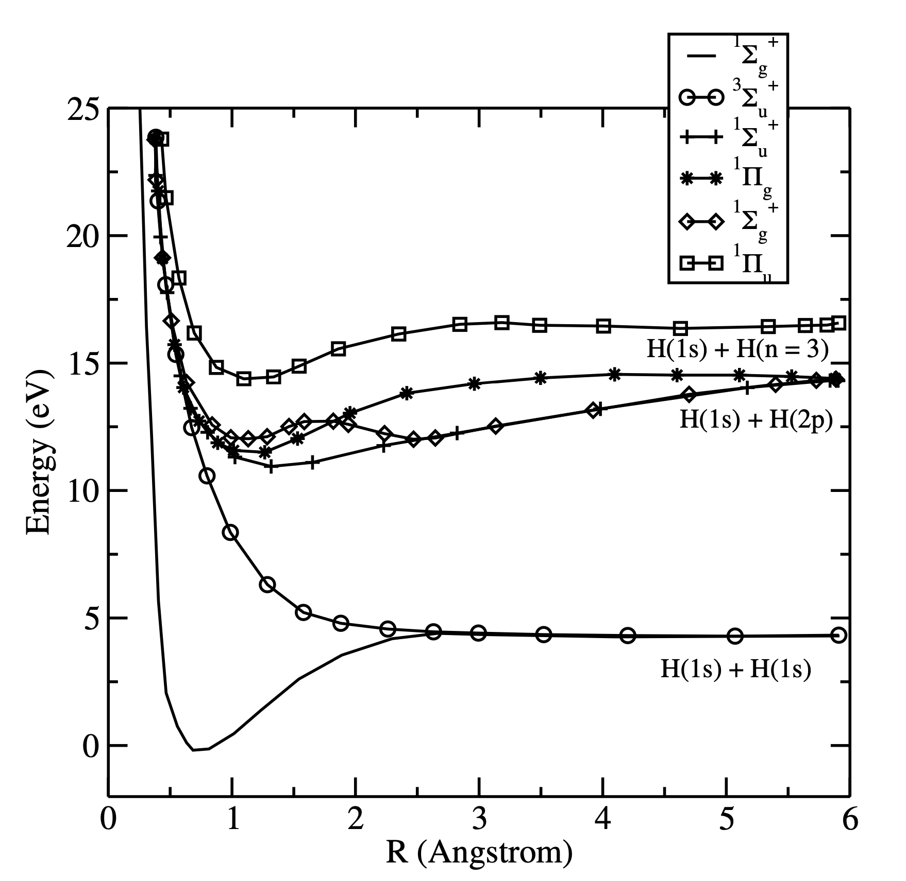

## From One Electron to Two

- $H_2^+$ had a single electron and an exact MO.
- Neutral $H_2$ adds a **second electron**.

::: {.fragment}
- New term: electron-electron repulsion $1/r_{12}$.
- This term **couples** the electrons together.
:::

::: {.fragment}
- No analytic solution exists for the $H_2$ electronic equation.
- We proceed **approximately** with LCAO-MO.
:::

## The Molecular Hamiltonian

:::: {.columns}
::: {.column width="45%"}

:::
::: {.column width="55%"}
$$\begin{aligned}
H = &-\frac{\hbar^2}{2m_e}(\Delta_1 + \Delta_2) \\
&+ \frac{e^2}{4\pi\epsilon_0}\Big(\tfrac{1}{R} + \tfrac{1}{r_{12}} \\
&- \tfrac{1}{r_{A1}} - \tfrac{1}{r_{A2}} - \tfrac{1}{r_{B1}} - \tfrac{1}{r_{B2}}\Big)
\end{aligned}$$

::: {.fragment}
- The troublesome term is $1/r_{12}$.
- A simple product wavefunction is **not enough**.
:::
:::
::::

## Filling the Bonding Orbital

- **Pauli**: two opposite-spin electrons share one spatial orbital.
- Assume the $H_2$ orbitals match those of $H_2^+$.

::: {.fragment}
- Both electrons occupy $1\sigma_g$: configuration $(1\sigma_g)^2$.
:::

::: {.fragment}
$$1\sigma_g(1) = \frac{1}{\sqrt{2(1+S)}}\big(1s_A(1) + 1s_B(1)\big)$$
:::

## The Total Wavefunction Must Be Antisymmetric

- Exchange of electrons must **flip the sign**.
- Build it as a **Slater determinant**.

::: {.fragment}
$$\psi_{MO}^{(1\sigma_g)^2} = \frac{1}{\sqrt{2}}\begin{vmatrix}
1\sigma_g(1)\alpha(1) & 1\sigma_g(1)\beta(1)\\
1\sigma_g(2)\alpha(2) & 1\sigma_g(2)\beta(2)
\end{vmatrix}$$
:::

::: {.fragment}
- $\alpha, \beta$ are the two **spin** states.
:::

## Space and Spin Factorize

- Expanding the determinant separates the parts.

::: {.fragment}
$$\psi_{MO}^{(1\sigma_g)^2} = \frac{(1s_A(1)+1s_B(1))(1s_A(2)+1s_B(2))}{2\sqrt{2}(1+S_{AB})}\big(\alpha(1)\beta(2) - \alpha(2)\beta(1)\big)$$
:::

::: {.fragment}
- **Symmetric** spatial part times an **antisymmetric** spin singlet.
- Not an exact eigenfunction: energy comes from $\langle \psi | H | \psi\rangle$.
:::

## The Energy Expression

::: {.fragment}
$$E(R) = 2E_{1s} + \frac{e^2}{4\pi\epsilon_0 R} - \textnormal{integrals}$$
:::

- $2E_{1s}$: two separated H atoms.
- $e^2/4\pi\epsilon_0 R$: **nuclear repulsion**.
- "integrals": Coulomb, exchange, overlap of charge clouds.

## How Good Is the Simple MO?

- The model **predicts a bound molecule**. The method works.

::: {.fragment}
| Quantity | Simple MO | Experiment |
|---|---|---|
| $R_e$ | 84 pm | 74.1 pm |
| $D_e$ | 255 kJ/mol | 458 kJ/mol |
:::

::: {.fragment}
- Bond **too long**, binding **too weak**.
- Time to improve the wavefunction.
:::

## Ionic and Covalent Pieces

:::: {.columns}
::: {.column width="50%"}

:::
::: {.column width="50%"}
- The MO product hides distinct physical terms.

::: {.fragment}
- **Covalent**: one electron on each atom (H + H).
- **Ionic**: both electrons on one atom ($H^- + H^+$).
:::

::: {.fragment}
- Simple MO weights them **equally**, overcounting ionic.
:::
:::
::::

## Weighting Them Separately

::: {.fragment}
$$\psi = c_1\,\psi_{\textnormal{covalent}} + c_2\,\psi_{\textnormal{ionic}}$$
:::

::: {.fragment}
$$\psi_{\textnormal{covalent}} = 1s_A(1)1s_B(2) + 1s_A(2)1s_B(1)$$
$$\psi_{\textnormal{ionic}} = 1s_A(1)1s_A(2) + 1s_B(1)1s_B(2)$$
:::

::: {.fragment}
- $c_1, c_2$ are **variational** and depend on $R$.
- Result: $R_e$ = 74.9 pm, $D_e$ = 386 kJ/mol. Much closer.
:::

## Toward Exact Agreement

- Add **higher atomic orbitals** to the basis.
- Hartree-Fock solves this efficiently but **ignores correlation**.

::: {.fragment}
- Full **configuration interaction** captures correlation.
:::

::: {.fragment}
- $D_e$ = 36117.8 cm$^{-1}$ (CI) vs $36117.3 \pm 1.0$ cm$^{-1}$ (expt).
- $R_e$ = 74.140 pm vs 74.139 pm. **Essentially exact.**
:::

# Takeaway {.center}

> Neutral $H_2$ has no analytic solution because of $1/r_{12}$, so we place two opposite-spin electrons in $1\sigma_g$ as a **Slater determinant**. This simple LCAO-MO already binds the molecule, and separating **ionic from covalent** terms, then adding **configuration interaction**, drives the bond length and binding energy to essentially exact agreement.
