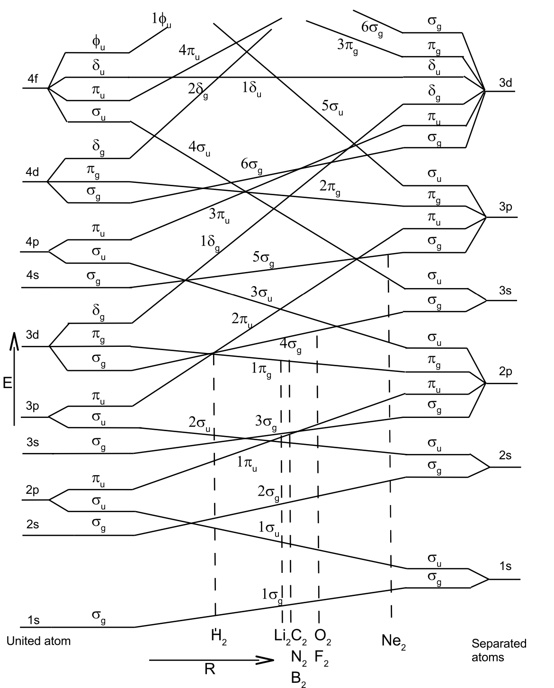
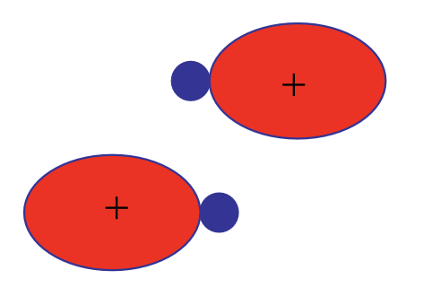
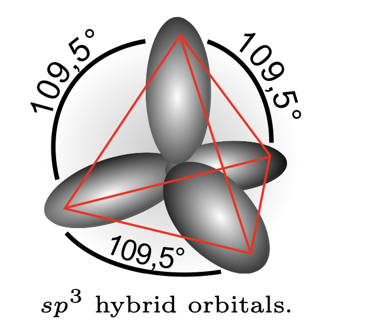
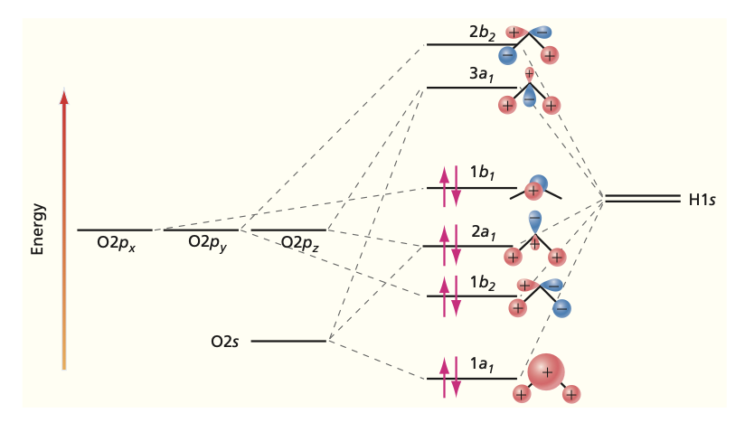

## Two Pictures of Bonding

- **Molecular orbitals (MO)**: electrons delocalized over the whole molecule.

::: {.fragment}
- **Valence bond (VB)**: bonds built from **overlapping atomic orbitals**.
:::

::: {.fragment}
- VB naturally gives **hybrid orbitals** that explain molecular **shape**.
:::

::: {.fragment}
- Both are approximations to the same exact wavefunction.
:::

## Filling the Diatomic Series

- Fill MOs in order of energy: each pair is **bonding plus antibonding**.

::: {.fragment}
$$\text{BO} = \tfrac{1}{2}\left(N_\text{bonding} - N_\text{antibonding}\right)$$
:::

::: {.fragment}
- Higher **bond order** means shorter $R_e$ and larger $D_e$.
- $\pi$ orbitals hold **4** electrons; $\sigma$ hold **2**.
:::

## The Diatomic Trend

| Molecule | Config | BO | $R_e$ (Å) | $D_e$ (eV) |
|---|---|---|---|---|
| $H_2$ | $(1\sigma_g)^2$ | 1.0 | 0.741 | 4.78 |
| $C_2$ | $Be_2(1\pi_u)^4$ | 2.0 | 1.242 | 6.36 |
| $N_2$ | $(3\sigma_g)^2$ | 3.0 | 1.094 | 9.90 |
| $O_2$ | $(1\pi_g)^2$ | 2.0 | 1.207 | 5.21 |

::: {.fragment}
- $N_2$ has the strongest bond: **triple bond**, shortest, deepest well.
:::

## The Non-Crossing Rule

:::: {.columns}
::: {.column width="50%"}

:::
::: {.column width="50%"}
- States of the **same symmetry never cross**.

::: {.fragment}
- As $R$ changes, same-symmetry levels **avoid** each other.
:::

::: {.fragment}
- Sorts orbitals into clean bonding / antibonding ladders.
:::
:::
::::

## Valence Bond and Overlap

- A bond forms where atomic orbitals have **non-zero overlap**.

::: {.fragment}
- Orbitals must share the **same symmetry** to overlap.
:::

::: {.fragment}
- **Hybrids** are linear combinations of orbitals on a **single atom**.
- They only form as other atoms approach, not in free atoms.
:::

## sp Hybrids: $BeH_2$

:::: {.columns}
::: {.column width="45%"}

:::
::: {.column width="55%"}
$$\psi_{sp}^1 = \tfrac{1}{\sqrt{2}}(2s + 2p_z)$$

$$\psi_{sp}^2 = \tfrac{1}{\sqrt{2}}(2s - 2p_z)$$

::: {.fragment}
- One $s$ plus one $p$ give **two** hybrids.
- Geometry is **linear**: H-Be-H.
:::
:::
::::

## sp2 Hybrids: $BH_3$

- Mix $2s$, $2p_z$, $2p_x$ into **three** hybrids.

::: {.fragment}
$$\psi^1_{sp^2} = \tfrac{1}{\sqrt{3}}\,2s + \sqrt{\tfrac{2}{3}}\,2p_z$$
:::

::: {.fragment}
- Each forms a $\sigma$ bond with an H.
- Geometry is **trigonal planar**, angles $120^\circ$.
:::

## sp3 Hybrids: $CH_4$

:::: {.columns}
::: {.column width="45%"}

:::
::: {.column width="55%"}
$$\psi^1_{sp^3} = \tfrac{1}{2}(2s + 2p_x + 2p_y + 2p_z)$$

::: {.fragment}
- One $s$ plus three $p$ give **four** hybrids.
- Geometry is **tetrahedral**.
:::

::: {.fragment}
- Count is conserved: orbitals in = hybrids out.
:::
:::
::::

## Lone Pairs: $H_2O$

- Oxygen is **$sp^3$** hybridized.

::: {.fragment}
- Two hybrids **bond** to H; two hold **lone pairs**.
:::

::: {.fragment}
- Predicted angle $109^\circ$, observed $104^\circ$.
- Lone pairs **squeeze** the bond angle.
:::

## Reading an MO Diagram

:::: {.columns}
::: {.column width="50%"}

:::
::: {.column width="50%"}
- Atomic orbitals on the sides, **molecular** orbitals in the middle.

::: {.fragment}
- Bonding orbitals drop **below** the atomic levels.
- Antibonding rise **above**.
:::
:::
::::

## From Orbitals to Numbers

- Real calculations replace atomic orbitals with **Gaussian basis sets**.

::: {.fragment}
- Gaussians make the required **integrals analytic**.
- Used in **Hartree-Fock (SCF)** and beyond.
:::

::: {.fragment}
- Handy rule: a **product of Gaussians is a Gaussian**.
:::

# Takeaway {.center}

> The **MO picture** predicts bond order, length, and strength across the diatomic series, while the **valence bond** picture builds bonds from overlapping atomic orbitals and gives $sp$, $sp^2$, $sp^3$ **hybrids** that fix molecular geometry.
