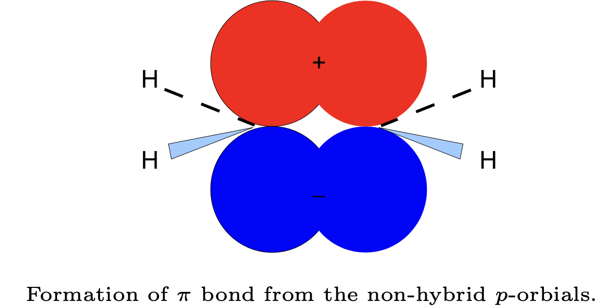
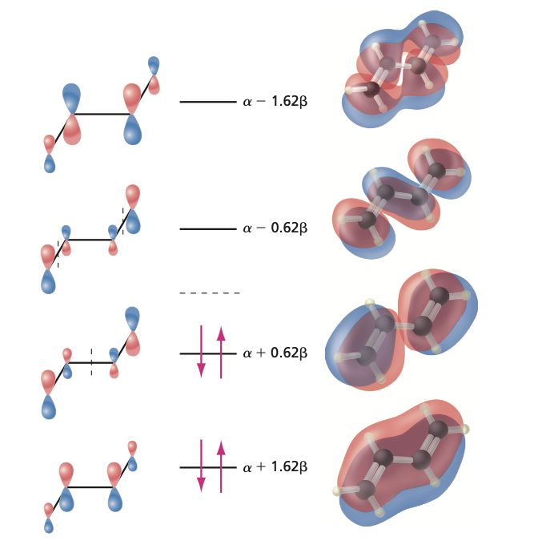
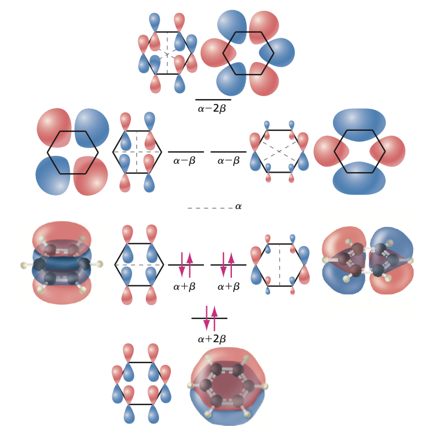

## Why Conjugated Systems Need a New Approach

:::: {.columns}
::: {.column width="50%"}

:::
::: {.column width="50%"}
- $\pi$ electrons are **delocalized** over the whole molecule.
- Localized **valence bond** pictures fail for benzene.

::: {.fragment}
- We need a model built for **delocalization**.
:::
:::
::::

## The Huckel Idea

- Treat the **$\pi$ electrons** independently of the $\sigma$ framework.
- Each $\pi$ MO is a **linear combination** of carbon $2p$ orbitals.

::: {.fragment}
$$\psi = c_1\phi_1 + c_2\phi_2 + \cdots$$
:::

::: {.fragment}
- The variational principle gives a **secular determinant** to solve.
:::

## The Three Huckel Approximations

::: {.fragment}
1. Overlaps $S_{ij}=0$ unless $i=j$, where $S_{ii}=1$.
:::

::: {.fragment}
2. All diagonal elements $H_{ii}=\alpha$, the **Coulomb integral**.
:::

::: {.fragment}
3. Off-diagonal $H_{ij}=\beta$ only for **neighboring** atoms, else $0$. This is the **resonance integral**.
:::

::: {.fragment}
- $\alpha$ and $\beta$ are **empirical**: no Hamiltonian needed.
:::

## Ethylene: The Simplest Case

- Two carbons, one neighboring pair. The secular determinant is

::: {.fragment}
$$\begin{vmatrix}\alpha - E & \beta\\ \beta & \alpha - E\\ \end{vmatrix} = 0$$
:::

::: {.fragment}
- Expanding gives a quadratic with roots
$$E = \alpha \pm \beta$$
:::

::: {.fragment}
- Since $\beta < 0$, the **bonding** level is $E_1 = \alpha + \beta$.
:::

## Ethylene MOs and Energy

- Substituting each $E$ back gives the normalized orbitals:

::: {.fragment}
$$\psi_1 = \tfrac{1}{\sqrt{2}}(\phi_1 + \phi_2), \qquad \psi_2 = \tfrac{1}{\sqrt{2}}(\phi_1 - \phi_2)$$
:::

::: {.fragment}
- Two $\pi$ electrons fill $\psi_1$: $E_{tot} = 2\alpha + 2\beta$.
- Excitation energy $= 2|\beta|$, measurable by **UV/VIS**.
:::

## HOMO and LUMO

- **HOMO**: highest occupied molecular orbital.
- **LUMO**: lowest unoccupied molecular orbital.

::: {.fragment}
- The **HOMO-LUMO gap** sets the lowest electronic excitation.
- For ethylene that gap is exactly $2|\beta|$.
:::

## Butadiene: Build the Matrix

- Number the carbons $1\,2\,3\,4$; neighbors get a $\beta$.
- Divide each row by $\beta$ and set $x = (\alpha - E)/\beta$:

::: {.fragment}
$$\begin{vmatrix} x & 1 & 0 & 0\\ 1 & x & 1 & 0\\ 0 & 1 & x & 1\\ 0 & 0 & 1 & x\\ \end{vmatrix} = 0$$
:::

::: {.fragment}
- Expanding: $x^4 - 3x^2 + 1 = 0$, with $x = \pm 0.618,\ \pm 1.618$.
:::

## Butadiene: Four Levels

:::: {.columns}
::: {.column width="50%"}

:::
::: {.column width="50%"}
$$E_1 = \alpha + 1.618\beta$$
$$E_2 = \alpha + 0.618\beta$$
$$E_3 = \alpha - 0.618\beta$$
$$E_4 = \alpha - 1.618\beta$$

::: {.fragment}
- Four electrons fill $E_1, E_2$:
$$E_\pi = 4\alpha + 4.472\beta$$
:::
:::
::::

## Resonance Stabilization

- Delocalized $\pi$ energy: $E_\pi = 4\alpha + 4.472\beta$.
- Two isolated double bonds would give $4\alpha + 4\beta$.

::: {.fragment}
- The extra $0.472\beta$ is the **resonance stabilization energy**.
- Delocalization **lowers** the total $\pi$ energy.
:::

## Benzene: Aromatic Stabilization

:::: {.columns}
::: {.column width="48%"}

:::
::: {.column width="52%"}
$$E_1 = \alpha + 2\beta$$
$$E_2 = E_3 = \alpha + \beta$$
$$E_4 = E_5 = \alpha - \beta$$
$$E_6 = \alpha - 2\beta$$

::: {.fragment}
- Six electrons fill the lowest three: $E_\pi = 6\alpha + 8\beta$.
:::

::: {.fragment}
- Three ethylenes give $6\alpha + 6\beta$: benzene gains an extra $2\beta$.
:::
:::
::::

## Symmetry and Degeneracy

- Benzene's ring symmetry forces **degenerate pairs**: $E_2 = E_3$ and $E_4 = E_5$.

::: {.fragment}
- High symmetry produces **shared energy levels**, just as in the 3D box.
- The $2\beta$ bonus is the quantum origin of **aromaticity**.
:::

# Takeaway {.center}

> Huckel theory reduces the $\pi$ system to a matrix of just two empirical numbers, $\alpha$ and $\beta$. Diagonalizing it gives the orbital energies, and the extra binding beyond isolated double bonds (an extra $2\beta$ for benzene) is the quantum origin of **resonance** and **aromatic stabilization**.
