# Chapter 1: Intro to Quantum Mechanics

## What is quantum mechanics?

::: {.fragment}

The **fundamental theory of nature**, governing atoms, molecules, and subatomic particles.

:::

::: {.fragment}

- A *complete description* of physical reality
- Has **never failed an experimental test** since its discovery
- Verified to an **astonishing degree of accuracy**

:::

## Beware: quantum mechanics is weird 🤯

:::: {.columns}

::: {.column width="45%"}

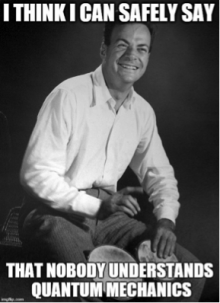{width="70%"}

:::

::: {.column width="55%"}

> "I think I can safely say that nobody understands quantum mechanics."
>
> Richard Feynman

::: {.fragment}

Be prepared to let go of the idea that *"things make sense."*
We can still **master the logic** of QM and apply it everywhere.

:::

:::

::::

## QM is not "just another theory"

::: {.fragment}

In the hierarchy *biology → chemistry → physics → math*,
quantum mechanics sits in a unique spot:

:::

::: {.fragment}

> It is like the **operating system** on which other theories run as "apps."

Translating a classical theory into this OS is what physicists call **quantization**.

:::

::: {.fragment}

::: {.callout-note appearance="minimal"}

Scott Aaronson, *Quantum Computing Since Democritus* (2013)

:::

:::

## Where is quantum mechanics applied?

:::: {.columns}

::: {.column width="50%"}

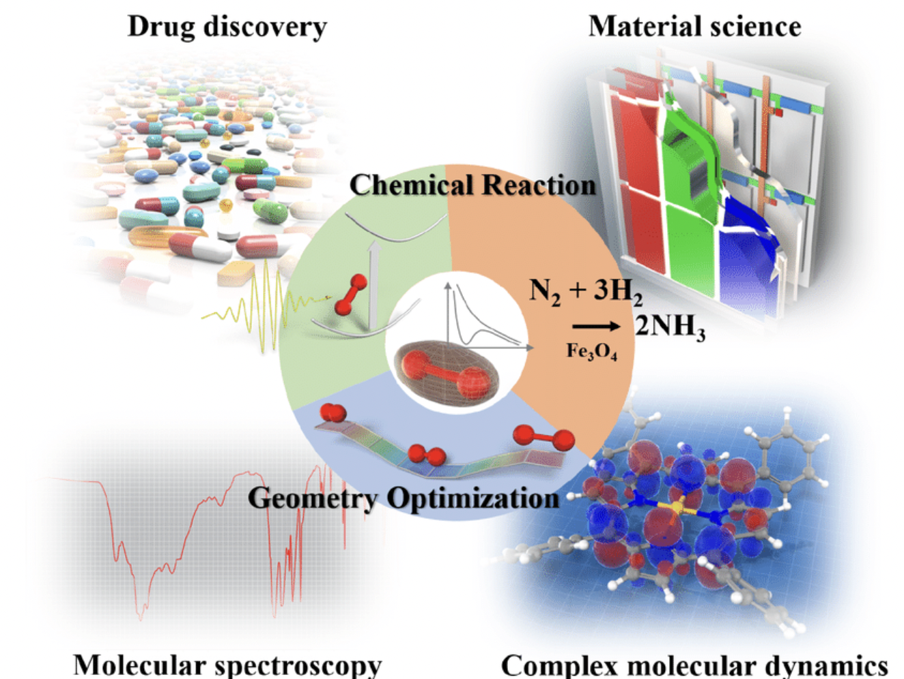{width="90%"}

:::

::: {.column width="50%"}

- Chemistry & materials
- Lasers, LEDs, semiconductors
- MRI & medical imaging
- **Quantum computing**

:::

::::

## Takeaway

> If you feel you don't fully understand QM, you're in good company, with *everyone else*. The goal is to master its **logic**, not its intuition.

## What is the nature of light?

:::: {.columns}

::: {.column width="50%"}

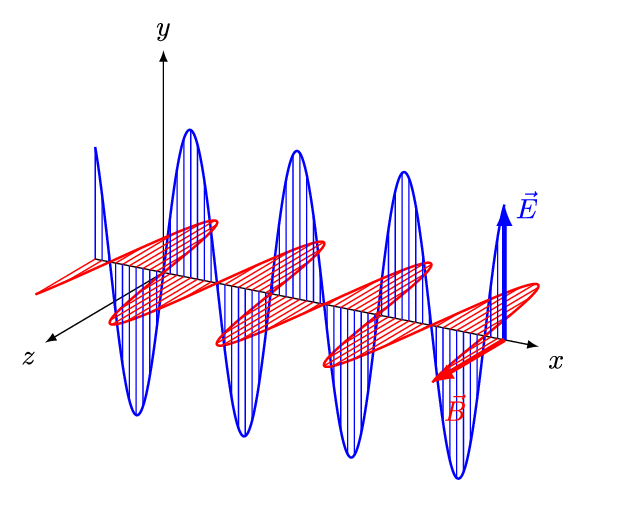{width="90%"}

:::

::: {.column width="50%"}

- Light as a **traveling electromagnetic wave**
- Perpendicular **electric** and **magnetic** components
- Needs **no medium**, travels in vacuum at speed $c$
- This wave picture is **not the whole story**

:::

::::

## The electromagnetic spectrum

:::: {.columns}

::: {.column width="55%"}

{width="95%"}

:::

::: {.column width="45%"}

- **Visible light** is a narrow band
- **High frequency** carries **more energy** (X-rays, gamma)
- **Low frequency** carries **less energy** (microwave, radio)
- Clear link between an object's **temperature** and its radiation

:::

::::

## Frequency, wavelength, speed of light

::: {.fragment}

$$\lambda \nu = c$$

:::

::: {.fragment}

- **Speed of light**: $c = 3 \cdot 10^8 \, m/s$ (fundamental constant)

:::

::: {.fragment}

- **Frequency** $\nu$: cycles per second, $1\,Hz = 1\,s^{-1}$

:::

::: {.fragment}

- **Wavelength** $\lambda$: distance between successive peaks

:::

::: {.fragment}

- Key question: how does **energy** $E$ relate to **frequency** $\nu$?

:::

## The black body

:::: {.columns}

::: {.column width="45%"}

{width="95%"}

:::

::: {.column width="55%"}

- **Idealized model**: absorbs and emits **every wavelength**
- In thermal equilibrium at temperature $T$
- Emitted spectrum set **only by** $T$
- Heating up: (1) **intensity rises**, (2) peak **shifts to higher** $\nu$, (3) color **red to yellow to blue**

:::

::::

## The classical picture

:::: {.columns}

::: {.column width="45%"}

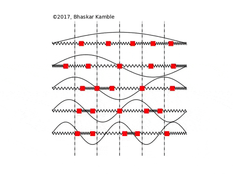{width="95%"}

:::

::: {.column width="55%"}

- Heated atoms vibrate like **springs**, radiating at frequency $\nu$
- More **short-wavelength** modes fit in a box than long ones:
$$dN_{\nu} = \frac{8\pi}{c^3} \cdot \nu^2 d\nu$$
- **Equipartition**: each oscillator gets the same energy
$$\langle E\rangle = k_BT$$

:::

::::

## The ultraviolet catastrophe

:::: {.columns}

::: {.column width="50%"}

{width="90%"}

:::

::: {.column width="50%"}

- Classical radiation distribution:
$$\rho({\nu}) = k_B T \cdot \frac{8\pi}{c^3}\nu^2$$
- **Shoots to infinity** at high $\nu$
- Total radiation would be **infinite**: a light bulb could destroy the universe
- **Classical physics fails**

:::

::::

## Planck's trick: quantization

::: {.fragment}

In 1900 Planck postulated that only **discrete** energy values are allowed:

:::

::: {.fragment}

$$\boxed{E= h\nu}$$

:::

::: {.fragment}

- Planck's constant: $h = 6.63 \cdot 10^{-34} \, \text{J} \cdot \text{s}$

:::

::: {.fragment}

- Atoms absorb and emit radiation in **quanta**, multiples of $h\nu$

:::

::: {.fragment}

- $h$ is tiny, so quantization is **invisible** at the macro scale (classical limit $h \to 0$)

:::

## Planck's radiation law

::: {.fragment}

Quantized oscillators give a **frequency-dependent** average energy:
$$\langle E \rangle = \frac{h\nu}{e^{\frac{h\nu}{ kT}} - 1}$$

:::

::: {.fragment}

This yields a distribution that **vanishes** at high frequency:
$$\rho_{\nu}(T) = \frac{8\pi \nu^2}{c^3} \cdot \frac{1}{e^{\frac{h\nu}{kT}} - 1}$$

:::

::: {.fragment}

- Integrating over all $\nu$ gives a **finite** total: $\int^{\infty}_0 \rho_{\nu}(T)d\nu = \sigma T^4$
- No more catastrophe!

:::

## Wien's displacement law

:::: {.columns}

::: {.column width="45%"}

{width="95%"}

:::

::: {.column width="55%"}

- Peak wavelength is **inversely proportional** to temperature:
$$\lambda_{max} = \frac{b}{T}$$
- $b = 2.898 \cdot 10^{-3} \, m \cdot K$
- Connects an object's **temperature** to its **color**
- Hotter object: **shorter** $\lambda_{max}$ (bluer)

:::

::::

## Takeaway

> Energy is **quantized**: by postulating $E = h\nu$, Planck cured the ultraviolet catastrophe and gave birth to quantum mechanics.

## The Puzzle

:::: {.columns}

::: {.column width="50%"}

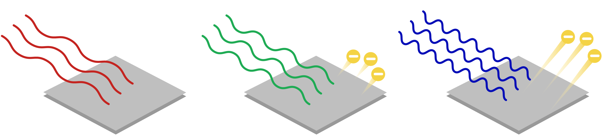{width="90%"}

:::

::: {.column width="50%"}

- Shine radiation on a metal: electrons fly off
- Only **above a threshold frequency** $\nu_0$
- **Below** $\nu_0$: no electrons, no matter how bright
- Frequency increases left to right

:::

::::

## Why Classical Physics Fails

- Classically, energy of a wave scales with **amplitude** (intensity, brightness)
- So a bright enough light *should* always eject electrons
- Experiment says **no**: dim high-frequency light works, intense low-frequency light does not
- **Intensity is the wrong knob.** Frequency is the gatekeeper.

## Enter the Photon

- Planck quantized oscillators: energies $0, h\nu, 2h\nu, 3h\nu, \ldots$ (seen then as a math trick)
- **Einstein**: light itself is a stream of discrete energy packets, **photons**
- This bold step explains the experiment

## Energy of a Photon

::: {.fragment}

$$
E_{photon} = h\nu = \frac{hc}{\lambda}
$$

:::

- $E_{photon}$: energy of one photon
- $\nu$: frequency of that photon
- **Both matter and radiation are quantized**, by the same relation: energy = (Planck constant) times frequency

## Kinetic Energy: Frequency vs Intensity

:::: {.columns}

::: {.column width="50%"}

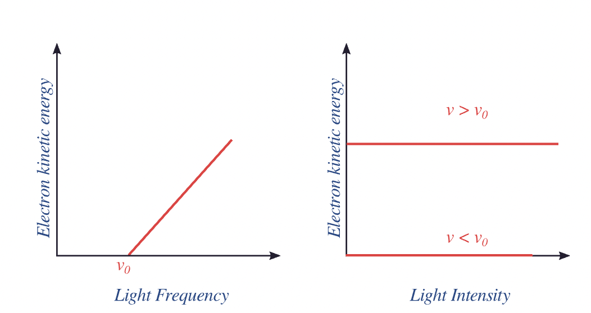{width="90%"}

:::

::: {.column width="50%"}

- Need $\nu > \nu_0$ to eject at all
- **KE grows linearly with frequency**: $KE \sim \nu$
- KE does **not** depend on intensity
- Below $\nu_0$: brighter light still ejects nothing

:::

::::

## Electric Current: Frequency vs Intensity

:::: {.columns}

::: {.column width="50%"}

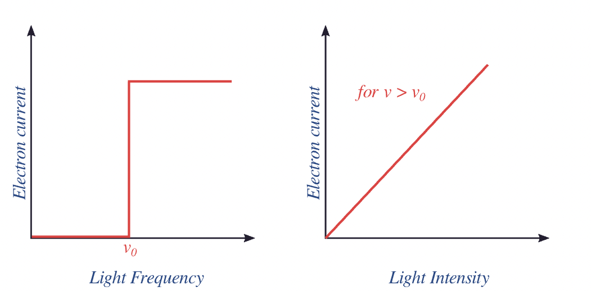{width="90%"}

:::

::: {.column width="50%"}

- Above threshold, **frequency does not change current**
- **Intensity sets the current**: more photons, more electrons
- Current rises **linearly** with intensity

:::

::::

## How Photons Explain It All

- **Intensity** = number of photons (sets the *current*)
- **Frequency** = energy per photon (sets the *KE*)
- $n$ photons per second carry total energy $nh\nu$
- **One photon ejects one electron**, if it carries enough energy

## The Photoelectric Equation

::: {.fragment}

$$E_{photon} = W_0 + KE$$

:::

::: {.fragment}

$$h\nu = h\nu_0 + \frac{mv_e^2}{2}$$

:::

- **Work function** $W_0 = h\nu_0$: minimum energy to free an electron (material dependent)
- $\nu_0$: **threshold frequency**; below it, no energy transfers
- Excess energy becomes electron kinetic energy $KE = mv_e^2/2$

## Why It Matters

:::: {.columns}

::: {.column width="50%"}

{width="90%"}

:::

::: {.column width="50%"}

- Cornerstone of quantum theory
- **Solar cells** and photovoltaics
- **Photoelectron spectroscopy**
- Night vision and detectors

:::

::::

## Takeaway

> Light is quantized into photons: frequency sets each photon's energy (and the ejected electron's kinetic energy), while intensity sets only how many electrons fly off.

## Spectroscopy: Light as a Fingerprint

:::: {.columns}

::: {.column width="50%"}

{width="90%"}

:::

::: {.column width="50%"}

- **Spectroscopy**: interaction of matter and light
- Heated atoms emit at **characteristic frequencies**
- Spectrum is **unique per element**: an atomic fingerprint
- Reveals **structure and composition**

:::

::::

## Discrete Lines, Not a Continuum

:::: {.columns}

::: {.column width="50%"}

{width="90%"}

:::

::: {.column width="50%"}

- Solar spectrum shows **dark and bright lines**
- Lines identify **elements** in the Sun's atmosphere
- Discrete lines are **impossible** in classical mechanics
- A puzzle awaiting a new physics

:::

::::

## The Rydberg Formula

::: {.fragment}

Balmer (1885) fit part of the hydrogen spectrum. Rydberg generalized it:

:::

::: {.fragment}

$$\tilde{\nu} = R_H\left(\frac{1}{n_1^2}-\frac{1}{n_2^2}\right)$$

:::

::: {.fragment}

- $R_H = 1.097 \times 10^7 \ \text{m}^{-1}$ (Rydberg constant)
- $n_1 = 1,2,3,...$ and $n_2 = n_1+1, n_1+2,...$

:::

::: {.fragment}

- Fits the data beautifully, but offers **no physics**
- Why should **integers** govern atomic light?

:::

## Spectral Series

:::: {.columns}

::: {.column width="40%"}

{width="80%"}

:::

::: {.column width="60%"}

- Each **series** = all transitions to one lower level
- **Lyman**: $n_1=1$
- **Balmer**: $n_1=2$
- **Paschen**: $n_1=3$
- Named after their discoverers

:::

::::

## Bohr's Model (1913)

:::: {.columns}

::: {.column width="50%"}

{width="95%"}

:::

::: {.column width="50%"}

- Electron in **circular orbits** around a fixed proton
- New **quantization rule** stops the spiral into the nucleus
- Orbit must hold an **integer number of standing waves**, $n=1,2,3,...$
- Yields discrete **energy levels** labeled by $n$

:::

::::

## Quantized Angular Momentum

::: {.fragment}

Fit an integer number of de Broglie waves around the orbit:

$$2\pi r = n \lambda_e, \qquad \lambda_e = \frac{h}{m_e v}$$

:::

::: {.fragment}

Substituting gives the quantization condition:

$$m_e v r = \frac{n h}{2\pi} = n \hbar$$

:::

::: {.fragment}

- $m_e v r$ is the **angular momentum**
- Bohr: angular momentum is quantized in units of $\hbar$

:::

## Force Balance Sets the Radius

::: {.fragment}

Electrostatic pull balances the centrifugal force:

$$\frac{e^2}{4\pi\varepsilon_0 r^2} = \frac{m_e v^2}{r}$$

:::

::: {.fragment}

Combined with $m_e v r = n\hbar$, the allowed radii are:

$$r = n^2 a_0, \qquad n = 1,2,3,...$$

:::

::: {.fragment}

$$a_0 = \frac{4\pi \varepsilon_0 \hbar^2}{m_e e^2} \approx 0.529 \,\text{Å}$$

:::

::: {.fragment}

- The **Bohr radius** $a_0$ sets the length scale of atoms

:::

## The Bohr Energy Levels

::: {.fragment}

Total energy (kinetic plus Coulomb) at quantized radius:

$$E_n = -\frac{m_e e^4}{8 \varepsilon_0^2 h^2}\cdot\frac{1}{n^2}$$

:::

::: {.fragment}

The practical form for problem solving:

$$E_n = -13.6\,\frac{1}{n^2}\,\,\,[\text{eV}]$$

:::

::: {.fragment}

- **Negative**: electron is bound
- **Ionization** ($n=1 \to \infty$) costs exactly **13.6 eV**
- Photon of a jump: $\Delta E = h\nu$

:::

## Rydberg Constant from First Principles

::: {.fragment}

Photon energy of a transition, $\tilde{\nu} = \nu/c$:

$$\tilde{\nu} = R_H \left(\frac{1}{n_1^2} - \frac{1}{n_2^2}\right)$$

:::

::: {.fragment}

Now $R_H$ is **derived**, not fitted:

$$R_H = \frac{m_e e^4}{8 \varepsilon_0^2 c h^3}$$

:::

::: {.fragment}

- Bohr's model **explains** the empirical Rydberg formula
- The mysterious integers are **quantum numbers**

:::

## Hydrogen-like Atoms

::: {.fragment}

For one-electron ions ($He^+$, $Li^{2+}$), add nuclear charge $Z$:

$$E_n = -13.6\,\frac{Z^2}{n^2}\,\,\,[\text{eV}]$$

:::

::: {.fragment}

- $Z=1$ for $H$, $Z=2$ for $He^+$, $Z=3$ for $Li^{2+}$
- Energies scale as $Z^2$: $He^+$ ionization is **54.4 eV**
- Orbits shrink as $r_n = n^2 a_0 / Z$

:::

## Takeaway

> Atomic spectra are discrete because energy is quantized: Bohr's standing-wave condition fixes the orbits and yields $E_n = -13.6\,/\,n^2$ eV, deriving the empirical Rydberg formula from first principles.

## The Big Idea

- **Particles and waves are not mutually exclusive**
- Every quantum object shows **both** behaviors

::: {.fragment}

- An electron has a **wavelength**; a photon has **momentum**

:::

::: {.fragment}

- Which behavior dominates depends on the **experimental conditions**

:::

## Diffraction and Interference

:::: {.columns}

::: {.column width="50%"}

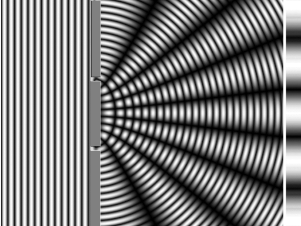{width="90%"}

:::

::: {.column width="50%"}

- **Diffraction:** waves spread around obstacles or through openings
- **Interference:** combined waves add (in phase) or cancel (out of phase)
- **Double slit:** two slits produce interference bands on the screen

:::

::::

## Bragg's Law: X-rays Scatter Off Crystals

:::: {.columns}

::: {.column width="50%"}

{width="90%"}

:::

::: {.column width="50%"}

- X-rays scatter off lattice atoms
- Path differences give **constructive** (left) or **destructive** (right) interference

:::

::::

::: {.fragment}

$$\boxed{2d \sin\theta = n\lambda}$$

:::

::: {.fragment}

- $d$: plane spacing, $\lambda$: wavelength, $n$: diffraction order
- Interference was the **hallmark of wave behavior**

:::

## Electrons Also Diffract

:::: {.columns}

::: {.column width="50%"}

{width="95%"}

:::

::: {.column width="50%"}

- **Davisson and Germer (1925):** intensity peaks in scattered electron beams
- Peaks fit **Bragg's law** (until then only for X-rays)
- Electrons behave as **waves**

:::

::::

## Compton Scattering: Light Has Momentum

:::: {.columns}

::: {.column width="50%"}

{width="90%"}

:::

::: {.column width="50%"}

- X-rays scatter off free electrons like **billiard balls**
- Conservation of **momentum** gives longer outgoing wavelength
- Makes sense only if the photon is a **particle** with momentum

:::

::::

## The de Broglie Relation

- Wave-like and particle-like traits are **inversely proportional**

::: {.fragment}

$$\boxed{\lambda = \frac{h}{p}}$$

:::

::: {.fragment}

- $h$: Planck's constant, $p$: momentum, $\lambda$: wavelength
- **Heavy/fast** objects: tiny wavelength (particle-like)
- **Light/slow** objects: large wavelength (wave-like)

:::

::: {.fragment}

- With $E = T + V$: $\quad \lambda = \dfrac{h}{\sqrt{2m(E - V)}}$
- Wavelength **changes** as a particle moves through different potentials (key for bonding)

:::

## The Double-Slit Puzzle

:::: {.columns}

::: {.column width="50%"}

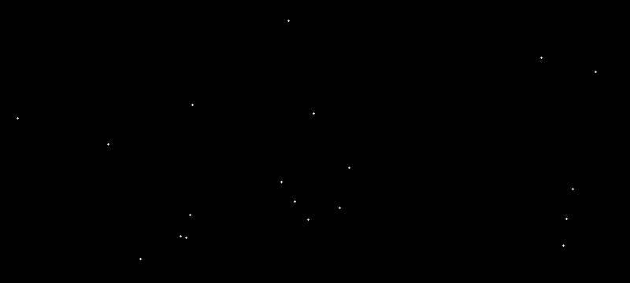{width="90%"}

:::

::: {.column width="50%"}

- Electrons build an **interference pattern**
- It persists even with **one electron at a time**
- Each electron interferes with **itself**

:::

::::

## Which Slit?

:::: {.columns}

::: {.column width="50%"}

{width="90%"}

:::

::: {.column width="50%"}

- Try to detect **which slit** the electron took
- The **interference pattern disappears**
- Measurement changes the outcome (resolved later via QM postulates)

:::

::::

## Heisenberg's Uncertainty Principle

:::: {.columns}

::: {.column width="50%"}

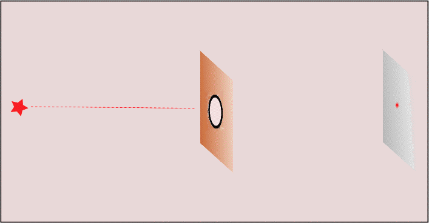{width="90%"}

:::

::: {.column width="50%"}

- Cannot know exact **position and momentum** at once
- Narrow the slit (localize $x$): momentum spreads out
- A direct consequence of **wave-particle duality**

:::

::::

::: {.fragment}

$$\sigma_x \sigma_p \geq \hbar/2$$

:::

## Takeaway

> Every quantum object is both wave and particle, with wavelength set by $\lambda = h/p$, so position and momentum can never both be sharp: $\sigma_x \sigma_p \geq \hbar/2$.

# Chapter 2: Waves and the Wave Equation

## What is a wave?

- A **wave** is a self-propagating **disturbance**
- Transfers **energy, momentum, information**
- Does **not** transport matter
- Governed by the **wave equation**, a PDE

::: {.fragment}

Two key families: **traveling waves** (propagate) and **standing waves** (oscillate in place)

:::

## Kinds of waves

:::: {.columns}

::: {.column width="50%"}

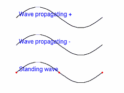{width="90%"}

:::

::: {.column width="50%"}

- **Medium disturbance**: sound, strings, water
- **Quantum waves**: complex wavefunctions for electrons, atoms
- **Electromagnetic waves**: need **no medium**, travel in vacuum
- **Gravitational waves**: ripples in spacetime

:::

::::

## Transverse vs longitudinal

:::: {.columns}

::: {.column width="50%"}

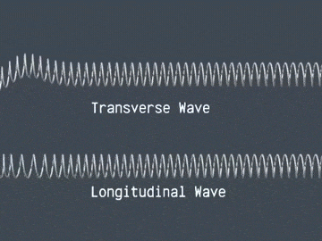{width="90%"}

:::

::: {.column width="50%"}

- **Transverse**: disturbance is **perpendicular** to propagation
- **Longitudinal**: disturbance is **along** propagation

:::

::::

## Defining a wave mathematically

- A disturbance $u$ depends on space and time: $u = f(x, t)$
- A surfer riding the wave sees it frozen at $x'$
- A shore observer sees the front move: $x = x' + vt$

::: {.fragment}

A right-moving wave of fixed shape:

$$u(x,t) = f(x-vt)$$

:::

::: {.fragment}

Set the front constant: $x - vt = const \Rightarrow x = vt + const$ (moves right). The form $f(x+vt)$ moves **left**.

:::

## Periodic traveling waves

:::: {.columns}

::: {.column width="50%"}

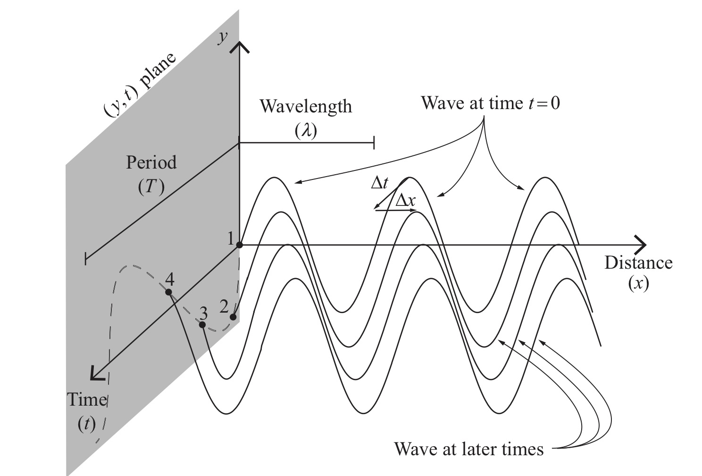{width="90%"}

:::

::: {.column width="50%"}

A sine wave traveling along $x$:

$$y(x,t)= A \sin(kx-\omega t+\phi)$$

- **Amplitude** $A$: max disturbance
- **Wave number** $k$: periodicity in space
- **Angular frequency** $\omega = kv$: periodicity in time
- **Phase** $\phi$: starting point

:::

::::

## Complex representation

- Easier to compute with **complex exponentials**, take real or imaginary part at the end

::: {.fragment}

$$u(x,t) = Ae^{i(kx-\omega t)}$$

:::

:::: {.columns}

::: {.column width="40%"}

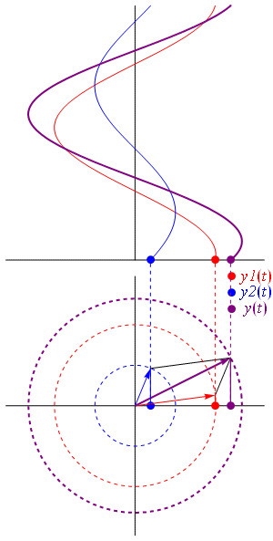{width="80%"}

:::

::: {.column width="60%"}

::: {.fragment}

- Real and imaginary parts are cosine and sine
- The **phasor** rotates as $t$ advances at fixed $x$

:::

:::

::::

## Periodicity in space and time

- Repeats every **wavelength** $\lambda$ in space: $k\lambda = 2\pi$

::: {.fragment}

$$k=\frac{2\pi}{\lambda}$$

:::

- Repeats every **period** $T$ in time, frequency $\nu = 1/T$: $\omega T = 2\pi$

::: {.fragment}

$$\omega=\frac{2\pi}{T} = 2\pi\nu$$

:::

::: {.fragment}

Wavelength, frequency, and speed are linked by $\omega = kv$, i.e. $\lambda \nu = v$

:::

## The classical wave equation

- Two $x$-derivatives: $u_{xx}^{''} = -k^2 u$
- Two $t$-derivatives: $u_{tt}^{''} = -\omega^2 u$
- Take the ratio to eliminate $u$: $\dfrac{k^2}{\omega^2} = \dfrac{1}{v^2}$

::: {.fragment}

$$\frac{\partial^2 u(x,t)}{\partial x^2 } = \frac{1}{v^2}\frac{\partial^2 u(x,t)}{\partial t^2}$$

:::

::: {.fragment}

Solutions are **wave functions** of space and time

:::

## Combining waves: interference

:::: {.columns}

::: {.column width="55%"}

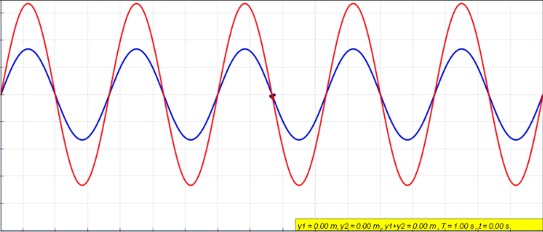{width="95%"}

:::

::: {.column width="45%"}

- **Superposition**: if $u_A$ and $u_B$ solve the wave equation, so does $u_C = u_A + u_B$
- **Interference**: combining waves yields greater, lower, or equal amplitude

:::

::::

## Interference of two phases

:::: {.columns}

::: {.column width="50%"}

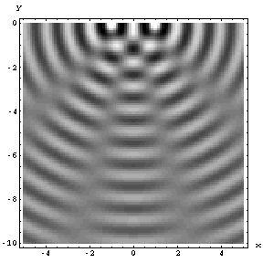{width="90%"}

:::

::: {.column width="50%"}

Summing two waves differing only in phase:

$$\Psi_{\text{total}} = 2 \cos\left( \frac{\phi_1 - \phi_2}{2} \right) e^{i \left( kx - \omega t + \frac{\phi_1 + \phi_2}{2} \right)}$$

- In phase ($\phi=0$): amplitude **doubles**
- Out of phase ($\phi=\pi$): **cancels**

:::

::::

## Takeaway

> A wave is a disturbance described by $u=f(x \pm vt)$ that obeys the classical wave equation $u_{xx} = \frac{1}{v^2}u_{tt}$, with $k=2\pi/\lambda$, $\omega=2\pi\nu$, and $\omega=kv$; superposing waves produces interference.

## The Classical Wave Equation

:::: {.columns}

::: {.column width="50%"}

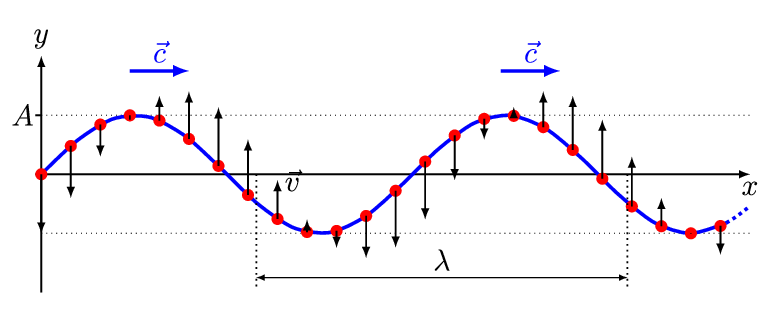{width="90%"}

:::

::: {.column width="50%"}

- A second-order **PDE** for the displacement $u(x,t)$

$$\frac{\partial^2 u(x,t)}{\partial x^2} = \frac{1}{v^2}\frac{\partial^2 u(x,t)}{\partial t^2}$$

- Governs evolution in **space and time**
- Given initial conditions, predicts any complicated wave

:::

::::

## Why a Guitar String?

:::: {.columns}

::: {.column width="50%"}

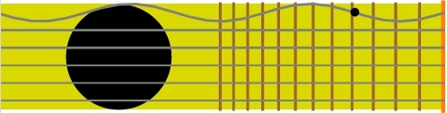{width="90%"}

:::

::: {.column width="50%"}

- A plucked string is the classic **1D wave** system
- Specify initial conditions, predict evolution over space and time
- **Linear** PDE: any combination of solutions is a solution

:::

::::

## The Big Picture: Three Ingredients

- **1. Boundary conditions** (string fixed at both ends):

$$u(0, t) = 0 \quad \text{and} \quad u(L, t) = 0$$

- **2. Separation of variables** (assume $x$, $t$ vary independently):

$$u(x, t) = X(x) \cdot T(t)$$

- **3. Superposition** (linearity lets us sum solutions):

$$u = c_1 u_1+c_2u_2$$

## Step 1: Separate the Variables

- Substitute $u(x,t) = X(x)T(t)$ into the wave equation
- Divide through: each side depends on **one variable only**, so both equal a constant $K$

$$\frac{1}{T(t)v^2}\frac{\partial^2 T(t)}{\partial t^2} = \frac{1}{X(x)}\frac{\partial^2 X(x)}{\partial x^2} = K$$

- One **PDE** becomes two **ODEs**:

$$\frac{\partial^2 T(t)}{\partial t^2} - K T(t) v^2 = 0 \qquad \frac{\partial^2 X(x)}{\partial x^2} - K X(x) = 0$$

## Step 2: The Sign of K Decides

- **Recipe for linear, homogeneous ODEs:** plug in $y \to e^{kx}$, solve the algebraic equation for $k$
- **$K > 0$:** real exponentials, boundary conditions force $X(x) = 0$ (no music!)
- **$K < 0$** (set $K = -\beta^2$): oscillatory solution

$$X(x) = A \cos(\beta x) + B \sin(\beta x)$$

- Boundary conditions: $A = 0$, and $\sin(\beta L) = 0$ for a non-trivial solution

## Normal Modes Emerge

:::: {.columns}

::: {.column width="50%"}

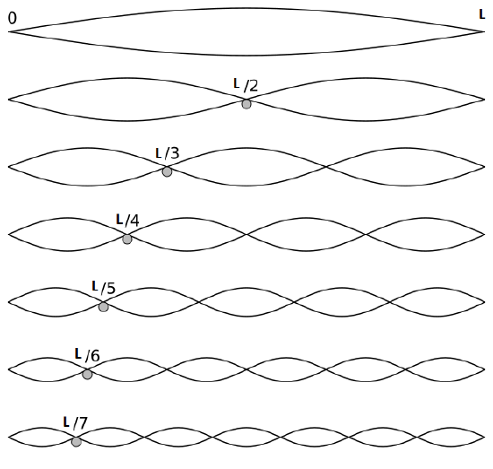{width="90%"}

:::

::: {.column width="50%"}

- $\sin(\beta L) = 0$ quantizes $\beta$:

$$\beta = \frac{n \pi}{L}, \quad n = 1, 2, 3, \ldots$$

- Infinite set of **normal modes**:

$$X(x) = B \sin \left(\frac{n \pi}{L} x \right)$$

:::

::::

## The Temporal Part

- Time has **no boundary conditions**: it marches forward freely
- Solution is oscillatory with mode frequency $\omega_n = \beta v = \frac{n \pi v}{L}$

$$T(t) = D_n \cos(\omega_n t) + E_n \sin(\omega_n t) = A_n \cos (\omega_n t + \phi_n)$$

- Constants $A_n$ and $\phi_n$ are fixed by **initial conditions** (how the string is plucked)

## Step 3: The Full Solution

- Combine spatial and temporal parts, sum over all modes:

$$u(x, t) = \sum_n A_n \sin \left(\frac{n \pi}{L} x \right) \cdot \cos (\omega_n t + \phi_n)$$

- **Nodes** (points fixed at zero) grow with $n$:
  - $n=1$: **0 nodes**, fundamental (first harmonic)
  - $n=2$: 1 node, second harmonic
  - $n=3$: 2 nodes, third harmonic

## Extending to 2D Membranes

:::: {.columns}

::: {.column width="50%"}

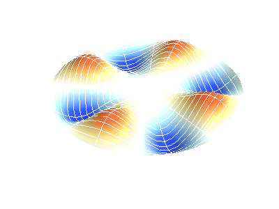{width="90%"}

:::

::: {.column width="50%"}

- Separate **three** functions: $u(x, y, t) = X(x) Y(y) T(t)$
- 2D mode is a product of 1D modes, indexed by $n$ and $m$

$$\omega_{nm} = v\pi \left(\frac{n^2}{a^2} + \frac{m^2}{b^2}\right)^{1/2}$$

:::

::::

## The Sound of Music

:::: {.columns}

::: {.column width="50%"}

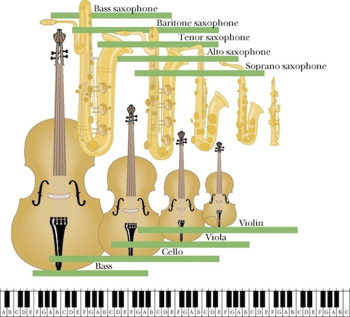{width="90%"}

:::

::: {.column width="50%"}

- Musical sound is a **superposition of normal modes** (harmonics, overtones)
- Instrument **size** sets the frequency range: small = high, large = low

:::

::::

## Takeaway

> Separation of variables plus boundary conditions turns the wave equation into quantized **normal modes**, and any vibration is a superposition of them.

# Chapter 3: The Schrodinger Equation

## Entering the quantum world

:::: {.columns}

::: {.column width="55%"}

::: {.fragment}

- **Classical mechanics fails** at atomic scales

:::

::: {.fragment}

- Need a new equation explaining **energy quantization** and **wave-particle duality**

:::

::: {.fragment}

- **Schrödinger's Equation** is a *fundamental law*: postulated, not derived

:::

::: {.fragment}

- Never failed when applied correctly

:::

:::

::: {.column width="45%"}

:::

::::

## From a wave to a quantum wave

::: {.fragment}

Start with a traveling wave:
$$\Psi(x,t) = Ae^{i(kx-\omega t)}$$

:::

::: {.fragment}

Insert the **de Broglie** and **Planck** relations:
$$p = \hbar k \qquad E = \hbar\omega$$

:::

::: {.fragment}

**Quantum wave function:**
$$\Psi(x,t)=Ae^{\frac{i}{\hbar}(px-E t)}$$

:::

## What equation generates it?

::: {.fragment}

**Time part** returns total energy:
$$\frac{\partial \Psi}{\partial t} = -\frac{i}{\hbar} E\, \Psi$$

:::

::: {.fragment}

**Spatial part** returns kinetic energy:
$$\frac{\partial^2 \Psi}{\partial x^2} = -\frac{2m(E - V)}{\hbar^2}\, \Psi$$

:::

::: {.fragment}

Combine via $K = E - V$ to eliminate $E$.

:::

## Time-Dependent Schrödinger Equation

::: {.fragment}

$$-\frac{\hbar^2}{2m} \frac{\partial^2 \Psi}{\partial x^2} + V(x)\,\Psi = i\hbar \frac{\partial \Psi}{\partial t}$$

:::

::: {.fragment}

- Describes evolution of $\Psi(x,t)$ in a potential $V(x)$

:::

::: {.fragment}

- Only a **single time derivative** (unlike the classical wave equation)

:::

::: {.fragment}

- The $i$ makes solutions **oscillate in the complex plane**

:::

## Anatomy of the equation

:::: {.columns}

::: {.column width="50%"}

:::

::: {.column width="50%"}

::: {.fragment}

- **Kinetic** + **potential** = total energy flow

:::

::: {.fragment}

- $\Psi$ is generally **complex**: not directly measurable

:::

::: {.fragment}

- 1D shown; 3D adds $y, z$ terms

:::

:::

::::

## Separation of variables

::: {.fragment}

Assume $\Psi(x,t) = \psi(x)\,T(t)$.

:::

::: {.fragment}

Time part is a simple oscillation:
$$\Psi(x,t) = \psi(x)\cdot e^{-iEt/\hbar}$$

:::

::: {.fragment}

- The **hard part** is finding $\psi(x)$, set by the potential $V(x)$

:::

## Time-Independent Schrödinger Equation

::: {.fragment}

$$-\frac{\hbar^2}{2m} \frac{\partial^2 \psi}{\partial x^2} + V(x)\,\psi = E\,\psi$$

:::

::: {.fragment}

- Gives the **stationary states** of the system

:::

::: {.fragment}

- Our **primary focus** for the rest of the course

:::

## Operators: the language of QM

:::: {.columns}

::: {.column width="50%"}

:::

::: {.column width="50%"}

::: {.fragment}

- An **operator** $\hat{A}$ transforms a function into another

:::

::: {.fragment}

- Differentiate, multiply, integrate, ...

:::

::: {.fragment}

- The SE is **linear**:
$$\hat{A}[c_1 f_1 + c_2 f_2] = c_1\hat{A}f_1 + c_2\hat{A}f_2$$

:::

:::

::::

## The Hamiltonian

::: {.fragment}

**Classical** total energy:
$$H(x,p) = \frac{p^2}{2m} + V(x)$$

:::

::: {.fragment}

**Quantum** Hamiltonian operator:
$$\hat{H} = \hat{K} + \hat{V} = -\frac{\hbar^2}{2m} \frac{\partial^2}{\partial x^2} + V(x)$$

:::

::: {.fragment}

The SE in operator form:
$$\hat{H}\psi = i\hbar \frac{\partial \psi}{\partial t}$$

:::

## Correspondence principle

::: {.fragment}

Every classical observable has a **quantum operator**:

:::

::: {.fragment}

| Observable | Classical | Quantum |
|:---:|:---:|:---:|
| Position | $x$ | $\hat{x}=x$ |
| Momentum | $p$ | $\hat{p}=-i\hbar \frac{\partial}{\partial x}$ |
| Kinetic energy | $\frac{p^2}{2m}$ | $\hat{K}=\frac{\hat{p}^2}{2m}$ |
| Total energy | $H$ | $\hat{H}=\hat{K}+\hat{V}$ |

:::

## Eigenvalues and eigenfunctions

:::: {.columns}

::: {.column width="48%"}

:::

::: {.column width="52%"}

::: {.fragment}

The TI-SE is an **eigenvalue problem**:
$$\boxed{\hat{H} \psi_n = E_n \psi_n}$$

:::

::: {.fragment}

- $\psi_n$: **eigenfunctions** (wave functions)

:::

::: {.fragment}

- $E_n$: **eigenvalues** (energies)

:::

::: {.fragment}

- General state: $\psi = \sum_n c_n \psi_n f_n(t)$

:::

:::

::::

## Takeaway

> Solving a quantum system means finding the eigenfunctions $\psi_n$ and eigenvalues $E_n$ of its Hamiltonian: $\hat{H}\psi_n = E_n \psi_n$.

## A Probabilistic World

- The quantum world is **fundamentally probabilistic**.

- Certainty is replaced by **probabilities**.

- The wavefunction $\psi$ is the central object.

::: {.fragment}

**Key question:** what does $\psi$ actually mean?

:::

## What is $\psi$?

- Classically, a wave amplitude is a **physical displacement** (a guitar string).

- The quantum $\psi$ is generally **complex**.

::: {.fragment}

- $\psi$ itself has **no direct physical meaning**.

:::

::: {.fragment}

- We must extract **real, measurable** quantities from it.

:::

## The Born Rule

The absolute square is a **probability density**:

$$p(x) = \psi^{*}(x) \cdot \psi(x) = |\psi(x)|^2$$

::: {.fragment}

- $p(x)\,dx$ = probability of finding the particle in $[x, x+dx]$.

:::

::: {.fragment}

- In 3D: $\quad p(x,y,z) = \psi(x,y,z)^{*} \cdot \psi(x,y,z)$

:::

## Rules of Probability

- **Non-negative:** $\quad p(x) \geq 0$

- **Normalized:**

$$\int_{-\infty}^{\infty} p(x)\,dx = 1$$

::: {.fragment}

- **Mean:** $\quad \mu = \langle x \rangle = \int_{-\infty}^{\infty} x\,p(x)\,dx$

:::

::: {.fragment}

- **Variance:** $\quad \sigma^2 = \langle x^2 \rangle - \langle x \rangle^2$

:::

## Normalization

A wavefunction must be **normalizable** to be a true probability distribution.

$$\int^{+\infty}_{-\infty} |\psi(x)|^2\, dx = 1$$

::: {.fragment}

- Guarantees the particle is **somewhere** in space.

:::

::: {.fragment}

- Fix the constant in $\psi = N\psi'$ by enforcing this condition.

:::

## Normalization Example

Normalize $\psi(x) = C\,x$ on $[0,1]$:

$$C^2 \int_0^1 x^2\, dx = C^2 \cdot \frac{1}{3} = 1$$

::: {.fragment}

$$C = \sqrt{3} \quad \Rightarrow \quad \psi(x) = \sqrt{3}\,x$$

:::

## Probability in a Region

Integrate the density over the region of interest:

$$p(a<x<b) = \int_a^b |\psi(x)|^2\, dx$$

::: {.fragment}

For $\psi = \sqrt{3}\,x$, so $p(x) = 3x^2$:

$$P(0.3<x<0.6) = 0.6^3 - 0.3^3 = 0.189$$

:::

## Expectation Values

Weight values by their probability:

$$\langle x \rangle = \int x \cdot p(x)\, dx$$

::: {.fragment}

Any function of $x$:

$$\langle f \rangle = \int f(x) \cdot p(x)\, dx$$

:::

## Observables Are Operators

Momentum and energy are **operators**, not simple functions:

$$\langle A \rangle = \int \psi^{*}(x) \cdot \hat{A}\, \psi(x)\, dx$$

::: {.fragment}

- $\hat{p} = -i\hbar\dfrac{d}{dx}$

:::

::: {.fragment}

- $\hat{H} = -\dfrac{\hbar^2}{2m}\dfrac{d^2}{dx^2} + V(x)$

:::

## Operators in Action

Particle in a box, $\psi_n(x) = \sqrt{2}\sin(n\pi x)$:

::: {.fragment}

$$\langle p \rangle = \int_0^1 \psi_n^*(-i\hbar)\psi_n'\, dx = 0$$

:::

::: {.fragment}

$$\langle p^2 \rangle = (n\pi\hbar)^2 \quad\Rightarrow\quad \langle E \rangle = \frac{(n\pi\hbar)^2}{2m}$$

:::

## Takeaway

> The wavefunction is a **probability amplitude**: $|\psi|^2$ is the probability density, normalization makes it certain the particle exists, and observables are expectation values of operators sandwiched in $\psi^{*}\hat{A}\psi$.

## Classical vs Quantum

:::: {.columns}

::: {.column width="50%"}

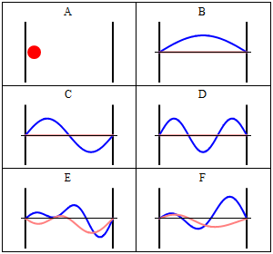{width="100%"}

:::

::: {.column width="50%"}

- A particle trapped in a region $[0, L]$
- **Classical**: bounces freely, found **everywhere** with equal probability

::: {.fragment}

- **Quantum**: described by a wavefunction $\psi(x)$, found in some regions with **high** probability, others with **zero**

:::

::: {.fragment}

- Wavefunctions are **standing waves**, but with a **probabilistic** meaning

:::

:::

::::

## The Model

:::: {.columns}

::: {.column width="45%"}

{width="100%"}

:::

::: {.column width="55%"}

**Infinite walls** confine the particle:

$$V(x) = \begin{cases} \infty & x = 0 \text{ or } x = L \\ 0 & 0 < x < L \end{cases}$$

::: {.fragment}

**Boundary conditions:**
$$\psi(0) = \psi(L) = 0$$

:::

::: {.fragment}

Inside, only **kinetic energy**:
$$\hat{H} = -\frac{\hbar^2}{2m}\frac{d^2}{dx^2}$$

:::

:::

::::

## Solving the Schrödinger Equation

The eigenvalue problem $\hat{H}\psi = E\psi$ becomes

$$\psi''(x) = -k^2\psi(x), \qquad k^2 = \frac{2mE}{\hbar^2}$$

::: {.fragment}

General solution:
$$\psi(x) = A\cos(kx) + B\sin(kx)$$

:::

::: {.fragment}

- $\psi(0)=0 \Rightarrow A = 0$
- $\psi(L)=0 \Rightarrow \sin(kL) = 0$

:::

## Quantization Emerges

The wall condition forces

$$kL = n\pi \quad\Rightarrow\quad k = \frac{n\pi}{L}, \quad n = 1, 2, 3, \dots$$

::: {.fragment}

Energy is **quantized**:
$$E_n = \frac{n^2 h^2}{8mL^2}$$

:::

::: {.fragment}

> Confining a wave to a finite space forces **discrete** energy levels. Atoms, molecules, and solids inherit their quantized levels this way.

:::

## Normalization Fixes the Amplitude

Require total probability of $1$:

$$\int_0^L \psi_n(x)^2\, dx = 1$$

::: {.fragment}

Using $\sin^2\theta = \tfrac{1}{2}(1-\cos 2\theta)$ gives $\tfrac{B_n^2}{2}L = 1$, so

$$B_n = \sqrt{\frac{2}{L}}$$

:::

## The 1D Eigenstates

:::: {.columns}

::: {.column width="48%"}

{width="100%"}

:::

::: {.column width="52%"}

$$\psi_n(x) = \left(\frac{2}{L}\right)^{1/2}\sin\frac{n\pi x}{L}$$

$$E_n = \frac{n^2 h^2}{8mL^2}$$

::: {.fragment}

- **Higher $n$**: more curvature, more energy
- State $n$ has $n-1$ **nodes** where $|\psi_n|^2 = 0$

:::

:::

::::

## Zero-Point Energy

The lowest state $n=1$ has **nonzero** energy:

$$E_1 = \frac{h^2}{8mL^2} \neq 0$$

::: {.fragment}

- Energy is purely kinetic, so a quantum particle is **never at rest**

:::

::: {.fragment}

- Level spacing grows with $n$:
$$E_{n+1} - E_n = (2n+1)\frac{h^2}{8mL^2}$$

:::

::: {.fragment}

> Smaller box means larger spacing. Quantum effects dominate when a particle is tightly confined.

:::

## Nodes and Non-Uniform Probability

- $|\psi_n|^2$ is **not** uniform, unlike the classical prediction
- **Nodes**: points where probability is exactly **zero**

::: {.fragment}

- State $n$ has $n-1$ nodes at $x = \frac{L}{n}, \frac{2L}{n}, \dots, \frac{(n-1)L}{n}$

:::

::: {.fragment}

- The existence of nodes is the signature of **wave-like** behavior

:::

::: {.fragment}

- Yet for any $n$: $\langle x \rangle = \frac{L}{2}$ and $\langle p \rangle = 0$ by symmetry

:::

## Pure vs Mixed States

**Pure state** (single eigenstate): probability is **time-independent**

$$|\psi_n(x,t)|^2 = |\psi_n(x)|^2$$

::: {.fragment}

**Mixed state** (superposition): probability **oscillates** in time

$$\psi(x,t) = c_1\psi_1 e^{-iE_1 t/\hbar} + c_2\psi_2 e^{-iE_2 t/\hbar}$$

:::

::: {.fragment}

- Interference term beats at frequency $(E_1 - E_2)/\hbar$

:::

## The 3D Box

:::: {.columns}

::: {.column width="42%"}

{width="100%"}

:::

::: {.column width="58%"}

Separable solution $\psi = X(x)Y(y)Z(z)$:

$$\psi = \sqrt{\frac{8}{abc}}\sin\frac{n_x\pi x}{a}\sin\frac{n_y\pi y}{b}\sin\frac{n_z\pi z}{c}$$

$$E_{n_x,n_y,n_z} = \frac{h^2}{8m}\left(\frac{n_x^2}{a^2} + \frac{n_y^2}{b^2} + \frac{n_z^2}{c^2}\right)$$

:::

::::

::: {.fragment}

- When $a = b = c$, different $(n_x, n_y, n_z)$ can share one energy: **degeneracy**
- **Degeneracy arises from symmetry**

:::

## Takeaway

> Confining a quantum wave to a box quantizes its energy as $E_n = \frac{n^2 h^2}{8mL^2}$, forbids rest through zero-point energy, and carves the probability into nodes, with symmetry producing degeneracy in higher dimensions.

## Why a Toy Model Matters

::: {.fragment}

The **particle in a box** is exactly solvable.

:::

::: {.fragment}

It also **predicts real chemistry**: light absorbed by dye-like molecules.

:::

::: {.fragment}

Key idea: **delocalized $\pi$-electrons** behave like particles trapped in a 1D box.

:::

## $\pi$-Electrons as Confined Particles

:::: {.columns}

::: {.column width="55%"}

::: {.fragment}

Conjugated chains: **alternating single and double bonds**.

:::

::: {.fragment}

$\pi$-electrons are **delocalized** over the chain.

:::

::: {.fragment}

Box length $L$ = **length of the conjugated region**.

:::

:::

::: {.column width="45%"}

:::

::::

## The Model System: Butadiene

:::: {.columns}

::: {.column width="50%"}

::: {.fragment}

**Butadiene** $\text{C}_4\text{H}_6$: four carbons, **4 $\pi$-electrons**.

:::

::: {.fragment}

C–C single bond: **1.54 Å**

:::

::: {.fragment}

C=C double bond: **1.34 Å**

:::

:::

::: {.column width="50%"}

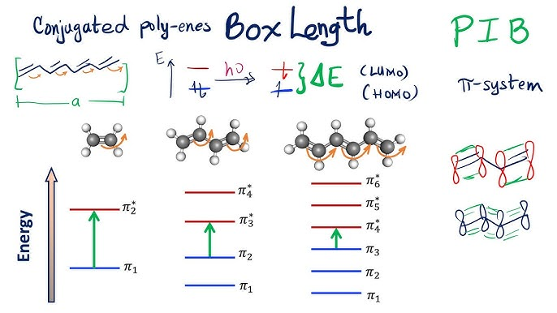

:::

::::

## Step 1: Box Length

::: {.fragment}

Sum the bond lengths across the conjugated chain.

:::

::: {.fragment}

$$
L = 1.54\, \text{Å} + 1.34\, \text{Å} + 1.54\, \text{Å} = 4.42\, \text{Å}
$$

:::

::: {.fragment}

Each C contributes **one $\pi$-electron** $\rightarrow$ **4 electrons** total.

:::

## Step 2: Energy Levels

::: {.fragment}

1D particle-in-a-box energies:

:::

::: {.fragment}

$$
E_n = \frac{n^2 h^2}{8mL^2}
$$

:::

::: {.fragment}

$n = 1, 2, 3, \dots$, $\;m$ = electron mass, $\;L$ = box length.

:::

## Step 3: Fill and Excite

::: {.fragment}

4 electrons, 2 per level $\rightarrow$ fill $n=1$ and $n=2$.

:::

::: {.fragment}

**HOMO** $= n=2$, **LUMO** $= n=3$.

:::

::: {.fragment}

Absorption promotes one electron: $n=2 \rightarrow n=3$.

:::

## Step 4: Photon Wavelength

::: {.fragment}

Transition energy:
$$
\Delta E = E_{n+1} - E_n
$$

:::

::: {.fragment}

Set equal to photon energy:
$$
\Delta E = \frac{hc}{\lambda}
$$

:::

::: {.fragment}

Solve for $\lambda$ $\rightarrow$ the **color absorbed**.

:::

## The Trend: Longer Chain, Redder Light

::: {.fragment}

$\Delta E \propto \dfrac{1}{L^2}$

:::

::: {.fragment}

Bigger conjugation $\rightarrow$ **smaller $\Delta E$** $\rightarrow$ **longer $\lambda$**.

:::

::: {.fragment}

Explains why extended dyes are **deeply colored**.

:::

## Beyond 1D: 2D Box

::: {.fragment}

Aromatic rings and **graphene fragments**: confine in two directions.

:::

::: {.fragment}

$$
E_{n_x,n_y} = \frac{h^2}{8m} \left( \frac{n_x^2}{L_x^2} + \frac{n_y^2}{L_y^2} \right)
$$

:::

::: {.fragment}

Same physics, **two quantum numbers**.

:::

## Takeaway

> The particle in a box turns a length and an electron count into a predicted absorption wavelength: longer conjugation gives a smaller gap and redder color.

## Quantum objects go where classical ones cannot

:::: {.columns}

::: {.column width="55%"}

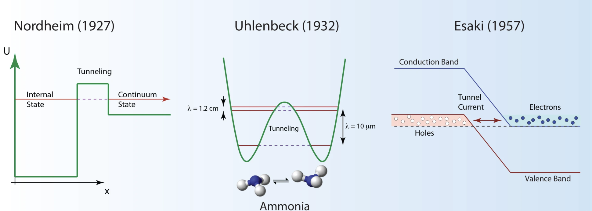

:::

::: {.column width="45%"}

::: {.fragment}

- **Tunneling** into classically forbidden regions

:::

::: {.fragment}

- Electron emission, **ammonia inversion**, tunnel diodes

:::

::: {.fragment}

- The **finite well** is the realistic model that allows it

:::

:::

::::

## Reading a wavefunction qualitatively

:::: {.columns}

::: {.column width="50%"}

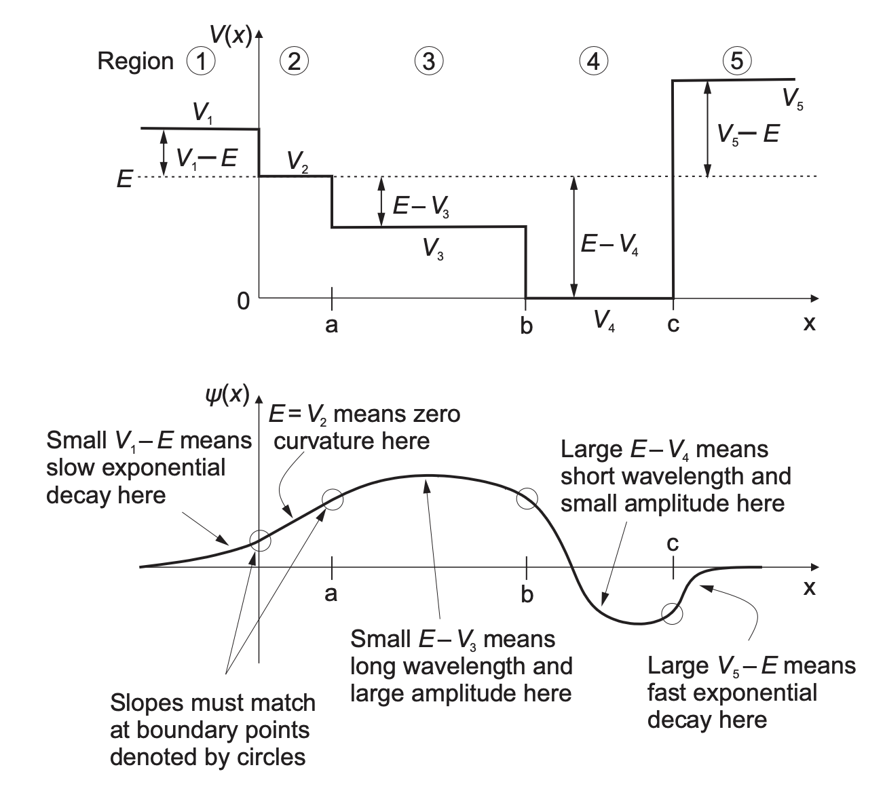

:::

::: {.column width="50%"}

::: {.fragment}

- **Curvature** is set by the sign of $E - V$

:::

::: {.fragment}

- $E > V$: $\psi$ **oscillates**, curves toward axis

:::

::: {.fragment}

- $E < V$: $\psi$ **decays**, curves away from axis

:::

:::

::::

## Curvature follows the potential

:::: {.columns}

::: {.column width="50%"}

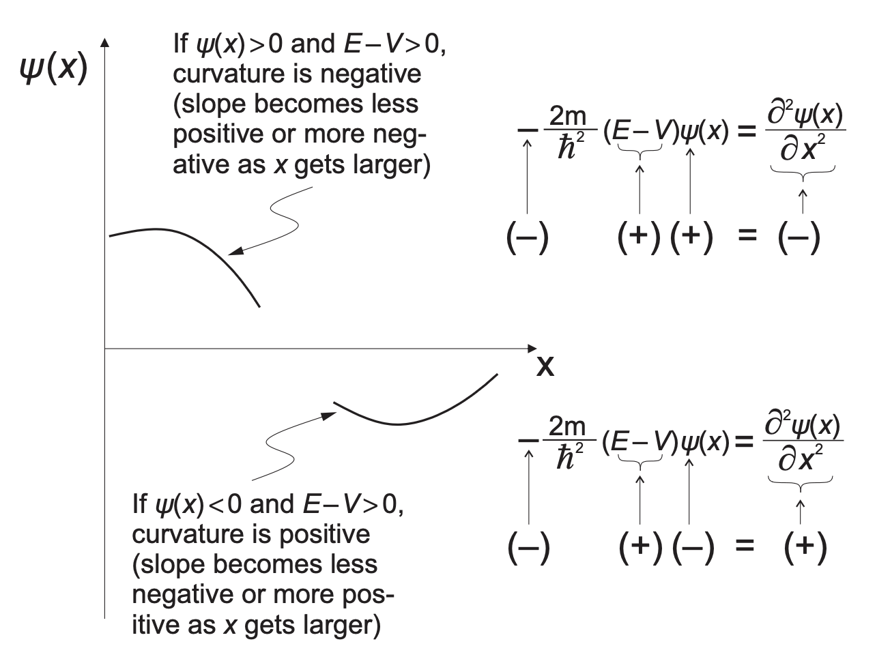

:::

::: {.column width="50%"}

::: {.fragment}

- A **stepped potential** changes the local wavelength

:::

::: {.fragment}

- Higher kinetic energy means **shorter wavelength**

:::

::: {.fragment}

- $\psi$ stays smooth and continuous everywhere

:::

:::

::::

## Three regions, three solutions

The finite square well: $V=0$ inside, $V=V_0$ outside.

::: {.fragment}

$$
-\frac{\hbar^2}{2m}\frac{d^2\psi(x)}{d{x}^2}+V(x)\psi(x) =E\psi(x)
$$

:::

::: {.fragment}

$$
\begin{gathered}
\text{Region I:  }  V(x) = V_0 ~~~~~~~~~~~~~~~~ x \leq-\frac{L}{2} ~~~~~ \psi_{I} = A e^{\beta  x} \\
\text{Region II: }  V(x) = 0 ~~~ -\frac{L}{2} \leq x \leq\frac{L}{2} ~~~~~~~ \psi_{II} = B \cos(k x) + C \sin(k x)\\
\text{Region III:}  V(x) = V_0 ~~~~~~~~~~~~~~  x \geq \frac{L}{2}  ~~~~~~~ \psi_{III} = D e^{-\beta x}
\end{gathered}
$$

:::

## Inside vs outside the well

:::: {.columns}

::: {.column width="50%"}

**Inside** ($E > V$)
$$
\psi(x)=A\sin(kx)+B\cos(kx)
$$

::: {.fragment}

Oscillatory.

:::

:::

::: {.column width="50%"}

**Outside** ($E < V_0$)

::: {.fragment}

$$
k^2 = \frac{2m(V_0 - E)}{\hbar^2}
$$

:::

::: {.fragment}

Real $\beta$: **exponential decay**, an evanescent wave.

:::

:::

::::

## Why continuity matters

:::: {.columns}

::: {.column width="50%"}

:::

::: {.column width="50%"}

::: {.fragment}

- Match $\psi$ **and** $\psi'$ at each boundary

:::

::: {.fragment}

$$
\psi_{I}\!\left(-\tfrac{L}{2}\right) = \psi_{II}\!\left(-\tfrac{L}{2}\right)
$$

:::

::: {.fragment}

- $\psi'$ continuous so $\psi''$ exists

:::

::: {.fragment}

- $\psi''$ is the **kinetic energy** operator: must be defined

:::

:::

::::

## Even and odd solutions

The well is **symmetric** about $x=0$, so states split by parity.

:::: {.columns}

::: {.column width="50%"}

::: {.fragment}

**Even** ($\psi(x)=\psi(-x)$)
$$
\psi_{II}(x) = B \cos(k x)
$$
$$
\beta = k\tan\left(k\frac{L}{2}\right)
$$

:::

:::

::: {.column width="50%"}

::: {.fragment}

**Odd** ($\psi(x)=-\psi(-x)$)
$$
\psi_{II}(x) = C \sin(k x)
$$
$$
\beta = -\frac{k}{\tan\left(k\frac{L}{2}\right)}
$$

:::

:::

::::

::: {.fragment}

No closed form: solve **graphically or numerically**.

:::

## Wavefunctions leak out

:::: {.columns}

::: {.column width="55%"}

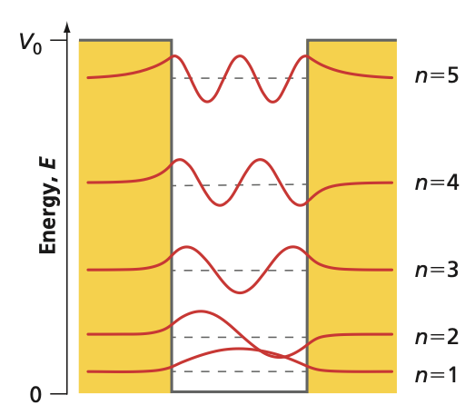

:::

::: {.column width="45%"}

::: {.fragment}

- $\psi$ extends into the **classically forbidden** region

:::

::: {.fragment}

- Green area: probability of being **outside** the well

:::

::: {.fragment}

- Leakage **grows** as $V_0 - E \to 0$

:::

:::

::::

## Tunneling probability

The chance of finding the particle outside the box:

::: {.fragment}

$$
P\left(-\frac{L}{2}>x>\frac{L}{2}\right)=\frac{\int^{\frac{-L}{2}}_{-\infty} |\psi(x)|^2\ dx +\int^{+\infty}_{\frac{L}{2}} |\psi(x)|^2\ dx }{\int_{-\infty}^{+\infty} |\psi(x)|^2\ dx }
$$

:::

::: {.fragment}

- States **near the top** of the well tunnel most

:::

## Finite vs infinite well

::: {.fragment}

- Finite well has a **finite number** of bound states

:::

::: {.fragment}

- Low states: energies nearly **match** the infinite well

:::

::: {.fragment}

- High states: $\psi$ spreads out, **longer wavelength**

:::

::: {.fragment}

- Longer wavelength means smaller $k$, so **lower energy**

:::

## Takeaway

> Wavefunctions stay smooth, curving and decaying according to $E - V$, and they leak into forbidden regions, giving the finite well its tunneling and its limited set of bound states.

## Observables become operators

Every measurable quantity has a **corresponding operator** (the hat $\hat{}$).

::: {.fragment}

**Position** multiplies by $x$:
$$\hat{x} = x$$

:::

::: {.fragment}

**Momentum** differentiates, then scales by $-i\hbar$:
$$\hat{p}_x = -i\hbar\frac{d}{dx}$$

:::

::: {.fragment}

**Recipe:** take the classical expression, replace $x$ and $p$ by their operators.

:::

## Operators are linear

Inherited from the linear Schrodinger equation.

::: {.fragment}

$$\hat{A}(\psi_1 + \psi_2) = \hat{A}\psi_1 + \hat{A}\psi_2$$

:::

::: {.fragment}

$$\hat{A}(c\psi) = c\hat{A}\psi$$

:::

::: {.fragment}

$\hat{x}$, $\hat{p}_x$, and $\hat{H}$ all satisfy this.

:::

## The commutator

Order of operations matters, just like matrices ($AB \neq BA$).

::: {.fragment}

$$\left[\hat{A},\hat{B}\right]f = \left(\hat{A}\hat{B} - \hat{B}\hat{A}\right)f$$

:::

::: {.fragment}

- **Zero** commutator: order does not matter.
- **Non-zero** commutator: order matters.

:::

::: {.fragment}

$$\left[A,A^n\right] = 0, \qquad \left[A,B\right] = -\left[B,A\right]$$

:::

## The canonical commutator

Position and momentum **do not commute**.

::: {.fragment}

$$\hat{p}_x\hat{x}\psi = \frac{\hbar x}{i}\frac{d\psi}{dx} + \frac{\hbar}{i}\psi, \qquad \hat{x}\hat{p}_x\psi = \frac{\hbar x}{i}\frac{d\psi}{dx}$$

:::

::: {.fragment}

$$\left[\hat{p}_x,\hat{x}\right] = \frac{\hbar}{i} \qquad\Longleftrightarrow\qquad \left[\hat{x},\hat{p}_x\right] = i\hbar$$

:::

::: {.fragment}

This single line drives the uncertainty principle.

:::

## Commutators set measurement limits

For any non-commuting $\hat{A}$ and $\hat{B}$:

::: {.fragment}

$$\Delta A\,\Delta B \ge \frac{1}{2}\left|\left\langle\left[\hat{A},\hat{B}\right]\right\rangle\right|$$

:::

::: {.fragment}

Apply it to $\hat{x}$ and $\hat{p}_x$:
$$\Delta x\,\Delta p_x \ge \frac{\hbar}{2}$$

:::

::: {.fragment}

**Position and momentum cannot be measured precisely at once.**

:::

## Commuting operators share eigenfunctions

$$[\hat{A},\hat{B}]=0 \;\Longrightarrow\; \hat{A}\phi_k = a_k\phi_k,\quad \hat{B}\phi_k = b_k\phi_k$$

::: {.fragment}

Both observables measured **simultaneously** in one experiment.

:::

::: {.fragment}

$\hat{T}$ and $\hat{p}_x$ commute (measure together):
$$\left[\hat{T},\hat{p}_x\right] = \left[\frac{\hat{p}_x^2}{2m},\hat{p}_x\right] = 0$$

:::

::: {.fragment}

But $\hat{x}$ and $\hat{p}_x$ do **not**.

:::

## Expectation values

Average outcome of many measurements.

::: {.fragment}

$$\langle A \rangle = \int \psi^* \hat{A}\,\psi \, d\tau$$

:::

::: {.fragment}

If $\psi$ is an eigenfunction, $\hat{A}\psi = a\psi$, then
$$\langle A \rangle = a\int \psi^*\psi\,d\tau = a$$

:::

::: {.fragment}

The expectation value collapses to the **eigenvalue**.

:::

## Dirac notation

A compact, representation-free language.

::: {.fragment}

**Ket** $|\psi\rangle$, **bra** $\langle\psi|$, inner product
$$\langle \phi | \psi \rangle = \int \phi^*(r)\,\psi(r)\,d\tau$$

:::

::: {.fragment}

Expectation value becomes one symbol:
$$\langle A \rangle = \langle \psi | \hat{A} | \psi \rangle$$

:::

## Adjoint and Hermitian operators

The **adjoint** $\hat{A}^\dagger$ is defined through the inner product:

::: {.fragment}

$$\langle \phi | \hat{A}\psi \rangle = \langle \hat{A}^\dagger \phi | \psi \rangle$$

:::

::: {.fragment}

For matrices, the adjoint is the **conjugate transpose**, $(A^\dagger)_{jk} = A_{kj}^*$.

:::

::: {.fragment}

An operator is **Hermitian** (self-adjoint) when
$$\hat{A} = \hat{A}^\dagger, \qquad \langle \phi | \hat{A}\psi \rangle = \langle \hat{A}\phi | \psi \rangle$$

:::

## Why Hermitian operators matter

Observables are represented by **Hermitian operators**.

::: {.fragment}

**Real eigenvalues** (only real numbers can be measured):
$$\hat{A}|\psi\rangle = a|\psi\rangle \implies a \in \mathbb{R}$$

:::

::: {.fragment}

**Orthogonal eigenfunctions** for distinct eigenvalues:
$$\langle \psi_m | \psi_n \rangle = 0 \quad (m \ne n)$$

:::

::: {.fragment}

The quantum analog of symmetric matrices.

:::

## Takeaway

> Observables are linear Hermitian operators with real eigenvalues, and their commutators decide which quantities can be known at once: $[\hat{x},\hat{p}_x]=i\hbar$ forbids sharp position and momentum together.

## The Eigenvalue Equation

An operator acting on its **eigenfunction** returns the same function, scaled.

$$\hat{A}\psi_n = A_n\psi_n$$

::: {.fragment}

- $\psi_n$: **eigenfunctions**
- $A_n$: **eigenvalues**

:::

::: {.fragment}

Boundary conditions fix how many solutions exist: **finite or infinite**.

:::

## In Matrix Form

Numerically, operators become **matrices**, eigenfunctions become **eigenvectors**.

$$Av = \lambda v$$

::: {.fragment}

- $v$: eigenvector, $\lambda$: eigenvalue
- An $N \times N$ matrix has **at most $N$ eigenvalues**

:::

## Eigenvalues Are What We Measure

**Hermitian operators** describe observables.

$$\langle \phi \mid \hat{H} \mid \psi \rangle = \langle \psi \mid \hat{H}\mid \phi \rangle^*$$

::: {.fragment}

Three consequences:
- **Eigenvalues are real**: $\;E_n = E_n^*$
- **Eigenfunctions are orthogonal**: $\;\langle \psi_n \mid \psi_m\rangle = \delta_{nm}$
- **Eigenfunctions form a complete basis**

:::

## A Complete Basis Set

Eigenfunctions of a Hermitian operator span the space, like **unit vectors**.

$$\mid f\rangle = \sum_i c_i \mid \psi_i \rangle$$

::: {.fragment}

Any wavefunction can be **expanded** in the eigenfunctions of any observable.

:::

## Wavefunction as Superposition

A state is a **linear superposition** of the eigenfunctions of $\hat{A}$.

$$\mid \psi \rangle = \sum_n c_n \mid \phi_n \rangle$$

::: {.fragment}

The coefficients are **projections** onto each eigenfunction:

$$c_n = \langle n \mid \psi \rangle$$

:::

## Probabilistic Meaning

The **squared coefficients** are probabilities.

$$p_n = \mid c_n \mid^2$$

::: {.fragment}

$$\sum_n \mid c_n \mid^2 = \sum_n p_n = 1$$

:::

::: {.fragment}

Measuring $\hat{A}$ yields eigenvalue $A_n$ with probability $p_n$.

:::

## Expectation Value

The average is a **probability-weighted sum of eigenvalues**.

$$\langle E\rangle = \langle \psi \mid \hat{H}\mid \psi \rangle$$

::: {.fragment}

For $\mid \psi \rangle = c_1\mid 1\rangle + c_2\mid 2\rangle$:

$$\langle E\rangle = \mid c_1\mid^2 E_1 + \mid c_2\mid^2 E_2 = p_1 E_1 + p_2 E_2$$

:::

## Measurement and Collapse

In any single experiment you obtain **one** eigenvalue.

$$\mid \psi \rangle \rightarrow \mid \phi_n \rangle$$

::: {.fragment}

The superposition **collapses** to a single eigenfunction.

:::

::: {.fragment}

**Orthogonality** means **mutually exclusive** outcomes:

$$\langle \phi_1 \mid \phi_2 \rangle = 0$$

:::

## Schrödinger's Cat

A radioactive atom in **superposition** of decayed and not-decayed.

::: {.fragment}

- Atom decay triggers poison
- Cat is **alive and dead at once** until observed

:::

::: {.fragment}

Measurement forces the system into **one** mutually exclusive state.

:::

## Takeaway

> A quantum state is a superposition of eigenfunctions; measurement returns a single eigenvalue with probability $\mid c_n\mid^2$, and the expectation value is the probability-weighted average of those eigenvalues.

## How states evolve in time

The **time-dependent Schrödinger equation** governs all quantum dynamics:

$$ i\hbar\frac{\partial}{\partial t}\mid \psi \rangle =\hat{H}\mid\psi(t)\rangle $$

::: {.fragment}

So far we have studied states that **do not appear to move**. Why?

:::

## Stationary states carry a phase

A pure eigenstate of $\hat{H}$ evolves only by a complex **phase factor**:

$$\psi_n(x,t) = \psi_n(x)\, e^{-\frac{i}{\hbar}E_n t}$$

::: {.fragment}

- Spatial shape $\psi_n(x)$ is **fixed**
- Only the phase $e^{-iE_n t/\hbar}$ turns

:::

## Why the probability is stationary

The phase has **unit magnitude**, so it cancels in $|\psi|^2$:

$$\mid \psi_n(x,t) \mid^2 = \psi_n^*(x)\psi_n(x)\, e^{-\frac{i}{\hbar}E_n t} e^{+\frac{i}{\hbar}E_n t} = \mid \psi_n(x) \mid^2$$

::: {.fragment}

**Definite energy** $\Rightarrow$ **time-independent** probability distribution.

:::

## Expectation values freeze too

For any operator $\hat{A}$ the phases also cancel:

$$\langle A \rangle = \int \psi_n^*(x) e^{+\frac{i}{\hbar}E_n t} \hat{A}\, \psi_n(x) e^{-\frac{i}{\hbar}E_n t}\, dx = \int \psi_n^*(x) \hat{A}\, \psi_n(x)\, dx$$

::: {.fragment}

Nothing observable changes in a **single eigenstate**.

:::

## Superpositions bring time back

Start with a superposition at $t=0$:

$$\mid \psi(0) \rangle = c_1\mid 1 \rangle + c_2 \mid 2 \rangle$$

::: {.fragment}

Each piece picks up **its own** phase:

$$\mid \psi(t) \rangle = c_1 e^{-\frac{i}{\hbar}E_1 t}\mid 1 \rangle + c_2 e^{-\frac{i}{\hbar}E_2 t}\mid 2 \rangle$$

:::

## Coefficients move, basis stays fixed

$$\mid \psi(t) \rangle = c_1(t)\mid 1\rangle+c_2(t) \mid 2 \rangle$$

::: {.fragment}

- The eigenstates are **fixed, orthogonal** directions
- The **coefficients** $c_n(t)$ rotate the state vector through them

:::

::: {.fragment}

General case:

$$\mid \psi(t)\rangle = \sum_n c_n e^{-\frac{i}{\hbar}E_n t} \mid n\rangle$$

:::

## Interference makes probabilities oscillate

Different energies $\Rightarrow$ phases turn at **different rates**.

::: {.fragment}

- Relative phase $e^{-\frac{i}{\hbar}(E_k - E_n)t}$ drives **interference**
- Drives **oscillations** between states in two-level systems
- The engine of all **quantum dynamics**

:::

## What stays constant: normalization

Orthogonality kills the cross terms, so the norm is **conserved**:

$$\langle \psi(t) \mid \psi(t)\rangle = \sum_n \sum_k c^*_n c_k\, e^{-\frac{i}{\hbar}(E_k - E_n)t} \delta_{kn} = \sum_n \mid c_n \mid^2 = 1$$

::: {.fragment}

The particle is always **somewhere**.

:::

## Constants of motion

Time derivative of any expectation value:

$$\frac{\partial}{\partial t}\langle A \rangle = \frac{1}{i\hbar} \langle \psi \mid [\hat{A}, \hat{H}] \mid \psi \rangle + \langle \psi \mid \frac{\partial \hat{A}}{\partial t} \mid \psi \rangle$$

::: {.fragment}

- **Commutes** with $\hat{H}$ and no explicit $t$ $\Rightarrow$ **conserved**
- Energy commutes with itself $\Rightarrow$ $\dfrac{\partial}{\partial t}\langle E \rangle = 0$

:::

## Quantum dynamics, visualized

:::: {.columns}

::: {.column width="50%"}

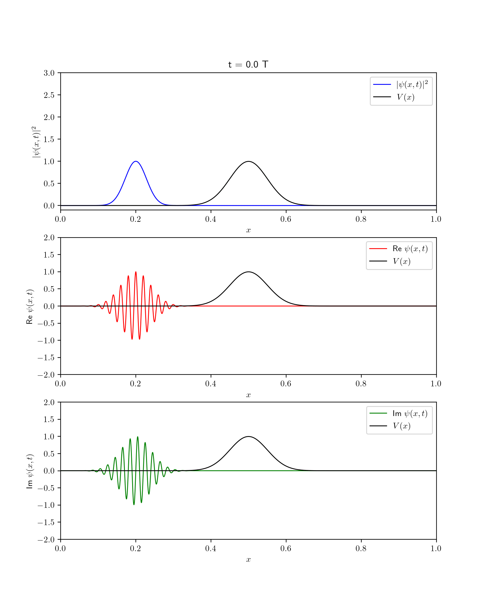{width="90%"}

:::

::: {.column width="50%"}

{width="90%"}

:::

::::

::: {.fragment}

Superposition of energies $\Rightarrow$ **motion** you can watch.

:::

## Takeaway

> A single eigenstate only spins its phase, so nothing observable moves; superpose different energies and their phases beat against each other, and quantum dynamics comes alive.

## Why Fourier?

Any signal can be built from **waves**.

::: {.fragment}

- **Fourier series**: periodic functions as sums of sines and cosines

:::

::: {.fragment}

- **Fourier transform**: extends the idea to non-periodic functions

:::

::: {.fragment}

- Connects **position** and **momentum**, **time** and **frequency**

:::

## Fourier Series

A periodic $f(x)$ is a weighted sum of $\sin$ and $\cos$:

$$f(x) = \frac{a_0}{2} + \sum_{n=1}^{\infty}a_n \cos(nx) + \sum_{n=1}^{\infty}b_n \sin(nx)$$

::: {.fragment}

$\sin$ and $\cos$ form a **complete orthogonal basis**.

:::

## The Coefficients

Orthogonality picks out each coefficient:

$$a_n = \frac{1}{\pi} \int_{-{\pi}}^{\pi} f(x)\cos(nx)\,dx$$

$$b_n = \frac{1}{\pi} \int_{-{\pi}}^{\pi} f(x)\sin(nx)\,dx$$

::: {.fragment}

The $\frac{a_0}{2}$ term is the **mean** of $f(x)$ over the period.

:::

## Complex Form

Euler's formula folds $\sin$ and $\cos$ into exponentials:

$$f(x)=\sum_{n=0}^{\infty} c_{n} \exp\left(i \frac{2 \pi n x}{L}\right)$$

::: {.fragment}

Introduce the **wave number**

$$k_{n}=\frac{2 \pi n}{L} = \frac{2 \pi}{\lambda}$$

:::

## From Series to Transform

Let the period $L \to \infty$: the discrete sum becomes an integral.

$$\Delta k_{n}=\frac{2 \pi n}{L} \rightarrow d k$$

::: {.fragment}

Discrete modes $\to$ a **continuum** of wave numbers.

:::

## The Transform Pair

$$F(k)=\int_{-\infty}^{\infty} f(x)\, \mathrm{e}^{-i k x}\, d x$$

::: {.fragment}

**Inverse** transform rebuilds the original:

$$f(x)=\frac{1}{2 \pi} \int_{-\infty}^{\infty} F(k)\, \mathrm{e}^{i k x}\, d k$$

:::

::: {.fragment}

$f(x)$ and $F(k)$ are **two views of the same object**.

:::

## Narrow in x, Broad in k

Square pulse of width $w$:

$$\psi(x) = \begin{cases} 1, & |x| \leq \frac{w}{2} \\ 0, & |x| > \frac{w}{2} \end{cases}$$

::: {.fragment}

Its transform is a **sinc**:

$$\hat{\psi}(k) = w \, \text{sinc}(kw/2)$$

:::

::: {.fragment}

Shrink $w$ in space $\Rightarrow$ the sinc **spreads** in $k$.

:::

## The Uncertainty Relation

$$\Delta x \, \Delta k \geq \frac{1}{2}$$

::: {.fragment}

A function and its transform **cannot both be sharp**.

:::

::: {.fragment}

With de Broglie $k = p/\hbar$, this becomes position vs **momentum** uncertainty.

:::

## Gaussian to Gaussian

A Gaussian transforms into another Gaussian:

$$f(t) = \exp\left(- \frac{t^2}{2\sigma^2}\right)$$

$$\mathcal{F}[f(t)] = \sqrt{2\pi}\, \exp\left(- \frac{\omega^2\sigma^2}{2}\right)$$

::: {.fragment}

Broad in $t$ $\Rightarrow$ **narrow** in $\omega$. The minimum-uncertainty shape.

:::

## Plane Wave and Delta Duality

Expand in momentum eigenstates:

$$\psi(x) = \frac{1}{\sqrt{2\pi}} \int \phi(k)\, e^{ikx}\, dk$$

::: {.fragment}

- Definite momentum $k_0$: $\;\phi(k)=\delta(k-k_0) \Rightarrow \psi(x)=e^{ik_0 x}$

:::

::: {.fragment}

- Localized at $x_0$: $\;\psi(x)=\delta(x-x_0) \Rightarrow \phi(k)=\frac{1}{\sqrt{2\pi}}e^{-ikx_0}$

:::

::: {.fragment}

A **plane wave** is one momentum spread over all space; a **spike** in space is all momenta at once.

:::

## Takeaway

> A function and its Fourier transform are conjugate views: sharpening one always blurs the other, and that trade-off **is** the uncertainty principle.

# Chapter 4: Model Systems

## Where we are headed

Bound systems have **quantized** energy.

::: {.fragment}

Next: how each kind of motion is quantized, and how **spectroscopy** probes it.

:::

::: {.fragment}

Toy models map onto real motions:

- **Particle in a box** → translation
- **Harmonic oscillator** → vibration
- **Rigid rotor** → rotation

:::

## Four kinds of molecular motion

:::: {.columns}

::: {.column width="50%"}

:::

::: {.column width="50%"}

A molecule's energy splits into independent pieces:

$$E = \epsilon_{trans} + \epsilon_{rot} + \epsilon_{vib} + \epsilon_{elec}$$

::: {.fragment}

Each kind of motion is **quantized differently**.

:::

:::

::::

## Different spacings, different spectroscopy

:::: {.columns}

::: {.column width="45%"}

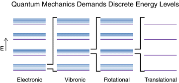

:::

::: {.column width="55%"}

::: {.fragment}

Boundary conditions set the **level spacing**.

:::

::: {.fragment}

Electronic ≫ vibrational ≫ rotational ≫ translational.

:::

::: {.fragment}

Each scale → its **own spectroscopy**.

:::

:::

::::

## Counting: 3N nuclear coordinates

:::: {.columns}

::: {.column width="50%"}

:::

::: {.column width="50%"}

$N$ nuclei, each with $x, y, z$:

$$3N \text{ total degrees of freedom}$$

::: {.fragment}

**Born–Oppenheimer**: separate nuclei from electrons.

:::

::: {.fragment}

$$\hat{H} = \sum_{i=1}^{N} -\frac{\hbar^2}{2m_i}\nabla_{R_i}^2 + E(R_1,\dots,R_N)$$

:::

:::

::::

## Splitting the Hamiltonian

The nuclear motion separates into three parts:

$$\hat{H} = \hat{H}_{tr} + \hat{H}_{rot} + \hat{H}_{vib}$$

::: {.fragment}

- $\hat{H}_{tr}$, $\hat{H}_{rot}$: **no potential**
- $\hat{H}_{vib}$: carries the potential $E$ between nuclei

:::

::: {.fragment}

Separation lets the wavefunction **factorize**:

$$\psi = \psi_{tr}\,\psi_{rot}\,\psi_{vib}$$

:::

## Three Schrödinger equations

$$\hat{H}_{tr}\psi_{tr} = E_{tr}\psi_{tr}$$

$$\hat{H}_{rot}\psi_{rot} = E_{rot}\psi_{rot}$$

$$\hat{H}_{vib}\psi_{vib} = E_{vib}\psi_{vib}$$

::: {.fragment}

**Translation**: no boundary condition → continuous spectrum.

:::

::: {.fragment}

**Rotation** (cyclic boundary) and **vibration** (potential $E$) → **quantized**.

:::

## Bookkeeping the degrees of freedom

Start with $3N$, then subtract:

::: {.fragment}

- **Translation**: always $3$ → leaves $3N - 3$

:::

::: {.fragment}

- **Rotation**: $3$ nonlinear, $2$ linear

:::

::: {.fragment}

- **Vibration**: whatever remains
  - Nonlinear: $3N - 6$
  - Linear: $3N - 5$

:::

## At a glance

|              | Translation | Rotation | Vibration |
|--------------|:-----------:|:--------:|:---------:|
| **Linear**   | 3           | 2        | $3N-5$    |
| **Nonlinear**| 3           | 3        | $3N-6$    |

::: {.fragment}

Linear molecules have **one fewer** rotation, so **one more** vibration.

:::

## Takeaway

> A molecule has $3N$ degrees of freedom: $3$ translation, $2$ or $3$ rotation, the rest ($3N-5$ or $3N-6$) vibration. Born–Oppenheimer separation factorizes the motion, and boundary conditions decide which parts are quantized and how spectroscopy probes them.

## Bead, spring, and a wall

:::: {.columns}

::: {.column width="55%"}

- A mass tied to a wall by a spring
- Displace it by $x$ from equilibrium
- A **restoring force** pulls it back

::: {.fragment}

$$F = -kx$$

:::

::: {.fragment}

The minus sign always points **toward equilibrium**

:::

:::

::: {.column width="45%"}

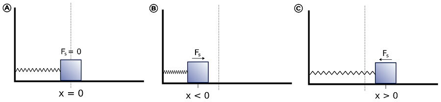{width="100%"}

:::

::::

## Hooke's law

::: {.fragment}

$$F = -kx$$

:::

- $k$ is the **spring constant**: the stiffness
- Stiffer spring means a stronger pull back
- The only ingredient we need to build the whole model

## Equation of motion

- Newton's second law with the Hooke force:

::: {.fragment}

$$m\ddot{x} = -kx$$

:::

::: {.fragment}

$$\ddot{x} + \omega^2 x = 0$$

:::

- A linear **second-order ODE**
- One constant $\omega$ governs everything

## The solution

:::: {.columns}

::: {.column width="55%"}

::: {.fragment}

$$x(t) = A\cos(\omega t + \phi)$$

:::

- **Amplitude** $A$ and **phase** $\phi$ set by initial conditions
- Motion is a pure cosine: **simple harmonic motion**

:::

::: {.column width="45%"}

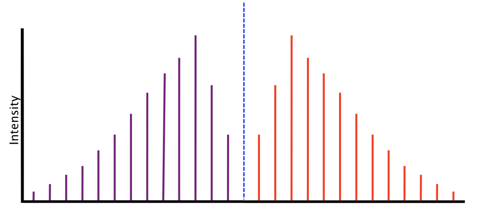{width="100%"}

:::

::::

## Frequency

::: {.fragment}

$$\omega = \sqrt{\frac{k}{\mu}}$$

:::

- **Stiffer** spring (larger $k$): faster oscillation
- **Heavier** mass (larger $\mu$): slower oscillation
- Period $T = 2\pi/\omega$, frequency $f = \omega/2\pi$

## Energy of the oscillator

:::: {.columns}

::: {.column width="55%"}

- Force is the slope of a potential: $F = -\partial V/\partial x$
- Integrating gives a **parabolic well**: $V = \tfrac{1}{2}kx^2$

::: {.fragment}

$$E = \frac{p^2}{2m} + \frac{kx^2}{2}$$

:::

- Kinetic and potential energy trade off; **total energy is constant**

:::

::: {.column width="45%"}

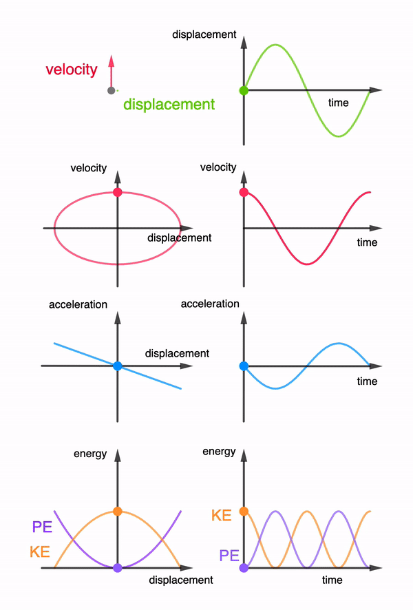{width="100%"}

:::

::::

## Diatomic molecule: a two-body problem

- Two atoms bound by a spring, masses $m_1$ and $m_2$
- Center of mass drifts freely; only the **relative coordinate** vibrates

::: {.fragment}

$$\ddot{x} = -\left(\frac{1}{m_1} + \frac{1}{m_2}\right)kx = -\frac{k}{\mu}x$$

:::

## Reduced mass

- The two-body problem becomes **one body** with an effective mass:

::: {.fragment}

$$\mu = \frac{m_1 m_2}{m_1 + m_2}$$

:::

- Same equation as the bead on a wall, with $m \to \mu$
- One particle, one spring, one frequency $\omega = \sqrt{k/\mu}$

## Real bonds are not parabolas

:::: {.columns}

::: {.column width="50%"}

- Real bonds **dissociate**; a parabola never does
- Taylor expand any well about its minimum $x_0$:

:::

::: {.column width="50%"}

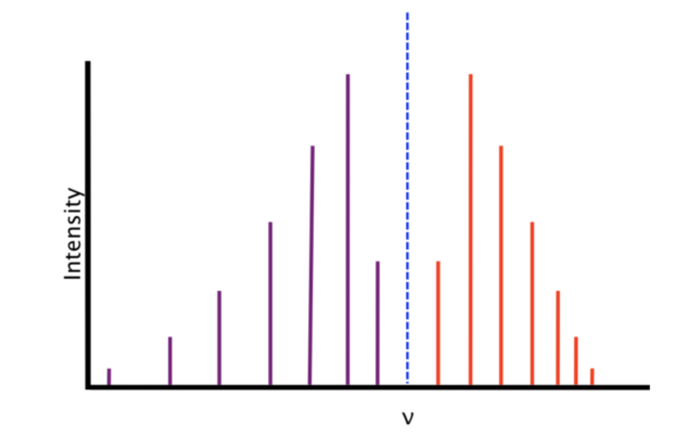{width="100%"}

:::

::::

::: {.fragment}

$$U(x) = \frac{1}{2}k(x-x_0)^2 + \frac{1}{6}\gamma(x-x_0)^3 + \cdots$$

:::

## The harmonic approximation

:::: {.columns}

::: {.column width="55%"}

- First derivative vanishes at the minimum
- Keep only the **first non-vanishing term**: the quadratic
- $k$ is the **curvature** $U''(x_0)$ at the bottom of the well
- Good near equilibrium; **anharmonic** terms grow far out

:::

::: {.column width="45%"}

{width="100%"}

:::

::::

## Takeaway

> A restoring force $F=-kx$ gives sinusoidal motion $x(t)=A\cos(\omega t+\phi)$ at $\omega=\sqrt{k/\mu}$. Any bond near its minimum is harmonic, and the parabola is the launching point for the quantum oscillator.

## Why the Harmonic Oscillator?

- Near equilibrium, **any** bond is a spring.

::: {.fragment}

:::: {.columns}

::: {.column width="55%"}

- Molecular **vibrations** are quantized.
- Foundation for **IR and Raman** spectroscopy.
- First place we meet **zero-point energy** and **tunneling**.

:::

::: {.column width="45%"}

:::

::::

:::

## The Schrodinger Equation

- Classical Hamiltonian: kinetic plus a quadratic well.

::: {.fragment}

$$\hat{H} = -\frac{\hbar^2}{2\mu}\frac{d^2}{dx^2} + \frac{1}{2}kx^2$$

:::

::: {.fragment}

$$\hat{H}\psi_v(x) = E_v\,\psi_v(x)$$

:::

::: {.fragment}

- **Spring constant** $k$, **angular frequency** $\omega = \sqrt{k/\mu}$.

:::

## Quantized Energies

::: {.fragment}

$$E_v = \left(v + \tfrac{1}{2}\right)\hbar\omega, \qquad v = 0,1,2,\dots$$

:::

- Levels are **evenly spaced** by $\hbar\omega$.
- The integer $v$ is the **vibrational quantum number**.
- Energy never goes to zero, even in the lowest state.

## Zero-Point Energy

::: {.fragment}

$$E_0 = \tfrac{1}{2}\hbar\omega \neq 0$$

:::

- The oscillator **cannot sit still** at the bottom of the well.
- A consequence of the **uncertainty principle**: pinning $x$ would blow up $p$.
- Atoms keep moving even at **absolute zero**.

## The Wavefunctions

::: {.fragment}

$$\psi_v(x) = N_v\,H_v\!\left(\sqrt{\alpha}\,x\right)e^{-\alpha x^2/2}$$

:::

- **Hermite polynomial** $H_v$ times a **Gaussian** envelope.
- Scaling $\alpha = \sqrt{k\mu/\hbar^2}$, normalization $N_v = \dfrac{1}{\sqrt{2^v v!}}\left(\dfrac{\alpha}{\pi}\right)^{1/4}$.

## The Gaussian Ground State

::: {.fragment}

$$\psi_0(x) = \left(\frac{\alpha}{\pi}\right)^{1/4} e^{-\alpha x^2/2}$$

:::

- **No nodes**, a single peak at the bottom of the well.
- A pure **Gaussian**: the minimum-uncertainty state.
- First excited state gains one node: $\psi_1(x) \propto x\,e^{-\alpha x^2/2}$.

## Hermite Polynomials

| $v$ | $H_v(y)$ |
|---|---|
| 0 | $1$ |
| 1 | $2y$ |
| 2 | $4y^2 - 2$ |
| 3 | $8y^3 - 12y$ |

::: {.fragment}

- Each added quantum number adds **one node**.
- They are **orthogonal** with weight $e^{-y^2}$.

:::

## Even / Odd Parity

- Even $v = 0,2,4,\dots$: $\psi_v(-x) = \psi_v(x)$.
- Odd $v = 1,3,5,\dots$: $\psi_v(-x) = -\psi_v(x)$.

::: {.fragment}

$$\langle x \rangle = 0, \qquad \langle p \rangle = 0$$

:::

::: {.fragment}

- Symmetry **kills** odd integrals, so spreads survive: $\langle x^2\rangle, \langle p^2\rangle \neq 0$.

:::

## Tunneling

- Wavefunction tails **leak past** the classical turning points.

::: {.fragment}

- Finite probability in the **classically forbidden region** where $E < V$.
- Strictly impossible in classical mechanics.

:::

::: {.fragment}

- At **high** $v$, probability piles up near the edges, approaching the classical result.

:::

## Beyond Harmonic: Anharmonicity

:::: {.columns}

::: {.column width="50%"}

:::

::: {.column width="50%"}

- Real bonds **dissociate**, the well is not a perfect parabola.
- Levels **bunch up** toward $D_e$.
- Harmonic model is only the **near-equilibrium** limit.

:::

::::

## Takeaway

> The quantum oscillator has **evenly spaced** levels $E_v = \hbar\omega(v+\tfrac{1}{2})$ with an irreducible **zero-point energy** $\tfrac{1}{2}\hbar\omega$. Its states are **Hermite polynomials times a Gaussian**, with definite **parity** and tails that **tunnel** into the forbidden region.

## Bonds as Springs

A vibrating bond is a **quantized harmonic oscillator**.

::: {.fragment}

- Energy levels are **evenly spaced**:
$$\tilde{E}_v = \tilde{\nu}\left(v + \frac{1}{2}\right), \qquad v = 0,1,2,\dots$$

:::

::: {.fragment}

- A single transition energy, the **fundamental**:
$$\Delta \tilde{E}_v = \tilde{E}_{v+1} - \tilde{E}_{v} = \tilde{\nu}$$

:::

::: {.fragment}

> Vibrations are **quantized**: this underlies infrared and Raman spectroscopy.

:::

## Frequency, Mass, and Bond Strength

$$\tilde{\nu} = \frac{1}{2\pi c}\sqrt{\frac{k}{\mu}}$$

::: {.fragment}

- **Force constant** $k$: stiffness of the bond
- **Reduced mass** $\mu$ of the diatomic

:::

::: {.fragment}

- Typical range **500 to 4000 cm$^{-1}$**
- **Strong, stiff bonds** vibrate at higher frequency
- **Heavy atoms** vibrate at lower frequency

:::

## Harmonic Approximation

:::: {.columns}

::: {.column width="48%"}

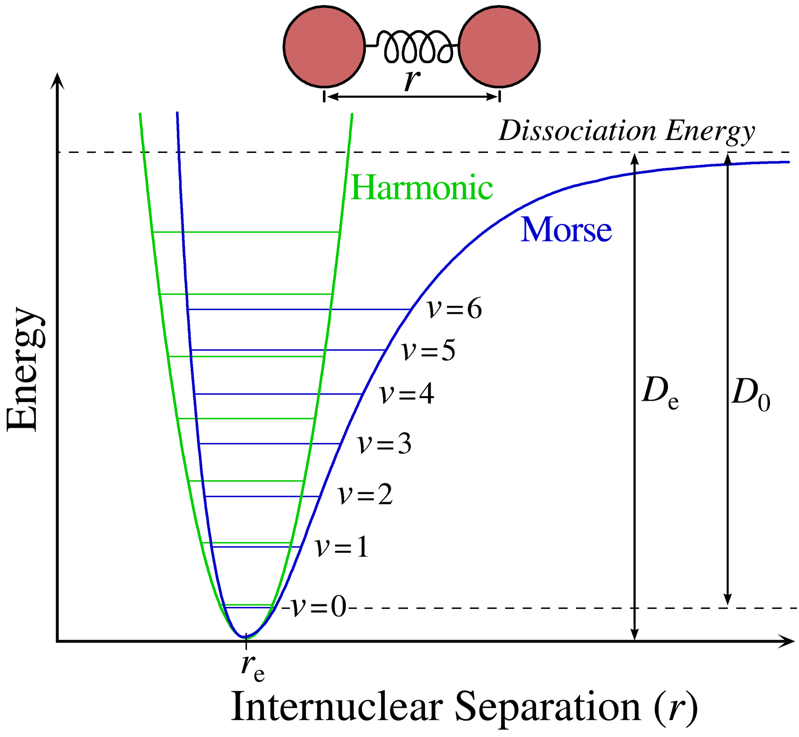{width="90%"}

:::

::: {.column width="52%"}

A parabola near the **equilibrium** bond length $R_e$:

$$E(R) = \frac{1}{2}k(R - R_e)^2$$

::: {.fragment}

- It is the **Taylor expansion** of the true curve truncated at second order

:::

::: {.fragment}

- Good near the bottom of the well, but it **never dissociates**

:::

:::

::::

## The Morse Potential

:::: {.columns}

::: {.column width="50%"}

{width="95%"}

:::

::: {.column width="50%"}

A realistic curve that **dissociates**:

$$V(R)=D_e\left(1-e^{-a(R-R_e)}\right)^2$$

::: {.fragment}

- $D_e$: well depth from the **minimum**
- $D_0 = D_e - \tfrac{1}{2}h\nu$: from the **ground level**

:::

::: {.fragment}

- Levels **converge** as $v$ grows

:::

:::

::::

## Anharmonic Energy Levels

Add higher-order terms so levels are **no longer evenly spaced**:

$$\tilde{E}_v = \tilde{\nu}_e\left(v + \tfrac{1}{2}\right) - \tilde{\nu}_e x_e\left(v + \tfrac{1}{2}\right)^2 + \dots$$

::: {.fragment}

- $\tilde{\nu}_e$: vibrational wavenumber, $x_e$: **anharmonicity constant**

:::

::: {.fragment}

- Transition energies **shrink** with $v$:
$$\tilde{\nu}_{v\rightarrow v+1} = \tilde{\nu}_e\left[1 - 2x_e(v+1)\right]$$

:::

## Normal Modes

:::: {.columns}

::: {.column width="48%"}

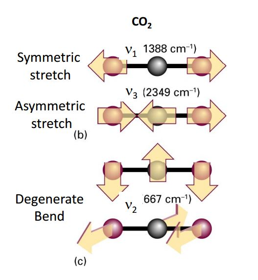{width="95%"}

:::

::: {.column width="52%"}

A polyatomic molecule's motion resolves into **independent normal modes**.

::: {.fragment}

- **Linear** molecules:
$$N_{modes} = 3N - 5$$
- **Nonlinear** molecules:
$$N_{modes} = 3N - 6$$

:::

::: {.fragment}

- Subtract translations and rotations from $3N$

:::

:::

::::

## IR Selection Rule

A transition is **allowed** only if the **dipole changes** with bond length:

$$\left( \frac{\partial \mu}{\partial x} \right)_{R_e} \neq 0$$

::: {.fragment}

- And the quantum number changes by one:
$$\Delta v = \pm 1$$

:::

::: {.fragment}

> The transition probability $P_{v\rightarrow v'} \sim \langle v | x | v' \rangle$ vanishes unless both conditions hold.

:::

## IR-Active vs Inactive

:::: {.columns}

::: {.column width="48%"}

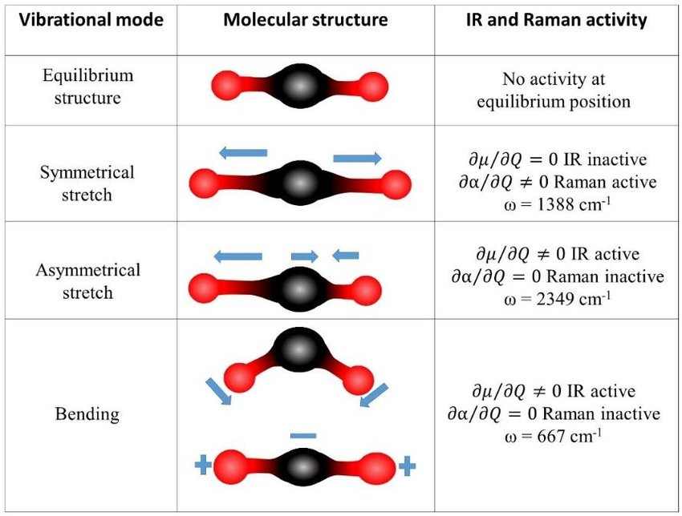{width="95%"}

:::

::: {.column width="52%"}

- **Heteronuclear** (HCl, CO): dipole changes, **IR-active**

::: {.fragment}

- **Homonuclear** (H$_2$, O$_2$, N$_2$): zero dipole, **IR-inactive**

:::

::: {.fragment}

- IR-inactive stretches can still appear in the **Raman** spectrum

:::

:::

::::

## Overtones

::: {.fragment}

- Anharmonicity makes **weak overtones** appear: $\Delta v = \pm 2, \pm 3, \dots$

:::

::: {.fragment}

$$\tilde{\nu}_{0\rightarrow v} = \tilde{\nu}_e \cdot v - \tilde{\nu}_e x_e \cdot v(v+1)$$

:::

::: {.fragment}

- Intensities **fall off rapidly** with each higher overtone

:::

::: {.fragment}

- At room temperature almost all molecules sit in $v=0$, so only the **fundamental** dominates the spectrum

:::

## Reading an IR Spectrum

:::: {.columns}

::: {.column width="55%"}

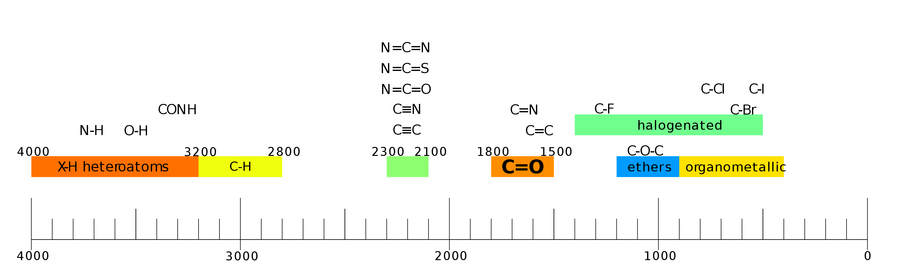{width="100%"}

:::

::: {.column width="45%"}

- Each bond type absorbs in a **characteristic region**

::: {.fragment}

- Stiff bonds and light atoms sit at **high wavenumber**

:::

::: {.fragment}

- A spectrum is a **fingerprint** of functional groups

:::

:::

::::

## Takeaway

> Bonds vibrate as quantized harmonic oscillators with $\tilde{E}_v = \tilde{\nu}(v+\tfrac{1}{2})$; polyatomics split into $3N-6$ (or $3N-5$) normal modes; a mode is IR-active only if the dipole changes, with $\Delta v = \pm 1$; and the Morse potential captures the anharmonicity that lets molecules dissociate.

## Why angular momentum?

- **Rotation** is to angular momentum what **straight-line motion** is to linear momentum.

::: {.fragment}

- Central to **atomic structure** and any system with **rotational symmetry**.

:::

::: {.fragment}

- In QM it is a **vector operator**, like $\vec{p}$.

:::

::: {.fragment}

- Key twist: its three components **do not commute**.

:::

## Conservation from symmetry

:::: {.columns}

::: {.column width="55%"}

**Noether's theorem**

> Every continuous symmetry of the laws of physics corresponds to a conserved quantity.

::: {.fragment}

- Translation $\to$ **momentum**
- Rotation $\to$ **angular momentum**
- Time shift $\to$ **energy**

:::

:::

::: {.column width="45%"}

{width="60%"}

:::

::::

## Classical definition

:::: {.columns}

::: {.column width="55%"}

$$\vec{L}=\vec{r}\times\vec{p}$$

::: {.fragment}

- A **vector**: direction by the **right-hand rule**.

:::

::: {.fragment}

- Components:
$$L_x = yp_z - zp_y$$
$$L_y = zp_x - xp_z$$
$$L_z = xp_y - yp_x$$

:::

:::

::: {.column width="45%"}

{width="85%"}

:::

::::

## Conservation in action

:::: {.columns}

::: {.column width="50%"}

- **No external torque** $\Rightarrow$ $\vec{L}$ **conserved**.

::: {.fragment}

- Rotational energy:
$$E_\text{rot}=\frac{L^2}{2I}$$

:::

::: {.fragment}

- Pull mass inward $\to$ smaller $I$ $\to$ **faster spin**.

:::

:::

::: {.column width="50%"}

{width="80%"}

:::

::::

## Spherical coordinates

:::: {.columns}

::: {.column width="50%"}

- Natural choice for rotation: $(r,\theta,\phi)$.

::: {.fragment}

- Fixed orbit $r=\text{const}$ removes the **radial** degree of freedom.

:::

::: {.fragment}

$$x=r\sin\theta\cos\phi$$
$$y=r\sin\theta\sin\phi$$
$$z=r\cos\theta$$

:::

:::

::: {.column width="50%"}

{width="85%"}

:::

::::

## Quantum operators

- Promote classical $\vec{L}$ to operators, e.g.

$$\hat{L}_z = -i\hbar\frac{\partial}{\partial\phi}$$

::: {.fragment}

- Eigenvalue problem $\hat{L}_z f = a f$ gives
$$f(\phi)=e^{im\phi},\qquad a=\hbar m$$

:::

::: {.fragment}

- The **$z$-axis is a choice** (often set by an external field).

:::

## Components do not commute

$$\left[\hat{L}_x,\hat{L}_y\right]=i\hbar\hat{L}_z,\;\left[\hat{L}_y,\hat{L}_z\right]=i\hbar\hat{L}_x,\;\left[\hat{L}_z,\hat{L}_x\right]=i\hbar\hat{L}_y$$

::: {.fragment}

$$\left[\hat{L}_x,\vec{\hat{L}}^2\right]=\left[\hat{L}_y,\vec{\hat{L}}^2\right]=\left[\hat{L}_z,\vec{\hat{L}}^2\right]=0$$

:::

::: {.fragment}

- Only $\vec{\hat{L}}^2$ **and one component** are knowable **simultaneously**.

:::

::: {.fragment}

- Note the **cyclic** pattern $x\to y\to z\to x$.

:::

## Quantized eigenvalues

- Shared eigenfunctions $Y_l^m(\theta,\phi)$:

$$\hat{L}^2 Y_l^m = \hbar^2 l(l+1)\, Y_l^m$$
$$\hat{L}_z Y_l^m = \hbar m\, Y_l^m$$

::: {.fragment}

- **Magnitude** quantized: $L^2 \to \hbar^2 l(l+1)$.
- **Projection** quantized: $L_z \to m\hbar$.

:::

::: {.fragment}

- $l=0,1,2,\dots$ and $|m|\le l$, giving $2l+1$ values of $m$.

:::

## A vector on a cone

:::: {.columns}

::: {.column width="50%"}

- Fixed length $\sqrt{l(l+1)}\,\hbar$.

::: {.fragment}

- Only **$2l+1$ projections** onto $z$.

:::

::: {.fragment}

- $\vec{L}$ never points exactly along $z$: $L_x, L_y$ stay **uncertain**.

:::

:::

::: {.column width="50%"}

{width="90%"}

:::

::::

## Spherical harmonics

:::: {.columns}

::: {.column width="50%"}

- $Y_l^m(\theta,\phi)$ or $|l,m\rangle$: the **angular wavefunctions**.

::: {.fragment}

- **Orthonormal**: $\langle l',m'|l,m\rangle=\delta_{ll'}\delta_{mm'}$.

:::

::: {.fragment}

- **Total nodes** $= l$ (polar bands from $l$, longitude lines from $|m|$).

:::

:::

::: {.column width="50%"}

{width="95%"}

:::

::::

## Takeaway

> Angular momentum is a **vector operator** with **quantized** magnitude $L^2\to\hbar^2 l(l+1)$ and projection $L_z\to m\hbar$. Its components **do not commute**, so only $\vec{L}^2$ and one component are simultaneously sharp, and the **spherical harmonics** $Y_l^m$ are their shared eigenfunctions.

## The model

:::: {.columns}

::: {.column width="55%"}

::: {.fragment}

- A mass $\mu$ rotating at **fixed radius** $r$

:::

::: {.fragment}

- No potential: pure rotational **kinetic energy**

:::

::: {.fragment}

- Use **spherical coordinates** to exploit the symmetry

:::

::: {.fragment}

- Hamiltonian becomes angular momentum:
$$\hat{H}=\frac{\hat{L}^2}{2I}$$

:::

:::

::: {.column width="45%"}

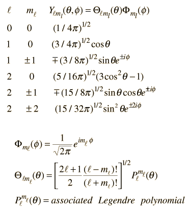

:::

::::

## Two angles, two quantum numbers

::: {.fragment}

Eigenfunctions are the **spherical harmonics** $Y(\theta,\phi)$:
$$\hat{H}\,Y(\theta,\phi)=E_{J,m}\,Y(\theta,\phi)$$

:::

::: {.fragment}

- $J$ quantizes total angular momentum

:::

::: {.fragment}

- $M_J$ quantizes its projection

:::

::: {.fragment}

- Quantization comes from the **cyclic boundary condition** $\Phi(0)=\Phi(2\pi)$

:::

## Rotational energy levels

::: {.fragment}

$$E_J = \frac{\hbar^2}{2I}J(J+1) = B\,J(J+1)$$

:::

::: {.fragment}

**Rotational constant** (units of energy):
$$B = \frac{h^2}{8\pi^2 I}$$

:::

::: {.fragment}

- Energy depends **only on $J$**

:::

::: {.fragment}

- **No zero-point energy**: $J=0$ is allowed

:::

## Degeneracy and the moment of inertia

:::: {.columns}

::: {.column width="50%"}

::: {.fragment}

Each level is **$(2J+1)$-fold degenerate** (the allowed $M_J$)

:::

::: {.fragment}

For a diatomic:
$$I = \mu r^2$$

:::

::: {.fragment}

- Bigger $I$ $\Rightarrow$ smaller $B$ $\Rightarrow$ closer levels

:::

:::

::: {.column width="50%"}

:::

::::

## Selection rules

::: {.fragment}

The molecule must have a **permanent dipole moment**:
$$\langle J' | \mu | J'' \rangle \neq 0$$

:::

::: {.fragment}

Only adjacent levels connect:
$$\boxed{\Delta J = \pm 1}$$

:::

::: {.fragment}

- Derived from the **recursion relations** of spherical harmonics

:::

## Evenly spaced lines

::: {.fragment}

Line positions ($\Delta J = +1$):
$$\tilde{\nu}_J = 2\tilde{B}(J+1)$$

:::

::: {.fragment}

Take one more difference:
$$\tilde{\nu}_{J+1} - \tilde{\nu}_J = 2\tilde{B}$$

:::

::: {.fragment}

- Successive lines at $2\tilde{B},\,4\tilde{B},\,6\tilde{B},\dots$

:::

::: {.fragment}

- **Equal spacing** is the fingerprint of the rigid rotor

:::

## Reading the spacing

:::: {.columns}

::: {.column width="55%"}

::: {.fragment}

- Measure line spacing $\Rightarrow$ get $\tilde{B}$

:::

::: {.fragment}

- $\tilde{B}\Rightarrow I\Rightarrow$ **bond length** $r$

:::

::: {.fragment}

- Different **isotopes** shift the lines

:::

::: {.fragment}

- Intensities follow the **Boltzmann** populations $g_J\,e^{-E_J/k_BT}$

:::

:::

::: {.column width="45%"}

:::

::::

## Rotation rides on vibration

:::: {.columns}

::: {.column width="50%"}

::: {.fragment}

Combine rotor and oscillator:
$$\tilde{E}_{v,J} = \tilde{\omega}(v+\tfrac12) + \tilde{B}J(J+1)$$

:::

::: {.fragment}

- **R branch** ($\Delta J=+1$): high side of $\tilde{\omega}$

:::

::: {.fragment}

- **P branch** ($\Delta J=-1$): low side

:::

::: {.fragment}

- **Q branch** ($\Delta J=0$) is **forbidden**

:::

:::

::: {.column width="50%"}

:::

::::

## Where the model breaks

::: {.fragment}

- **Rovibrational coupling**: $B$ shrinks with $v$
$$B_v = B_e - \alpha_e(v+\tfrac12)$$

:::

::: {.fragment}

- **Centrifugal distortion**: fast rotation stretches the bond
$$\tilde{E}_r(J) = \tilde{B}J(J+1) - \tilde{D}J^2(J+1)^2$$

:::

::: {.fragment}

- Both crowd the levels at large $J$

:::

## Takeaway

> Rotational energies $E_J = B\,J(J+1)$ are $(2J+1)$-fold degenerate. With $\Delta J=\pm 1$ this gives **evenly spaced microwave lines** separated by $2\tilde{B}$, and the spacing reveals the bond length through $I=\mu r^2$.

# Chapter 5: The Hydrogen Atom

## The Simplest Atom We Can Solve

- One electron, one nucleus of charge $Ze$: **H**, $\text{He}^+$, $\text{Li}^{2+}$.

::: {.fragment}

- The **only** atom solved **exactly**: add even one electron and electron-electron repulsion breaks it.

:::

::: {.fragment}

- The Coulomb pull is **isotropic**: it depends only on distance $r$.

:::

::: {.fragment}

- That **symmetry** is the source of the **degeneracies** we will find.

:::

## The Schrodinger Equation

- Kinetic energy plus one **Coulomb** attraction term.

::: {.fragment}

$$\left[ -\frac{\hbar^2}{2m_e}\nabla^2 - \frac{Ze^2}{4\pi\epsilon_0 r}\right]\psi(r,\theta,\phi) = E\psi(r,\theta,\phi)$$

:::

::: {.fragment}

- Since the potential depends **only on $r$**, work in **spherical coordinates**.
- Electron mass $m_e$ replaces the reduced mass (the nucleus is far heavier).

:::

## Separation of Variables

- The Laplacian splits into a **radial** and an **angular** piece via $\hat{L}^2$.

::: {.fragment}

$$\psi_{n,l,m}(r,\theta,\phi) = R_{nl}(r)\,Y_l^m(\theta,\phi)$$

:::

::: {.fragment}

- **Angular part** is already solved: spherical harmonics $Y_l^m$.
- **Radial part** $R_{nl}(r)$ is the new piece to find.

:::

::: {.fragment}

$$\hat{L}^2 Y_l^m = \hbar^2 l(l+1)\, Y_l^m$$

:::

## The Effective Radial Potential

:::: {.columns}

::: {.column width="50%"}

:::

::: {.column width="50%"}

$$V_{eff} = -\frac{Ze^2}{4\pi\epsilon_0 r} + \frac{l(l+1)\hbar^2}{2m_e r^2}$$

::: {.fragment}

- Coulomb **attraction** plus a **centrifugal** barrier.

:::

::: {.fragment}

- For $l > 0$ the barrier pushes the electron **farther** from the nucleus.

:::

:::

::::

## Radial Wavefunctions

::: {.fragment}

$$R_{nl}(r) = \rho^l\, e^{-\rho/2}\, L_{n-l-1}^{2l+1}(\rho)$$

:::

- **Laguerre polynomial** times a decaying exponential.
- Bohr radius sets the length scale: $a_0 = \dfrac{4\pi\epsilon_0\hbar^2}{m_e e^2}$.
- Scaled distance: $\rho = \dfrac{2Zr}{n a_0}$.

::: {.fragment}

- Example, the **1s** orbital: $R_{10}(r) = 2\left(\dfrac{Z}{a_0}\right)^{3/2} e^{-\rho/2}$.

:::

## The Full Solution

:::: {.columns}

::: {.column width="50%"}

:::

::: {.column width="50%"}

$$\psi_{n,l,m_l} = N_{nl}\,R_{nl}(r)\,Y_{l,m_l}(\theta,\phi)$$

::: {.fragment}

$$E_n = -\frac{m_e e^4}{8\varepsilon_0^2 h^2}\cdot\frac{1}{n^2}$$

:::

::: {.fragment}

- Three quantum numbers in $\psi$, but **energy depends only on $n$**.

:::

:::

::::

## Degeneracy from Symmetry

- All states of a given $n$ share the **same energy**.

::: {.fragment}

- For $n = 2$: the $2s$ and the three $2p$ states are **degenerate**.

:::

::: {.fragment}

- Counting spin, the total degeneracy of level $n$ is $2n^2$.

:::

::: {.fragment}

- This **accidental degeneracy** is special to the $1/r$ Coulomb potential.

:::

## Quantum Numbers

::: {.fragment}

$$n = 1, 2, 3, \dots$$
$$l = 0, 1, 2, \dots, n-1$$
$$m = 0, \pm 1, \pm 2, \dots, \pm l$$
$$m_s = \pm 1/2$$

:::

::: {.fragment}

- $n$ sets the **energy**, $l$ the **shape**, $m$ the **orientation**.
- Letters for $l$: $s, p, d, f, \dots$ for $l = 0, 1, 2, 3, \dots$

:::

## The Hydrogen Spectrum

:::: {.columns}

::: {.column width="50%"}

:::

::: {.column width="50%"}

$$\Delta\tilde{v} = R_H Z^2\left(\frac{1}{n_1^2} - \frac{1}{n_2^2}\right)$$

::: {.fragment}

- **Lyman** ($n_1 = 1$), **Balmer** ($n_1 = 2$), **Paschen** ($n_1 = 3$).

:::

::: {.fragment}

- Balmer lines are the **visible** emission of hydrogen.

:::

:::

::::

## Ionization Energy

- Removing the ground-state electron means $n_1 = 1$, $n_2 \to \infty$.

::: {.fragment}

$$E_i = R_H Z^2\left(\frac{1}{1^2} - \frac{1}{\infty}\right)$$

:::

::: {.fragment}

- For hydrogen: $109678~\text{cm}^{-1} = 13.6057~\text{eV}$.

:::

::: {.fragment}

- Larger nuclear charge $Z$ means **tighter binding**.

:::

## Takeaway

> The hydrogenlike atom separates into a **radial** function $R_{nl}$ and a **spherical harmonic** $Y_l^m$. Its energy $E_n \propto -Z^2/n^2$ depends **only on $n$**, so each level carries a $2n^2$-fold **degeneracy** that traces directly to the **spherical symmetry** of the Coulomb potential.

## What Is an Orbital?

- A **one-electron wavefunction** is called an **orbital**.
- For the hydrogen atom it is an **atomic orbital (AO)**, exact for H-like atoms.

::: {.fragment}

$$\psi_{n\ell m_\ell}(r,\theta,\phi) = R_{n\ell}(r)\,Y_{\ell m_\ell}(\theta,\phi)$$

:::

::: {.fragment}

- Splits cleanly into a **radial** part and an **angular** part.

:::

## Three Quantum Numbers

::: {.fragment}

- **Principal:** $n = 1, 2, 3, \ldots$

:::

::: {.fragment}

- **Orbital angular momentum:** $\ell = 0, 1, 2, \ldots, n-1$

:::

::: {.fragment}

- **Magnetic:** $m_\ell = -\ell, -\ell+1, \ldots, \ell$

:::

::: {.fragment}

- Each valid triple labels **one** orbital.

:::

## Where Is the Electron?

- Probability over the full 3D volume:

::: {.fragment}

$$|\psi|^2 dV = \big|R_{n\ell}(r)\big|^2 \cdot \big|Y_{\ell m_\ell}(\theta,\phi)\big|^2 \cdot r^2\sin\theta \, dr \, d\theta \, d\phi$$

:::

::: {.fragment}

- The $r^2$ factor reshapes the radial picture.

:::

## Radial Probability

:::: {.columns}

::: {.column width="50%"}

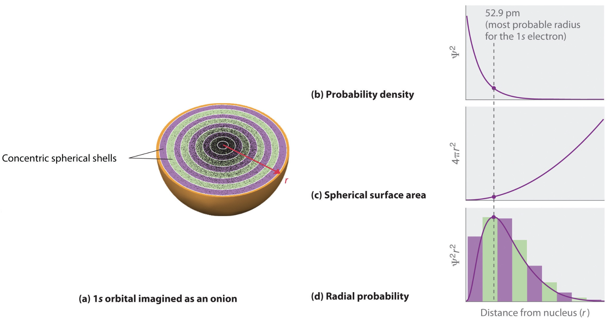{width="100%"}

:::

::: {.column width="50%"}

$$P_r(r) = r^2\big|R_{n\ell}(r)\big|^2$$

::: {.fragment}

- Peaks mark the **most probable distance** from the nucleus.

:::

::: {.fragment}

- For the $1s$ orbital the peak sits at the **Bohr radius** $a_0$.

:::

:::

::::

## How Far Out?

- Average distance grows with $n$:

::: {.fragment}

$$\langle r\rangle_{nl} = \frac{n^2 a_0}{Z}\left\{ 1 + \frac{1}{2}\left[ 1 - \frac{l(l+1)}{n^2}\right]\right\}$$

:::

::: {.fragment}

- Larger $n$: electron **moves outward**.
- Larger $Z$: electron **pulled inward**.

:::

::: {.fragment}

- Expectation value $\langle r\rangle$ is **not** the most probable $r$.

:::

## Counting Nodes

::: {.fragment}

- **Radial** nodes: $n - \ell - 1$

:::

::: {.fragment}

- **Angular** nodes: $\ell$

:::

::: {.fragment}

- **Total** nodes: $n - 1$

:::

::: {.fragment}

- More nodes mean more **curvature** and higher energy.

:::

## Angular Shapes

:::: {.columns}

::: {.column width="50%"}

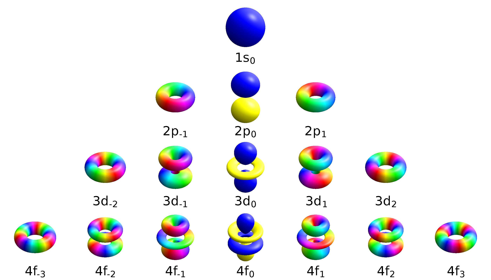{width="100%"}

:::

::: {.column width="50%"}

$$P_\Omega(\theta,\phi) = \big|Y_{\ell m_\ell}(\theta,\phi)\big|^2$$

::: {.fragment}

- $s$ orbitals ($\ell = 0$) are **isotropic**: $P_\Omega = \tfrac{1}{4\pi}$.

:::

::: {.fragment}

- $p, d, \ldots$ have **angular nodes** that carve the lobes.

:::

:::

::::

## Real vs Complex Orbitals

:::: {.columns}

::: {.column width="50%"}

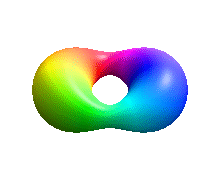{width="100%"}

:::

::: {.column width="50%"}

- Degenerate $\ell > 0$ states allow **free recombination**.

::: {.fragment}

$$p_x \propto \sin\theta\cos\phi \propto x$$
$$p_y \propto \sin\theta\sin\phi \propto y$$
$$p_z = p_0$$

:::

::: {.fragment}

- Same density, **different frame**.

:::

:::

::::

## Pointing the Lobes

- Combining $p_x, p_y, p_z$ aims a lobe in **any direction**.
- Five degenerate $d$ orbitals follow the same recipe:

::: {.fragment}

$$d_{x^2 - y^2} = \tfrac{1}{\sqrt{2}}\left(d_{+2} + d_{-2}\right), \quad d_{xy} = -\tfrac{i}{\sqrt{2}}\left( d_{+2} - d_{-2}\right)$$
$$d_{xz} = -\tfrac{1}{\sqrt{2}}\left( d_{+1} - d_{-1}\right), \quad d_{yz} = \tfrac{i}{\sqrt{2}}\left( d_{+1} + d_{-1}\right)$$
$$d_{z^2} = d_0$$

:::

## Putting It Together

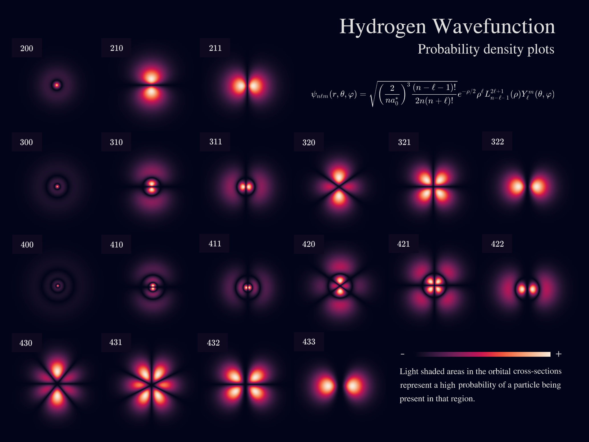{width="78%"}

::: {.fragment}

- Cross sections of $|\psi_{n\ell m}|^2$: **radial reach** times **angular shape**.

:::

## Takeaway

> An atomic orbital factors as $\psi = R_{n\ell}(r)\,Y_{\ell m_\ell}(\theta,\phi)$, labeled by $n$, $\ell$, $m_\ell$. The radial part sets **how far** ($n - \ell - 1$ nodes) and the angular part sets the **shape** ($\ell$ nodes), for $n - 1$ nodes in all.

## Moving Charge Makes a Magnet

- A charge circulating around the nucleus generates a **magnetic moment**.

::: {.fragment}

$$\vec{\mu} = \gamma_e \vec{L}, \qquad \mu_z = -\mu_B m_l$$

:::

::: {.fragment}

- **Bohr magneton** $\mu_B = \dfrac{e\hbar}{2m_e}$ sets the scale.
- Only electrons with $l > 0$ carry an orbital magnetic moment.

:::

## Atoms in a Magnetic Field

- Add the field-interaction term to the Hamiltonian:

::: {.fragment}

$$\hat{H} = \hat{H}_0 + \frac{eB}{2m_e}\hat{L}_z$$

:::

::: {.fragment}

- $\hat{L}_z$ **commutes** with $\hat{H}_0$, so they share eigenstates.
- The field only **shifts** each level by its $m_l$.

:::

## The Orbital Zeeman Effect

:::: {.columns}

::: {.column width="50%"}

{width="100%"}

:::

::: {.column width="50%"}

$$E_{nlm} = E_n + \mu_B m_l B$$

::: {.fragment}

- Field **splits** the $(2l+1)$ degenerate levels.
- The $2p$ level fans into **three** lines: $-\mu_B B,\ 0,\ +\mu_B B$.

:::

:::

::::

## A Surprise: Spin

- Stern-Gerlach split a beam into **two** spots, not an odd number.

::: {.fragment}

- Electrons carry an **intrinsic** angular momentum: **spin**.
- Not literal spinning, an intrinsic property like **mass** and **charge**.

:::

::: {.fragment}

- The Schrodinger equation misses it; spin comes from the **Dirac equation**.

:::

## Spin as a Tiny Magnet

:::: {.columns}

::: {.column width="50%"}

{width="100%"}

:::

::: {.column width="50%"}

- Every particle carries a **permanent magnetic moment**.
- Add spin as a new quantum number $s$, like $l$.

::: {.fragment}

- Allowed projections: $2s + 1$.
- Experiment shows only **two**, so $s = \tfrac{1}{2}$.

:::

:::

::::

## The Two Spin States

::: {.fragment}

$$S = \frac{\sqrt{3}}{2}\hbar, \qquad S_z = \pm\frac{1}{2}\hbar$$

:::

::: {.fragment}

- $m_s = +\tfrac{1}{2}$ is $\alpha$ (**spin-up**), $m_s = -\tfrac{1}{2}$ is $\beta$ (**spin-down**).

:::

::: {.fragment}

$$\hat{S}^2|\alpha\rangle = \tfrac{3}{4}\hbar^2|\alpha\rangle, \qquad \hat{S}_z|\alpha\rangle = +\tfrac{1}{2}\hbar|\alpha\rangle$$

:::

## Spin Joins the Wavefunction

- States $\alpha$ and $\beta$ are **orthonormal**:

::: {.fragment}

$$\langle\alpha|\alpha\rangle = \langle\beta|\beta\rangle = 1, \qquad \langle\alpha|\beta\rangle = 0$$

:::

::: {.fragment}

- The full state is **spatial** times **spin**:
$$|n,l,m_l,m_s\rangle = \psi_{n,l,m_l}\,\sigma, \quad \sigma = \alpha \text{ or } \beta$$

:::

## Magnetic Moment of Spin

::: {.fragment}

$$\hat{\mu}_z = -\frac{g_e e}{2m_e}\hat{S}_z, \qquad g_e \approx 2$$

:::

::: {.fragment}

- The **$g$-factor** $g_e = 2.0023$ comes from relativistic theory.
- Energy in a field: $E = g_e \mu_B m_s B$.

:::

::: {.fragment}

$$\hat{H} = \hat{H}_0 + \frac{eB}{2m_e}\left(\hat{L}_z + g_e\hat{S}_z\right)$$

:::

## Spin-Orbit Coupling

:::: {.columns}

::: {.column width="50%"}

{width="100%"}

:::

::: {.column width="50%"}

- Two internal magnets, orbital and spin, **interact**.

::: {.fragment}

$$\hat{H} = \hat{H}_0 + \frac{A}{r^3}\,\hat{L}\cdot\hat{S}$$

:::

::: {.fragment}

- $\hat{L}$ and $\hat{S}$ no longer commute with $\hat{H}$.
- Need the **total** $\vec{J} = \vec{L} + \vec{S}$.

:::

:::

::::

## Total Angular Momentum and Terms

::: {.fragment}

$$j = |l - s|, \dots, l + s = l \pm \tfrac{1}{2}$$

:::

::: {.fragment}

- Label each level by a **term symbol**:
$$^{2S+1}L_J$$

:::

::: {.fragment}

- A $2p$ electron splits into $^2P_{3/2}$ and $^2P_{1/2}$ (**fine structure**).

:::

## Selection Rules

- Transitions are allowed only when:

::: {.fragment}

$$\Delta L = \pm 1$$
$$\Delta S = 0$$
$$\Delta J = 0, \pm 1 \quad (0 \rightarrow 0 \text{ forbidden})$$

:::

::: {.fragment}

- These rules govern which spectral lines actually appear.

:::

## Takeaway

> Electrons carry an **intrinsic spin** with $s = \tfrac{1}{2}$ and two states $\alpha, \beta$ at $S_z = \pm\tfrac{1}{2}\hbar$. Its magnetic moment ($g_e \approx 2$) drives the **anomalous Zeeman effect**, while **spin-orbit coupling** binds $\vec{L}$ and $\vec{S}$ into the total $\vec{J}$ that labels states as $^{2S+1}L_J$.

# Chapter 6: Approximation Methods

## Why We Need Approximations

- The Schrodinger equation is solvable **exactly** only for a handful of systems.

::: {.fragment}

- The **hydrogen atom** is the most complex atom with a closed form.

:::

::: {.fragment}

- **Helium** and any multi-electron system are **intractable**.

:::

::: {.fragment}

- We need a systematic way to **approximate** and to **rank** approximations.

:::

## The Core Idea

- Begin with an **educated guess**: a trial wavefunction $|\phi\rangle$.

::: {.fragment}

- The guess carries **adjustable parameters**.

:::

::: {.fragment}

- **Tune** the parameters to **minimize the energy**, driving the answer toward the exact value.

:::

## The Variational Theorem

For **any** trial function, the computed energy is an **upper bound**.

::: {.fragment}

$$E_{\phi} = \frac{\langle \phi \mid \hat{H} \mid \phi\rangle}{\langle \phi \mid \phi\rangle} \geq E_0$$

:::

::: {.fragment}

- $\hat{H}$ is the Hamiltonian of the problem.
- $|\phi\rangle$ is the trial function with unknown parameters.
- $E_0$ is the **true** ground-state energy (usually unknown).

:::

## What the Theorem Buys Us

- The ground state is the **lowest possible** energy.

::: {.fragment}

- **Minimizing** the energy functional gives the best answer for a given trial form.

:::

::: {.fragment}

- **More parameters** mean more handles, hence more accuracy.

:::

::: {.fragment}

- Equality holds **only** when $\phi$ equals the exact ground state.

:::

## Example: Particle in a Box

Trial function obeying $\psi_t(0) = \psi_t(a) = 0$:

::: {.fragment}

$$\psi_t(x) = \frac{\sqrt{30}}{a^{5/2}}\,x(a - x)$$

:::

::: {.fragment}

- Plug into $\hat{H} = -\dfrac{\hbar^2}{2m}\dfrac{d^2}{dx^2}$ and integrate.

:::

::: {.fragment}

$$E_\phi = \frac{5\hbar^2}{a^2 m} \;\geq\; E_1$$

:::

::: {.fragment}

- A clean **upper bound** from a crude parabola guess.

:::

## Example: Hydrogen with a Gaussian

- Trial function $\phi = e^{-\alpha r^2}$ for the **1s** ground state.

::: {.fragment}

$$E_{trial}(\alpha) = \frac{3\hbar^2 \alpha}{2m_e} - \frac{e^2 \alpha^{1/2}}{\sqrt{2}\,\epsilon_0 \pi^{3/2}}$$

:::

::: {.fragment}

- Minimize: $\dfrac{\partial E_{trial}}{\partial \alpha} = 0$.

:::

::: {.fragment}

$$E_0 = -0.5\,h, \qquad E_{trial}(\alpha_{min}) = -0.424\,h$$

:::

::: {.fragment}

- About **15% error**. A Gaussian lacks the exponential's cusp.

:::

## The Helium Atom Is Tough

$$\hat{H} = -\frac{\hbar^2}{2m_e}(\Delta_1 + \Delta_2) - \frac{1}{4\pi\epsilon_0}\left(\frac{Ze^2}{r_1} + \frac{Ze^2}{r_2} - \frac{e^2}{r_{12}}\right)$$

::: {.fragment}

- The **electron-electron** term $\dfrac{e^2}{r_{12}}$ blocks any analytic solution.

:::

::: {.fragment}

- Drop it and $\hat{H}$ separates into **two hydrogen-like atoms**.

:::

## Helium: From Crude to Variational

- **Independent electrons** ($1s(1)\,1s(2)$): $E = -74.8$ eV.

::: {.fragment}

- Now treat the nuclear charge $Z$ as a **variational parameter**:
$$E(Z) = \left[Z^2 - \frac{27Z}{8}\right]\frac{e^2}{4\pi\epsilon_0 a_0}$$

:::

::: {.fragment}

- Minimizing gives $Z = \dfrac{27}{16} \approx 1.7$ and $E \approx -77.5$ eV.

:::

::: {.fragment}

- $Z < 2$: each electron **shields** the nucleus. Exact is $-79.0$ eV.

:::

## The Linear Variational Method

- Expand the trial function in a **basis set** $f_n$:

::: {.fragment}

$$\phi(r) = \sum_n^N c_n f_n(r)$$

:::

::: {.fragment}

- Minimize over the **coefficients** $c_n$, not over a functional form.

:::

::: {.fragment}

- Turns a hard **differential equation** into **linear algebra**.

:::

::: {.fragment}

- This idea underlies **Hartree-Fock** and modern electronic structure.

:::

## The Generalized Eigenvalue Problem

$$\mathbf{H}\mathbf{c} = E\,\mathbf{S}\mathbf{c}$$

::: {.fragment}

$$\begin{bmatrix} H_{11} & H_{12} \\ H_{12} & H_{22} \end{bmatrix}
\begin{bmatrix} c_1 \\ c_2 \end{bmatrix}
= E
\begin{bmatrix} S_{11} & S_{12} \\ S_{12} & S_{22} \end{bmatrix}
\begin{bmatrix} c_1 \\ c_2 \end{bmatrix}$$

:::

::: {.fragment}

- $H_{ij} = \langle f_i|\hat{H}|f_j\rangle$, $\quad S_{ij} = \langle f_i|f_j\rangle$.
- **Lowest eigenvalue** is the energy estimate; its eigenvector gives the best $\mathbf{c}$.

:::

## The Secular Determinant

A nontrivial solution exists only when

::: {.fragment}

$$\det(\mathbf{H} - E\,\mathbf{S}) = 0$$

:::

::: {.fragment}

- Solving this determinant yields the **variational energies**.

:::

::: {.fragment}

- For an **orthonormal** basis ($\mathbf{S} = \mathbf{I}$) it reduces to
$$\mathbf{H}\mathbf{c} = E\mathbf{c}$$

:::

::: {.fragment}

- Box example with two functions: $E_\phi = 4.9349\,\tfrac{\hbar^2}{m}$ vs exact $4.9348\,\tfrac{\hbar^2}{m}$.

:::

## Takeaway

> Any trial wavefunction gives an energy that is an **upper bound** on the true ground state, $E_\phi \geq E_0$. **Minimizing over parameters** sharpens the estimate, and expanding in a **basis set** turns the search into a **generalized eigenvalue problem** $\mathbf{H}\mathbf{c} = E\mathbf{S}\mathbf{c}$, the foundation of electronic-structure theory.

## The Big Idea

:::: {.columns}

::: {.column width="50%"}

:::

::: {.column width="50%"}

- Most real problems are **not exactly solvable**.
- Split the Hamiltonian into a **solvable** part plus a **small** correction.

::: {.fragment}

- Quantum analog of a **Taylor expansion**.
- The art is finding the **small parameter**.

:::

:::

::::

## Splitting the Hamiltonian

- Start from an **exactly solvable** problem (box, oscillator, ...):

::: {.fragment}

$$\hat{H}^0 \mid n^0\rangle = E^0_n \mid n^0\rangle$$

:::

::: {.fragment}

- Add a **small perturbation** $\hat{H}^1$, switched by $\lambda$:
$$\hat{H} = \hat{H}^0 + \lambda \hat{H}^1$$

:::

::: {.fragment}

- "Small" means level shifts stay **below the level spacing**.

:::

## Expand Like a Taylor Series

- Energies and states become **power series** in $\lambda$:

::: {.fragment}

$$E_n = E^0_n + \lambda E^1_n + \lambda^2 E^2_n + \dots$$

:::

::: {.fragment}

$$\mid n\rangle = \mid n^0\rangle + \lambda \mid n^1\rangle + \lambda^2 \mid n^2\rangle + \dots$$

:::

::: {.fragment}

- Plug into $\hat{H}\mid n\rangle = E_n\mid n\rangle$ and **collect powers** of $\lambda$.

:::

## Order by Order

- Each power of $\lambda$ gives one equation:

::: {.fragment}

$$\hat{H}^0\mid n^0\rangle = E^0_n\mid n^0 \rangle$$

:::

::: {.fragment}

$$\hat{H}^0\mid n^1\rangle + \hat{H}^1\mid n^0\rangle = E^0_n\mid n^1 \rangle + E^1_n\mid n^0 \rangle$$

:::

::: {.fragment}

- **Zeroth order** is just the exact solution.
- The **sum of superscripts** sets the order.

:::

## The Master Formula

::: {.fragment}

$$E_n = E^0_n + H_{nn} + \sum_{k \neq n} \frac{\mid H_{nk}\mid^2}{E^0_n - E^0_k}$$

:::

::: {.fragment}

- Everything is built from the **solved** eigenstates and eigenvalues.
- **Matrix elements** of the perturbation:
$$H_{nk} = \langle n^0\mid \hat{H}^1\mid k^0\rangle$$

:::

## First Order: a Diagonal Average

- The first-order shift is the **diagonal** matrix element:

::: {.fragment}

$$E_n^1 = \langle n^0 \mid \hat{H}^1\mid n^0 \rangle$$

:::

::: {.fragment}

- Looks like an **expectation value**, but the **solved** states sandwich the perturbation.
- $\hat{H}^0$ and $\hat{H}^1$ in general do **not** share eigenfunctions.

:::

## Second Order: Mixing in Other States

::: {.fragment}

$$E_n^2 = \sum_{k \neq n} \frac{\mid H_{nk}\mid^2}{E^0_n - E^0_k}$$

:::

::: {.fragment}

- Built from **off-diagonal** elements $H_{nk}$.
- **Nearby levels** dominate: small denominators **amplify** their terms.

:::

::: {.fragment}

- For the **ground state** every denominator is negative, so $E_0^2 < 0$: mixing pushes it **down**.

:::

## Particle in a Box, Shifted Up

- Add a constant potential $V_0$ across the whole box.

::: {.fragment}

$$E_n^1 = \langle n \mid V_0 \mid n \rangle = V_0 \cdot \frac{2}{L}\int_0^L \sin^2\frac{n\pi x}{L}\,dx = V_0$$

:::

::: {.fragment}

- **Every level** rises by the same $V_0$.
- Spacings are **unchanged** to first order.

:::

## Anharmonic Oscillator

- Oscillator plus a **cubic** kick: $\hat{H} = \hat{H}_0 + \gamma x^3$.

::: {.fragment}

$$E_n^1 = \langle n\mid \gamma x^3 \mid n\rangle = 0$$

:::

::: {.fragment}

- **First order vanishes**: $x^3$ is odd, $|\psi_n|^2$ is even.
- The shift appears only at **second order**, from odd $k$ terms.

:::

## Where It Shows Up

- **Hydrogen in a magnetic field**: $\hat{H}^1 = \frac{e}{2m_e}B\,\hat{L}_z$, shift $m_l\,\beta_B B$.

::: {.fragment}

- **Spin-orbit coupling**: $\hat{H}^1 = A_{SO}\,\hat{L}\hat{S}$.

:::

::: {.fragment}

- **Anharmonic vibrations**, a **shifted box**, and a perturbative view of **bonding**.

:::

## Takeaway

> Perturbation theory turns a hard problem into a **solvable one plus a small correction**, expanding the energy as $E_n = E^0_n + H_{nn} + \sum_{k\neq n}\frac{\mid H_{nk}\mid^2}{E^0_n - E^0_k}$. The **first-order** shift is a diagonal average; the **second-order** shift mixes in other states, with **nearby levels** dominating.

## Why Time-Dependent Perturbations?

:::: {.columns}

::: {.column width="50%"}

{width="100%"}

:::

::: {.column width="50%"}

- A **time-dependent** field can drive **transitions** between stationary states.

::: {.fragment}

- Light is an **oscillating** electromagnetic field.

:::

::: {.fragment}

- This is the origin of **spectroscopy** and **selection rules**.

:::

:::

::::

## The Setup

- Split the Hamiltonian into a solvable part plus a weak, time-dependent kick.

::: {.fragment}

$$\hat{H}(t) = \hat{H}_0 + \hat{V}(t), \qquad \hat{H}_0|n\rangle = E_n|n\rangle$$

:::

::: {.fragment}

- Expand the state in the **stationary basis**:
$$|\Psi(t)\rangle = \sum_n c_n(t)\, e^{-iE_n t/\hbar}|n\rangle$$

:::

::: {.fragment}

- The coefficients $c_n(t)$ carry **all the dynamics**.

:::

## Equation of Motion for the Coefficients

- Insert the expansion into the time-dependent Schrodinger equation.

::: {.fragment}

$$i\hbar\,\dot{c}_m(t) = \sum_n c_n(t)\, V_{mn}(t)\, e^{i\omega_{mn}t}$$

:::

::: {.fragment}

$$V_{mn}(t) = \langle m|\hat{V}(t)|n\rangle, \qquad \omega_{mn} = \frac{E_m - E_n}{\hbar}$$

:::

## First-Order Transition Amplitude

- Start in state $|i\rangle$. The perturbation is **weak**, so keep $c_n \approx \delta_{ni}$.

::: {.fragment}

$$\dot{c}_f^{(1)}(t) = -\frac{i}{\hbar}\, V_{fi}(t)\, e^{i\omega_{fi}t}$$

:::

::: {.fragment}

Integrate from $0$ to $t$:
$$c_f^{(1)}(t) = -\frac{i}{\hbar}\int_0^t V_{fi}(t')\, e^{i\omega_{fi}t'}\, dt'$$

:::

## Coupling to Light: Dipole Approximation

- An oscillating field couples through the **electric dipole**.

::: {.fragment}

$$\hat{V}(t) = -\hat{\boldsymbol{\mu}}\cdot\mathbf{E}(t), \qquad \mathbf{E}(t) = \mathbf{E}_0\cos(\omega t)$$

:::

::: {.fragment}

- Define the **dipole matrix element** $\mu_{fi} = \langle f|\hat{\boldsymbol{\mu}}\cdot\hat{\mathbf{e}}|i\rangle$:
$$V_{fi}(t) = -\mu_{fi}\, E_0\cos(\omega t)$$

:::

## Resonance and Energy Conservation

- Write $\cos(\omega t') = \tfrac{1}{2}(e^{i\omega t'} + e^{-i\omega t'})$.

::: {.fragment}

- The integral holds terms $\displaystyle\int_0^t e^{i(\omega_{fi}\pm\omega)t'}\,dt'$.

:::

::: {.fragment}

- Off-resonance these **oscillate away**. The amplitude is large only when $\omega_{fi}\approx\omega$.

:::

::: {.fragment}

$$E_f - E_i = \pm\hbar\omega$$

:::

## Transition Probability

::: {.fragment}

$$P_{i\to f}(t) \approx |c_f^{(1)}(t)|^2 \propto |\mu_{fi}|^2$$

:::

- The transition rate is set by the **square** of the dipole matrix element.

::: {.fragment}

- **Allowed** when $\mu_{fi} = \langle f|\hat{\boldsymbol{\mu}}\cdot\hat{\mathbf{e}}|i\rangle \neq 0$.

:::

::: {.fragment}

- **Forbidden** (first order) when symmetry makes it **exactly zero**.

:::

## Where Selection Rules Come From

- A vanishing integral is dictated by **symmetry**, not by accident.

::: {.fragment}

- **Wavefunctions**: angular and parity symmetry of $|i\rangle$ and $|f\rangle$.

:::

::: {.fragment}

- **Operator**: $\hat{\boldsymbol{\mu}}\sim\mathbf{r}$ is a **vector** (angular-momentum-1) object.

:::

::: {.fragment}

- The parity of the state must **change** for a dipole transition.

:::

## Selection Rules for Hydrogen-Like Atoms

- States are labeled $|n, l, m_l\rangle$; $\mathbf{r}$ transforms like $Y_{1m}$.

::: {.fragment}

**Orbital angular momentum:**
$$\Delta l = l_f - l_i = \pm 1$$

:::

::: {.fragment}

**Magnetic quantum number:**
$$\Delta m_l = m_{l,f} - m_{l,i} = 0, \pm 1$$

:::

## Takeaway

> A weak oscillating field drives transitions with amplitude $c_f^{(1)} = -\frac{i}{\hbar}\int_0^t V_{fi}\, e^{i\omega_{fi}t'}\,dt'$, large only at **resonance** $E_f - E_i = \pm\hbar\omega$. The rate scales as $|\mu_{fi}|^2$, and where symmetry makes this **vanish** the transition is forbidden: for hydrogen-like atoms $\Delta l = \pm 1$, $\Delta m_l = 0,\pm 1$.

# Chapter 7: Multi-Electron Atoms

## Why Helium Is Hard

:::: {.columns}

::: {.column width="55%"}

- **Two electrons**, one nucleus with $Z = 2$.
- Hydrogen has an **exact** solution.

::: {.fragment}

- Helium has **no closed-form** solution.

:::

::: {.fragment}

- The culprit: **electron, electron repulsion**.

:::

:::

::: {.column width="45%"}

:::

::::

## The Helium Hamiltonian

::: {.fragment}

$$\hat{H} = -\frac{\hbar^2}{2m_e}\left(\Delta_1 + \Delta_2\right) - \frac{1}{4\pi\epsilon_0}\left(\frac{Ze^2}{r_1} + \frac{Ze^2}{r_2} - \frac{e^2}{r_{12}}\right)$$

:::

::: {.fragment}

- **Kinetic** energy of both electrons.
- **Attraction** to the nucleus.

:::

::: {.fragment}

- The **tough term** $-\,e^2/r_{12}$ couples the coordinates.

:::

## The Term That Breaks Everything

- Repulsion $e^2/r_{12}$ **ties the two electrons together**.

::: {.fragment}

- The Hamiltonian **no longer separates** into one-electron pieces.

:::

::: {.fragment}

- Without it, helium would just be **two hydrogen atoms**.

:::

::: {.fragment}

- Strategy: **drop it first**, then patch it back.

:::

## The Independent-Electron Approximation

- **Ignore** the $r_{12}$ term.

::: {.fragment}

$$\hat{H} = \hat{H}_1 + \hat{H}_2$$

:::

::: {.fragment}

$$\hat{H}_i = -\frac{\hbar^2}{2m_e}\Delta_i - \frac{Ze^2}{4\pi\epsilon_0 r_i}$$

:::

::: {.fragment}

- A **sum** of two hydrogenlike atoms, so the problem **separates**.

:::

## The Separable Solution

::: {.fragment}

$$E = E_1 + E_2 = -RZ^2\left(\frac{1}{n_1^2} + \frac{1}{n_2^2}\right)$$

:::

::: {.fragment}

$$\psi(r_1,r_2) = \frac{1}{\pi}\left(\frac{Z}{a_0}\right)^3 e^{-Z(r_1 + r_2)/a_0}$$

:::

::: {.fragment}

- Ground state: both electrons in $1s$, so $\psi = 1s(1)\,1s(2)$.

:::

## How Good Is It?

- Energy is a **product of two hydrogen orbitals**.

::: {.fragment}

- Computed: $E \approx -74.8$ eV.
- Exact: $E = -79.0$ eV.

:::

::: {.fragment}

- Error of about **5.2 eV**: we **lost the repulsion**.

:::

::: {.fragment}

- The estimate sits **above** the truth, as the variational principle demands.

:::

## A Better Trial: Vary the Charge

- Treat the nuclear charge $Z$ as an **adjustable parameter**.

::: {.fragment}

$$E = \langle\psi|\hat{H}|\psi\rangle = \left[Z^2 - \frac{27Z}{8}\right]\frac{e^2}{4\pi\epsilon_0 a_0}$$

:::

::: {.fragment}

- The **variational principle**: lower energy means a **better** wavefunction.

:::

## Minimize the Energy

- Set the derivative to zero:

::: {.fragment}

$$\frac{dE}{dZ} = \left(2Z - \frac{27}{8}\right)\frac{e^2}{4\pi\epsilon_0 a_0} = 0$$

:::

::: {.fragment}

$$Z = \frac{27}{16} \approx 1.7, \qquad E \approx -77.5 \text{ eV}$$

:::

::: {.fragment}

- Closer to the exact $-79.0$ eV than $Z = 2$ gave.

:::

## Shielding

- The optimal charge $Z \approx 1.7$ is **less than** the true $Z = 2$.

::: {.fragment}

- Each electron **screens** the nucleus from the other.

:::

::: {.fragment}

- The other electron feels a **reduced effective charge**.

:::

::: {.fragment}

- Our **first quantitative encounter** with shielding.

:::

## The Lesson of Helium

- Even **two electrons** have no closed-form solution.

::: {.fragment}

- Build wavefunctions from **hydrogenlike orbitals**.

:::

::: {.fragment}

- Use the **variational principle** to systematically improve them.

:::

::: {.fragment}

- **Perturbation theory** offers an alternative route.

:::

## Takeaway

> Helium has no exact solution because the $1/r_{12}$ repulsion couples the electrons. We approximate it as **two hydrogenlike orbitals**, then sharpen the estimate with the **variational principle**: optimizing the nuclear charge gives $Z \approx 1.7$, our first measure of **shielding**, and an energy of $-77.5$ eV against the exact $-79.0$ eV.

## Why Helium Is Hard

:::: {.columns}

::: {.column width="50%"}

{width="100%"}

:::

::: {.column width="50%"}

- One extra **electron-electron repulsion** term couples the coordinates.

::: {.fragment}

- The coordinates **do not separate**, so there is **no exact analytical solution**.

:::

::: {.fragment}

- We must **approximate** the many-electron wavefunction.

:::

:::

::::

## The Orbital Approximation

- Build the wavefunction from **single-electron orbitals**.

::: {.fragment}

$$\Psi(r_1, r_2, \ldots, r_n) \approx \phi_1(r_1)\phi_2(r_2)\cdots\phi_n(r_n)$$

:::

::: {.fragment}

- Each $\phi_i(r)$ is an **atomic orbital** holding one electron.
- Orbitals come from **computation** (for example, variationally).

:::

## Three Problems With a Plain Product

For helium, $\Psi(r_1,r_2) \approx \phi_1(r_1)\phi_2(r_2)$ fails because of:

::: {.fragment}

- **Indistinguishability**: cannot label "electron 1" with "orbital 1".

:::

::: {.fragment}

- **Spin**: a spin function is needed so the total state is antisymmetric.

:::

::: {.fragment}

- **Correlation**: a product assumes electrons move independently.

:::

## Antisymmetry Requirement

- Electrons are **fermions**: swapping two must flip the sign.

::: {.fragment}

$$\Psi(\ldots, r_m, \ldots, r_n, \ldots) = -\Psi(\ldots, r_n, \ldots, r_m, \ldots)$$

:::

::: {.fragment}

- Antisymmetrized helium spatial part:
$$\Psi(r_1,r_2) \propto \phi_1(r_1)\phi_2(r_2) - \phi_1(r_2)\phi_2(r_1)$$

:::

## Spin Pairs With Space

- Total wavefunction = **spatial** times **spin**, and must be **antisymmetric**.

::: {.fragment}

- **Symmetric** space pairs with **antisymmetric** spin.
- **Antisymmetric** space pairs with **symmetric** spin.

:::

::: {.fragment}

- This is the **Pauli exclusion principle**:
> No two electrons can possess identical sets of quantum numbers.

:::

## Slater Determinant

- A compact, universal way to enforce antisymmetry.

::: {.fragment}

$$\Psi(r_1,\ldots, r_n) = \frac{1}{\sqrt{n!}}
\begin{vmatrix}
\chi_1(1) & \chi_2(1) & \cdots & \chi_n(1) \\
\chi_1(2) & \chi_2(2) & \cdots & \chi_n(2) \\
\vdots    & \vdots    & \ddots & \vdots    \\
\chi_1(n) & \chi_2(n) & \cdots & \chi_n(n)
\end{vmatrix}$$

:::

::: {.fragment}

- $\chi_j(i)$ is a **spin-orbital**; swapping two rows flips the sign.

:::

## Singlets and Triplets

:::: {.columns}

::: {.column width="50%"}

{width="100%"}

:::

::: {.column width="50%"}

For $1s2s$ helium, the spatial part is symmetric **or** antisymmetric:

::: {.fragment}

- **Triplet** ($S=1$): symmetric spin, **antisymmetric** space.

:::

::: {.fragment}

- **Singlet** ($S=0$): antisymmetric spin, **symmetric** space.

:::

:::

::::

## Exchange Stabilization

:::: {.columns}

::: {.column width="50%"}

{width="100%"}

:::

::: {.column width="50%"}

- **Triplet** electrons are spatially **antisymmetric**: they avoid each other, feel **less repulsion**, lie **lower**.

::: {.fragment}

- **Singlet** electrons overlap more and lie **higher**.

:::

::: {.fragment}

- The split is the origin of **exchange stabilization**.

:::

:::

::::

## Coulomb and Exchange Integrals

- The repulsion energy splits into two kinds of integral.

::: {.fragment}

$$J_{ij} = \int |\phi_i(r_1)|^2 \frac{e^2}{4\pi\epsilon_0 r_{12}} |\phi_j(r_2)|^2 \, d^3r_1 \, d^3r_2$$
always **positive**.

:::

::: {.fragment}

$$K_{ij} = \int \phi_i^*(r_1)\phi_j^*(r_2) \frac{e^2}{4\pi\epsilon_0 r_{12}} \phi_j(r_1)\phi_i(r_2) \, d^3r_1 \, d^3r_2$$
purely quantum; lowers the **triplet**.

:::

## The Splitting Made Explicit

::: {.fragment}

$$E_{\text{triplet}} = I(1s) + I(2s) + J(1s,2s) - K(1s,2s)$$

:::

::: {.fragment}

$$E_{\text{singlet}} = I(1s) + I(2s) + J(1s,2s) + K(1s,2s)$$

:::

::: {.fragment}

- $J$ shifts **both** up; $K$ **splits** them.
- Triplet sits **lower by** $2K(1s,2s)$.

:::

## Filling the Orbitals

:::: {.columns}

::: {.column width="45%"}

{width="100%"}

:::

::: {.column width="55%"}

- **Aufbau**: fill orbitals in order of increasing energy.

::: {.fragment}

- **Pauli**: two electrons per orbital, opposite spins.

:::

::: {.fragment}

- **Hund**: fill degenerate orbitals **singly with parallel spins** first.
- Same **exchange stabilization** that split helium's triplet below its singlet.

:::

:::

::::

## Takeaway

> Multi-electron atoms do not separate, so we build wavefunctions from **orbitals** made **antisymmetric** by a **Slater determinant**. Antisymmetry forces **Pauli exclusion**, and the **exchange integral** $K$ lowers parallel-spin (triplet) states, the origin of **exchange stabilization** and **Hund's rule**.

## The Many-Electron Problem

- The Schrodinger equation is **unsolvable** for $N > 1$ electrons.

::: {.fragment}

- The culprit: **electron, electron repulsion** couples every coordinate.

:::

::: {.fragment}

- **Idea:** let each electron feel only the **average field** of all the others.
- A many-body problem becomes many **one-electron** problems.

:::

## The Slater Determinant

- The total wavefunction must be **antisymmetric** (Pauli).

::: {.fragment}

$$\Psi(1, 2, \ldots, N) = \frac{1}{\sqrt{N!}}
\begin{vmatrix}
\psi_1(1) & \psi_2(1) & \cdots & \psi_N(1) \\
\psi_1(2) & \psi_2(2) & \cdots & \psi_N(2) \\
\vdots & \vdots & \ddots & \vdots \\
\psi_1(N) & \psi_2(N) & \cdots & \psi_N(N)
\end{vmatrix}$$

:::

::: {.fragment}

- Swapping two electrons **swaps rows**, flipping the sign automatically.

:::

## The Hartree-Fock Equation

- Each orbital is an **eigenfunction** of one effective operator.

::: {.fragment}

$$\hat{F}\,\psi_i = \varepsilon_i\,\psi_i$$

:::

::: {.fragment}

- $\hat{F}$ is the **Fock operator**.
- $\varepsilon_i$ are the **orbital energies**.

:::

## Inside the Fock Operator

$$\hat{F} = \hat{h} + \sum_{j}\left(\hat{J}_j - \hat{K}_j\right)$$

::: {.fragment}

- $\hat{h}$: **kinetic energy** plus **nuclear attraction**.

:::

::: {.fragment}

- $\hat{J}_j$: **Coulomb** operator, classical electron, electron repulsion.

:::

::: {.fragment}

- $\hat{K}_j$: **exchange** operator, a purely **quantum** effect with no classical analogue.

:::

## The Self-Consistent Field

:::: {.columns}

::: {.column width="48%"}

:::

::: {.column width="52%"}

$\hat{F}$ depends on the very orbitals it determines, so we **iterate**:

::: {.fragment}

1. **Guess** the orbitals $\psi_i$.
2. **Build** the Fock operator $\hat{F}$.
3. **Solve** $\hat{F}\psi_i = \varepsilon_i\psi_i$.
4. **Repeat** until the orbitals stop changing.

:::

:::

::::

## The Mean Field in Action

:::: {.columns}

::: {.column width="50%"}

:::

::: {.column width="50%"}

- **Helium:** the simplest closed-shell test.

::: {.fragment}

- Each $1s$ electron moves in the **average field** of the other.

:::

::: {.fragment}

- The two-electron problem splits into **two one-electron** problems.

:::

:::

::::

## The Effective Potential

:::: {.columns}

::: {.column width="50%"}

:::

::: {.column width="50%"}

- One electron feels the bare **nuclear attraction**...

::: {.fragment}

- ...**screened** by the averaged charge cloud of the other.

:::

::: {.fragment}

- The net pull is **weaker** than the bare nucleus: **shielding**.

:::

:::

::::

## The Total Energy

$$E_{HF} = \sum_{i}\langle \psi_i | \hat{h} | \psi_i \rangle + \frac{1}{2}\sum_{i,j}\left(J_{ij} - K_{ij}\right)$$

::: {.fragment}

- $J_{ij}$: **Coulomb** integral, classical repulsion.
- $K_{ij}$: **exchange** integral, lowers the energy.

:::

::: {.fragment}

- The factor $\tfrac{1}{2}$ removes **double counting** of each pair.

:::

## Strengths and Limits

**Strengths**

- **Efficient:** intractable many-body problem becomes coupled one-electron equations.
- **Exchange** is captured **exactly** through the determinant.

::: {.fragment}

**Limits**

- **No dynamic correlation:** each electron sees only the *average*, not instantaneous, positions.
- **Post-HF** methods (MP2, CCSD) add correlation on top.

:::

## Takeaway

> Hartree-Fock replaces the impossible many-body problem with a **self-consistent** set of one-electron equations, where each electron moves in the **averaged field** of all the others. The **Slater determinant** enforces antisymmetry and captures **exchange exactly**, but **correlation** only on average.

## Adding Angular Momenta

:::: {.columns}

::: {.column width="45%"}

{width="100%"}

:::

::: {.column width="55%"}

- Each electron carries **orbital** and **spin** angular momentum.
- They add as **vectors**, not numbers.

::: {.fragment}

$$\hat{L} = \sum_{i=1}^{N} \hat{l}_i, \qquad M_L = \sum_{i=1}^{N} m_i$$

:::

::: {.fragment}

- Light atom: neglect **spin-orbit** for now.

:::

:::

::::

## Total Orbital Momentum L

- Two electrons couple between **parallel** and **antiparallel**.

::: {.fragment}

$$L = l_1 + l_2,\; l_1 + l_2 - 1,\; \ldots,\; |l_1 - l_2|$$

:::

::: {.fragment}

- Two $p$ electrons: $L = 2, 1, 0$.
- State count matches: $5 + 3 + 1 = 9 = 3^2$.

:::

## Total Spin S

- Same coupling rule for the **spins**.

::: {.fragment}

$$S = s_1 + s_2,\; s_1 + s_2 - 1,\; \ldots,\; |s_1 - s_2|$$

:::

::: {.fragment}

- Two electrons: $S = 1$ (**triplet**) or $S = 0$ (**singlet**).

:::

## Total Angular Momentum J

- Combine **orbital** and **spin**: $\vec{\hat{J}} = \vec{\hat{L}} + \vec{\hat{S}}$.

::: {.fragment}

$$J = L + S,\; L + S - 1,\; \ldots,\; |L - S|$$
$$M_J = M_L + M_S$$

:::

::: {.fragment}

- This is **Russell-Saunders** ($LS$) coupling.
- Good for the first two rows of the table.

:::

## Term Symbols

- One compact label for a whole group of states.

::: {.fragment}

$$^{2S+1}L_J$$

:::

::: {.fragment}

- $2S+1$ is the **spin multiplicity** (1 singlet, 2 doublet, 3 triplet).
- $L$ as a **letter**: S, P, D, F for $L = 0, 1, 2, 3$.
- Only **valence** electrons matter.

:::

## Configurations, Terms, Levels

:::: {.columns}

::: {.column width="55%"}

{width="100%"}

:::

::: {.column width="45%"}

- One **configuration** splits into **terms** (electron repulsion).

::: {.fragment}

- Each term splits into **levels** by $J$ (spin-orbit).

:::

::: {.fragment}

- Carbon $2p^2$: $^3$P, $^1$D, $^1$S.

:::

:::

::::

## Hund's Rules

- **Maximum multiplicity** $2S+1$ lies lowest.

::: {.fragment}

- For equal $S$, **maximum $L$** lies lowest.

:::

::: {.fragment}

- For equal $S$ and $L$, $J$ depends on filling:
  - Less than half-filled: **smallest $J$** lowest.
  - More than half-filled: **largest $J$** lowest.

:::

::: {.fragment}

- Carbon ground state: $^3$P$_0$.

:::

## Ground Terms Across the Table

{width="62%"}

::: {.fragment}

- Every element's ground state is a **single term symbol**.
- Read straight off Hund's rules.

:::

## Spin-Orbit Interaction

- A relativistic term couples $\vec{L}$ and $\vec{S}$:

::: {.fragment}

$$\hat{H}_{SO} = A\,\vec{\hat{L}}\cdot\vec{\hat{S}}$$

:::

::: {.fragment}

$$\vec{\hat{L}}\cdot\vec{\hat{S}} = \tfrac{1}{2}\left[J(J+1)-L(L+1)-S(S+1)\right]$$

:::

::: {.fragment}

- Larger for **heavy** atoms; only $J$ stays a **good** quantum number.

:::

## Selection Rules

:::: {.columns}

::: {.column width="48%"}

{width="100%"}

:::

::: {.column width="52%"}

- $\Delta L = 0, \pm 1$ (not $0 \to 0$).
- $\Delta l = \pm 1$ for the active electron.
- $\Delta J = 0, \pm 1$ (not $0 \to 0$).
- $\Delta S = 0$ (spin does not flip).

::: {.fragment}

- Violations are **forbidden**: weak, long-lived **metastable** states.

:::

:::

::::

## Takeaway

> Couple the electron momenta as vectors to get $L$, $S$, and $J$, pack them into a term symbol $^{2S+1}L_J$, and let **Hund's rules** pick the ground state. Spin-orbit coupling splits terms into levels, and **selection rules** decide which transitions you actually see.

# Chapter 8: Molecular Orbital Theory

## From Atoms to Molecules

- Multi-electron methods worked for **atoms**.

::: {.fragment}

- Molecules add a new problem: **moving nuclei**.

:::

::: {.fragment}

- One idea makes it tractable: **separate** the fast electrons from the slow nuclei.

:::

::: {.fragment}

- This is the **Born-Oppenheimer (BO) approximation**.

:::

## The Simplest Molecule

:::: {.columns}

::: {.column width="42%"}

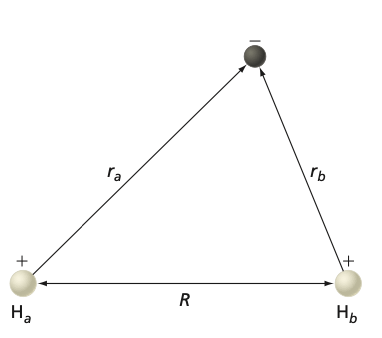

:::

::: {.column width="58%"}

- $H_2^+$: **one electron**, two protons.
- Cleanest model of a **chemical bond**.

::: {.fragment}

- Electron at $\vec{r}_1$, protons at $\vec{R}_A$, $\vec{R}_B$.
- Internuclear distance $R = |\vec{R}_A - \vec{R}_B|$.

:::

:::

::::

## The Full Hamiltonian

- Kinetic energy of **both nuclei and electron**, plus Coulomb terms.

::: {.fragment}

$$\hat{H} = -\frac{\hbar^2}{2M}(\Delta_A + \Delta_B) - \frac{\hbar^2}{2m_e}\Delta_e + \frac{e^2}{4\pi\epsilon_0}\left(\frac{1}{R} - \frac{1}{r_{1A}} - \frac{1}{r_{1B}}\right)$$

:::

::: {.fragment}

- Wavefunction depends on **all** coordinates: $\psi(\vec{r}_1, \vec{R}_A, \vec{R}_B)$.

:::

## The Key Insight: Mass

- Proton mass $M$ is about **1800 times** the electron mass $m_e$.

::: {.fragment}

- Electrons are **fast and light**; nuclei are **slow and heavy**.

:::

::: {.fragment}

- Electrons adjust **instantly** to any nuclear position.

:::

::: {.fragment}

- So freeze the nuclei, then solve for the electron.

:::

## Separating the Wavefunction

- Split into an **electronic** and a **nuclear** part.

::: {.fragment}

$$\psi(\vec{r}_1, \vec{R}_A, \vec{R}_B) = \psi_e(\vec{r}_1, R)\,\psi_n(\vec{R}_A, \vec{R}_B)$$

:::

::: {.fragment}

- $\psi_e$ depends on $R$ as a **parameter**, not a variable.
- $\psi_n$ further splits into **vibration, rotation, translation**.

:::

## The Electronic Schrodinger Equation

::: {.fragment}

$$\hat{H}_e\,\psi_e = E_e\,\psi_e$$

:::

::: {.fragment}

$$\hat{H}_e = -\frac{\hbar^2}{2m_e}\Delta_e + \frac{e^2}{4\pi\epsilon_0}\left(\frac{1}{R} - \frac{1}{|r_1 - R_A|} - \frac{1}{|r_1 - R_B|}\right)$$

:::

::: {.fragment}

- **No nuclear kinetic energy**: the nuclei are frozen.
- One equation **for each value** of $R$.

:::

## R is a Parameter, Not a Variable

- Solve the electronic problem at a **fixed geometry**.

::: {.fragment}

- Both the energy and the orbital depend on $R$:
$$E_e = E_e(R), \qquad \psi_e = \psi_e(R)$$

:::

::: {.fragment}

- Change $R$, get a **new** energy and a **new** wavefunction.

:::

## The Potential Energy Surface

- Sweep $R$ across many fixed geometries.

::: {.fragment}

- Each solution gives one point $E_e(R)$.
- Together they trace the **potential energy surface**.

:::

::: {.fragment}

- The nuclei then **move on this surface**.
- This is what makes electronic structure **tractable**.

:::

## Molecular Orbitals

- The single-electron wavefunctions of a molecule.

::: {.fragment}

- Called **molecular orbitals (MOs)**.
- The molecular analog of **atomic orbitals**.

:::

::: {.fragment}

- Each geometry $R$ gives its **own set** of MOs.

:::

## Born and Oppenheimer

:::: {.columns}

::: {.column width="50%"}

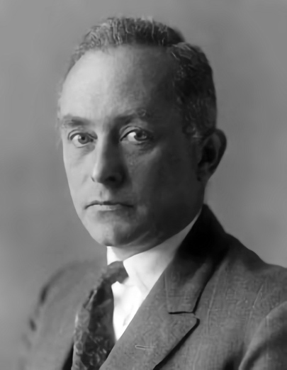

Max Born

:::

::: {.column width="50%"}

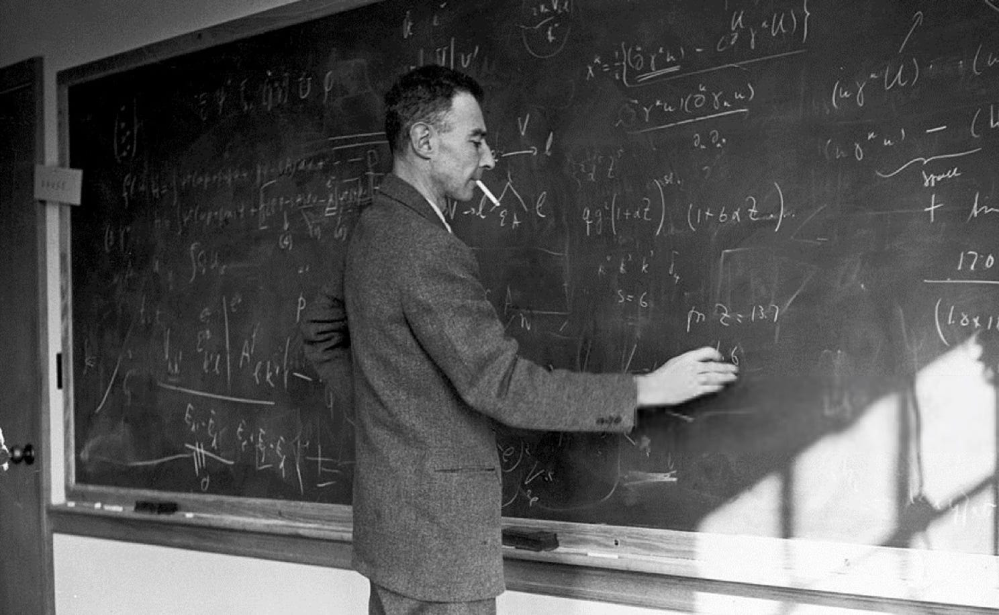

Robert J. Oppenheimer

:::

::::

::: {.fragment}

- Their 1927 separation underpins **all** of molecular quantum chemistry.

:::

## Takeaway

> Because nuclei are far heavier than electrons, the molecular wavefunction **separates** into electronic and nuclear parts. Solving $\hat{H}_e\psi_e = E_e\psi_e$ at each **fixed** nuclear geometry $R$ yields molecular orbitals and traces the **potential energy surface** on which the nuclei move.

## Why $H_2^+$?

- The **simplest molecule**: two nuclei, one electron.

::: {.fragment}

- Solvable **exactly**, but the math is ugly.

:::

::: {.fragment}

- Instead we build an **approximate** wavefunction from atomic orbitals.
- Goal: intuition for **chemical bonding** from a model we can do by hand.

:::

## Building MOs from AOs

:::: {.columns}

::: {.column width="45%"}

:::

::: {.column width="55%"}

- Combine two hydrogen **1s** orbitals.

::: {.fragment}

$$\psi_{\pm} = c\,\big(1s_A \pm 1s_B\big)$$

:::

::: {.fragment}

- This is the **LCAO** approximation.
- Identical nuclei force $c_1 = c_2 \equiv c$ by **symmetry**.

:::

:::

::::

## The Overlap Integral

- Normalizing the **bonding** combination:

::: {.fragment}

$$1 = c^2 \int (1s_A + 1s_B)^2\, d\tau = c^2(2 + 2S)$$

:::

::: {.fragment}

$$S = \int 1s_A(\vec{r})\,1s_B(\vec{r})\, d\tau$$

:::

::: {.fragment}

- The **overlap** $S$ measures how much the AOs share space.
- Fixes the normalization constant $c = 1/\sqrt{2(1+S)}$.

:::

## Bonding and Antibonding MOs

::: {.fragment}

$$\psi_{+} \equiv \psi_g = \frac{1}{\sqrt{2(1+S)}}\left( 1s_A + 1s_B \right)$$

:::

::: {.fragment}

$$\psi_{-} \equiv \psi_u = \frac{1}{\sqrt{2(1-S)}}\left( 1s_A - 1s_B \right)$$

:::

::: {.fragment}

- The antibonding orbital has a **node between the nuclei**: zero density there.

:::

## Where the Electron Goes

:::: {.columns}

::: {.column width="50%"}

:::

::: {.column width="50%"}

- **Bonding** $(+)$: density **piled up** between the nuclei.

::: {.fragment}

- **Antibonding** $(-)$: density **scooped out**, a node at the midpoint.

:::

::: {.fragment}

- This buildup of charge **glues** the nuclei together.

:::

:::

::::

## Symmetry Labels: $g$ and $u$

- Invert through the **center of symmetry** at the midpoint.

::: {.fragment}

- $\psi(-\vec{r}) = +\psi(\vec{r})$: even parity, label $g$.
- $\psi(-\vec{r}) = -\psi(\vec{r})$: odd parity, label $u$.

:::

::: {.fragment}

- For $\sigma$ orbitals: **bonding is $g$**, **antibonding is $u$**.
- The analytic overlap: $S(R) = e^{-R}\left( 1 + R + \tfrac{R^3}{3}\right)$, with $S(0)=1$.

:::

## Variational Energy

- Plug the LCAO trial function into the **variational** energy:

::: {.fragment}

$$E = \frac{c_1^2 H_{AA} + 2c_1 c_2 H_{AB} + c_2^2 H_{BB}}{c_1^2 + 2c_1 c_2 S + c_2^2}$$

:::

::: {.fragment}

- $H_{AA} = H_{BB}$: the **Coulomb** integral (attractive).
- $H_{AB} = H_{BA}$: the **resonance** integral.

:::

## The Secular Determinant

- Minimizing over $c_1, c_2$ gives a **generalized eigenvalue** problem:

::: {.fragment}

$$\begin{pmatrix}H_{AA} - E & H_{AB} - SE\\ H_{AB} - SE & H_{BB} - E\end{pmatrix}\begin{pmatrix} c_1\\ c_2\end{pmatrix} = 0$$

:::

::: {.fragment}

- Non-trivial $c$'s exist only if the **determinant vanishes**:
$$\begin{vmatrix}H_{AA} - E & H_{AB} - SE\\ H_{AB} - SE & H_{BB} - E\end{vmatrix} = 0$$

:::

## Two Energy Roots

::: {.fragment}

$$E_g(R) = E_{1s} + \frac{J(R) + K(R)}{1 + S(R)}$$

:::

::: {.fragment}

$$E_u(R) = E_{1s} + \frac{J(R) - K(R)}{1 - S(R)}$$

:::

::: {.fragment}

- $J(R)$: Coulomb term. $K(R)$: **resonance** term, the source of bonding.
- $E_g$ **lowers** the energy, $E_u$ **raises** it relative to separated atoms.

:::

## Energy vs Internuclear Distance

:::: {.columns}

::: {.column width="55%"}

:::

::: {.column width="45%"}

- $E_g$ has a **minimum**: a stable bond.

::: {.fragment}

- $E_u$ is **repulsive** at all $R$: a purely excited state.

:::

::: {.fragment}

- Crude model: bond length **132 pm** vs **106 pm** experiment.
- Improved by adding more terms to the LCAO.

:::

:::

::::

## The MO Diagram

:::: {.columns}

::: {.column width="40%"}

:::

::: {.column width="60%"}

- Two AOs **split** into a lower $\sigma_g$ and a higher $\sigma_u^{*}$.

::: {.fragment}

- $\sigma$: zero angular momentum about the axis, $\lambda = 0$.
- $\pi$ orbitals from $p_{x,y}$ are **doubly degenerate**.

:::

::: {.fragment}

- Same recipe scales to all **homonuclear** diatomics.

:::

:::

::::

## Takeaway

> Mixing two **1s** orbitals gives a **bonding** $\sigma_g$ that piles electron density between the nuclei and **lowers** the energy, plus an **antibonding** $\sigma_u^{*}$ with a node that **raises** it. The variational secular determinant turns this LCAO picture into the two energy curves $E_g$ and $E_u$.

## From One Electron to Two

- $H_2^+$ had a single electron and an exact MO.
- Neutral $H_2$ adds a **second electron**.

::: {.fragment}

- New term: electron-electron repulsion $1/r_{12}$.
- This term **couples** the electrons together.

:::

::: {.fragment}

- No analytic solution exists for the $H_2$ electronic equation.
- We proceed **approximately** with LCAO-MO.

:::

## The Molecular Hamiltonian

:::: {.columns}

::: {.column width="45%"}

:::

::: {.column width="55%"}

$$\begin{aligned}
H = &-\frac{\hbar^2}{2m_e}(\Delta_1 + \Delta_2) \\
&+ \frac{e^2}{4\pi\epsilon_0}\Big(\tfrac{1}{R} + \tfrac{1}{r_{12}} \\
&- \tfrac{1}{r_{A1}} - \tfrac{1}{r_{A2}} - \tfrac{1}{r_{B1}} - \tfrac{1}{r_{B2}}\Big)
\end{aligned}$$

::: {.fragment}

- The troublesome term is $1/r_{12}$.
- A simple product wavefunction is **not enough**.

:::

:::

::::

## Filling the Bonding Orbital

- **Pauli**: two opposite-spin electrons share one spatial orbital.
- Assume the $H_2$ orbitals match those of $H_2^+$.

::: {.fragment}

- Both electrons occupy $1\sigma_g$: configuration $(1\sigma_g)^2$.

:::

::: {.fragment}

$$1\sigma_g(1) = \frac{1}{\sqrt{2(1+S)}}\big(1s_A(1) + 1s_B(1)\big)$$

:::

## The Total Wavefunction Must Be Antisymmetric

- Exchange of electrons must **flip the sign**.
- Build it as a **Slater determinant**.

::: {.fragment}

$$\psi_{MO}^{(1\sigma_g)^2} = \frac{1}{\sqrt{2}}\begin{vmatrix}
1\sigma_g(1)\alpha(1) & 1\sigma_g(1)\beta(1)\\
1\sigma_g(2)\alpha(2) & 1\sigma_g(2)\beta(2)
\end{vmatrix}$$

:::

::: {.fragment}

- $\alpha, \beta$ are the two **spin** states.

:::

## Space and Spin Factorize

- Expanding the determinant separates the parts.

::: {.fragment}

$$\psi_{MO}^{(1\sigma_g)^2} = \frac{(1s_A(1)+1s_B(1))(1s_A(2)+1s_B(2))}{2\sqrt{2}(1+S_{AB})}\big(\alpha(1)\beta(2) - \alpha(2)\beta(1)\big)$$

:::

::: {.fragment}

- **Symmetric** spatial part times an **antisymmetric** spin singlet.
- Not an exact eigenfunction: energy comes from $\langle \psi | H | \psi\rangle$.

:::

## The Energy Expression

::: {.fragment}

$$E(R) = 2E_{1s} + \frac{e^2}{4\pi\epsilon_0 R} - \textnormal{integrals}$$

:::

- $2E_{1s}$: two separated H atoms.
- $e^2/4\pi\epsilon_0 R$: **nuclear repulsion**.
- "integrals": Coulomb, exchange, overlap of charge clouds.

## How Good Is the Simple MO?

- The model **predicts a bound molecule**. The method works.

::: {.fragment}

| Quantity | Simple MO | Experiment |
|---|---|---|
| $R_e$ | 84 pm | 74.1 pm |
| $D_e$ | 255 kJ/mol | 458 kJ/mol |

:::

::: {.fragment}

- Bond **too long**, binding **too weak**.
- Time to improve the wavefunction.

:::

## Ionic and Covalent Pieces

:::: {.columns}

::: {.column width="50%"}

:::

::: {.column width="50%"}

- The MO product hides distinct physical terms.

::: {.fragment}

- **Covalent**: one electron on each atom (H + H).
- **Ionic**: both electrons on one atom ($H^- + H^+$).

:::

::: {.fragment}

- Simple MO weights them **equally**, overcounting ionic.

:::

:::

::::

## Weighting Them Separately

::: {.fragment}

$$\psi = c_1\,\psi_{\textnormal{covalent}} + c_2\,\psi_{\textnormal{ionic}}$$

:::

::: {.fragment}

$$\psi_{\textnormal{covalent}} = 1s_A(1)1s_B(2) + 1s_A(2)1s_B(1)$$
$$\psi_{\textnormal{ionic}} = 1s_A(1)1s_A(2) + 1s_B(1)1s_B(2)$$

:::

::: {.fragment}

- $c_1, c_2$ are **variational** and depend on $R$.
- Result: $R_e$ = 74.9 pm, $D_e$ = 386 kJ/mol. Much closer.

:::

## Toward Exact Agreement

- Add **higher atomic orbitals** to the basis.
- Hartree-Fock solves this efficiently but **ignores correlation**.

::: {.fragment}

- Full **configuration interaction** captures correlation.

:::

::: {.fragment}

- $D_e$ = 36117.8 cm$^{-1}$ (CI) vs $36117.3 \pm 1.0$ cm$^{-1}$ (expt).
- $R_e$ = 74.140 pm vs 74.139 pm. **Essentially exact.**

:::

## Takeaway

> Neutral $H_2$ has no analytic solution because of $1/r_{12}$, so we place two opposite-spin electrons in $1\sigma_g$ as a **Slater determinant**. This simple LCAO-MO already binds the molecule, and separating **ionic from covalent** terms, then adding **configuration interaction**, drives the bond length and binding energy to essentially exact agreement.

## Two Pictures of Bonding

- **Molecular orbitals (MO)**: electrons delocalized over the whole molecule.

::: {.fragment}

- **Valence bond (VB)**: bonds built from **overlapping atomic orbitals**.

:::

::: {.fragment}

- VB naturally gives **hybrid orbitals** that explain molecular **shape**.

:::

::: {.fragment}

- Both are approximations to the same exact wavefunction.

:::

## Filling the Diatomic Series

- Fill MOs in order of energy: each pair is **bonding plus antibonding**.

::: {.fragment}

$$\text{BO} = \tfrac{1}{2}\left(N_\text{bonding} - N_\text{antibonding}\right)$$

:::

::: {.fragment}

- Higher **bond order** means shorter $R_e$ and larger $D_e$.
- $\pi$ orbitals hold **4** electrons; $\sigma$ hold **2**.

:::

## The Diatomic Trend

| Molecule | Config | BO | $R_e$ (Å) | $D_e$ (eV) |
|---|---|---|---|---|
| $H_2$ | $(1\sigma_g)^2$ | 1.0 | 0.741 | 4.78 |
| $C_2$ | $Be_2(1\pi_u)^4$ | 2.0 | 1.242 | 6.36 |
| $N_2$ | $(3\sigma_g)^2$ | 3.0 | 1.094 | 9.90 |
| $O_2$ | $(1\pi_g)^2$ | 2.0 | 1.207 | 5.21 |

::: {.fragment}

- $N_2$ has the strongest bond: **triple bond**, shortest, deepest well.

:::

## The Non-Crossing Rule

:::: {.columns}

::: {.column width="50%"}

:::

::: {.column width="50%"}

- States of the **same symmetry never cross**.

::: {.fragment}

- As $R$ changes, same-symmetry levels **avoid** each other.

:::

::: {.fragment}

- Sorts orbitals into clean bonding / antibonding ladders.

:::

:::

::::

## Valence Bond and Overlap

- A bond forms where atomic orbitals have **non-zero overlap**.

::: {.fragment}

- Orbitals must share the **same symmetry** to overlap.

:::

::: {.fragment}

- **Hybrids** are linear combinations of orbitals on a **single atom**.
- They only form as other atoms approach, not in free atoms.

:::

## sp Hybrids: $BeH_2$

:::: {.columns}

::: {.column width="45%"}

:::

::: {.column width="55%"}

$$\psi_{sp}^1 = \tfrac{1}{\sqrt{2}}(2s + 2p_z)$$

$$\psi_{sp}^2 = \tfrac{1}{\sqrt{2}}(2s - 2p_z)$$

::: {.fragment}

- One $s$ plus one $p$ give **two** hybrids.
- Geometry is **linear**: H-Be-H.

:::

:::

::::

## sp2 Hybrids: $BH_3$

- Mix $2s$, $2p_z$, $2p_x$ into **three** hybrids.

::: {.fragment}

$$\psi^1_{sp^2} = \tfrac{1}{\sqrt{3}}\,2s + \sqrt{\tfrac{2}{3}}\,2p_z$$

:::

::: {.fragment}

- Each forms a $\sigma$ bond with an H.
- Geometry is **trigonal planar**, angles $120^\circ$.

:::

## sp3 Hybrids: $CH_4$

:::: {.columns}

::: {.column width="45%"}

:::

::: {.column width="55%"}

$$\psi^1_{sp^3} = \tfrac{1}{2}(2s + 2p_x + 2p_y + 2p_z)$$

::: {.fragment}

- One $s$ plus three $p$ give **four** hybrids.
- Geometry is **tetrahedral**.

:::

::: {.fragment}

- Count is conserved: orbitals in = hybrids out.

:::

:::

::::

## Lone Pairs: $H_2O$

- Oxygen is **$sp^3$** hybridized.

::: {.fragment}

- Two hybrids **bond** to H; two hold **lone pairs**.

:::

::: {.fragment}

- Predicted angle $109^\circ$, observed $104^\circ$.
- Lone pairs **squeeze** the bond angle.

:::

## Reading an MO Diagram

:::: {.columns}

::: {.column width="50%"}

:::

::: {.column width="50%"}

- Atomic orbitals on the sides, **molecular** orbitals in the middle.

::: {.fragment}

- Bonding orbitals drop **below** the atomic levels.
- Antibonding rise **above**.

:::

:::

::::

## From Orbitals to Numbers

- Real calculations replace atomic orbitals with **Gaussian basis sets**.

::: {.fragment}

- Gaussians make the required **integrals analytic**.
- Used in **Hartree-Fock (SCF)** and beyond.

:::

::: {.fragment}

- Handy rule: a **product of Gaussians is a Gaussian**.

:::

## Takeaway

> The **MO picture** predicts bond order, length, and strength across the diatomic series, while the **valence bond** picture builds bonds from overlapping atomic orbitals and gives $sp$, $sp^2$, $sp^3$ **hybrids** that fix molecular geometry.

## Why Conjugated Systems Need a New Approach

:::: {.columns}

::: {.column width="50%"}

:::

::: {.column width="50%"}

- $\pi$ electrons are **delocalized** over the whole molecule.
- Localized **valence bond** pictures fail for benzene.

::: {.fragment}

- We need a model built for **delocalization**.

:::

:::

::::

## The Huckel Idea

- Treat the **$\pi$ electrons** independently of the $\sigma$ framework.
- Each $\pi$ MO is a **linear combination** of carbon $2p$ orbitals.

::: {.fragment}

$$\psi = c_1\phi_1 + c_2\phi_2 + \cdots$$

:::

::: {.fragment}

- The variational principle gives a **secular determinant** to solve.

:::

## The Three Huckel Approximations

::: {.fragment}

1. Overlaps $S_{ij}=0$ unless $i=j$, where $S_{ii}=1$.

:::

::: {.fragment}

2. All diagonal elements $H_{ii}=\alpha$, the **Coulomb integral**.

:::

::: {.fragment}

3. Off-diagonal $H_{ij}=\beta$ only for **neighboring** atoms, else $0$. This is the **resonance integral**.

:::

::: {.fragment}

- $\alpha$ and $\beta$ are **empirical**: no Hamiltonian needed.

:::

## Ethylene: The Simplest Case

- Two carbons, one neighboring pair. The secular determinant is

::: {.fragment}

$$\begin{vmatrix}\alpha - E & \beta\\ \beta & \alpha - E\\ \end{vmatrix} = 0$$

:::

::: {.fragment}

- Expanding gives a quadratic with roots
$$E = \alpha \pm \beta$$

:::

::: {.fragment}

- Since $\beta < 0$, the **bonding** level is $E_1 = \alpha + \beta$.

:::

## Ethylene MOs and Energy

- Substituting each $E$ back gives the normalized orbitals:

::: {.fragment}

$$\psi_1 = \tfrac{1}{\sqrt{2}}(\phi_1 + \phi_2), \qquad \psi_2 = \tfrac{1}{\sqrt{2}}(\phi_1 - \phi_2)$$

:::

::: {.fragment}

- Two $\pi$ electrons fill $\psi_1$: $E_{tot} = 2\alpha + 2\beta$.
- Excitation energy $= 2|\beta|$, measurable by **UV/VIS**.

:::

## HOMO and LUMO

- **HOMO**: highest occupied molecular orbital.
- **LUMO**: lowest unoccupied molecular orbital.

::: {.fragment}

- The **HOMO-LUMO gap** sets the lowest electronic excitation.
- For ethylene that gap is exactly $2|\beta|$.

:::

## Butadiene: Build the Matrix

- Number the carbons $1\,2\,3\,4$; neighbors get a $\beta$.
- Divide each row by $\beta$ and set $x = (\alpha - E)/\beta$:

::: {.fragment}

$$\begin{vmatrix} x & 1 & 0 & 0\\ 1 & x & 1 & 0\\ 0 & 1 & x & 1\\ 0 & 0 & 1 & x\\ \end{vmatrix} = 0$$

:::

::: {.fragment}

- Expanding: $x^4 - 3x^2 + 1 = 0$, with $x = \pm 0.618,\ \pm 1.618$.

:::

## Butadiene: Four Levels

:::: {.columns}

::: {.column width="50%"}

:::

::: {.column width="50%"}

$$E_1 = \alpha + 1.618\beta$$
$$E_2 = \alpha + 0.618\beta$$
$$E_3 = \alpha - 0.618\beta$$
$$E_4 = \alpha - 1.618\beta$$

::: {.fragment}

- Four electrons fill $E_1, E_2$:
$$E_\pi = 4\alpha + 4.472\beta$$

:::

:::

::::

## Resonance Stabilization

- Delocalized $\pi$ energy: $E_\pi = 4\alpha + 4.472\beta$.
- Two isolated double bonds would give $4\alpha + 4\beta$.

::: {.fragment}

- The extra $0.472\beta$ is the **resonance stabilization energy**.
- Delocalization **lowers** the total $\pi$ energy.

:::

## Benzene: Aromatic Stabilization

:::: {.columns}

::: {.column width="48%"}

:::

::: {.column width="52%"}

$$E_1 = \alpha + 2\beta$$
$$E_2 = E_3 = \alpha + \beta$$
$$E_4 = E_5 = \alpha - \beta$$
$$E_6 = \alpha - 2\beta$$

::: {.fragment}

- Six electrons fill the lowest three: $E_\pi = 6\alpha + 8\beta$.

:::

::: {.fragment}

- Three ethylenes give $6\alpha + 6\beta$: benzene gains an extra $2\beta$.

:::

:::

::::

## Symmetry and Degeneracy

- Benzene's ring symmetry forces **degenerate pairs**: $E_2 = E_3$ and $E_4 = E_5$.

::: {.fragment}

- High symmetry produces **shared energy levels**, just as in the 3D box.
- The $2\beta$ bonus is the quantum origin of **aromaticity**.

:::

## Takeaway

> Huckel theory reduces the $\pi$ system to a matrix of just two empirical numbers, $\alpha$ and $\beta$. Diagonalizing it gives the orbital energies, and the extra binding beyond isolated double bonds (an extra $2\beta$ for benzene) is the quantum origin of **resonance** and **aromatic stabilization**.

## The Electric Dipole Moment

- A dipole measures the **asymmetry** of a charge distribution.

::: {.fragment}

$$\vec{\mu} = \sum_{i=1}^{N} Q_i\,\vec{r_i}$$

:::

::: {.fragment}

- A **vector** pointing from negative to positive charge.
- SI units of **C m**; often quoted in **debye** (D).

:::

## Dipole as an Expectation Value

- For a molecule, take the **expectation value** of the dipole operator.

::: {.fragment}

$$\hat{\mu}_x = \sum_{i=1}^{N} Q_i x_i, \quad \hat{\mu}_y = \sum_{i=1}^{N} Q_i y_i, \quad \hat{\mu}_z = \sum_{i=1}^{N} Q_i z_i$$

:::

::: {.fragment}

$$\left\langle \vec{\hat{\mu}} \right\rangle = \int \psi^* \, \vec{\hat{\mu}} \, \psi \, d\tau$$

:::

## Ionic versus Covalent

- **Similar** electronegativity: orbitals spread evenly, a **covalent** bond.

::: {.fragment}

- **Different** electronegativity: orbitals lopsided, **ionic** character and a permanent dipole.

:::

::: {.fragment}

- Neither **pure ionic** nor **pure covalent** bonds truly exist.

:::

## When Is a Bond Ionic? (LiF)

- Compare the cost of **electron transfer**.

::: {.fragment}

- Li ionization energy $\approx 5.4$ eV, F electron affinity $\approx 3.5$ eV.
- Difference of only **1.9 eV**, so ionic bonding is favorable.

:::

::: {.fragment}

- Contrast the **C-H** bond: the gap exceeds **10 eV**, so it stays covalent.

:::

## The Ionic Binding Curve

:::: {.columns}

::: {.column width="48%"}

:::

::: {.column width="52%"}

- **Coulomb attraction** at long range pulls the ions together.

::: {.fragment}

$$E(R) = \frac{Q_1 Q_2}{4\pi\epsilon_0 R} + b\,e^{-aR}$$

:::

::: {.fragment}

- Short-range **Pauli repulsion** sets the minimum at $R_e$.

:::

:::

::::

## Why the Short-Range Repulsion?

:::: {.columns}

::: {.column width="50%"}

:::

::: {.column width="50%"}

- Close in, filled orbitals **overlap**.

::: {.fragment}

- Both **bonding and antibonding** orbitals fill.
- Antibonding repulsion **outweighs** bonding attraction.

:::

::: {.fragment}

- This is the **Pauli repulsion** term $b\,e^{-aR}$.

:::

:::

::::

## Dissociation Goes to Atoms

- An **avoided crossing** switches ionic to covalent on the way out.

::: {.fragment}

- The molecule breaks into **neutral atoms**, not ions.

:::

::: {.fragment}

$$D_e(\text{MX} \to \text{M} + \text{X}) = D_e(\text{MX} \to \text{M}^+ + \text{X}^-) - E_{ea}(\text{X})$$

:::

## Intermolecular Forces

- Even with **no chemical bond**, molecules attract weakly.

::: {.fragment}

- Three weak attractions, **all** scaling as $1/R^6$:
  - **Dipole-dipole** (Keesom)
  - **Dipole-induced-dipole**
  - **Dispersion** (London)

:::

::: {.fragment}

- Balanced by **Pauli repulsion** at short range.

:::

## The Three $1/R^6$ Attractions

- **Dipole-dipole**, thermally averaged:
$$\langle V \rangle_{dd} = -\frac{2}{3kT}\left(\frac{\mu_A \mu_B}{4\pi\epsilon_0}\right)^2 \frac{1}{R^6}$$

::: {.fragment}

- **Dispersion** needs no permanent dipole:
$$\langle V \rangle_{disp} = -\frac{3}{2}\left(\frac{E_A E_B}{E_A + E_B}\right)\frac{\alpha_A \alpha_B}{(4\pi\epsilon_0)^2}\frac{1}{R^6}$$

:::

## The Lennard-Jones Potential

- Combine $1/R^6$ attraction with a steep repulsion.

::: {.fragment}

$$V(R) = 4\epsilon\left[\left(\frac{\sigma}{R}\right)^{12} - \left(\frac{\sigma}{R}\right)^{6}\right]$$

:::

::: {.fragment}

- $R^{-12}$ is **Pauli repulsion**, $R^{-6}$ is **van der Waals** binding.
- Well depth $\epsilon$ sits at $R_e = 2^{1/6}\sigma$.

:::

## Takeaway

> A **dipole** is the expectation value of $\sum_i Q_i \vec{r_i}$; an **ionic bond** is Coulomb attraction $Q_1 Q_2/4\pi\epsilon_0 R$ tamed by **Pauli repulsion**, and weak $1/R^6$ forces plus that repulsion give the **Lennard-Jones** potential $4\epsilon[(\sigma/R)^{12} - (\sigma/R)^{6}]$.
