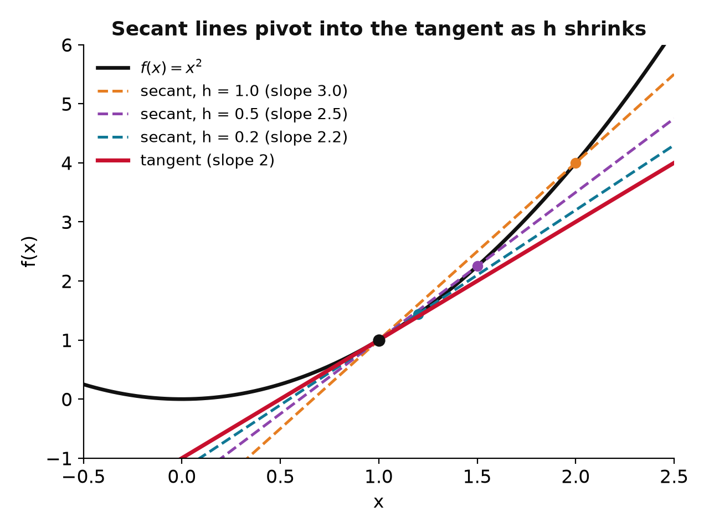
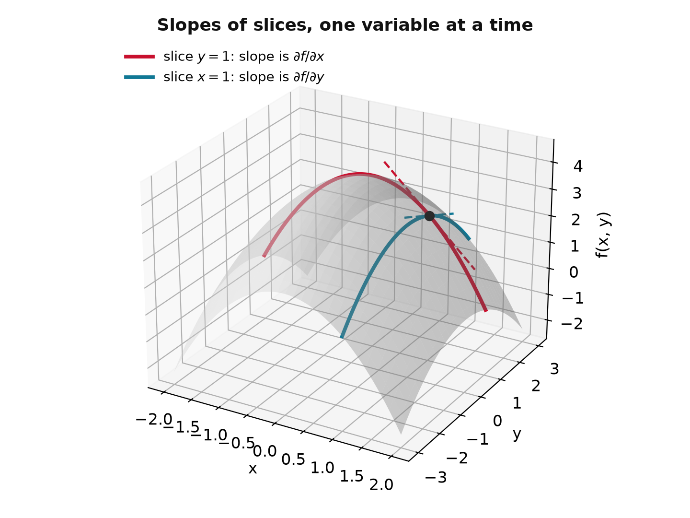
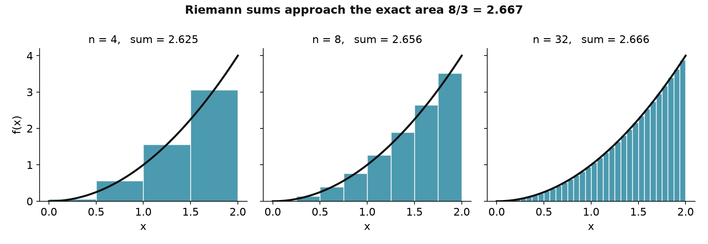
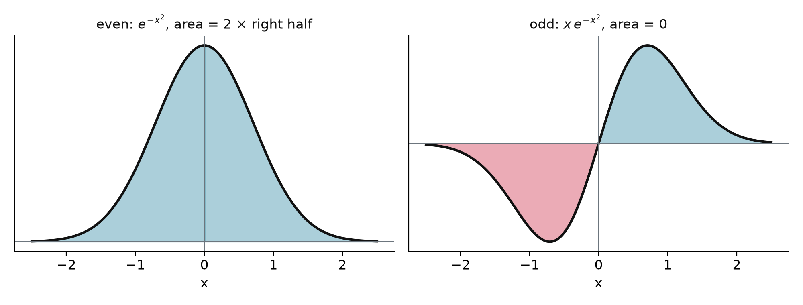

## Why calculus, in one slide

- Chemistry asks two questions of any changing quantity: **how fast** does it change, and **how much** accumulates

$$\text{rate} = -\frac{d[\mathrm{A}]}{dt} \qquad\qquad q = \int_{T_1}^{T_2} C_p\, dT$$

- Two pictures carry the whole subject: the **derivative is a slope**, the **integral is an area**
- Two tools do most of the work: the **chain rule** and **integration by parts**
- Later the same moves act on waves and quantum states; sharpen them now

## The derivative is a slope

:::: {.columns}
::: {.column width="55%"}
{width="100%"}
:::
::: {.column width="45%"}
::: {.keyeq}
$$f'(x) = \lim_{h \to 0}\frac{f(x+h) - f(x)}{h}$$
:::

- Slope of the **secant** through two nearby points; merge them and it becomes the **tangent**
- **Rate of change**: position gives velocity, concentration gives rate
- Read backwards, a **step recipe**: $f(x+h) \approx f(x) + f'(x)\,h$
:::
::::

## Live: shrink the spacing {.smaller}

<span style="color:#C8102E">**secant**</span> pivots into the <span style="color:#1f3a93">**tangent**</span>; the <span style="color:#107895">**step prediction**</span> $f(x) + f'(x)\,h$ misses the curve by $h^2$

```{ojs}
//| echo: false
viewof hh = Inputs.range([0.05, 1.5], {step: 0.05, value: 1.0, label: "spacing h"})
```

```{ojs}
//| echo: false
{
  const f = x => x * x, x0 = 1, slope = 2 + hh, pred = f(x0) + 2 * hh;
  const xs = d3.range(-0.5, 2.81, 0.02);
  const curve = xs.map(x => ({x, y: f(x)}));
  const sec = xs.map(x => ({x, y: f(x0) + slope * (x - x0)}));
  const tan = xs.map(x => ({x, y: f(x0) + 2 * (x - x0)}));
  return Plot.plot({
    width: 620, height: 400,
    x: {domain: [-0.5, 2.8], label: "x"}, y: {domain: [-1, 7], label: "f(x)"},
    marks: [
      Plot.line(curve, {x: "x", y: "y", stroke: "#111", strokeWidth: 2.5}),
      Plot.line(sec, {x: "x", y: "y", stroke: "#C8102E", strokeWidth: 2, strokeDasharray: "6,4"}),
      Plot.line(tan, {x: "x", y: "y", stroke: "#1f3a93", strokeWidth: 2}),
      Plot.ruleX([x0 + hh], {y1: pred, y2: f(x0 + hh), stroke: "#107895", strokeWidth: 4}),
      Plot.dot([{x: x0, y: f(x0)}, {x: x0 + hh, y: f(x0 + hh)}], {x: "x", y: "y", fill: "#C8102E", r: 5}),
      Plot.dot([{x: x0 + hh, y: pred}], {x: "x", y: "y", fill: "#107895", r: 5, symbol: "square"})
    ]
  });
}
```

```{ojs}
//| echo: false
md`secant slope = **${(2 + hh).toFixed(2)}** (tangent slope 2); step prediction error = h² = **${(hh * hh).toFixed(3)}**`
```

## Rules of differentiation

:::: {.columns}
::: {.column width="50%"}
- **Constant multiple**: $(c f)' = c f'$
- **Sum**: $(f \pm g)' = f' \pm g'$
- **Power**: $\dfrac{d}{dx} x^n = n x^{n-1}$
- **Product**: $(fg)' = f'g + fg'$
- **Quotient**: $\left(\dfrac{f}{g}\right)' = \dfrac{f'g - fg'}{g^2}$
:::
::: {.column width="50%"}
::: {.keyeq}
$$\frac{d}{dx} f(g(x)) = \frac{df}{dg}\cdot\frac{dg}{dx}$$
:::

- The **chain rule**: nearly every function in this course is a composition, $e^{-\alpha x^2}$, $\sin(kx)$, $e^{ikx}$
- Outer derivative times inner derivative
:::
::::

## Worked: a product with a composition inside

Differentiate $f(x) = x^2\, e^{-\alpha x^2}$ (product rule, chain rule inside the exponential):

$$\frac{df}{dx} = (x^2)'\, e^{-\alpha x^2} + x^2\, \big(e^{-\alpha x^2}\big)' = 2x\, e^{-\alpha x^2} + x^2\,(-2\alpha x)\, e^{-\alpha x^2} = 2x\,(1 - \alpha x^2)\, e^{-\alpha x^2}$$

- Product rule for the two factors, chain rule for $(e^{-\alpha x^2})' = -2\alpha x\, e^{-\alpha x^2}$

::: {.fragment}
- $f' = 0$ at $x = 0$ and $x = \pm 1/\sqrt{\alpha}$: a **minimum** flanked by two **maxima**
- Same moves for the Gaussian $e^{-ax^2}$: $f' = -2ax\,e^{-ax^2}$, $f'' = (4a^2x^2 - 2a)\,e^{-ax^2}$, inflection points at $x = \pm 1/\sqrt{2a}$
:::

## Derivatives you should know by heart {.smaller}

| $f(x)$ | $f'(x)$ | | $f(x)$ | $f'(x)$ |
|:--|:--|--|:--|:--|
| $x^n$ | $n x^{n-1}$ | | $e^{ax}$ | $a\,e^{ax}$ |
| $\sin x$ | $\cos x$ | | $\cos x$ | $-\sin x$ |
| $\ln x$ | $1/x$ | | $\tan x$ | $\sec^2 x$ |
| $e^{ikx}$ | $ik\,e^{ikx}$ | | $e^{-\alpha x^2}$ | $-2\alpha x\, e^{-\alpha x^2}$ |

- The last row is the course in miniature: **plane waves** and **Gaussians**
- Behind the table: $\lim_{\theta\to0} \sin\theta/\theta = 1$ and $\lim_{h\to0}(e^h - 1)/h = 1$, which is why $e^x$ is its own derivative

## Several variables: hold the rest fixed

:::: {.columns}
::: {.column width="42%"}
{width="100%"}
:::
::: {.column width="58%"}
::: {.keyeq}
$$\frac{\partial f}{\partial x} = \lim_{h \to 0}\frac{f(x+h,\,y) - f(x,\,y)}{h}$$
:::

- A surface has no single slope: **slice it** along one variable, freeze the others
- Compute with the ordinary rules; the frozen variables ride along like constants
- Shorthands $f_x$, $f_{xx}$, $f_{xy}$, and $\left(\partial P/\partial V\right)_T$ in thermodynamics
- Mixed partials **commute**: $f_{xy} = f_{yx}$
:::
::::

## The chain rule on a sliding shape

$u(x,t) = f(x - vt)$: the profile $f$ moving right at speed $v$. Chain rule with $s = x - vt$:

$$\frac{\partial u}{\partial x} = f'(s), \qquad \frac{\partial u}{\partial t} = -v\,f'(s), \qquad
\frac{\partial^2 u}{\partial x^2} = f''(s), \qquad \frac{\partial^2 u}{\partial t^2} = v^2 f''(s)$$

- Each $t$ derivative brings down one factor of $-v$

::: {.fragment}
- Eliminate $f''$: a relation holds for **every** sliding shape, whatever $f$ is

$$\frac{\partial^2 u}{\partial x^2} = \frac{1}{v^2}\,\frac{\partial^2 u}{\partial t^2}$$

- This is the **classical wave equation**, straight out of calculus. Chapter 2 gives it physics
:::

## The integral is an area

::: {.keyeq}
$$\int_a^b f(x)\,dx = \lim_{n\to\infty}\sum_{i=1}^{n} f(x_i)\,\Delta x, \qquad \Delta x = \frac{b-a}{n}$$
:::

{width="66%" fig-align="center"}

## The fundamental theorem

::: {.keyeq}
$$\int_a^b f(x)\,dx = F(b) - F(a), \qquad F'(x) = f(x)$$
:::

- Differentiation and integration are **inverse operations**
- An infinite sum becomes a single subtraction: find an antiderivative and you are done

| $f(x)$ | $F(x)$ | | $f(x)$ | $F(x)$ |
|:--|:--|--|:--|:--|
| $x^n$ | $\dfrac{x^{n+1}}{n+1}$ | | $e^{ax}$ | $\dfrac{1}{a}e^{ax}$ |
| $\sin x$ | $-\cos x$ | | $\cos x$ | $\sin x$ |

## Two techniques cover almost everything

**Substitution**, the chain rule run backwards:
$$\int f(g(x))\,g'(x)\,dx = \int f(u)\,du$$

::: {.keyeq}
$$\int u\,dv = uv - \int v\,du$$
:::

- **Integration by parts** is the product rule run backwards: $\int x\,e^{-x}dx$, $\int x \sin x\,dx$, every expectation value
- For sines and cosines: $\sin^2 x = \tfrac12(1 - \cos 2x)$, $\cos^2 x = \tfrac12(1 + \cos 2x)$

## Symmetry kills integrals on sight

:::: {.columns}
::: {.column width="60%"}
{width="100%"}
:::
::: {.column width="40%"}
- **Even** $f(-x) = f(x)$: $\displaystyle\int_{-a}^{a} f\,dx = 2\int_0^a f\,dx$
- **Odd** $f(-x) = -f(x)$: $\displaystyle\int_{-a}^{a} f\,dx = 0$
- Check the symmetry **before** you integrate: $\langle x \rangle = 0$ for every symmetric state
:::
::::

## The two integrals you will use all semester

$$\int_0^L \sin^2\!\left(\frac{n\pi x}{L}\right) dx = \frac{L}{2}$$

- Power reduction, the cosine integrates to zero over whole half-periods. This is the $\sqrt{2/L}$ in front of every **particle in a box** state

$$\int_0^\infty x^n e^{-x}\, dx = n!$$

- Integrate by parts $n$ times, or recognize the Gamma function. The workhorse of **hydrogen atom** radial integrals

# Takeaway {.center}

> A derivative is a slope and a step recipe, an integral is an area, and the fundamental theorem makes them inverses. A partial derivative is the same slope with the other variables frozen. The chain rule and integration by parts do most of the work; check the symmetry of the integrand before doing either.
