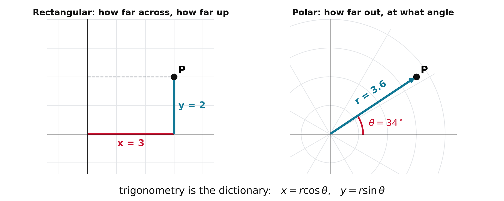
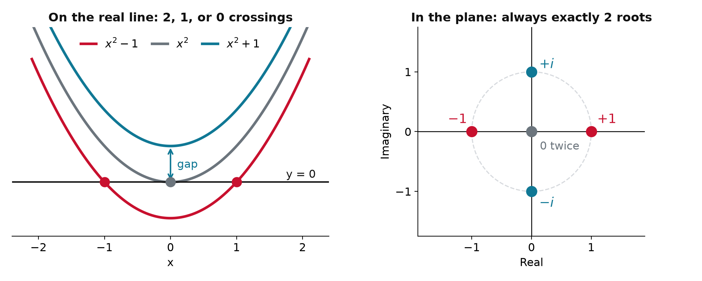

## One theme: rotation in a plane

{.nostretch width="76%" fig-align="center"}

- One point, two ways to name it: **across and up**, or **out and around**
- **Trigonometry** converts between them; **complex numbers** make the second one algebra

## Sine and cosine are coordinates

{width="95%" fig-align="center"}

- Rotate a point on the unit circle by $\theta$ radians: $x = \cos\theta$, $y = \sin\theta$
- A full turn is $2\pi$; each function is the other shifted by a quarter turn

## Identities you will reach for

::: {.keyeq}
$$\cos^2\theta + \sin^2\theta = 1$$
:::

**Angle sum**, the workhorse

$$\sin(A \pm B) = \sin A\cos B \pm \cos A\sin B$$

$$\cos(A \pm B) = \cos A\cos B \mp \sin A\sin B$$

- Do not memorize the table: every line falls out of Euler's formula

## Two more you will use constantly

**Power reduction**, a square becomes a single cosine

$$\sin^2\theta = \tfrac{1}{2}(1 - \cos 2\theta), \qquad \cos^2\theta = \tfrac{1}{2}(1 + \cos 2\theta)$$

**Small angles** in radians, the first Taylor terms

$$\sin\theta \approx \theta, \qquad \cos\theta \approx 1 - \tfrac{1}{2}\theta^2$$

- The second one is how a vibrating bond becomes a **harmonic oscillator**

## Complex numbers live in 2D

:::: {.columns}
::: {.column width="40%"}
{width="100%"}
:::
::: {.column width="60%"}
- $x^2 + 1 = 0$ has no real root, so extend the line to a plane with one new symbol, $i^2 = -1$

::: {.keyeq}
$$z = x + iy, \qquad x = \operatorname{Re} z,\ \ y = \operatorname{Im} z$$
:::

- A complex number is a **point in a plane**: real part across, imaginary part up
- $3 + 2i$, $-2i$, and $1.1$ are all complex numbers
:::
::::

## Why we needed $i$: every root, every time

{.nostretch width="70%" fig-align="center"}

- Lift the parabola and the crossings vanish, but the **roots do not**: they step off the line
- **Fundamental theorem of algebra**: degree $n$ means exactly $n$ complex roots, always

## Polar form and Euler's formula

:::: {.columns}
::: {.column width="42%"}
{width="100%"}
:::
::: {.column width="58%"}
Locate $z$ by its distance $r$ and angle $\phi$

$$x = r\cos\phi, \qquad y = r\sin\phi$$

::: {.keyeq}
$$e^{i\phi} = \cos\phi + i\sin\phi$$
:::

$$z = r(\cos\phi + i\sin\phi) = r\,e^{i\phi}$$

- $r = \sqrt{x^2 + y^2}$ is the **magnitude**, $\phi$ the **phase**
:::
::::

## Example: Cartesian to polar

::: {.worked}
Write $z = -4 + 4i$ in polar form.
:::

::: {.soln .fragment}
$$r = \sqrt{(-4)^2 + 4^2} = 4\sqrt{2}, \qquad \phi = \frac{3\pi}{4}$$

$$z = 4\sqrt{2}\;e^{i\,3\pi/4}$$
:::

- Second quadrant, so take $\phi$ from `arctan2(y, x)`, not from $\arctan(y/x)$
- On a calculator `atan` sees $-4/4$ and $4/{-4}$ as one ratio and always answers in quadrant I or IV; `atan2` reads both signs

## Multiplication is rotation

:::: {.columns}
::: {.column width="45%"}
{width="100%"}
:::
::: {.column width="55%"}
$$(r_1 e^{i\phi_1})(r_2 e^{i\phi_2}) = r_1 r_2\, e^{i(\phi_1 + \phi_2)}$$

- **Magnitudes multiply, angles add**
- $|e^{i\phi}| = 1$, so multiplying by $e^{i\phi}$ is a **pure turn** by $\phi$: no stretching
- $i = e^{i\pi/2}$ is a quarter turn; four of them bring you home, $i^4 = 1$
- $e^{-i\phi}$ undoes $e^{i\phi}$; angles matter only mod $2\pi$
:::
::::

## Example: multiply the same idea two ways

::: {.worked}
Find $(3 + 4i)(1 - 2i)$, then $\left(2e^{i\pi/6}\right)\left(3e^{i\pi/3}\right)$.
:::

::: {.soln .fragment}
$$(3 + 4i)(1 - 2i) = 3 - 6i + 4i - 8i^2 = 11 - 2i$$

$$\left(2e^{i\pi/6}\right)\left(3e^{i\pi/3}\right) = 6\,e^{i(\pi/6 + \pi/3)} = 6\,e^{i\pi/2} = 6i$$
:::

- Cartesian: expand, then $i^2 = -1$. Polar: **lengths multiply, angles add**, and you are done

## Live: dial the phase {.smaller}

<span style="color:#e67e22">**$z$**</span> and <span style="color:#107895">**$e^{i\phi} z$**</span>: the length never changes, only the angle

```{ojs}
//| echo: false
viewof phi = Inputs.range([-6.28, 6.28], {step: 0.05, value: 0.9, label: "rotation angle φ (rad)"})
```

```{ojs}
//| echo: false
{
  const z = {re: 1.3, im: 0.5};
  const w = {re: Math.cos(phi) * z.re - Math.sin(phi) * z.im, im: Math.sin(phi) * z.re + Math.cos(phi) * z.im};
  const R = Math.hypot(z.re, z.im);
  const circle = d3.range(0, 6.3, 0.05).map(t => ({x: R * Math.cos(t), y: R * Math.sin(t)}));
  const a0 = Math.atan2(z.im, z.re);
  const arc = d3.range(0, 1.0001, 0.02).map(s => ({x: 0.5 * Math.cos(a0 + s * phi), y: 0.5 * Math.sin(a0 + s * phi)}));
  return Plot.plot({
    width: 440, height: 440, aspectRatio: 1,
    x: {domain: [-2, 2], label: "Real", ticks: 5}, y: {domain: [-2, 2], label: "Imaginary", ticks: 5},
    marks: [
      Plot.line(circle, {x: "x", y: "y", stroke: "#bbb", strokeDasharray: "4,4"}),
      Plot.ruleX([0], {stroke: "#333"}), Plot.ruleY([0], {stroke: "#333"}),
      Plot.arrow([{x1: 0, y1: 0, x2: z.re, y2: z.im}], {x1: "x1", y1: "y1", x2: "x2", y2: "y2", stroke: "#e67e22", strokeWidth: 3}),
      Plot.arrow([{x1: 0, y1: 0, x2: w.re, y2: w.im}], {x1: "x1", y1: "y1", x2: "x2", y2: "y2", stroke: "#107895", strokeWidth: 3}),
      Plot.line(arc, {x: "x", y: "y", stroke: "#C8102E", strokeWidth: 2}),
      Plot.text([{x: z.re + 0.15, y: z.im + 0.1, t: "z"}], {x: "x", y: "y", text: "t", fill: "#e67e22", fontSize: 18}),
      Plot.text([{x: w.re + 0.15, y: w.im + 0.1, t: "e^(iφ) z"}], {x: "x", y: "y", text: "t", fill: "#107895", fontSize: 18})
    ]
  });
}
```

```{ojs}
//| echo: false
md`|z| = **${Math.hypot(1.3, 0.5).toFixed(2)}** before and after: a pure ${phi >= 0 ? "counterclockwise" : "clockwise"} turn by ${phi.toFixed(2)} rad`
```

## The rotating phase is a helix

:::: {.columns}
::: {.column width="55%"}
{width="100%"}
:::
::: {.column width="45%"}
$$e^{i\omega t} = \cos\omega t + i\sin\omega t$$

- The tip runs around a **circle** in the complex plane; let time run along a third axis and the path is a **helix**
- Its shadow on one wall is $\cos\omega t$, on the other $\sin\omega t$
- One turning arrow carries **both waves**, which is why one exponential replaces two trig functions
:::
::::

## The conjugate and the modulus

::: {.keyeq}
$$\bar{z} = x - iy = r\,e^{-i\phi}, \qquad |z|^2 = \bar{z}\,z = x^2 + y^2 = r^2$$
:::

- Conjugation **reflects** $z$ across the real axis; $\bar z z$ rotates it back onto the axis and leaves a non-negative number
- Sums and differences of $e^{\pm i\phi}$ hand the trig functions back:

$$\cos\phi = \frac{e^{i\phi} + e^{-i\phi}}{2}, \qquad \sin\phi = \frac{e^{i\phi} - e^{-i\phi}}{2i}$$

## Example: modulus and division

::: {.worked}
Find $|7 + 24i|$, then divide $3 + 4i$ by $1 - 2i$.
:::

::: {.soln .fragment}
$$|7 + 24i| = \sqrt{49 + 576} = \sqrt{625} = 25$$

$$\frac{3 + 4i}{1 - 2i} = \frac{(3 + 4i)(1 + 2i)}{(1 - 2i)(1 + 2i)} = \frac{-5 + 10i}{5} = -1 + 2i$$
:::

- To divide, multiply top and bottom by the **conjugate of the bottom**: the denominator turns real

## Adding waves is adding arrows

Each cosine is the shadow of a turning arrow, $\cos\theta = \operatorname{Re}\,e^{i\theta}$

$$\cos\theta + \cos(\theta + \phi)
= \operatorname{Re}\,e^{i\theta} + \operatorname{Re}\,e^{i\theta}e^{i\phi}
= \operatorname{Re}\big[e^{i\theta} + e^{i\theta}e^{i\phi}\big]$$

::: {.keyeq}
$$\cos\theta + \cos(\theta + \phi) = \operatorname{Re}\big[e^{i\theta}\,(1 + e^{i\phi})\big]$$
:::

- Two rules only: $e^{i(\theta + \phi)} = e^{i\theta}e^{i\phi}$, and $\operatorname{Re}$ of a sum is the sum of the $\operatorname{Re}$s
- Factoring the shared $e^{i\theta}$ leaves $1 + e^{i\phi}$: **two arrows a fixed angle $\phi$ apart**

## Interference is the length of one arrow

{.nostretch width="72%" fig-align="center"}

$$|1 + e^{i\phi}| = 2\left|\cos(\phi/2)\right|$$

- $\phi = 0$: arrows aligned, amplitude **doubles**. $\phi = \pi$: opposed, amplitude **zero**
- Bright and dark fringes are exactly this arrow, long or short

## Derivatives become multiplications

::: {.keyeq}
$$\frac{\partial}{\partial x}\,e^{i(kx - \omega t)} = ik\,e^{i(kx - \omega t)}, \qquad \frac{\partial}{\partial t}\,e^{i(kx - \omega t)} = -i\omega\,e^{i(kx - \omega t)}$$
:::

- A wave is the real part of a rotating phase: $\cos(kx - \omega t) = \operatorname{Re}\,e^{i(kx - \omega t)}$
- Differentiating only brings down a **constant factor**; twice gives $-k^2$ and $-\omega^2$
- Taking the real part commutes with adding and differentiating, so do all the algebra on the exponential and take $\operatorname{Re}$ at the very end

# Takeaway {.center}

> $e^{i\phi} = \cos\phi + i\sin\phi$ turns trigonometry into exponentials: multiplying by $e^{i\phi}$ rotates without stretching, $\bar z z = |z|^2$ turns any complex number into a real length, and adding waves becomes adding arrows.
