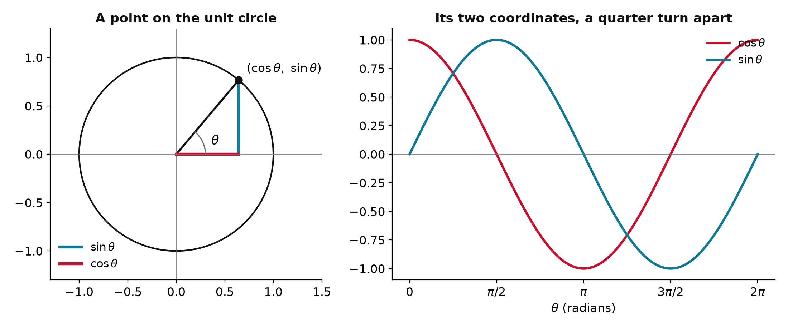
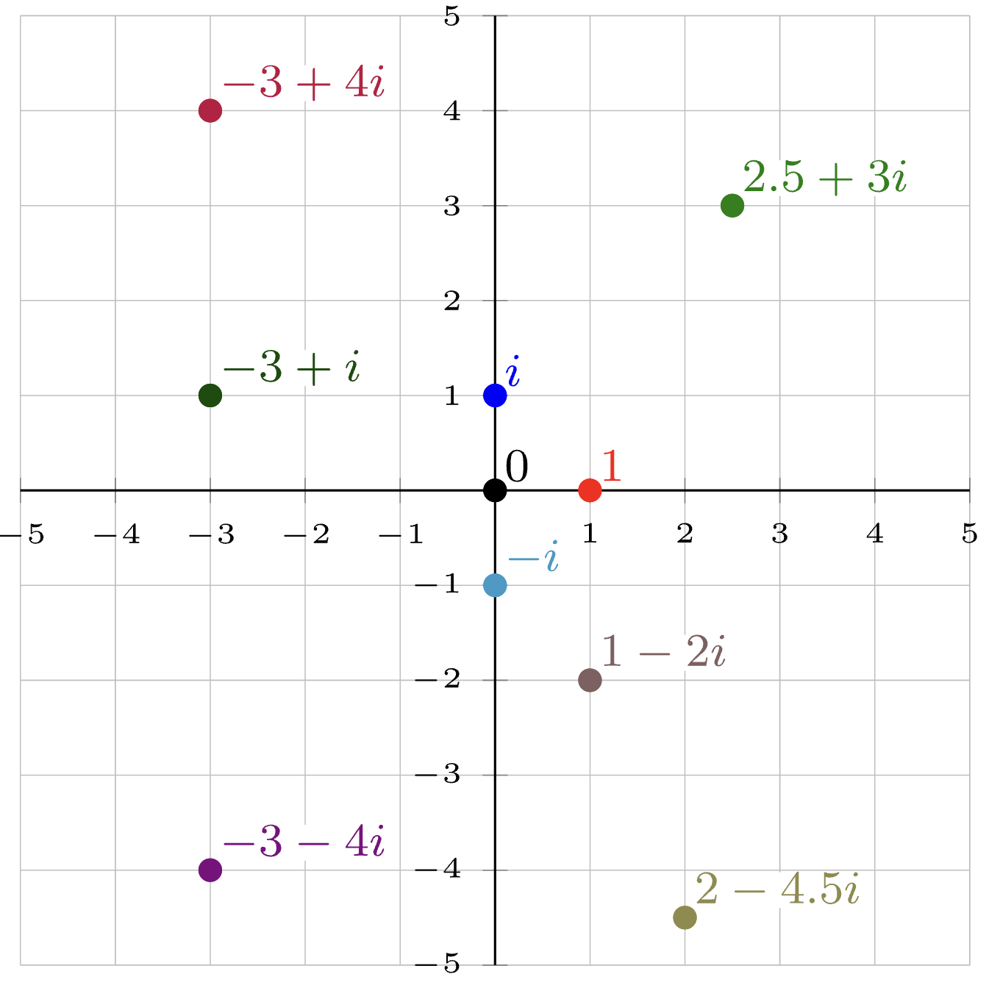
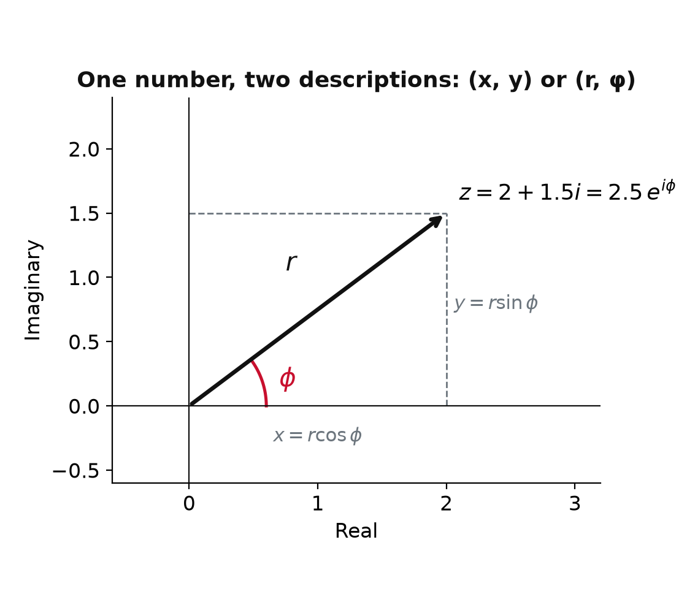
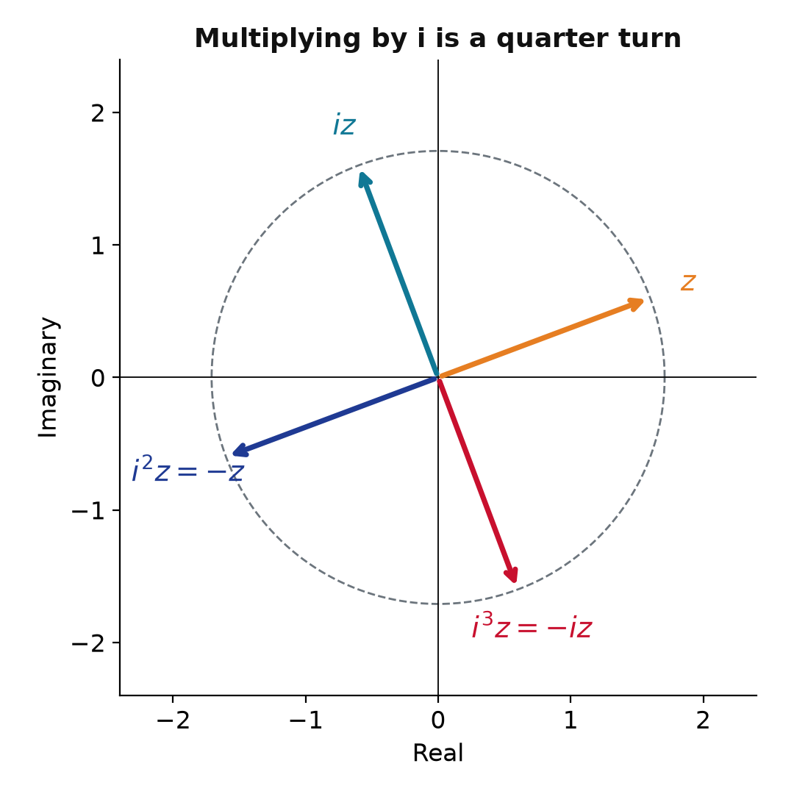
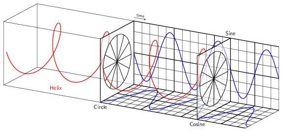
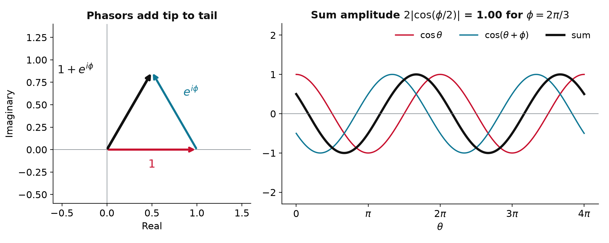

## One theme: rotation in a plane

- **Trigonometry** and **complex numbers** are two views of the same thing, a point turning around a circle
- Waves, oscillations, and every quantum phase live here
- The bridge between the two views is **Euler's formula**, the single most useful identity in the course

## Sine and cosine are coordinates

{width="95%" fig-align="center"}

- Rotate a point on the unit circle by $\theta$ radians: $x = \cos\theta$, $y = \sin\theta$
- A full turn is $2\pi$; each function is the other shifted by a quarter turn

## Identities you will reach for

::: {.keyeq}
$$\cos^2\theta + \sin^2\theta = 1$$
:::

- **Angle sum**: $\sin(A \pm B) = \sin A\cos B \pm \cos A\sin B$, $\quad \cos(A \pm B) = \cos A\cos B \mp \sin A\sin B$
- **Power reduction**: $\sin^2\theta = \tfrac12(1 - \cos 2\theta)$, $\quad \cos^2\theta = \tfrac12(1 + \cos 2\theta)$
- **Small angles**: $\sin\theta \approx \theta$, $\cos\theta \approx 1 - \tfrac12\theta^2$, which is how a vibrating bond becomes a harmonic oscillator
- Do not memorize the table: every line falls out of Euler's formula

## Complex numbers live in 2D

:::: {.columns}
::: {.column width="40%"}
{width="100%"}
:::
::: {.column width="60%"}
- $x^2 + 1 = 0$ has no real root, so extend the line to a plane with one new symbol, $i^2 = -1$

::: {.keyeq}
$$z = x + iy, \qquad x = \operatorname{Re} z,\ \ y = \operatorname{Im} z$$
:::

- A complex number is a **point in a plane**: real part across, imaginary part up
- $3 + 2i$, $-2i$, and $1.1$ are all complex numbers
:::
::::

## Polar form and Euler's formula

:::: {.columns}
::: {.column width="45%"}
{width="100%"}
:::
::: {.column width="55%"}
- Locate $z$ by its distance $r$ and angle $\phi$: $x = r\cos\phi$, $y = r\sin\phi$

::: {.keyeq}
$$e^{i\phi} = \cos\phi + i\sin\phi$$
:::

- So $z = r(\cos\phi + i\sin\phi) = r\,e^{i\phi}$: $r = \sqrt{x^2 + y^2}$ is the **magnitude**, $\phi$ the **phase**
- Proof in one line: the Taylor series of $e^{ix}$ splits into the series of $\cos x$ and $i\sin x$
:::
::::

## Multiplication is rotation

:::: {.columns}
::: {.column width="45%"}
{width="100%"}
:::
::: {.column width="55%"}
$$(r_1 e^{i\phi_1})(r_2 e^{i\phi_2}) = r_1 r_2\, e^{i(\phi_1 + \phi_2)}$$

- **Magnitudes multiply, angles add**
- $|e^{i\phi}| = 1$, so multiplying by $e^{i\phi}$ is a **pure turn** by $\phi$: no stretching
- $i = e^{i\pi/2}$ is a quarter turn; four of them bring you home, $i^4 = 1$
- $e^{-i\phi}$ undoes $e^{i\phi}$; angles matter only mod $2\pi$
:::
::::

## Live: dial the phase {.smaller}

<span style="color:#e67e22">**$z$**</span> and <span style="color:#107895">**$e^{i\phi} z$**</span>: the length never changes, only the angle

```{ojs}
//| echo: false
viewof phi = Inputs.range([-6.28, 6.28], {step: 0.05, value: 0.9, label: "rotation angle φ (rad)"})
```

```{ojs}
//| echo: false
{
  const z = {re: 1.3, im: 0.5};
  const w = {re: Math.cos(phi) * z.re - Math.sin(phi) * z.im, im: Math.sin(phi) * z.re + Math.cos(phi) * z.im};
  const R = Math.hypot(z.re, z.im);
  const circle = d3.range(0, 6.3, 0.05).map(t => ({x: R * Math.cos(t), y: R * Math.sin(t)}));
  const a0 = Math.atan2(z.im, z.re);
  const arc = d3.range(0, 1.0001, 0.02).map(s => ({x: 0.5 * Math.cos(a0 + s * phi), y: 0.5 * Math.sin(a0 + s * phi)}));
  return Plot.plot({
    width: 440, height: 440, aspectRatio: 1,
    x: {domain: [-2, 2], label: "Real", ticks: 5}, y: {domain: [-2, 2], label: "Imaginary", ticks: 5},
    marks: [
      Plot.line(circle, {x: "x", y: "y", stroke: "#bbb", strokeDasharray: "4,4"}),
      Plot.ruleX([0], {stroke: "#333"}), Plot.ruleY([0], {stroke: "#333"}),
      Plot.arrow([{x1: 0, y1: 0, x2: z.re, y2: z.im}], {x1: "x1", y1: "y1", x2: "x2", y2: "y2", stroke: "#e67e22", strokeWidth: 3}),
      Plot.arrow([{x1: 0, y1: 0, x2: w.re, y2: w.im}], {x1: "x1", y1: "y1", x2: "x2", y2: "y2", stroke: "#107895", strokeWidth: 3}),
      Plot.line(arc, {x: "x", y: "y", stroke: "#C8102E", strokeWidth: 2}),
      Plot.text([{x: z.re + 0.15, y: z.im + 0.1, t: "z"}], {x: "x", y: "y", text: "t", fill: "#e67e22", fontSize: 18}),
      Plot.text([{x: w.re + 0.15, y: w.im + 0.1, t: "e^(iφ) z"}], {x: "x", y: "y", text: "t", fill: "#107895", fontSize: 18})
    ]
  });
}
```

```{ojs}
//| echo: false
md`|z| = **${Math.hypot(1.3, 0.5).toFixed(2)}** before and after: a pure ${phi >= 0 ? "counterclockwise" : "clockwise"} turn by ${phi.toFixed(2)} rad`
```

## The rotating phase is a clock

:::: {.columns}
::: {.column width="55%"}
{width="100%"}
:::
::: {.column width="45%"}
- $e^{i\omega t}$ traces a **helix**: its shadow on one wall is $\cos\omega t$, on the other $\sin\omega t$
- One rotating phase carries **both waves** at once
- Preview: every stationary state carries $e^{-iEt/\hbar}$, a clock hand turning clockwise at rate $E/\hbar$
:::
::::

## The conjugate and the modulus

::: {.keyeq}
$$\bar{z} = x - iy = r\,e^{-i\phi}, \qquad |z|^2 = \bar{z}\,z = x^2 + y^2 = r^2$$
:::

- Conjugation **reflects** $z$ across the real axis; $\bar z z$ rotates it back onto the axis and leaves a non-negative number
- This is exactly how an amplitude becomes a probability: $|\psi|^2 = \psi^*\psi$
- Sums and differences give the trig functions back:
$$\cos\phi = \frac{e^{i\phi} + e^{-i\phi}}{2}, \qquad \sin\phi = \frac{e^{i\phi} - e^{-i\phi}}{2i}$$

## Waves are rotating phases

::: {.keyeq}
$$\cos(kx - \omega t) = \operatorname{Re}\, e^{i(kx - \omega t)}$$
:::

:::: {.columns}
::: {.column width="55%"}
{width="100%"}
:::
::: {.column width="45%"}
- **Derivatives become multiplications**: $\partial_x \to ik$, $\partial_t \to -i\omega$; twice gives $-k^2$, $-\omega^2$
- **Adding waves becomes adding arrows**: $\cos\theta + \cos(\theta+\phi) = \operatorname{Re}[e^{i\theta}(1 + e^{i\phi})]$
- Resultant amplitude $2|\cos(\phi/2)|$: doubles in phase, cancels half a turn apart. That is **interference**
:::
::::

## Why chemists care

- **Probabilities**: $|\psi|^2 = \psi^*\psi$ is why wavefunctions may be complex while measurements are real
- **Phases are invisible alone**: $\psi \to e^{i\theta}\psi$ leaves $|\psi|^2$ unchanged, but phases **between** two amplitudes produce interference
- **Time evolution** is a phase rotation, $e^{-iEt/\hbar}$
- **X-ray crystallography**: each scattered wave is $|A|e^{i\phi}$; detectors measure $|A|$ only, and recovering $\phi$ is the famous **phase problem**

# Takeaway {.center}

> $e^{i\phi} = \cos\phi + i\sin\phi$ turns trigonometry into exponentials: multiplying by $e^{i\phi}$ rotates without stretching, $\bar z z = |z|^2$ turns amplitudes into probabilities, and every identity you need falls out of one exponential rule.
